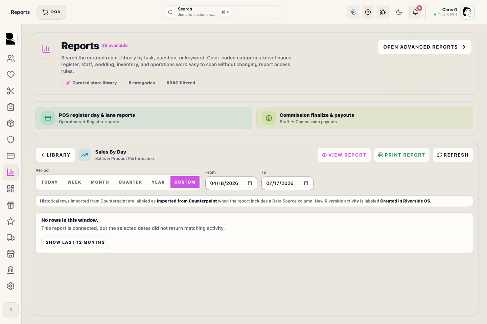

# Reports (curated) — in-app guide

## Screenshots

**Back Office → Reports** shows a **catalog** of read-only reports. Each card is wired to **Riverside** APIs and **your permissions** (not Metabase’s).

## Who can open it

You need **insights.view** to see the **Reports** tab. Some cards need extra keys (for example **register.reports** or **customers.rms_charge**). **Margin pivot** is **Admin only**.

## Quick steps

1. Open **Reports** in the left rail.
2. Use **Search reports by task, question, or keyword** when you know the job but not the report name.
3. Tap a **report card** (e.g., Sales By Day, Merchant Activity) to load the table.
4. Choose a quick **Period** (**Today**, **Week**, **Month**, **Quarter**, or **Year**) or set a **Custom** **From** / **To** date range.
5. Select the **Basis** (booked sale date vs completed / recognition) if available.
6. For **Best Sellers**, choose **Product View** to group parent products or **Variation View** to inspect individual SKUs.
7. Use **Refresh** after changes to pull the latest data.
8. Use **Print Report** (Professional Audit Layout) for the loaded report. Use **CSV** (spreadsheet) when a report includes table rows.

**Booked** = when the sale was rung. **Completed** = recognition-style timing for fulfilled lines (see store policy). Ask a lead if you are unsure which to use for payroll or tax questions.

Historical activity imported from Counterpoint is labeled **Imported from Counterpoint** when the report includes a **Data Source** column. New activity created in Riverside is labeled **Created in Riverside OS**.

## Finding the right report

Search understands report titles, descriptions, categories, keywords, and common staff questions. Try task words like **pickup**, **balance**, **tax**, **drawer**, **cash**, **appointments**, **no-show**, **slow stock**, **open orders**, or **failed payments**.

The report library is visually grouped with category colors and icons so staff can scan by work area first, then choose the exact report. The colors are navigation aids only; report access still comes from Riverside permissions.

Reports are grouped by store category so related work stays together:

- **Sales & Product Performance**
- **Register, Tender & Drawer Control**
- **Finance, Tax & Accounting**
- **Customer Follow-Up & Account Activity**
- **Weddings & Event Readiness**
- **Inventory & Replenishment**
- **Staff, Payroll & Coverage**
- **Store Operations & Risk**

Each report card shows an icon, category, intended audience, and sensitivity:

- **Staff-safe**: suitable for normal floor operations.
- **Manager**: operational leadership or sensitive follow-up.
- **Admin-only**: private financial/cost/margin content.

## What to watch for

- **Permissions**: The **Reports** library respects Riverside permissions, so missing cards usually mean missing access.
- **Admin restricted**: **Margin pivot** is more restricted than standard sales views.
- **Basis Accuracy**: Choose the correct **Basis** before exporting or printing; booked and completed answers are not interchangeable.
- **Runnable cards**: Current catalog cards open live Riverside reports. Do not treat report names as a substitute for the selected date range and basis.
- **Loaded report state**: Once a report opens, the report title, date filters, refresh action, print action, and result cards/table should all be visible together.

## Reports vs Insights

- **Reports** — fixed list, fast answers, **Riverside RBAC**. Only **Admin** Riverside roles get **Margin pivot** here.
- **Insights** — **Metabase**. Your store should give you a **staff** or **admin** **Metabase** login; that controls margin and private collections inside Metabase.

Use **Open Insights (Metabase)** on the Reports page when you need dashboards or custom questions.

## Payouts and register tools

- **NYS tax audit**: Drill-down into clothing vs non-clothing sales for audit.
- **Merchant activity**: Daily Helcim volume, fees, and net settlement values matched to business days.
- **Returns, Exchanges & Refunds**: Returned items, exchange activity, refunds still owed, and refunds already paid for the selected date range.
- **Donation Payments**: Donation tender activity by selected date range, including customer, linked transaction, amount, and the required donation note.
- **RMS charges**: Export of store-account charges vs payments.
- **Appointments & No-Show**: Appointment count, completed visits, cancellations/no-shows, appointment type, assigned salesperson, and wedding-linked vs walk-in context.
- **Wedding Event Readiness**: Upcoming wedding risk by event date, including missing measurements, balances, fulfillment, alterations, shipments, and pickup risk.
- **Wedding Program Profit**: Admin-only wedding-party profitability for the free-groom suit program, including paid wedding members, free-suit promo members, expected free suits, net sales, promo discount, cost, profit, and margin by selected date basis.
- **Staff Schedule Coverage vs Sales**: Staffing coverage compared with sales volume, appointments, pickups, and register activity.
- **Customer Follow-Up**: Customers needing action because of balances, pickups, recent quotes/orders, wedding dates, stale RMS charges, or missing recent contact.
- **Exception & Risk**: Negative stock, stale fulfillment orders, overdue alterations, high discounts, failed payments, open register sessions, and unclosed tasks.
- **Sales By Day**: One row per business day with daily sales, average sale, sales per active hour, prior-week comparison, same-date prior-year comparison when history exists, and an aggregated hourly sales chart.
- **Best Sellers**: Use **Product View** for parent product performance and **Variation View** for individual SKU demand within those products.
- **Sales Trend & Pace**: Daily sales pace compared with the prior week, including paid amounts and open balances.
- **Gift Card Liability Activity**: Gift card issue/load, redemption, other decreases, and net liability movement.
- **Layaway Aging & Deposit Risk**: Open layaway age, paid deposits, balances, promised pickup dates, and risk status.
- **Alterations Throughput & Aging**: Intake, due, completed, overdue, open, and average age counts by alteration status.
- **Online Store Conversion & Fulfillment**: Web carts, expired carts, online sales, pickup/ship fulfillment, and open balances.
- **Purchase, Receiving & Reorder Health**: Open purchase order units, overdue receiving, estimated open cost, and reorder risk.

## What happens next

- CSV exports land in your browser's download folder for spreadsheet analysis.
- Printed reports are formatted for standard 8.5x11 paper or PDF.
- If you need a custom chart not found here, switch to the **Insights (Metabase)** manual.

## Related workflows

- [Insights (Metabase)](manual:insights)
- [Register Reports](manual:pos-register-reports)
