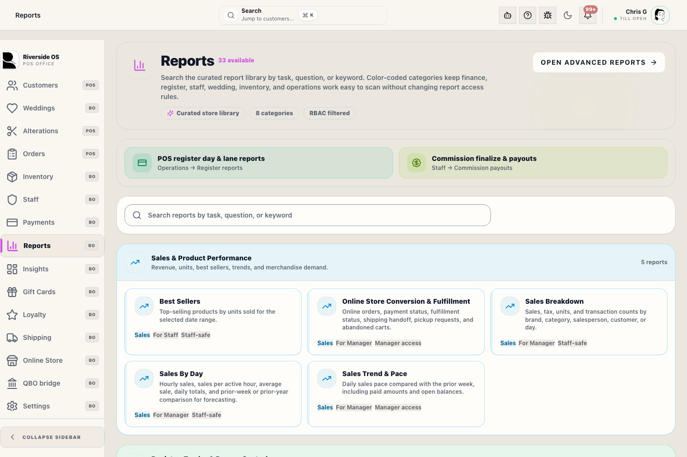

# Reports (curated) — in-app guide

**Back Office → Reports** shows a **catalog** of read-only reports. Each card is wired to **Riverside** APIs and **your permissions** (not Metabase’s).

## Who can open it

You need **insights.view** to see the **Reports** tab. Some cards need extra keys (for example **register.reports** or **customers.rms_charge**). **Margin pivot** is **Admin only**.

## Quick steps

1. Open **Reports** in the left rail.
2. Tap a **report card** (e.g., Daily Sales, Merchant Activity) to load the table.
3. Set **From** / **To** date filters.
4. Select the **Basis** (booked sale date vs completed / recognition) if available.
5. Use **Refresh** after changes to pull the latest data.
6. Use **CSV** (spreadsheet) or **Print Report** (Professional Audit Layout) for your records.

**Booked** = when the sale was rung. **Completed** = recognition-style timing for fulfilled lines (see store policy). Ask a lead if you are unsure which to use for payroll or tax questions.

## What to watch for

- **Permissions**: The **Reports** library respects Riverside permissions, so missing cards usually mean missing access.
- **Admin restricted**: **Margin pivot** is more restricted than standard sales views.
- **Basis Accuracy**: Choose the correct **Basis** before exporting or printing; booked and completed answers are not interchangeable.

## Reports vs Insights

- **Reports** — fixed list, fast answers, **Riverside RBAC**. Only **Admin** Riverside roles get **Margin pivot** here.
- **Insights** — **Metabase**. Your store should give you a **staff** or **admin** **Metabase** login; that controls margin and private collections inside Metabase.

Use **Open Insights (Metabase)** on the Reports page when you need dashboards or custom questions.

## Payouts and register tools

- **NYS tax audit**: Drill-down into clothing vs non-clothing sales for audit.
- **Merchant activity**: Daily Stripe volume, fees, and net settlement values matched to business days.
- **RMS charges**: Export of store-account charges vs payments.

## What happens next

- CSV exports land in your browser's download folder for spreadsheet analysis.
- Printed reports are formatted for standard 8.5x11 paper or PDF.
- If you need a custom chart not found here, switch to the **Insights (Metabase)** manual.

## Related workflows

- [Insights (Metabase)](manual:insights)
- [Register Reports](manual:pos-register-reports)
