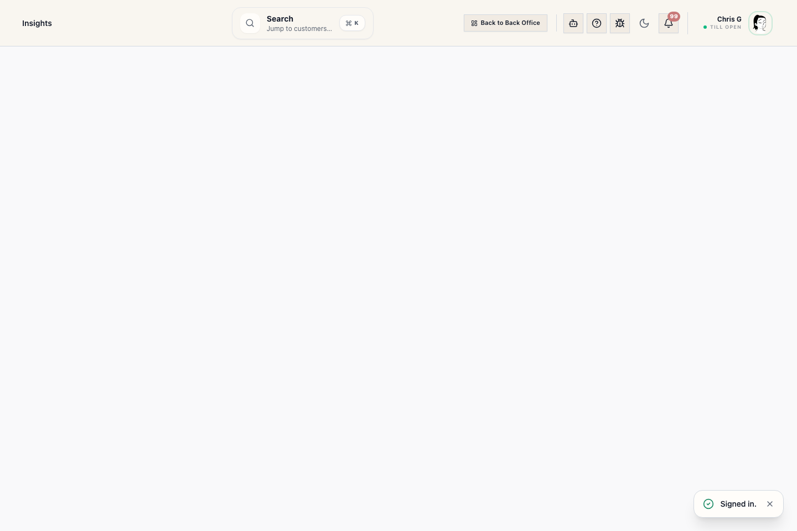

# Reports Workspace (reports)

## Screenshots

## What this is

Reports is the Back Office report library. Use it when you need a trusted store report without building a custom Insights question. The page uses category colors and icons to make report areas easier to scan.

## When to use it

Use Reports to find sales, register, finance, customer, wedding, inventory, staff, and operations reports by the task you are trying to finish.

## Before you start

- Sign in to Back Office.
- You need the report's required staff access before its tile appears.
- Admin-only reports stay separated and are visible only to Admin role users.

## Steps

1. Open Back Office -> Reports.
2. Use the search box: "Search reports by task, question, or keyword".
3. Search with plain terms such as pickup, balance, tax, cash, drawer, slow stock, weather, appointments, no-show, or open orders.
4. Review the matching category section and choose a report tile.
5. Use From, To, Basis, and Group by when those controls appear.
6. Use Refresh after changing filters.
7. Use CSV or Print Report when the table view supports it.

## Operational detail

Use Reports when the store needs a repeatable answer with the same filters, basis, and permissions every time. Use Insights when leadership needs dashboard exploration or Metabase-level analysis. Category colors and icons are visual shortcuts only; Riverside permissions decide what each staff member can open. If a report is marked planned, treat it as searchable roadmap guidance only; it should not be used as proof of a current operational total.

## What to watch for

- Category sections describe the report area: Sales & Product Performance; Register, Tender & Drawer Control; Finance, Tax & Accounting; Customer Follow-Up & Account Activity; Weddings & Event Readiness; Inventory & Replenishment; Staff, Payroll & Coverage; or Store Operations & Risk.
- Audience labels describe the usual reader: Staff, Manager, Owner, or Admin.
- Sensitivity labels describe access expectations: Staff-safe, Manager, or Admin-only.
- Search includes report titles, descriptions, category names, category descriptions, aliases, keywords, staff questions, audience, sensitivity, and runnable status.
- The report catalog should only show planned roadmap cards when there is no live Riverside API for that report yet.
- **Daily Sales Weather** shows sales by store day alongside the captured weather snapshot for that day.

## What happens next

Report cards open a detail view and load current data from Riverside.

## Related workflows

- Reports (curated) staff manual
- Daily Sales Reports
- Booked vs Fulfilled reporting
- Insights / Metabase
