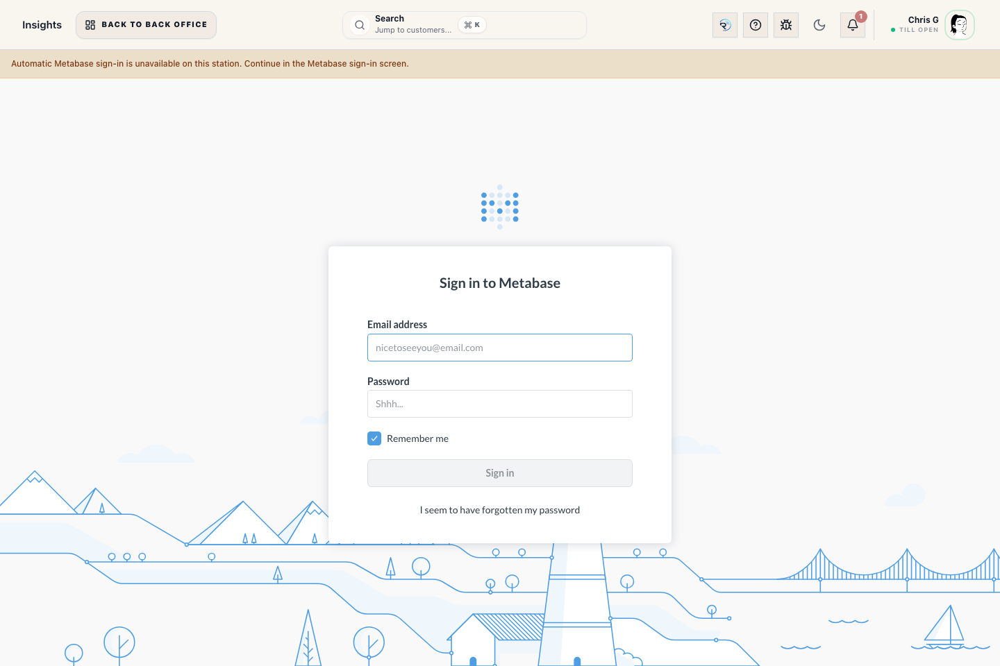

# Reports Workspace (reports)

## Screenshots

## What this is

Reports is the Back Office report library. Use it when you need a trusted store report without building a custom Insights question. The page uses category colors and icons to make report areas easier to scan.

## When to use it

Use Reports to find sales, register, finance, customer, wedding, inventory, staff, and operations reports by the task you are trying to finish.

## Before you start

- Sign in to Back Office.
- You need the report's required staff access before its tile appears.
- Admin-only reports stay separated and are visible only to Admin role users.

## Steps

1. Open Back Office -> Reports.
2. Use the search box: "Search reports by task, question, or keyword".
3. Search with plain terms such as pickup, balance, tax, cash, drawer, slow stock, weather, appointments, no-show, or open orders.
4. Review the matching category section and choose a report tile.
5. **Register Day Summary** opens on **Today**. Riverside displays the summary and first audited activity page as soon as they are ready. Use **Load next audited page** for more detail. The interactive view stops at 2,000 rows for stability and never labels a partial page as the complete activity set; narrow the date range when that limit is reached.
6. Use From, To, Basis, and Group by when those controls appear.
7. For **Best Sellers**, use **Product View** for parent products and **Variation View** for individual SKUs.
8. Use Refresh after changing filters.
9. Use **View Report** from the loaded report header to review table, summary, or no-row report results inside ROS. For **Register Day Summary**, View and Print request one read-only database snapshot containing the complete audited activity and pickup sections before opening output. If the combined detail exceeds the 20,000-row output limit or the response is incomplete, Riverside produces nothing and asks you to refresh or narrow the date range. Use **Print Report** to send the completed report to the configured Reports printer.
10. Use CSV when the loaded report includes table rows.
11. If View Report or Print Report cannot open the report path, Riverside shows an error so staff can check station printer setup or support can review the workstation state instead of assuming the button worked.

## Operational detail

Use Reports when the store needs a repeatable answer with the same filters, basis, and permissions every time. Use Insights when leadership needs dashboard exploration or Metabase-level analysis. Category colors and icons are visual shortcuts only; Riverside permissions decide what each staff member can open. If a report is marked planned, treat it as searchable roadmap guidance only; it should not be used as proof of a current operational total.

## What to watch for

- Category sections describe the report area: Sales & Product Performance; Register, Tender & Drawer Control; Finance, Tax & Accounting; Customer Follow-Up & Account Activity; Weddings & Event Readiness; Inventory & Replenishment; Staff, Payroll & Coverage; or Store Operations & Risk.
- Audience labels describe the usual reader: Staff, Manager, Owner, or Admin.
- Sensitivity labels describe access expectations: Staff-safe, Manager, or Admin-only.
- Search includes report titles, descriptions, category names, category descriptions, aliases, keywords, staff questions, audience, sensitivity, and runnable status.
- The report catalog should only show planned roadmap cards when there is no live Riverside API for that report yet.
- **Daily Sales Weather** shows sales by store day alongside the captured weather snapshot for that day.
- **Donation Payments** shows donation tender rows for the selected period with the recorded reason note, customer, linked transaction, and accounting amount.
- **Best Sellers** can group by parent product or by variation/SKU, depending on whether staff need the broad product winner or the exact size/color/SKU winner.
- **Wedding Program Profit** is Admin-only and shows the free-groom suit program by wedding party and selected date basis, including paid wedding members, free-suit promo members, discounts, cost, profit, and margin.
- **Negative Items from Transactions** is the period report for researching sale, pickup, or shipping recognition movements that drove SKU stock below zero. Use it after the transaction is complete; negative stock is an inventory follow-up, not a reason to block a customer sale or pickup.
- Register summary counts remain counts, money remains currency, weather is rounded for staff reading, and structured payment/item detail is shown as readable text rather than raw JSON or internal UUIDs.
- Register summary detail displays activity records and pickup records as separate audited sections. The progress line reports each section's loaded and total counts, so hidden pickup rows never consume the screen limit without being shown.
- **Returns, Exchanges & Refunds** separates returned merchandise and tax, the refund obligation, posted refund payments, and the amount still owed. **Refund Due** and **Refund Remaining** come from the refund queue; **Refund Paid** appears on the posted refund-payment row. Return-line and queue rows do not duplicate posted payments.
- **Returns, Exchanges & Refunds** loads every stable audited page before it shows the table or charts or enables print/CSV output. The green completeness line gives the row count and snapshot time. If the data changes during paging, a page repeats, or the range exceeds 20,000 rows, Riverside shows an error and displays no partial chart or table; narrow the date range and retry.

## What happens next

Report cards open a detail view and load current data from Riverside.

## Related workflows

- Reports (curated) staff manual
- Daily Sales Reports
- Booked vs Fulfilled reporting
- Insights / Metabase
