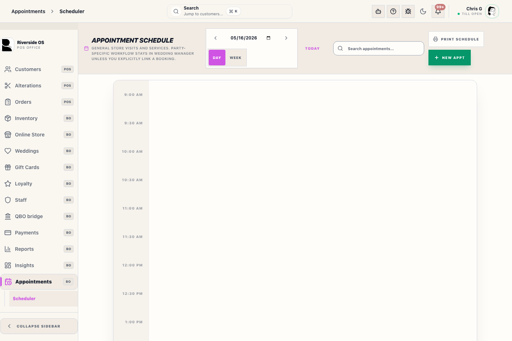

# Scheduler Workspace

The Scheduler is the central hub for managing store appointments, consultations, and fittings. It provides a visual calendar interface to ensure your team is never double-booked.

## What this is

Use the **Scheduler** to:
- View the daily, weekly, or monthly store agenda.
- Book new appointments for fittings, consultations, or pick-ups.
- Manage staff assignments for specific appointment slots.
- Identify and resolve scheduling conflicts.

## When to use it

- When a customer calls to book a fitting.
- When reviewing staff coverage for a busy Saturday.
- When checking if a specific fitting room or consultant is available.

## Before you start

- Ensure the **Customer** is already in the system (or be ready to add them).
- Confirm **Staff Availability** for the requested time slot.

## Steps

1. Open **Appointments → Scheduler** in the sidebar.
2. Select your preferred view (Day, Week, Month).
3. **Book Appointment**: Click on an empty time slot or use the **New Appointment** button.
4. Fill in the **Customer**, **Appointment Type** (e.g., Bridal Consultation, Tux Fitting), and **Assigned Staff**.
5. Save the appointment. It will appear on the calendar and notify the assigned staff member.
6. **Edit/Move**: Drag and drop appointments to change times, or click an entry to open the full edit dialog.

## What to watch for

- **Conflicts**: Red highlights or warnings indicate a staff member or room is overbooked.
- **Syncing**: Changes made here may sync to external calendars (Google/Outlook) if your store has enabled that integration in Settings.
- **Customer Notifications**: Confirmation and reminder messages are sent based on the customer's communication preferences.

## What happens next

- Appointments appear in the **Staff Tasks** view for the assigned consultant.
- On the day of the appointment, the customer can be "Checked In" directly from the calendar.

## Related workflows

- [Customer Hub](manual:customers-customer-relationship-hub-drawer)
- [Staff Schedule](manual:staff-schedule-panel)
