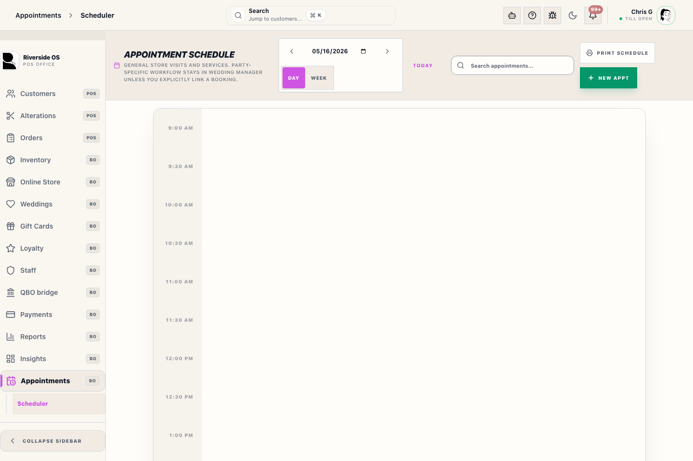
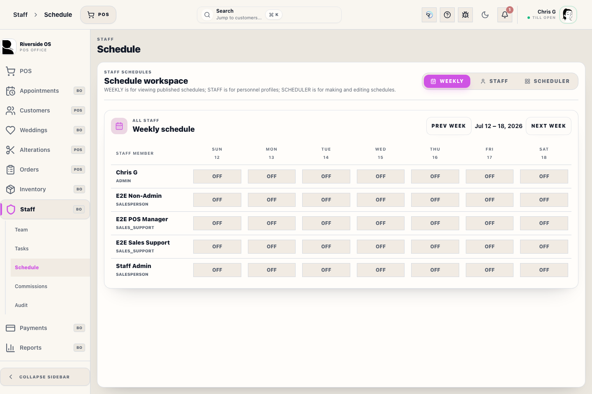

# Scheduler Workspace

## Screenshots

The Scheduler is the central hub for managing store appointments, consultations, and fittings. ROS checks assigned-staff overlap and room/resource capacity before a scheduled booking is saved.

Review published staff coverage before assigning a staff member to an appointment.

Use the Customer workspace when a booking needs a linked Customer record and notification preferences.

## What this is

Use the **Scheduler** to:
- View the daily or weekly store agenda.
- Book new appointments for fittings, consultations, or pick-ups.
- Manage staff assignments for specific appointment slots.
- Identify and resolve scheduling conflicts.

## When to use it

- When a customer calls to book a fitting.
- When reviewing staff coverage for a busy Saturday.
- When checking if a specific fitting room or consultant is available.

## Before you start

- Use a Customer record when customer notifications and Customer history are needed. A name or phone can be used for a one-off visit.
- Confirm **Staff Availability** for the requested time slot.

## Steps

1. Open **Appointments → Scheduler** in the sidebar.
2. Open **Find appointment** when looking for an existing booking by customer or appointment detail. Search and Print remain compact utilities so the date, Day/Week view, Today, and New Appointment controls stay primary.
3. Select your preferred view with **Day** or **Week**, then use the date controls or **Today** to move the calendar.
4. **Book Appointment**: Click on an empty time slot or use the **New Appt** button. When the entire day is open, choose the visual **Morning**, **Afternoon**, or **Evening** window; adjust the exact time before saving.
5. Fill in the **Customer**, **Appointment Type**, **Duration**, optional **Rooms & Resources**, and **Assigned Staff**.
6. Save the appointment. If the booking overlaps assigned staff or exceeds resource capacity, choose another slot or use an approved Manager Access override with a written reason.
7. To edit or move an appointment, select the appointment, change its date or time in the dialog, and save. ROS warns when another workstation changed the same appointment first.
8. Mark the visit **Attended** or **Missed** after it occurs. To cancel, enter a reason and use **Cancel Appointment**; ROS preserves the history.

## What to watch for

- Riverside shows a loading state while a new day refreshes. **The day is open** appears only after a successful refresh confirms no scheduled appointments.

- **Conflicts**: Open **Appointments → Conflicts** to review staff overlaps, room/resource capacity conflicts, and configured resource capacities.
- **Calendar authority**: ROS is the appointment calendar. Podium carries enabled messages; it is not a second booking calendar. Google/Outlook calendar synchronization is not part of this workflow.
- **Customer Interactions**: For a linked Customer, confirmations, cancellations, and reminders follow the customer's communication preferences and the enabled Podium/Store Email settings. Confirmation calendar attachments use the saved duration. Reminders are attempted about 24 hours before the appointment time and failed channels retry with bounded backoff.
- **Pickup**: Marking a Pickup appointment Attended does not fulfill merchandise. Complete product pickup through Orders/Register.
- Search distinguishes **no matching appointments** from **appointment search is unavailable**. Retry an unavailable search before concluding that a booking does not exist.

## What happens next

- The appointment remains searchable after it is Attended, Missed, or Cancelled, while the open calendar grid shows Scheduled work.
- Linked Measurement and Fitting appointments can complete their Wedding Manager milestone atomically when staff confirm that action. Pickup remains controlled by Orders/Register.

## Related workflows

- [Customer Hub](manual:customers-customer-relationship-hub-drawer)
- [Staff Schedule](manual:staff-schedule-panel)
