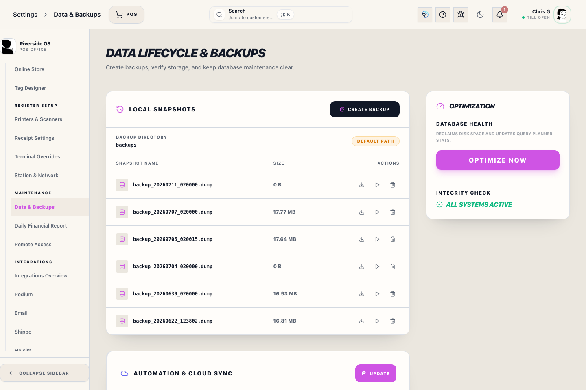
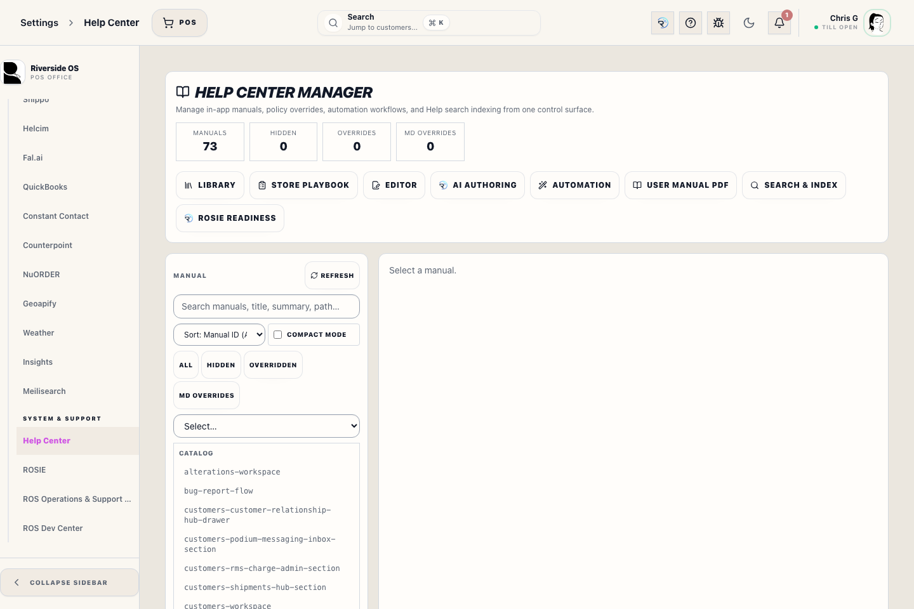

# Data Lifecycle & Backups

## Screenshots

Riverside OS includes an enterprise-grade backup and restoration system designed to ensure data integrity across local and cloud environments.

## What this is

Use this screen when an authorized operator needs to protect the database before risky work or recover the system from a known backup.

## 1. Local Snapshots
Snapshots are full PostgreSQL dumps stored in the configured backup directory on the server. The path is shown on this screen so managers can confirm the server is writing to the intended durable location.

### Automatic Backups:
*   **Cron Schedule**: Configurable via **System Control → Cloud Backups**. Default is `0 2 * * *` (2:00 AM daily).
*   **Retention**: The system automatically cleans up snapshots older than the configured "Retention Policy" (default: 30 days).

### Create Backup:
Use **Create Backup** for an immediate snapshot. This is recommended before major catalog imports or schema updates. Riverside writes into a non-catalog partial file and publishes it atomically only after PostgreSQL can read the new archive catalog; an empty, truncated, or invalid dump never appears as a selectable snapshot. Invalid stored backup settings are reported as an error and never silently fall back to unencrypted defaults.

## 2. Off-Site Copies
Backups should not live on only one machine. Use **Off-Site Storage** for direct cloud upload and **Replication Folders** for store-local redundancy.

- **Cloud provider** supports S3-compatible storage, OneDrive, Google Drive, and Dropbox.
- **Cloud folder path** chooses the folder/root inside the selected provider.
- **Replication Folders** accepts one mounted or synced folder per line. Use OneDrive/Google Drive/Dropbox desktop folders, NAS paths, SMB shares, mapped Windows drives, or external backup drives.
- Riverside reads a finalized cloud object back in bounded chunks and requires its byte length and SHA-256 to match the uploaded archive before marking cloud sync successful. Replication-folder copies receive the same size and SHA-256 check before publication.

## 3. Encrypted Archives
When **Encrypt Backup Archives** is on, new snapshots are saved as encrypted `.dump.enc` files. Encrypted backups protect customer, financial, inventory, and staff data if a backup copy leaves the server. Current snapshots use independently authenticated 1 MiB chunks so creating, downloading, and opening a large archive does not require loading the complete file into Main Hub memory.

The server must have `RIVERSIDE_BACKUP_ENCRYPTION_KEY` available before encrypted backups can be created or restored. If that key is lost, encrypted backups cannot be opened.

## 4. PostgreSQL Tooling
Riverside uses the PostgreSQL client tools that match the Main Hub database.

### How it works:
1. **Direct Mode**: The server resolves `pg_dump` and `pg_restore` from configured paths, the system `PATH`, or standard PostgreSQL installation folders.
2. **Verification**: Every custom-format archive must pass `pg_restore --list` before Riverside records backup success or encrypts the file.
3. **Development Docker Fallback**: A Docker fallback is available only when it is explicitly enabled outside strict production. Strict production never silently switches to a container database or a different PostgreSQL toolchain.

Readiness binds the verification timestamp to the exact final filename, byte length, and SHA-256. If that archive is deleted, replaced, damaged, or cannot be opened with the configured encryption key, Riverside reports `backup_recent_verified` as unavailable. Deleting the recorded snapshot or removing it through retention also invalidates that evidence immediately.

## 5. Restoration Procedure
Restoring a backup will **overwrite all current data** in the PostgreSQL database.

Live production restore is unavailable while the Riverside server is running. This prevents Register, worker, and integration writes from racing a destructive database replacement.

1. Create and verify a fresh backup before the recovery window.
2. Close every Register and stop the Riverside server and background workers.
3. Follow the approved offline recovery runbook with the selected cataloged archive.
4. Start Riverside only after the in-binary schema contract check passes, then reconcile the restored business date before reopening a Register.

The Settings restore action is reserved for an explicitly enabled non-production restore drill. It cannot unlock a strict-production runtime.

> [!CAUTION]
> Always perform a manual backup immediately before restoring an older snapshot. Restoration is an irreversible operation.

## What to watch for

- Backups protect data, but restore is destructive.
- Take a fresh manual backup before restoring an older snapshot.
- Confirm encrypted backups have the correct recovery key available before restore.
- Treat **Backup Verification Tools: Unavailable** or **backup_recent_verified** readiness warnings as unresolved data-protection issues, even when the backup scheduler itself is running.
- Treat restore as an offline operations event: confirm timing, scope, archive filename, and who approved it.

## What happens next

After an approved offline restore, Operations restarts Riverside, confirms readiness and backup evidence, and then authorizes Registers to reopen.
