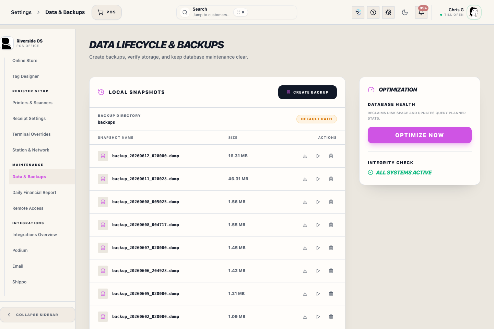

# Data Lifecycle & Backups

## Screenshots

Riverside OS includes an enterprise-grade backup and restoration system designed to ensure data integrity across local and cloud environments.

## What this is

Use this screen when an authorized operator needs to protect the database before risky work or recover the system from a known backup.

## 1. Local Snapshots
Snapshots are full PostgreSQL dumps stored in the configured backup directory on the server. The path is shown on this screen so managers can confirm the server is writing to the intended durable location.

### Automatic Backups:
*   **Cron Schedule**: Configurable via **System Control → Cloud Backups**. Default is `0 2 * * *` (2:00 AM daily).
*   **Retention**: The system automatically cleans up snapshots older than the configured "Retention Policy" (default: 30 days).

### Create Backup:
Use **Create Backup** for an immediate snapshot. This is recommended before major catalog imports or schema updates.

## 2. Off-Site Copies
Backups should not live on only one machine. Use **Off-Site Storage** for direct cloud upload and **Replication Folders** for store-local redundancy.

- **Cloud provider** supports S3-compatible storage, OneDrive, Google Drive, and Dropbox.
- **Cloud folder path** chooses the folder/root inside the selected provider.
- **Replication Folders** accepts one mounted or synced folder per line. Use OneDrive/Google Drive/Dropbox desktop folders, NAS paths, SMB shares, mapped Windows drives, or external backup drives.
- Riverside verifies each replicated copy before marking the off-site step successful.

## 3. Encrypted Archives
When **Encrypt Backup Archives** is on, new snapshots are saved as encrypted `.dump.enc` files. Encrypted backups protect customer, financial, inventory, and staff data if a backup copy leaves the server.

The server must have `RIVERSIDE_BACKUP_ENCRYPTION_KEY` available before encrypted backups can be created or restored. If that key is lost, encrypted backups cannot be opened.

## 4. Universal Docker Fallback
To ensure high availability, the Riverside server (v0.1.8+) implements a **Universal Docker Fallback** for database operations.

### How it works:
1.  **Direct Mode**: The server first attempts to use the host's `pg_dump` or `psql` binaries.
2.  **Fallback Mode**: If host binaries are missing or version-mismatched, the server automatically spawns a transient Docker container (`postgres:latest`) to execute the backup/restore command.
3.  **Zero-Configuration**: This ensures that backups work out-of-the-box on macOS, Linux, and Windows (assuming Docker/OrbStack is running), regardless of local Postgres installation state.

## 5. Restoration Procedure
Restoring a backup will **overwrite all current data** in the PostgreSQL database.

1.  Select a snapshot from the **Local Snapshots** table.
2.  Click the **Restore (Play)** icon.
3.  Confirm the action in the prompt.
4.  **Application Restart**: The application will automatically reload once the restore is complete to ensure all cached data is synchronized.

> [!CAUTION]
> Always perform a manual backup immediately before restoring an older snapshot. Restoration is an irreversible operation.

## What to watch for

- Backups protect data, but restore is destructive.
- Take a fresh manual backup before restoring an older snapshot.
- Confirm encrypted backups have the correct recovery key available before restore.
- Treat restore as an operations event: confirm timing, scope, and who approved it.

## What happens next

After a restore, Riverside reloads so the UI and cached data match the recovered database state.
