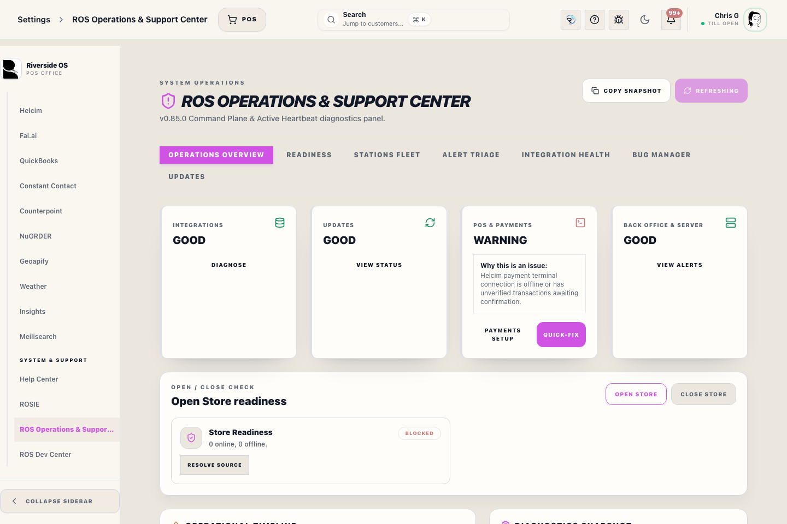
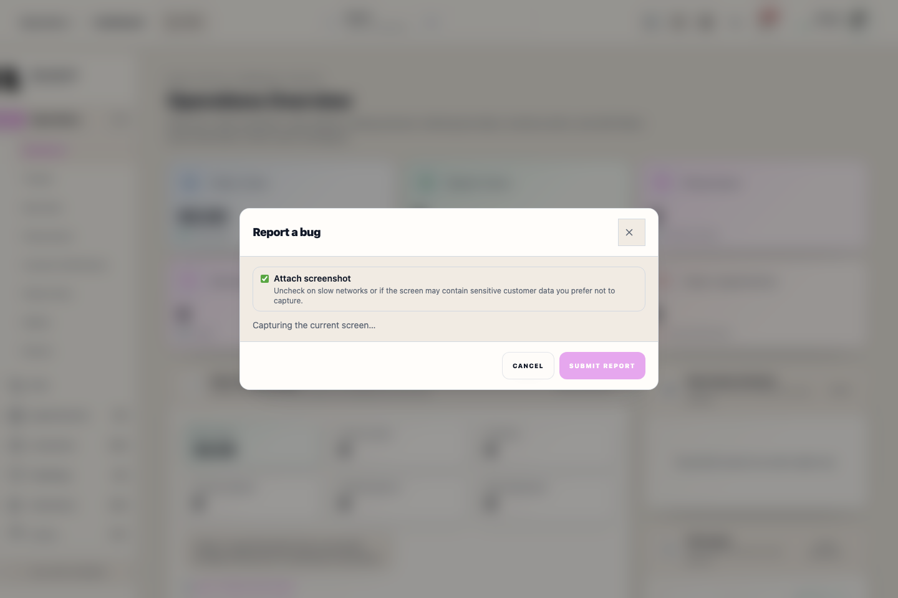
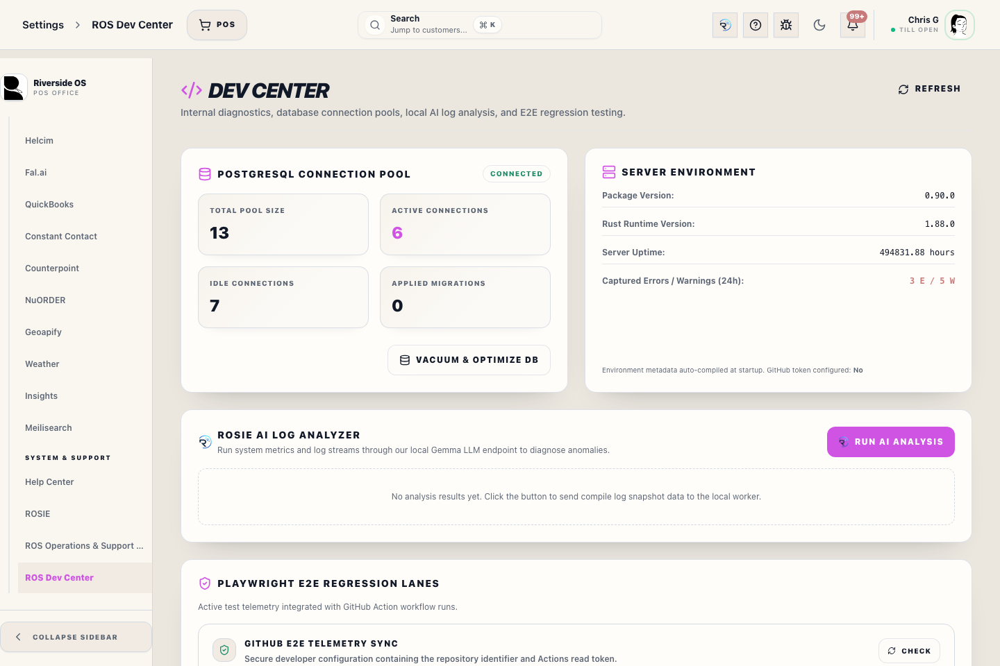

# Bug Reports Settings

## Screenshots

## What this is

Bug Reports Settings is the support review area for submitted reports and automated diagnostic incidents. It is split into two primary areas:
- **Bug Reports:** Manual tickets submitted directly by staff with custom context and optional screenshots.
- **Developer Errors:** Automated system alerts and exceptions captured from both the server (Rust) and client (React) runtimes.

It helps managers and support staff see what was reported, which workstation or route was involved, and whether the captured diagnostics are enough to reproduce the problem. It is also available in the standalone **Dev Ops Center** macOS app for immediate offline diagnostic collection and copy-to-clipboard AI diagnostics formatting.

## How to use it

1. Open Bug Reports Settings from the protected settings area (or open the Standalone macOS DevOps application).
2. Select the tab for either **Bug Reports** or **Developer Errors**.
3. Select the report or incident needing review to open its details dialog.
4. Use **Copy AI Package** to grab the pre-packaged context, error logs, and system variables formatted as a developer prompt, ready to paste directly into AI editors.
5. Use **Download AI Diagnostic** to save the diagnostic payload as an `.md` report.
6. Share the report ID or correlation ID with support when needed.

## When to use it

Use this panel when:

- staff submitted a bug report from the app
- support needs the latest report details
- a diagnostic incident needs review
- a developer asks for the report ID, route, or correlation ID

## What to review

- **Report summary:** what staff said happened.
- **Workflow context:** route, surface, browser, viewport, and workstation metadata.
- **Recent safe diagnostics:** redacted console and error context.
- **Screenshot:** only when staff attached one.
- **Incident status:** whether the report still needs follow-up.

## Privacy behavior

Diagnostics are redacted before they are submitted or downloaded. Authorization headers, bearer tokens, JWT-looking strings, cookies, session values, Access PIN-like fields, passwords, secrets, token fields, and API key fields should not appear in report evidence.

If a report includes sensitive text typed by a person into a description, treat it as private and remove or replace it before sharing.

## Degraded diagnostics

If one support feed cannot load, the panel should still show the other available report information. A quiet degraded message means that only part of the diagnostic history is unavailable.

## What happens next

Use the report details to reproduce the issue or hand the report ID to support. Do not mark an incident resolved until the staff-facing workflow has been checked again.
