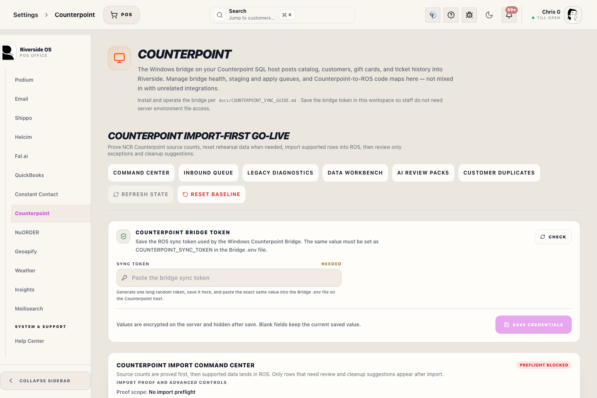
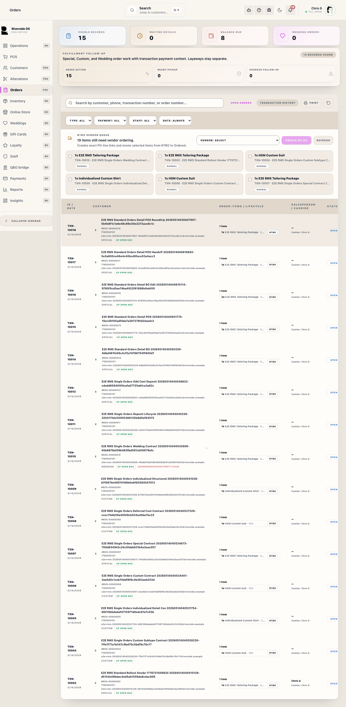

# Counterpoint Import and Sign-Off

## Screenshots

## What this is

Counterpoint Settings is the one-time ROS Import Command Center. For go-live, the Counterpoint Bridge reads Counterpoint SQL and posts directly to the Main Hub ROS intake on port 3000. ROS records source counts, landed proof, exceptions, duplicate-customer review, and final readiness.

Use this panel to verify facts before cutover. Bridge row counts mean data was sent. ROS landed counts mean ROS wrote and linked rows for proof.

## Go-live workflow

1. Open the Bridge app on the Counterpoint PC.
2. Confirm the Bridge can reach Main Hub ROS.
3. Run **Full Import / Recheck All** in the Bridge.
4. Open **Import & Proof** in ROS.
5. Follow **Current next step** at the top of the command center.
6. Confirm required areas show landed proof.
7. Resolve import exceptions, then rerun the affected import area if needed.
8. Review **Customer Duplicates** after customers land.
9. Confirm final proof is ready before go-live sign-off.

Do not sign off while required rows are failed, missing, or waiting for exception review.

## Current next step

The command center reads the Bridge heartbeat, source counts, landed proof, import exceptions, and required-area readiness. It then names the next action:

- Start the Bridge if ROS is not receiving a heartbeat.
- Run Full Import / Recheck All if source-count proof has not landed.
- Fix preflight blockers if Counterpoint SQL or mapping proof is blocked.
- Wait for landed proof if rows were sent but ROS has not written proof yet.
- Fix the first open exception when a source row cannot land cleanly.
- Review the first required area that is not ready.
- Move to final sign-off only after required areas are ready.

Use Support Diagnostics only when the current next step says proof or Bridge status is not progressing.

The four workflow cards show whether each stage is **Done**, **Current**, or **Waiting**. The active stage should match **Current next step**.

## Import proof

The proof table compares:

- **Expected**: rows Counterpoint reported during preflight.
- **Sent**: rows the Bridge posted to Main Hub ROS.
- **Landed**: rows ROS wrote and linked for proof.
- **Gap**: difference between expected and landed proof.
- **Ready**: whether that area can pass go-live review.

Some rows can intentionally create more than one ROS row, such as matrix variants. ROS proof should explain that clearly; unexplained gaps or failed required areas need review.

If a Bridge import fails before completion, the proof table shows the run as failed and ignores any partial landed rows from that failed run. Fix the Bridge extraction error, rerun the affected area or full import, then refresh proof before reviewing gaps.

## Exceptions

Import exceptions identify Counterpoint rows that did not land cleanly. Each exception card shows the affected import area, source details from the raw Counterpoint payload, and action buttons.

Use **Copy source** when support needs the exact Counterpoint payload. Use **Rerun Tickets**, **Rerun Open Docs**, or the matching import-area rerun after fixing the missing customer, variant, tender, duplicate reference, or mapping data. The Bridge must remain open so it can pick up the rerun request on its next heartbeat.

Use **Recheck after rerun** only after the affected import area has been rerun. Recheck closes the exception only when ROS can prove that the same Counterpoint source key now has landed provenance.

If an exception has no Counterpoint source key, it is a batch-level blocker rather than one row ROS can recheck. Fix the source, duplicate, or mapping issue, rerun the affected import area from the Bridge, then refresh **Import & Proof**.

Historical Counterpoint sales can include unresolved item lines when Counterpoint provides payment/header value but no exact item variant. ROS preserves the original Counterpoint item key so staff can correct the product when the exact line is known.

Generated SKU exceptions mean Counterpoint supplied a valid item number but the SKU was blank, invalid, or duplicated. ROS assigns a stable `CP-I...` SKU, keeps the original Counterpoint item key, and records the source payload for review. Search that generated SKU in Inventory to confirm the item, then print tags from the normal Inventory tag workflow if the generated SKU is accepted.

Open Docs are active customer obligations. ROS does not create a placeholder line for an open order item that still cannot match a variant after catalog/SKU recovery. Fix the item mapping or source record, rerun Open Orders from the Bridge, then use **Recheck after rerun**.

## Duplicate customers

Customer rows with duplicate email addresses do not stop the customer import. ROS preserves the raw Counterpoint source data, lands the customer without violating the unique email rule, and opens review work so staff can merge or correct duplicates before sign-off.

## Clean restart

Use **Reset Counterpoint import** from **Import & Proof** or **Support Diagnostics** only before go-live when an import needs to start over. Reset clears imported Counterpoint rows, import proof, exceptions, quarantine, stale diagnostics, CSV/reference cleanup artifacts, and active import pointers. It keeps staff access, store settings, register/printer configuration, local ROS setup, and reviewed Counterpoint mapping configuration.

## Updating after more Counterpoint work

Before go-live, if staff keep working in Counterpoint after an import, use **Update Since Last Run** in the Bridge without resetting ROS. ROS uses Counterpoint document, customer, product, variant, gift card, and loyalty keys to update existing imported records and land new rows. If a single area needs repair, use that area's **Fix** button. After every rerun, review **Current next step**, proof gaps, exceptions, open orders, deposits, and customer duplicates again before sign-off.

Use **Reset Counterpoint import** only when the previous import should be discarded and the store wants a clean baseline.

## Support diagnostics

Support Diagnostics is for troubleshooting proof, exceptions, and Bridge communication. It is not the normal import workflow and should not replace the current-run proof table.

## Imported tax semantics

Historical Counterpoint-imported transactions preserve gross historical totals for audit and reconciliation. Imported tax fields may be zero when Counterpoint did not provide itemized tax detail.

That imported tax detail is not current-period tax collection. Current Riverside OS tax reporting and QBO proposals should use current ROS activity, not historical imported activity.

## What to watch for

- Do not sign off from Bridge row counts alone.
- Confirm ROS landed proof for required areas.
- Resolve exceptions before final sign-off.
- Review customer duplicates before opening live operations.
- Confirm imported rows are auditable and distinguishable from current ROS transactions.

## Related workflows

- [QBO Workspace](manual:qbo-workspace)
- [Inventory Control Board](manual:inventory-control-board)
