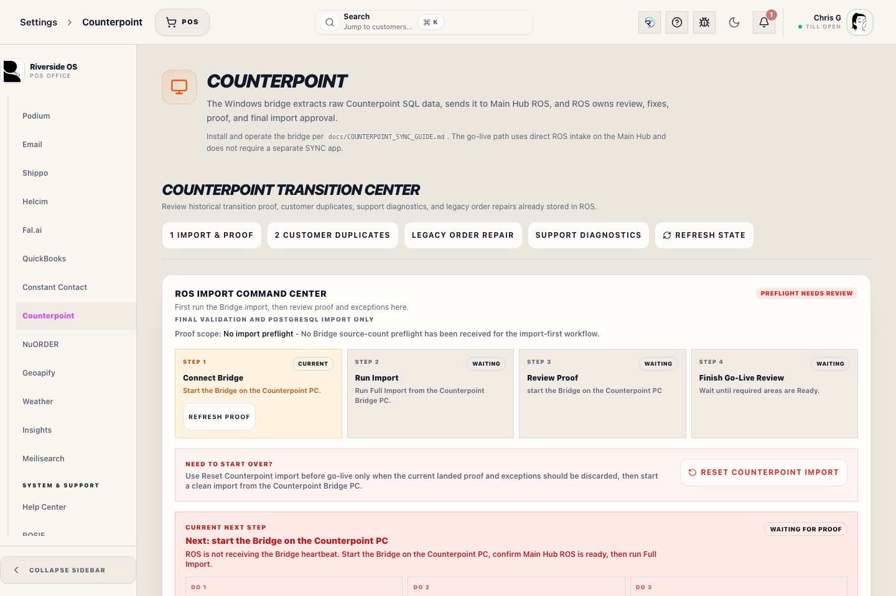
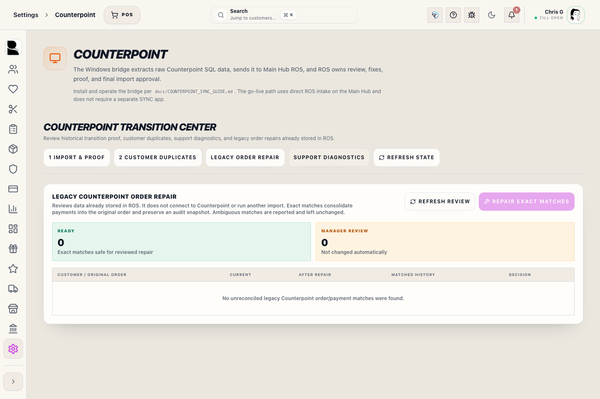

# Counterpoint Transition and Legacy Repair

## Screenshots

## What this is

Counterpoint Settings is the one-time ROS Import Command Center. For go-live, the Counterpoint Bridge reads Counterpoint SQL and posts directly to the Main Hub ROS intake on port 3000. ROS records source counts, landed proof, exceptions, duplicate-customer review, and final readiness.

Use this panel to verify facts before cutover. Bridge row counts mean data was sent. ROS landed counts mean ROS wrote and linked rows for proof.

After the import is signed off, Counterpoint does not create recurring stale-sync alerts. Any follow-up work belongs in the import proof, exception review, or duplicate-customer review surfaces before go-live.

Bridge **Online** proves only that the extraction process is currently reporting. Operations keeps
sync health **Degraded/Unknown** when no run history exists, an entity has never succeeded, or the
latest recorded success is older than 72 hours; it never converts those missing facts into a
healthy result.

ROS does not need another Counterpoint import to correct legacy order/payment history. Use **Legacy Order Repair** for historical records already stored in ROS.

## Legacy Order Repair

Use **Settings → Counterpoint → Legacy Order Repair** when an imported Counterpoint order appears more than once, a later payment is attached to a separate historical transaction, or the original order still shows a balance that Counterpoint documents as paid.

1. Select **Legacy Order Repair**.
2. Choose **Refresh Review**.
3. Review the **Ready** and **Manager review** counts.
4. Confirm each ready row shows the expected current and repaired paid/balance amounts.
5. Select **Repair Exact Matches** and enter the displayed confirmation phrase.
6. Reopen the customer’s Orders and History areas and confirm that the original order now carries the payments and correct balance.

The review uses only data already stored in ROS. It does not connect to Counterpoint, start the Bridge, or run an import.

An exact match requires the same customer, order total, merchandise lines, an original same-time Counterpoint ticket, and a unique set of payments that exactly equals the order total. ROS moves legitimate later payments onto the original order and supersedes duplicate imported payment/ticket shells. Before changing anything, ROS stores an audit snapshot and records the approving staff member.

Rows marked **Manager review** are not changed. Common reasons include multiple possible orders, mismatched merchandise, indistinguishable later payments, or payment totals that do not exactly equal the order total. Do not force a repair from the database; investigate the receipt and ROS transaction records first.

### Fulfillment incident recovery is held

There is no live bulk false-fulfillment or pickup-recognition recovery control
in this release. A prototype was removed from the executable migration, API,
and Settings paths after validation proved that it did not cover every writer
and could block legitimate Counterpoint, checkout, wedding, or exchange work.

Do not change fulfillment with direct SQL. Escalate the exact `TXN-` number and
retain its transaction, line, payment, inventory, revenue, commission, loyalty,
activity, and QBO evidence. `payment_allocations` does not retain attachment
time or mutation history, so any affected record with an allocation remains
blocked from automated recovery; current allocation agreement is not historical
proof. Manager review is required but cannot override missing provenance.

The held design requires explicit search-selected scope, count, reason,
correlation ID, Manager Access, rollback, and per-record verification. It is not
available to staff and must not be described as a shipped safeguard until the
runtime database role and every fulfillment/recognition writer use a trusted,
tested mutation boundary.

### Imported financial integrity

The financial-integrity section separates each Transaction Record's immutable Counterpoint import snapshot from its current net lines, payments, returns, refunds, and booking timestamps. A later audited return or refund is current operational history, not a broken import.

If Ticket History or Open Orders reports **source booking timestamp is missing or invalid**, correct the Bridge/source mapping and rerun that area. Riverside deliberately leaves the row in import review instead of substituting today's import time. A normal rerun preserves the superseded booking evidence and does not create a new current-day booked-sale adjustment.

1. Select **Refresh Integrity** and review the three counts.
2. **Financial source review** means the retained import-time money evidence conflicts. Compare the retained Counterpoint source payload and receipt; do not choose a total from this screen or force a database correction.
3. **Safe date repair** means a current imported line or its initial booking event used the later ROS import timestamp instead of the retained Counterpoint business time.
4. Select **Align Booking Dates** only after reviewing the manifest and entering the displayed confirmation phrase.
5. Reopen the affected Transaction Record audit and Daily Sales date. Confirm the source booking time appears and the header/payment/tender amounts are unchanged.

The screen shows a short reviewed-manifest fingerprint. Date repair sends the complete fingerprint and candidate count back to the Main Hub. If a candidate, ID, timestamp, count, or displayed financial context changed after the refresh, no row is changed and staff must refresh/review again. A successful repair stores the approving staff member, reason, manifest fingerprint, before/after values, and changed-row counts. It never changes transaction headers, payment transactions, payment allocations, or tender amounts. Orphaned or amended history stays in **Event review** for support/accounting review rather than being hidden.

**Repair Exact Matches** has the same safeguard. Its fingerprint covers the reviewed Transaction Record IDs, line signatures, payment/allocation IDs, statuses, dates, and totals. The Main Hub locks and rechecks those records before moving a payment. If anything drifted, the complete repair stops.

Counterpoint reruns also protect completed work. If an imported line already has a return/refund, fulfillment or purchase-order link/event, discount audit, suit-swap audit, or wedding cutover review, Riverside leaves the original line ID and all allocations/audit records intact and reports that the rerun needs Manager review.

## Go-live workflow

1. Open the Bridge app on the Counterpoint PC.
2. Confirm the Bridge can reach Main Hub ROS.
3. Run **Full Import** in the Bridge.
4. Open **Import & Proof** in ROS.
5. Follow **Current next step** at the top of the command center.
6. Confirm required areas show landed proof.
7. Resolve import exceptions by fixing supported ROS issues or deleting non-blocking issues from active review.
8. Review **Customer Duplicates** after customers land.
9. Confirm final proof is ready before go-live sign-off.

Do not sign off while required rows are failed, missing, or waiting for exception review.

## Current next step

The command center reads the Bridge heartbeat, source counts, landed proof, import exceptions, and required-area readiness. It then names the next action:

- Start the Bridge if ROS is not receiving a heartbeat.
- Run Full Import from the Counterpoint Bridge PC if source-count proof has not landed.
- Fix preflight blockers if Counterpoint SQL or mapping proof is blocked.
- Wait for landed proof if rows were sent but ROS has not written proof yet.
- Fix the first open exception when a source row cannot land cleanly.
- Review the first required area that is not ready.
- Move to final sign-off only after required areas are ready.

Use Support Diagnostics only when the current next step says proof or Bridge status is not progressing.

The four workflow cards show whether each stage is **Done**, **Current**, or **Waiting**. The active stage should match **Current next step**.

## Import proof

The proof table compares:

- **Expected**: rows Counterpoint reported during preflight.
- **Sent**: rows the Bridge posted to Main Hub ROS.
- **Landed**: rows ROS wrote and linked for proof.
- **Gap**: difference between expected and landed proof.
- **Ready**: whether that area can pass go-live review.

Some rows can intentionally create more than one ROS row, such as matrix variants. ROS proof should explain that clearly; unexplained gaps or failed required areas need review.

If a Bridge import fails before completion, the proof table shows the run as failed and ignores any partial landed rows from that failed run. Fix the Bridge extraction error on the Counterpoint PC, start a clean import when ready, then refresh proof before reviewing gaps.

## Exceptions

Import review identifies Counterpoint rows that need attention. The review table shows the affected import area, source details from the raw Counterpoint payload, the Counterpoint SKU value when one was provided, and the generated SKU when ROS had to assign one.

Generated SKU review rows are report-only rows. They do not require approval and do not show repair actions.

Landing issue rows should be fixed directly in ROS when a direct fix is supported. If the row should not block sign-off, use **Delete issue** to remove it from active review.

If an exception has no Counterpoint source key, it is a batch-level blocker rather than one row ROS can repair directly. Fix the source, duplicate, or mapping issue before final sign-off, or delete the issue from active review when it should not block sign-off.

Historical Counterpoint sales can include unresolved item lines when Counterpoint provides payment/header value but no exact item variant. ROS preserves the original Counterpoint item key so staff can correct the product when the exact line is known.

Generated SKU review rows mean Counterpoint supplied a valid item number but the SKU was blank, invalid, or duplicated. ROS assigns a stable compact `CP-XXXXXX` SKU, keeps the Counterpoint item key, and records the source payload for review. These rows are report-only, not repair blockers. Use **Export full list** to review all generated SKUs and search the generated SKU in Inventory when tag cleanup is needed.

Open Docs are active customer obligations. ROS does not create a placeholder line for an open order item that still cannot match a variant after catalog/SKU recovery. Fix the item mapping or source record before final sign-off, or delete the active review issue when it should not block sign-off.

## Duplicate customers

Customer rows with duplicate email addresses do not stop the customer import. ROS preserves the raw Counterpoint source data, lands the customer without violating the unique email rule, and opens review work so staff can merge or correct duplicates before sign-off.

## Clean restart

Use **Reset Counterpoint import** from **Import & Proof** or **Support Diagnostics** only before go-live when an import needs to start over. Reset clears imported Counterpoint rows, import proof, exceptions, quarantine, diagnostic leftovers, CSV/reference cleanup artifacts, and active import pointers. It keeps staff access, store settings, register/printer configuration, local ROS setup, and reviewed Counterpoint mapping configuration.

## Updating after more Counterpoint work

Before go-live, if staff keep working in Counterpoint after an import, use **Update Since Last Run** in the Bridge without resetting ROS. ROS uses Counterpoint document, customer, product, variant, gift card, and loyalty keys to update existing imported records and land new rows. Review **Current next step**, proof gaps, exceptions, open orders, deposits, and customer duplicates again before sign-off.

Use **Reset Counterpoint import** only when the previous import should be discarded and the store wants a clean baseline.

## Support diagnostics

Support Diagnostics is for troubleshooting proof, exceptions, and Bridge communication. It is not the normal import workflow and should not replace the current-run proof table.

## Imported tax semantics

Historical Counterpoint-imported transactions preserve gross historical totals for audit and reconciliation. Imported tax fields may be zero when Counterpoint did not provide itemized tax detail.

That imported tax detail is not current-period tax collection. Current Riverside OS tax reporting and QBO proposals should use current ROS activity, not historical imported activity.

## What to watch for

- Do not sign off from Bridge row counts alone.
- Confirm ROS landed proof for required areas.
- Resolve exceptions before final sign-off.
- Review customer duplicates before opening live operations.
- Confirm imported rows are auditable and distinguishable from current ROS transactions.

## Related workflows

- [QBO Workspace](manual:qbo-workspace)
- [Inventory Control Board](manual:inventory-control-board)
