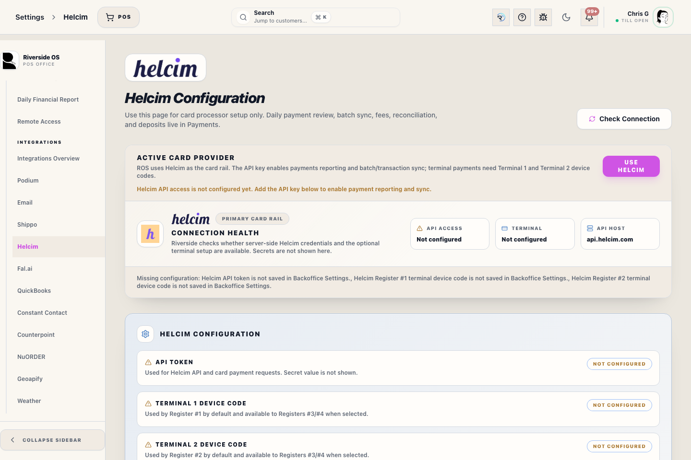

# Helcim Settings

## Screenshots

<!-- help:component-source -->
_Linked component: `client/src/components/settings/HelcimSettingsPanel.tsx`._
<!-- /help:component-source -->

## What this is

Use Helcim Settings to configure the card processor connection, terminal device codes, optional webhook signing secret, and test mode. Use Payments Health for daily payment review.

## When to use it

Use this panel when setting up Helcim, rotating credentials, adding or replacing a terminal, checking whether webhook signing is configured, or confirming that test mode is off before live card processing.

## Before you start

- You need Settings admin access.
- Routine Helcim secrets belong in this Settings panel or server environment configuration, not in notes, chats, screenshots, or customer records.
- Webhooks require a public HTTPS ROS API URL that Helcim can reach. Do not use localhost, 127.0.0.1, or a register workstation URL in Helcim.
- Live terminal payments require the API token and the device code for the terminal selected by the active register. Terminal 1 is the default for Register #1, Terminal 2 is the default for Register #2, and Registers #3/#4 choose an available configured terminal.
- Helcim terminal/device receipt printing should be off for Riverside lanes. ROS receipts are the customer/store receipt source after checkout.

## Steps

1. Open Settings, then Helcim.
2. Check API access and terminal readiness.
3. Save or replace the API token and the Terminal 1 / Terminal 2 device codes needed for the store's active registers.
4. If public webhooks are enabled, paste the public HTTPS delivery URL into Helcim with this path: `/api/webhooks/card-events`. Helcim requires HTTPS and does not allow the word Helcim in the URL.
5. Enable only the Helcim events ROS handles: `cardTransaction` and `terminalCancel`.
6. Save the Helcim webhook signing secret in the Optional webhook signing secret field.
7. Use Check Connection after saving credentials.
8. Verify payment updates in Payments > Health, Payment Updates, and Helcim Terminal Review.

## What to watch for

- **Webhook received by ROS** means a signed Helcim delivery reached ROS and was stored.
- **Provider event attached to ROS checkout** means ROS matched that stored provider event to one safe pending terminal checkout attempt.
- **Provider reference attached to ROS payment** means the payment row has the Helcim transaction ID needed for later card-not-present refunds.
- Webhook receipt does not by itself create a ROS payment ledger row, finish checkout, or prove that ROS recorded the payment.
- Card Not Present and public web checkout use HelcimPay.js. Add the public HTTPS ROS/PWA checkout origin to the Helcim API Access Configuration before live keyed entry. The desktop app's local `tauri.localhost` origin is not valid for HelcimPay.js, so Register Card Not Present embeds a one-time public HTTPS handoff inside the checkout drawer and then records the approved attempt back to the sale. Use **Open in Chrome** only if the embedded handoff does not load. If the public HTTPS base URL is not configured, use Manual Card only for an approval completed outside ROS.
- POS terminal requests also send a ROS invoice reference to Helcim. If a terminal approves but the live drawer response is delayed, the checkout drawer status check can recover the provider transaction by that invoice reference and exact amount.
- If a Helcim terminal prints a card receipt, fix the terminal/dashboard receipt setting before live processing continues; do not treat the terminal printout as the ROS receipt.
- If Payments Health shows **Provider event not attached to ROS checkout**, treat it as provider evidence requiring review only when the ROS payment is missing a Helcim provider reference.
- If the signing secret is missing or wrong, ROS rejects the delivery before it appears in Payments Health. Ask an admin to check server logs and the Settings secret.
- Test mode is for local checkout testing only. Keep it off for live Helcim payments.

## What happens next

After setup, POS terminal attempts can still be approved, declined, canceled, expired, or left unresolved by provider timing. Staff should follow the checkout drawer status and Payments Health review guidance before retrying unresolved terminal attempts.

## Related workflows

- Payments Operations: `docs/staff/payments-operations.md`
- Helcim integration contract: `docs/HELCIM.md`
- Store deployment: `docs/STORE_DEPLOYMENT_GUIDE.md`
