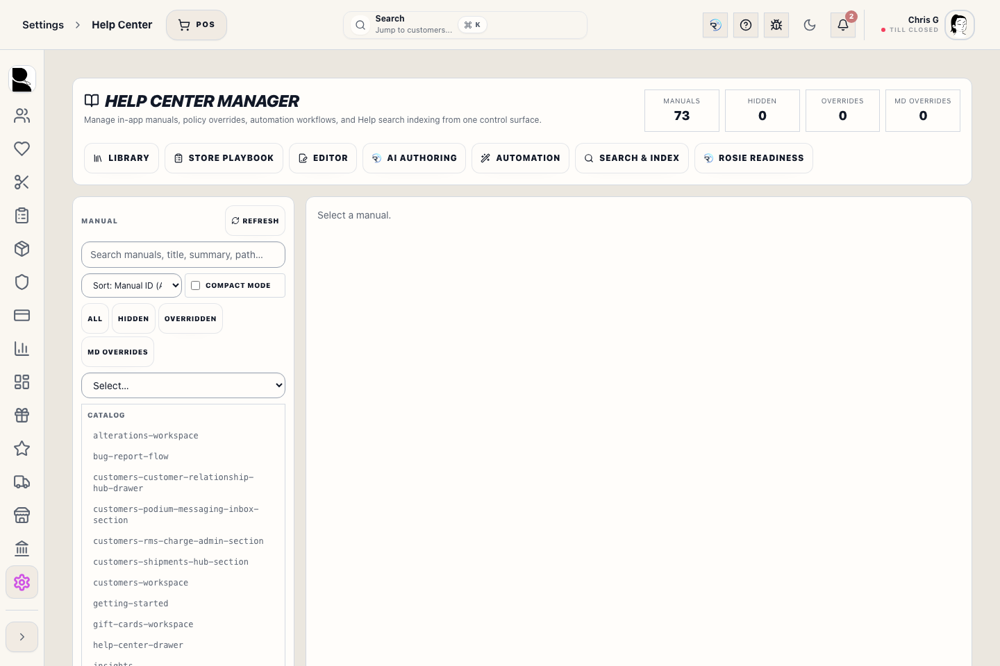
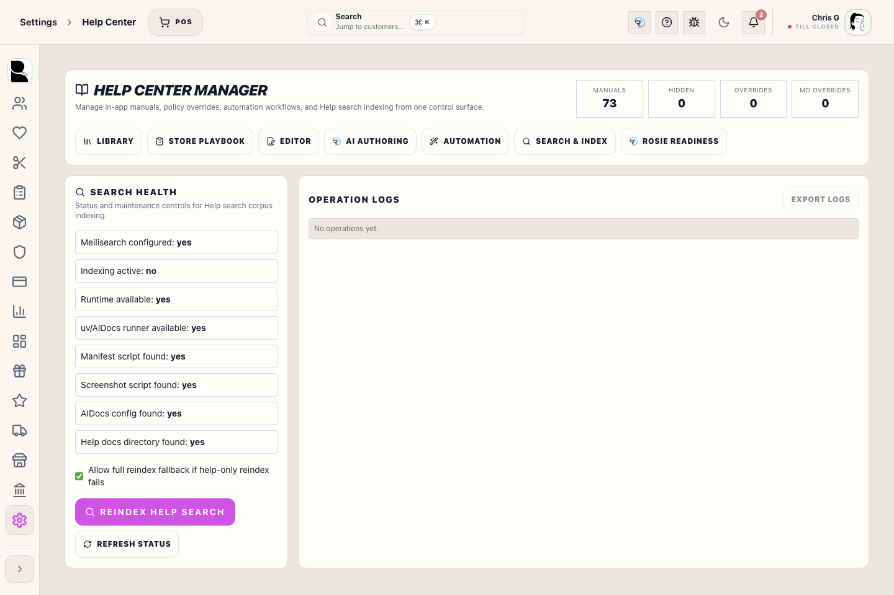
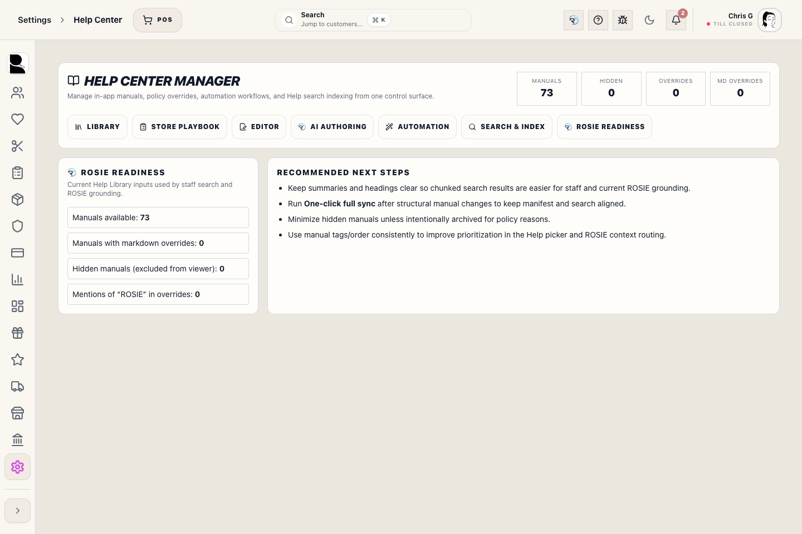
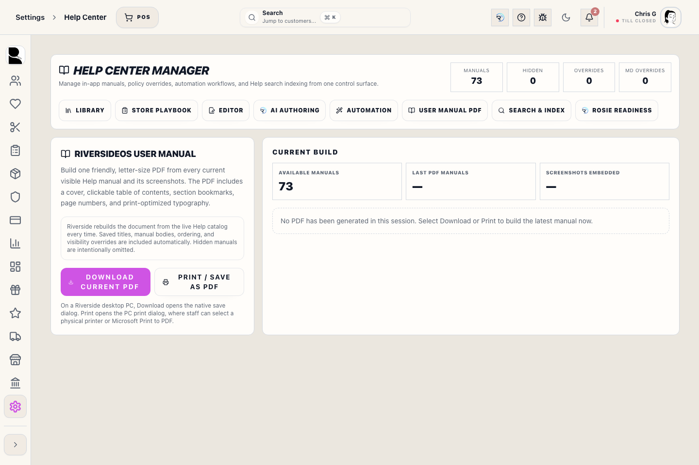

# Help Center Manager

## Screenshots

## What this is

Help Center Manager is the manager and support workspace for the staff Help Library. It shows every bundled manual, any store-specific override, visibility rules, automation health, screenshot controls, Help search status, and the approved knowledge sources available to ROSIE.

Normal staff use the **Help** button in the top bar. Use this manager workspace only when the library needs maintenance or a Help/ROSIE problem needs diagnosis.

## Before you start

- You need **Help management** access (`help.manage`).
- Use synthetic or redacted data in screenshots and manual examples.
- Treat bundled manuals as the product baseline. Store overrides should be small, intentional, and reviewed.
- Do not paste Access PINs, integration secrets, card data, or private customer notes into manuals or ROSIE authoring prompts.

## Review the Help Library

1. Open **Settings → Help Center**.
2. Use **Library** to search and sort the manual catalog.
3. Check **Hidden**, **Overridden**, or **Body overrides** when diagnosing why staff see different content.
4. Select a manual and open **Editor** to review its bundled text and any store override.
5. Confirm the title, summary, steps, warnings, permissions, and screenshots still match the live workflow.

Hiding a manual removes it from staff who would otherwise be allowed to see it. Permission and Register-session rules must remain at least as strict as the workflow they describe.

## Edit or revert a store override

1. Select the manual in **Library**.
2. Open **Editor**.
3. Change only the store-specific wording that needs to differ from the bundled guide.
4. Review visibility and Register-session access before saving.
5. Save, reopen the staff Help drawer, and verify the result with the intended role.

Use **Revert** to remove the database override and return to the bundled release manual. Reverting does not delete the bundled manual.

## Download or print the RiversideOS User Manual

1. Open **User Manual PDF**.
2. Select **Download Current PDF** to save `RiversideOS-User-Manual.pdf` on this PC.
3. Select **Print / Save as PDF** to open the PC print dialog instead.
4. Choose a physical printer for a paper copy, or choose the operating system's PDF printer to save another PDF copy.
5. Confirm the completed build reports the expected manual and screenshot counts.

Riverside rebuilds the PDF from the live Help catalog each time. Current saved title, body, ordering, and visibility overrides are included; intentionally hidden manuals are omitted. The manual includes a cover, clickable table of contents, PDF bookmarks, page numbers, readable letter-size formatting, and the screenshots referenced by each manual.

Generate a new copy after updating manuals. Previously downloaded or printed copies are snapshots and do not update themselves.

## Refresh screenshots and generated manuals

1. Open **Automation**.
2. Leave **dry run** on when reviewing what component scanning would change.
3. Capture screenshots only against the isolated Help/E2E environment.
4. Generate the Help manifest after adding, renaming, or changing manual metadata.
5. Review the automation result and generated quality report before publishing.

ROSIE-generated manual text is a draft. A manager or maintainer must verify every instruction and screenshot before staff can rely on it.

## Rebuild Help search

1. Open **Search & Index**.
2. Confirm Meilisearch is configured and healthy.
3. Select **Reindex Help Search** after manuals or store overrides change materially.
4. Wait for a successful result.
5. Open the staff Help drawer and test realistic phrases such as **close register**, **refund failed**, **wedding deposit**, and **printer issue**.

If live search is unavailable, the Help drawer searches bundled on-device manuals. Reindexing is still required so server search and store overrides are current.

## Verify ROSIE readiness

1. Open **ROSIE readiness**.
2. Confirm the visible, overridden, and hidden manual counts match the intended Help Library.
3. Run **One-click full sync** after structural manual changes.
4. Use **Settings → ROSIE** to inspect the wider approved staff-procedure and policy source groups and any detected intelligence-pack issues.
5. Refresh ROSIE intelligence after approved corpus changes.
6. Ask ROSIE representative workflow, permission, recovery, and live-data questions using a test account with the intended role.

ROSIE retrieval is permission-aware. A successful Admin answer does not prove a Register-only or standard Staff user can see the same source or live data.

## What to watch for

- Do not hide a recovery, payment, register-close, or safety manual without an approved replacement.
- Do not broaden a manual's permissions to work around an access problem.
- Do not trust a green manifest alone; verify search results, screenshots, and the real staff wording.
- If Help and the live screen disagree, follow the live validated workflow, correct the source manual, regenerate Help, and reindex search.
- ROSIE can explain and retrieve approved information, but it cannot bypass Manager Access or silently change Riverside OS data.

## What happens next

After a successful refresh, staff Help displays the approved manuals, live search uses the rebuilt index when available, the bundled fallback remains usable, and ROSIE rebuilds its local approved knowledge index on the next refresh or server lifecycle.

## Related workflows

- [Help Center Drawer](manual:help-center-drawer)
- [ROSIE Settings](manual:settings-rosie-settings-panel)
- [Bug Report Flow](manual:bug-report-flow)
