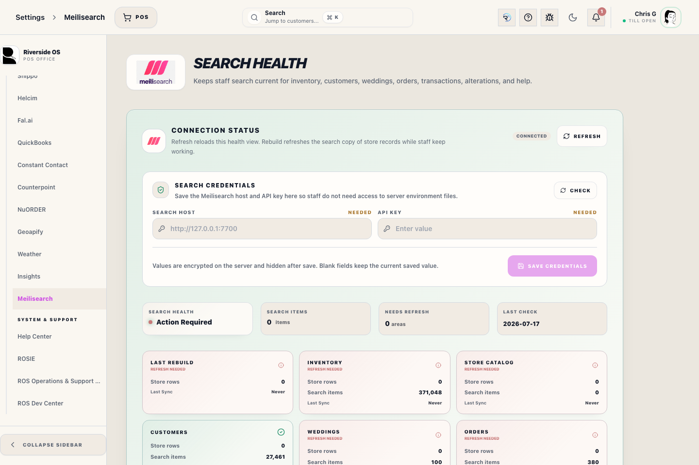

# Meilisearch Settings

## Screenshots

<!-- help:component-source -->
_Linked component: `client/src/components/settings/MeilisearchSettingsPanel.tsx`._
<!-- /help:component-source -->

## What this is

Use this Settings panel to verify whether the optional Meilisearch search engine is configured, whether each search index has synced successfully, and whether a full rebuild is needed.

## When to use it

Use this panel when inventory, customer, wedding, order, transaction, alteration, or Help Center search feels stale or blank.

## Before you start

- You need Settings admin access.
- PostgreSQL is still the source of truth. Meilisearch only accelerates fuzzy search.
- Search-capable screens fall back to SQL search when Meilisearch is unavailable.
- The saved Meilisearch API key in this panel is an encrypted server credential. It must match the live Meilisearch master/API key; `server/.env` is only a fallback for deployments without a saved value.

## Steps

1. Open Settings, then Meilisearch.
2. Use Refresh to reload the health view. This does not rebuild any index.
3. Review the PostgreSQL rebuild count, live search item count, count parity, rebuild time, and the exact reason for any warning.
4. Use Rebuild all indices after a restore, Meilisearch wipe, or major import if search results are stale.

## What to watch for

- Meilisearch does not update itself directly from PostgreSQL. ROS updates search through server write hooks after records are saved.
- Refresh only reloads this dashboard. It does not push new data into Meilisearch.
- Rebuild all indices pushes PostgreSQL records into Meilisearch and refreshes row counts.
- If the panel says the saved API key was rejected, enter the current Meilisearch API key and save credentials. Restart the API if the rejection remains after saving.
- If the panel says **Search runtime update required**, the self-hosted Meilisearch version does not match the version packaged for this Riverside build. Update the Main Hub search runtime before rebuilding; a rebuild does not repair a version mismatch.
- **Search ready** means the search service is reachable on the Riverside-pinned runtime version, no index job is still running, the latest full rebuild is no more than 36 hours old, and the live document count matches the PostgreSQL count captured by that rebuild.
- A warning names the fact that could not be verified: an old rebuild, a count mismatch, a failed or processing job, an unavailable live count, or a connection failure. Refresh rechecks those facts; it does not repair them.
- Normal incremental changes can make the stored rebuild count differ until the next automatic daily rebuild. Riverside safely confirms empty searches through PostgreSQL while parity is not verified. Rebuild manually when staff need the warning cleared immediately or results remain wrong.
- Back Office Orders are indexed as `ros_orders`; financial Transactions are indexed as `ros_transactions`. Orders should match unfulfilled Special, Custom, and Wedding order work in the Orders workspace, while Transactions includes all checkout records.
- Normal record changes update their affected documents through server-side write hooks. A full rebuild is the repair path when those hooks were missed or the search service was offline.

## What happens next

After a successful rebuild, each active index should show matching PostgreSQL and live search counts plus a current, count-verified status.

## Related workflows

- Search and pagination: `docs/SEARCH_AND_PAGINATION.md`
- Store deployment: `docs/STORE_DEPLOYMENT_GUIDE.md`
