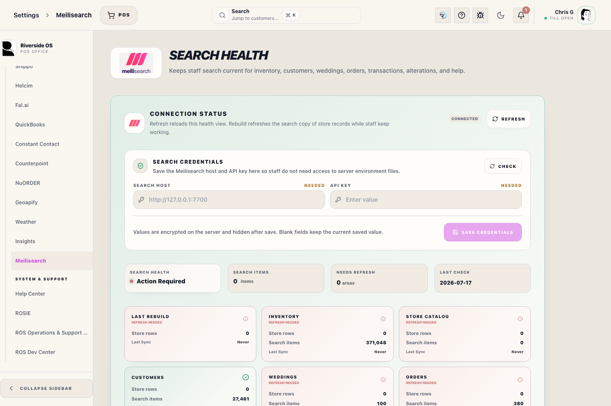
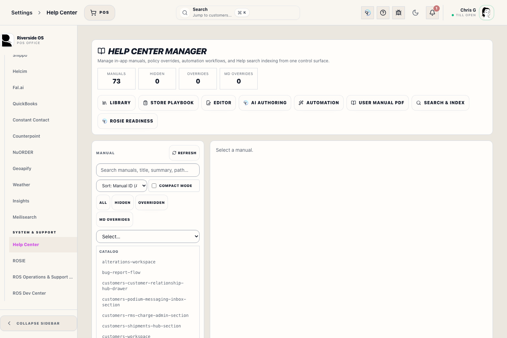

# Meilisearch Settings

## Screenshots

<!-- help:component-source -->
_Linked component: `client/src/components/settings/MeilisearchSettingsPanel.tsx`._
<!-- /help:component-source -->

## What this is

Use this Settings panel to verify whether the Main Hub Meilisearch engine is connected, whether each search index has synced successfully, and whether Riverside has queued automatic repair.

## When to use it

Use this panel when inventory, customer, wedding, order, transaction, alteration, or Help Center search feels stale or blank.

## Before you start

- You need Settings admin access.
- PostgreSQL is still the source of truth. Meilisearch only accelerates fuzzy search.
- Search-capable screens fall back to SQL search when Meilisearch is unavailable.
- The saved Meilisearch API key in this panel is an encrypted server credential. It must match the live Meilisearch master/API key; `server/.env` is only a fallback for deployments without a saved value.

## Steps

1. Open Settings, then Meilisearch.
2. Use Refresh to reload the health view. This does not rebuild any index.
3. Review the verified PostgreSQL count, live search item count, current verification time, and the exact reason for any warning.
4. Riverside repairs failed, divergent, mismatched, missing, or aging indexes automatically. Use **Rebuild search** only after a restore/wipe or when Support directs you to retry immediately.

## What to watch for

- ROS updates Meilisearch through server write hooks after records are saved, verifies the resulting revision in the background, and automatically stages a full repair when a task fails or counts diverge.
- Refresh only reloads this dashboard. It does not push new data into Meilisearch.
- Rebuild all indices pushes PostgreSQL records into Meilisearch and refreshes row counts.
- If the panel says the saved API key was rejected, enter the current Meilisearch API key and save credentials. The Settings response then shows **Main Hub restart required** because application search keeps its startup client until the Main Hub is restarted; do not treat a successful save or health check as full activation.
- If the panel says **Search runtime update required**, the self-hosted Meilisearch version does not match the version packaged for this Riverside build. Update the Main Hub search runtime before rebuilding; a rebuild does not repair a version mismatch.
- **Search ready** means the search service is reachable on the Riverside-pinned runtime version, no index job is still running, the latest full rebuild is no more than 36 hours old, and the current revision has a recent matching PostgreSQL/live-search count verification.
- **Automatic search repair queued** means Riverside found an incomplete update and will build and verify a replacement search copy without taking the current index away from staff. The panel checks every 30 seconds while idle and every 3 seconds during a rebuild.
- The daily rebuild worker checks immediately when the Main Hub starts. If today's rebuild is due and the scheduled local hour has already passed, it begins in the background instead of leaving search in SQL fallback until the next hourly check.
- A warning names the fact that could not be verified: an old rebuild, a count mismatch, a failed or processing job, an unavailable live count, or a connection failure. Revision/count warnings repair automatically; credentials and runtime-version warnings require a Main Hub configuration/update correction.
- Normal incremental changes briefly show **Confirming** until the background verifier proves the new revision. A sticky task failure or mismatch queues an atomic staged rebuild automatically and retries with bounded backoff.
- Back Office Orders are indexed as `ros_orders`; financial Transactions are indexed as `ros_transactions`. Orders should match unfulfilled Special, Custom, and Wedding order work in the Orders workspace, while Transactions includes all checkout records.
- Normal record changes update their affected documents through server-side write hooks. Riverside's automatic full rebuild is the repair path when a task failed, an index fell behind, or the search service was temporarily offline.

## What happens next

After a successful rebuild, each active index should show matching PostgreSQL and live search counts plus a current, count-verified status.

## Related workflows

- Search and pagination: `docs/SEARCH_AND_PAGINATION.md`
- Store deployment: `docs/STORE_DEPLOYMENT_GUIDE.md`
