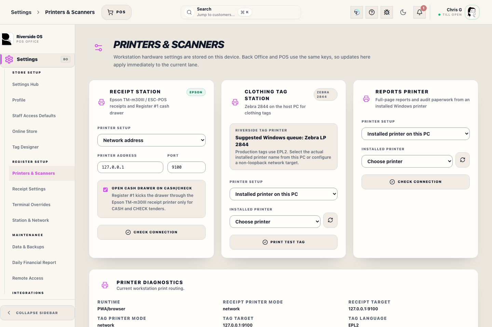
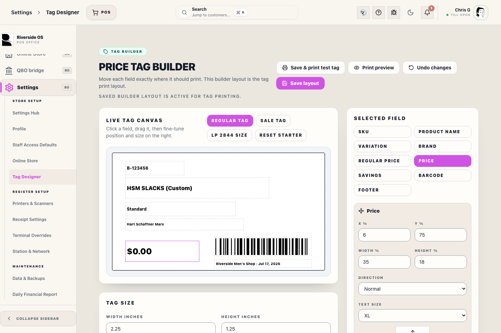
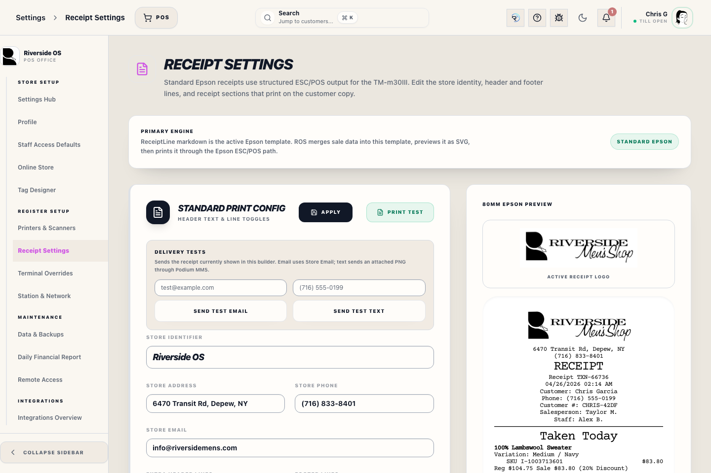

# Printers And Scanners Panel (settings)

## Screenshots

## What this is

This panel stores the current workstation's hardware targets. Back Office and POS use the same local settings, but POS opens a Register Hardware view with lane-focused readiness and test actions.

Register Settings only controls register preferences such as receipt auto-print. Receipt, tag, and Reports printer targets must be set here so every print path uses the same station configuration.

## When to use it

Use this panel when opening a new lane, replacing a printer, checking scanner input, or troubleshooting receipt delivery after a completed sale.

## How to use it

1. Open **Settings → Printers & Scanners**.
2. For the Epson TM-m30III receipt station, choose an installed printer from the desktop printer dropdown or enter the printer IP and port for network mode.
3. Leave **Open cash drawer on cash/check** enabled for Register #1 when the drawer is attached to the Epson receipt printer.
4. The Zebra clothing tag station should target the actual local Windows printer queue for the LP 2844, normally **Zebra LP 2844**, and uses **EPL2**.
5. Choose the installed **Reports Printer** on the Windows desktop station. Reports do not use a network-address mode in the desktop app.
6. Use **Print test tag** on the Clothing Tag Station card, or open **Tag Designer → Save & print test tag**, to save the current tag layout and send an actual EPL2 test label through the saved Tag Station target. The success message appears only after ROS dispatches to that target.
7. In POS, use **Print test** to send a short Epson test receipt.
8. Use **Open drawer** only when you need a manual drawer open. Enter a reason and the acting staff member's **Access PIN** so the event is recorded for the Z-report.
9. Use **Check connection** for the receipt and Reports printers. The desktop app checks installed printers directly; PWA/browser mode asks the Riverside server to check the receipt network path and Main Hub tag route.
10. Focus the scanner test field and scan a barcode to confirm HID keyboard input is reaching ROS.

## Recovery and escalation

If a printer test fails, do not keep retrying sale completion from the cart. Confirm the selected printer, printer power/network state, and whether the station is running the desktop app or browser/PWA mode. For cash drawer issues, record the manual-open reason and staff member before calling support so the Z-report remains auditable.

## Tips

- Receipt printing uses Epson ESC/POS for the TM-m30III path.
- The cash drawer opens automatically only on CASH and CHECK sales from Register #1.
- Manual drawer opens require an Access PIN, a reason, and are listed on the Z-report.
- The POS Register Hardware view shows the active receipt address, cash drawer state, and configured Zebra LP 2844 EPL2 tag route at the top of the page.
- The diagnostics panel shows runtime, receipt route, tag route, tag language, and the last printer test result.
- Item tags print through the saved Tag Station target using EPL2. For the Main Hub USB printer, select the installed Windows **Zebra LP 2844** queue. The old `127.0.0.1` tag address path is not used for Riverside tags.
- In the desktop app, direct tag printing must reach the configured Zebra station. If that fails, Riverside shows the printer error and does not mark variants as shelf-labeled.
- Tag Builder shows one editable tag canvas with separate **Regular tag** and **Sale tag** layouts. Move, resize, rotate, and size SKU, product name, variation, brand, price, barcode, and footer directly on the tag; those saved positions are the actual EPL2 print positions. To change price size, select the **Price** field and choose its **Text size**. Use the larger price text sizes when the Price field has enough room; Riverside still fits the final printed price inside that saved field box.
- Use **Sale tag** in Tag Builder to position regular price, sale price, and savings as separate fields before printing promotional tags. Sale layout changes do not move the regular tag layout.
- **Save & print test tag** saves the builder layout first, then uses the same direct tag route as inventory tag buttons. It does not fall back to preview when the selected printer path fails.
- Use **LP 2844 retail tag** in Tag Designer when the Zebra is loaded with Riverside's standard 2.25 in x 1.25 in clothing tags. A taller saved height can feed blank extra tag stock.
- On Zebra LP 2844 EPL2 retail tags, Riverside uses the saved Tag Builder field positions and configured fields. **Save & print test tag** uses a normal `B-XXXXXX` barcode sample so the physical barcode footprint matches regular Riverside item tags.
- Browser/PWA mode can save the same receipt settings. Tag printing still routes through the Main Hub saved Tag Station target when the API host is the Windows Main Hub. Receipt checks in PWA/browser mode verify the server-to-printer TCP path; installed-printer dropdowns and Windows printer checks run in the desktop app.
- USB scanner hardware on PC and Bluetooth scanner hardware on iPad/phone should be configured as HID keyboard input with an Enter suffix.

## What happens next

The workstation immediately uses the saved local printer targets for receipt, tag, and report actions. In the desktop app, Register Reports and Z-Reports dispatch through the saved Reports printer name for accountability instead of opening an external browser preview.

## Related workflows

- Receipt Settings controls Epson receipt content.
- POS sale completion uses the receipt printer target.
- Inventory tag printing uses the tag station target.
- Register Daily Sales and Z-Reports use the reports printer target.
