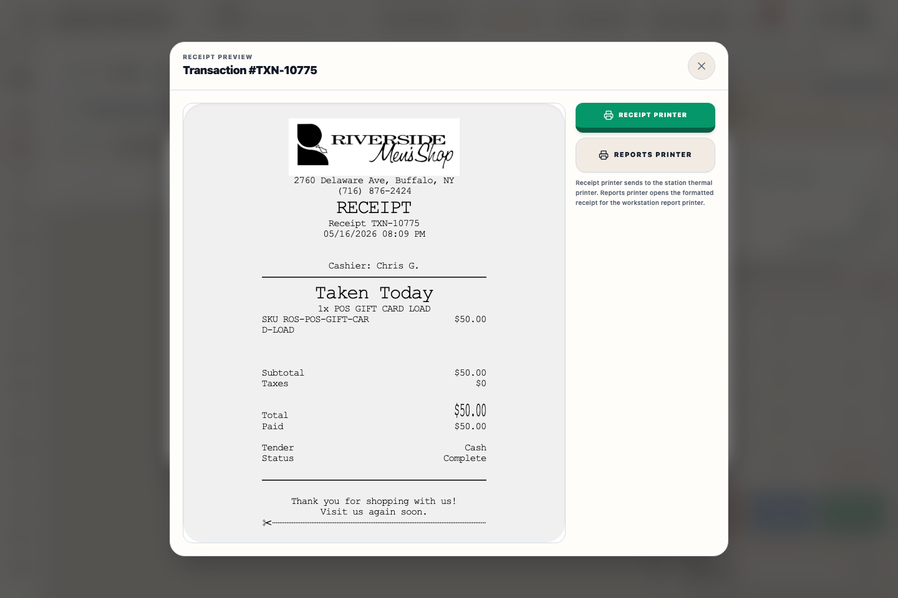

# Printers And Scanners Panel (settings)

## Screenshots

## What this is

This panel stores the current workstation's hardware targets. Back Office and POS use the same local settings, but POS opens a Register Hardware view with lane-focused readiness and test actions.

## When to use it

Use this panel when opening a new lane, replacing a printer, checking scanner input, or troubleshooting receipt delivery after a completed sale.

## How to use it

1. Open **Settings → Printers & Scanners**.
2. For the Epson TM-m30III receipt station, choose an installed printer from the desktop printer dropdown or enter the printer IP and port for network mode.
3. Leave **Open cash drawer on cash/check** enabled for Register #1 when the drawer is attached to the Epson receipt printer.
4. For the Zebra 2844 clothing tag station, choose the installed Zebra printer or enter the tag printer IP, then leave **Printer language** on **Auto-detect LP/TLP 2844** unless support tells you to force EPL or ZPL.
5. Enter the reports printer target when the workstation uses a dedicated reports bridge.
6. Open **Tag Designer → Print test tag** to send an actual sample label using the current saved tag layout and configured tag station.
7. In POS, use **Print test** to send a short Epson test receipt.
8. Use **Open drawer** only when you need a manual drawer open. Enter a reason and the acting staff member's **Access PIN** so the event is recorded for the Z-report.
9. Use **Check connection** for the receipt printer. The desktop app checks the printer directly; PWA/browser mode asks the Riverside server to check the printer IP and port.
10. Focus the scanner test field and scan a barcode to confirm HID keyboard input is reaching ROS.

## Recovery and escalation

If a printer test fails, do not keep retrying sale completion from the cart. Confirm the selected printer, printer power/network state, and whether the station is running the desktop app or browser/PWA mode. For cash drawer issues, record the manual-open reason and staff member before calling support so the Z-report remains auditable.

## Tips

- Receipt printing uses Epson ESC/POS for the TM-m30III path.
- The cash drawer opens automatically only on CASH and CHECK sales from Register #1.
- Manual drawer opens require an Access PIN, a reason, and are listed on the Z-report.
- The POS Register Hardware view shows the active receipt address, cash drawer state, and Zebra tag target at the top of the page.
- Item tags print directly to the configured Zebra station. Auto language uses EPL for classic Zebra LP/TLP 2844 names and ZPL II for newer Zebra/ZPL printers; if the desktop app still has the default tag address but sees an installed Zebra/2844 printer, it uses that installed printer before trying the network fallback.
- In the desktop app, direct tag printing must reach the configured Zebra station. If that fails, Riverside shows the printer error and does not mark variants as shelf-labeled.
- Tag Designer shows the live tag preview in the panel. Browser/PWA sessions can still open a printable preview document, but the desktop app uses **Print test tag** for the real Zebra path.
- Browser/PWA mode can save the same settings and can use server-side network printing when the API host can reach the printer. Receipt checks in PWA/browser mode verify the server-to-printer TCP path; installed-printer dropdowns and Windows printer checks run in the desktop app.
- USB scanner hardware on PC and Bluetooth scanner hardware on iPad/phone should be configured as HID keyboard input with an Enter suffix.

## What happens next

The workstation immediately uses the saved local printer targets for receipt, tag, and report actions. In the desktop app, Register Reports and Z-Reports send their printable audit text to the configured Reports printer.

## Related workflows

- Receipt Settings controls Epson receipt content.
- POS sale completion uses the receipt printer target.
- Inventory tag printing uses the tag station target.
- Register Daily Sales and Z-Reports use the reports printer target.
