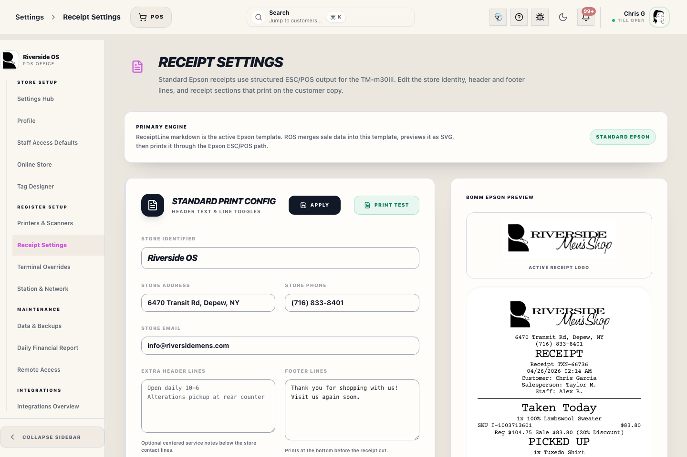

# Receipt Settings Panel (settings)

## Screenshots

## What this is

Receipt Settings controls what appears on customer receipts. The production path is **Standard Epson**, which uses ReceiptLine markdown for the editable template and prints ESC/POS receipts on Epson TM-m30III-compatible printers.

## When to use it

Use this panel when changing the receipt logo, store name, header lines, footer lines, or receipt sections used for receipt output.

## How to use it

1. Open **Settings → Receipt Settings**.
2. Use **Receipt Logo** to show or hide the full Riverside Men's Shop logo at the top of printed receipts.
3. Edit the store identifier and contact fields.
4. Add extra header lines for service notes or pickup instructions. The box supports normal spaces and line breaks; each non-empty line prints centered under the store contact details.
5. Add one footer line per row for thanks, return policy, or store messaging. The box supports normal spaces and line breaks; each non-empty line prints above the receipt cut.
6. Turn receipt sections on or off.
7. Review or edit the ReceiptLine template when the store needs a deeper layout change.
8. Use the preview to review the standard receipt shape.
9. Use **Print Test** to send the current preview to the Epson receipt printer.
10. Enter a destination under **Delivery tests** and use **Send Test Email** or **Send Test Text** to send the current preview without saving first. Email uses Store Email; text sends an attached receipt image through Podium.
11. Click **Apply** to save the standard receipt settings.

## Recovery and escalation

If a test print does not match the preview, check printer routing first, then re-open Receipt Settings and confirm the saved template still contains the required financial tokens. Do not remove tender, tax, paid, balance, or item-line tokens to make the layout shorter; those fields are part of the customer receipt audit trail.

## Tips

- Use **Printers & Scanners** to choose the workstation Epson receipt printer by installed printer name or network IP.
- Epson ESC/POS is the active production receipt path.
- Register #1 cash drawer behavior is controlled in **Printers & Scanners**. The drawer opens automatically for CASH and CHECK sales only; manual drawer opens require an Access PIN and are reported on the Z-report.
- The preview reflects the ReceiptLine template, header lines, footer lines, and section toggles before saving.
- The receipt logo is controlled by the `{{LOGO_IMAGE}}` token and is resized for 80mm Epson thermal output.
- The address, phone, email, barcode, and loyalty toggles affect the ReceiptLine preview and print output.
- The Order Barcode toggle prints a barcode for the Transaction Record display ID, such as `TXN-566056`. Staff can scan it in Register for the matching transaction workflow or scan/type it in Universal Search to open the Transaction Hub.
- Keep customer, item, payment, and financial tokens such as `{{CUSTOMER_LINE}}`, `{{ITEM_LINES}}`, `{{PAYMENT_BLOCK}}`, `{{PAYMENT_HISTORY_BLOCK}}`, `{{SUBTOTAL_LINE}}`, `{{TAX_LINE}}`, `{{TOTAL_SAVINGS_LINE}}`, `{{TOTAL_LINE}}`, `{{PAID_LINE}}`, and `{{TENDER_LINE}}` in the template.
- `{{CUSTOMER_LINE}}` prints the customer name, phone, and Customer # when present. `{{ITEM_LINES}}` groups merchandise as Taken Today, PICKED UP, SHIPPED, Special Order, Custom Order, Wedding Order, or Layaway and includes product title, SKU, variation, quantity when greater than one, order date for pickup lines, and pricing when applicable. Pickup receipts only print the items picked up in that pickup event.
- Pickup receipts use the normal **RECEIPT** heading. The **PICKED UP** status belongs in the item body, not the receipt title.
- Split tenders are shown as separate payment rows with short labels such as **CC**, **Cash**, **RMS90**, **RMS**, **Check**, and **SC**.
- `{{LOYALTY_EARNED}}` and `{{LOYALTY_BALANCE}}` are populated when loyalty toggles are on and the customer has earned points.
- The old HTML designer is not part of normal receipt setup.
- Delivery tests use the receipt preview currently shown in the builder, so they are useful for checking the exact layout before applying changes.

## What happens next

New receipt settings apply to future receipt previews, printed receipts, text receipts, and email receipts.

## Related workflows

- Printers & Scanners controls the workstation printer target, cash drawer test, Zebra tag station, report printer, and scanner test.
- POS sale completion uses these receipt settings after checkout.
- Text receipt delivery uses Podium MMS with the receipt preview attached. Customer sale receipts continue to use the configured Store Email mailbox for email delivery.
