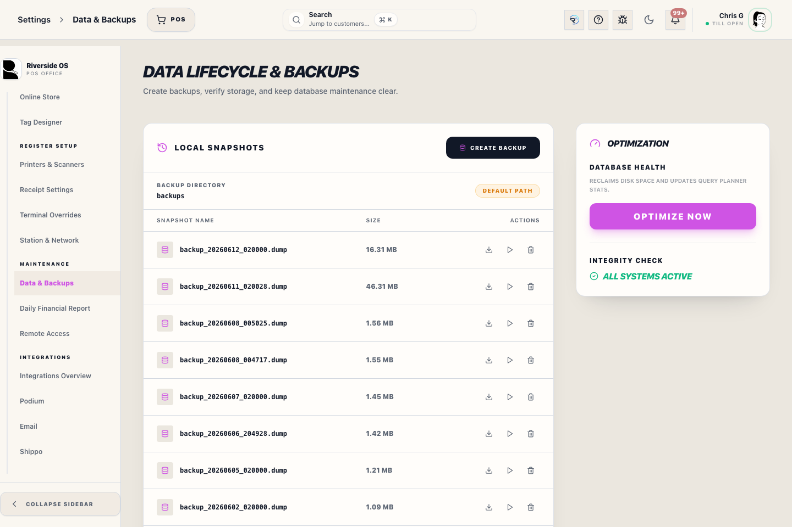
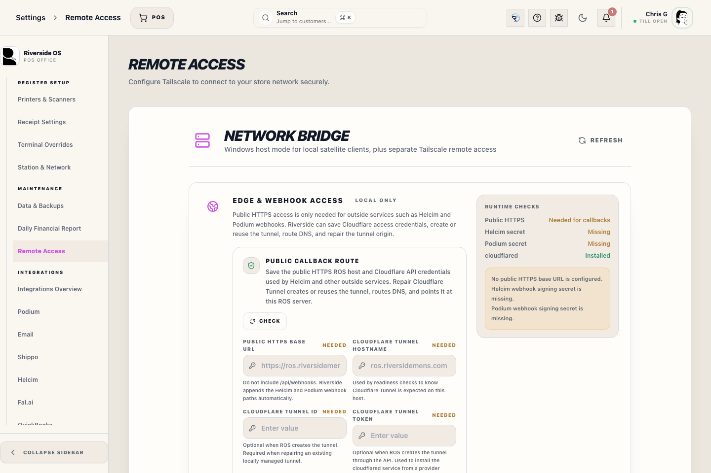

# Riverside Updates

## Screenshots

## What this is

Use **Settings → Updates** to see which update path applies to the PC in front of you. Riverside identifies the Main Hub separately from Register and Back Office PCs so staff do not accidentally run server work on a workstation.

The normal private release is built, signed, and published to ROS on the Main Hub. Publishing only makes the candidate visible; it does not install anything. No GitHub account is required for staff to install it. Windows workstations download the signed app update from the Main Hub address already saved during station setup.

## How to use it

### Main Hub update

Only run the Main Hub update during an approved update window, normally before 10 AM or after 6 PM.

1. Open **Settings → Updates** on the Main Hub.
2. Confirm the release card says **Private Main Hub release** and review the candidate version and build.
3. Confirm no Register is in an active payment or unsynced checkout.
4. Select **Install Main Hub candidate** only when the release is ready and the update window is approved.
5. Follow the elevated update window until Riverside reports the expected build is ready.
6. Reopen Riverside and confirm the Main Hub, database, and search readiness are healthy.

The guarded update verifies the package, takes the required pre-migration backup, runs the normal installer and migrations, and checks the exact build. Until the Main Hub is running that candidate build, Riverside keeps the Windows workstation updater unavailable. If installation or readiness fails, the normal rollback remains authoritative and staff must not update other stations.

### Register and Back Office PC update

Update the Main Hub first and confirm it is ready. Then, manually update each Windows station:

1. Finish the current customer task and avoid updating during payment.
2. Open **Settings → Updates** or use the blocking **Update Riverside to continue** prompt.
3. Select **Check for update**.
4. Confirm the available version/build matches the Main Hub.
5. Select **Install update**, then close and reopen Riverside when prompted.
6. Confirm the mismatch prompt clears before reopening Register or Payment.

Riverside verifies the Tauri updater signature before installation. A downloaded file with the wrong signature is rejected.

### Browser and iPad app

Browser and PWA stations do not install the Windows package. Their updated files exist only after Main Hub activation. On each station, use **Check app files** and **Reload app**, or follow the Riverside reload prompt. Finish active work first when the prompt allows **Later**. A confirmed exact-build mismatch remains blocking.

## What to watch for

- Never update during an active card payment or while a checkout is waiting to sync.
- **Exact build information is unavailable** means the update cannot be verified; refresh the check and stop if it remains missing.
- A Main Hub update failure is not permission to copy files manually or bypass migrations. Review the candidate-publication or update transcript, or contact support.
- A Windows publisher warning concerns Authenticode publisher trust. The separate Riverside updater signature still controls whether an installed app accepts the update.
- Do not share Windows passwords, signing keys, Access PINs, or deployment configuration with support messages.

## What happens next

After Main Hub and Windows stations report the same exact build, Riverside allows normal sign-in. Confirm any release-specific printer, scanner, drawer, payment-terminal, or other hardware checks before calling the update complete.
