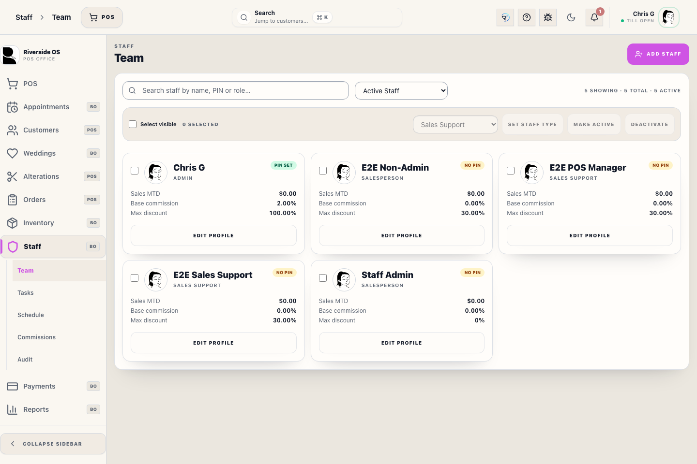
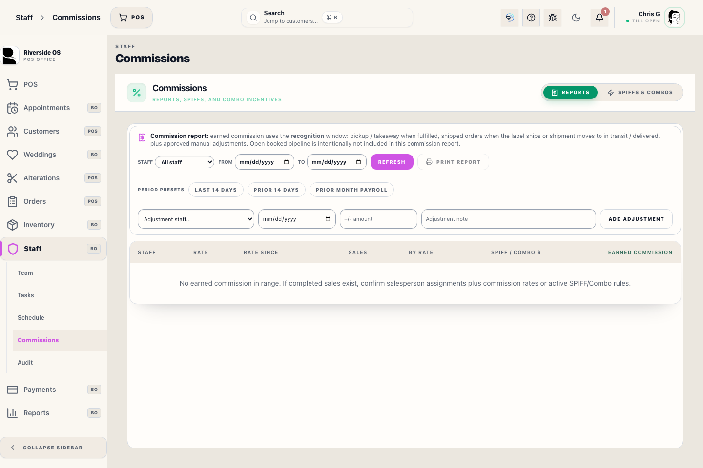
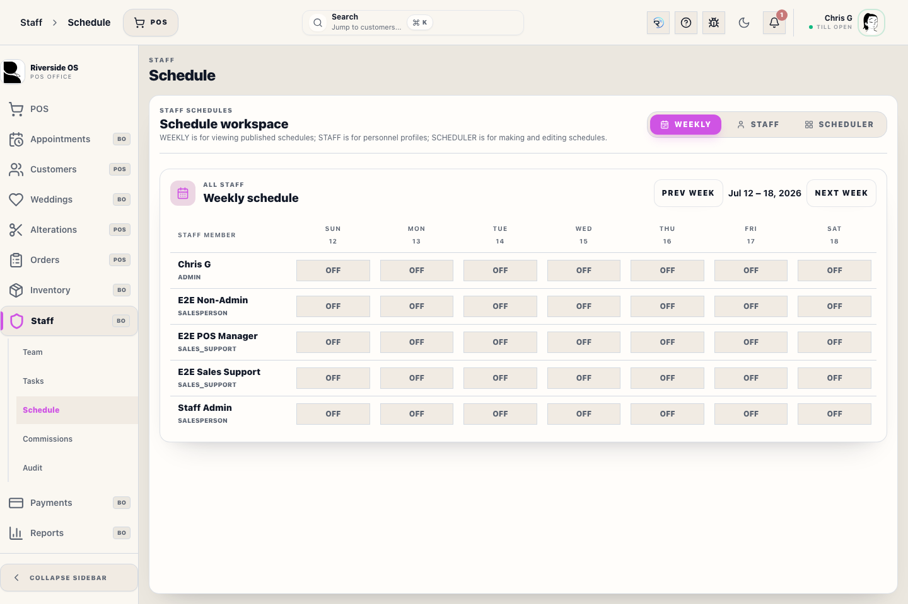

# Commission Reports Panel (staff)

## Screenshots

## What This Is

Use **Staff → Commissions → Reports** to review earned commission activity by period.

The screen supports all-staff reporting, individual staff drilldown, and printable payroll review. It is reporting-only; payout finalization controls have been retired from the visible workflow.

## Before You Start

- You need **insights.view** to read commission reports.
- Commission follows the **fulfillment / recognition** date, not the original booking date.
- Staff base rates are managed on the Staff Profile.
- Fixed SPIFF and combo incentives are managed under **SPIFFs & Combos**.

## Steps

1. Open **Staff → Commissions** and stay on **Reports**.
2. Choose a date window. Use **Prior month payroll** when reviewing the previous calendar month for the first payday of the new month.
3. Optional: pick a **Staff** member to run an individual report.
4. Review each staff row: **Rate**, **Rate since**, **Sales**, **By rate**, **SPIFF / Combo $**, and the final **Earned commission** amount.
5. Use **Print report** for payroll review.
6. Expand a staff row to review line-level detail.
7. Use **Trace** on a line when you need the calculation explainer.

## What To Watch For

- The commission report is earned-only. Booked-but-unfulfilled pipeline is intentionally excluded from the report totals.
- **Earned commission** is the payroll-facing total for the selected recognition window.
- **By rate** is the earned amount from the staff member's base commission rate.
- **SPIFF / Combo $** is fixed SPIFF and combo incentive money earned during the period.
- The bottom row, **Total commissions paid for period**, is the report total to review for payroll.
- **Staff Admin** attribution is kept for sales history but always earns $0.00 commission.
- Returns and exchanges affect the period in which they occur through immutable adjustment events.
- Manual add/subtract adjustments require notes and audit tracking.

## What Happens Next

Use **Total commissions paid for period** for owner/accounting payroll review. If the numbers do not match store expectations, review the expanded staff lines and Trace details before making any payroll decision.

## Related Workflows

- Open **Staff → Staff Profile** to change a staff member's base commission rate with an effective date.
- Open **Staff → Commissions → SPIFFs & Combos** to manage fixed incentive add-ons.
