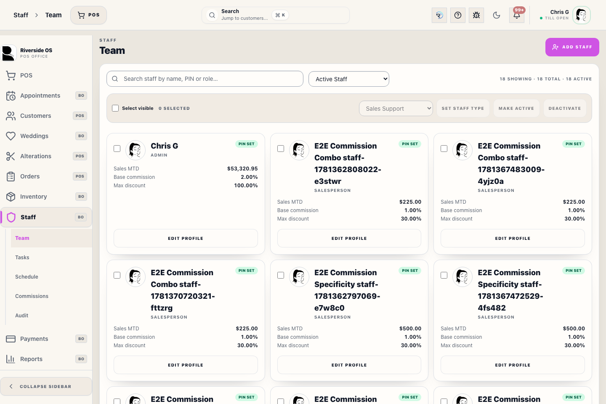
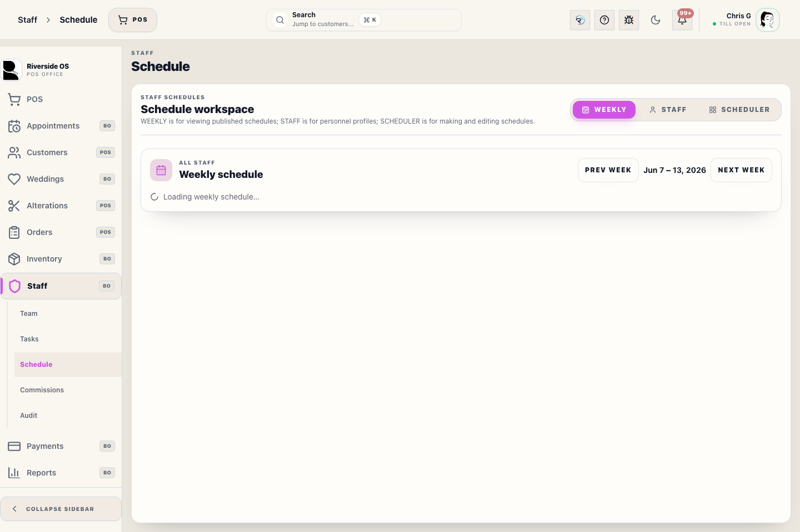
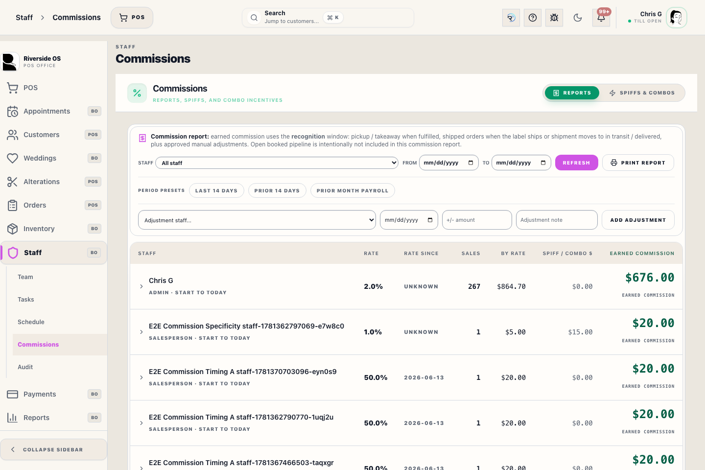

# Staff Workspace (Team)

## Screenshots

The Team workspace is the central hub for managing your store's roster. Use it to add new employees, manage secure Access PINs, and define what each person can see and do in Riverside OS.

## What this is

This workspace handles the administrative lifecycle of your team. It is divided into the **Team List** (roster overview) and the **Staff Profile** (detailed settings for one person).

## When to use it

- To add a new staff member to the system.
- To reset or update a staff member's 4-digit **Access PIN**.
- To adjust commission rates for specific garment categories.
- To grant or revoke permissions (e.g., allowing a senior salesperson to void transactions).
- To manage recurring staff checklist tasks and review task completion.

## Staff Profile Layout

When you select a staff member, their profile is organized for clarity:
- **Left Column (Identity)**: Contains the staff member's full name, display name, employment dates, and their 4-digit **Access PIN**.
- **Birthday**: Managers can save optional month/day only. Riverside does not store the year or age. If the staff member is active and scheduled to work on their birthday, Riverside shows in-app birthday greetings and team notifications.
- **Right Column (Access & Earnings)**: Manages **Role** (Admin, Salesperson, etc.), **Commissions** (Base % and Category overrides), and granular **Permissions**.

## Managing Access PINs

Riverside OS uses a 4-digit **Access PIN** for all secure actions (signing into a register, overriding a discount, or opening the Back Office).
1. Type exactly 4 digits into the **Access PIN** field.
2. Click **Save Changes**.
3. The staff member can now use this code at any terminal.

> [!IMPORTANT]
> To maintain security, never share PINs. If a staff member forgets their code, an Admin must set a new one here.

## Roles & Permissions

While **Roles** (Admin, Manager, Salesperson) provide a baseline set of permissions, you can toggle individual keys for specific needs:
- **admin**: Full system access, including financial settings and DB tools.
- **orders.modify**: Required for processing returns or manual price overrides.
- **inventory.manage**: Required for adding new SKUs or posting receipts.

## Staff Tasks

The **Tasks** subsection is where admins build reusable checklist templates, assign them to a role or individual, and review completion. Template steps can be marked **Required** or optional. Required steps block final checklist completion until they are checked.

Open task lists, team task lists, history, and individual task sheets can be printed. Task rows show assigned-by ownership and overdue status when available, and unfinished overdue work is reported back to the staff member who assigned it.

## What to watch for

- **PIN Security**: PINs are 4 digits. Avoid using simple sequences (1234, 1111).
- **Role Sync**: Changing a staff member's Role will reset their permissions and default discount cap to the role's baseline. Make one-off permission changes after saving the new Role.
- **Employment Dates**: Staff members with a future 'Start Date' or a past 'End Date' will not be able to sign in to the register.

## What happens next

- Changes to PINs or permissions take effect immediately across all terminals.
- New staff members will appear in the Register sign-in grid once they have an active PIN.

## Related workflows

- [Staff Commissions](manual:staff-commission-payouts-panel)
- [Staff Schedule](manual:staff-schedule-panel)
