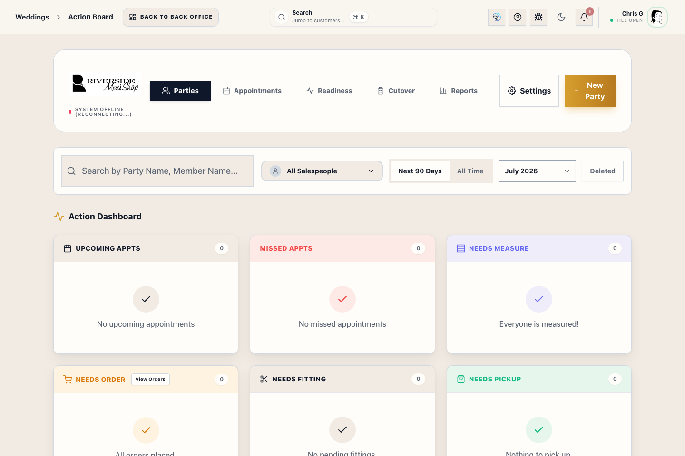
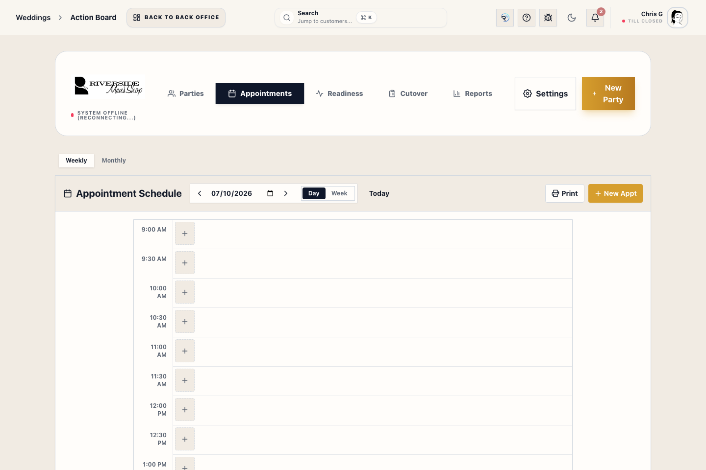
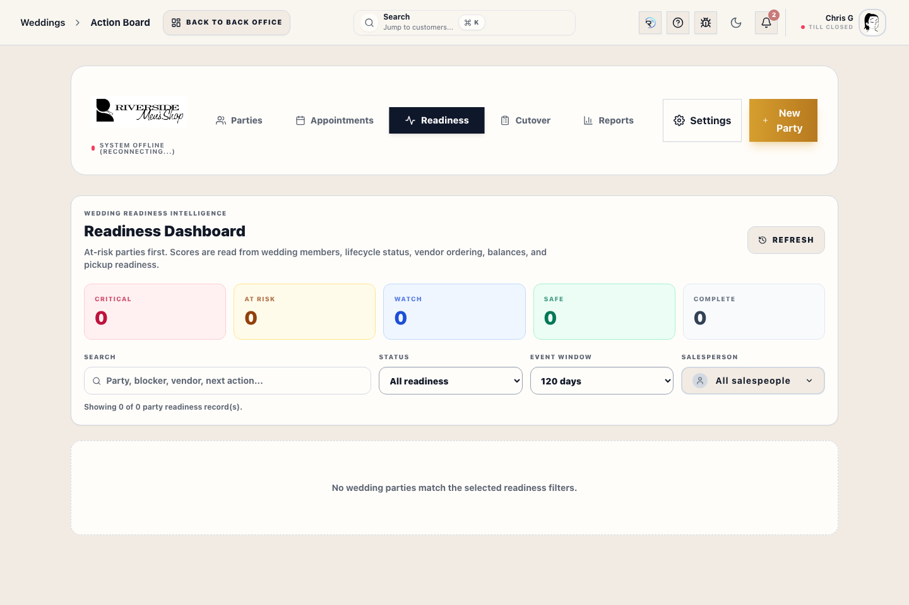

# Wedding Manager

## Screenshots

## What this is

Wedding Manager is the shared workspace for wedding parties, members, event dates, appointments, outfit readiness, linked Transaction Records, deposits, balances, ordering, receiving, and pickup status.

Use the normal Riverside workflows for money, inventory, vendor orders, and fulfillment. Wedding Manager brings those facts together; it does not replace the financial Transaction Record or the guarded pickup workflow.

## Before you start

- **Wedding view** access is required to read parties; creating or changing records requires the matching wedding-management access.
- Confirm the correct party, event date, and member before changing anything.
- Link each member to the correct Customer account when possible.
- Never retype a balance from another system. Riverside derives balances from linked Transaction Records and allocations.

## Find or create a party

1. Open **Weddings → Parties**.
2. Search by party or member name and confirm the event date.
3. Open the party, or select **New Party** when a new group is required.
4. Enter the event details and assign the responsible salesperson.
5. Add members with the correct role and Customer link.
6. Review the saved party before adding appointments, outfit work, or orders.

Use the party ID and event date when two families have similar names. Deleting a party or member with live financial or fulfillment links requires manager review.

## Manage members and outfit work

1. Open the party and select the member.
2. Confirm measurements, outfit requirements, and Customer linkage.
3. Leave placeholder outfits in **Needs measurements** until the exact sellable variation is known.
4. Attach the correct Transaction Record or fulfillment line to the member.
5. Move ordering and receiving work through **Orders**, purchase orders, and **Receive Stock**.
6. Verify readiness again after measurements, ordering, receiving, alterations, or payment changes.

Do not mark a member ready merely to clear the board. Readiness must agree with the actual item, receiving, alteration, balance, and pickup state.

## Schedule party appointments

1. Open **Appointments** inside Wedding Manager for party-linked visits.
2. Choose weekly or monthly view.
3. Select the correct member, appointment type, date, time, and assigned staff member.
4. Save and confirm the appointment appears on the expected date.
5. Mark attendance from the normal appointment workflow after the visit occurs.

Use the main **Appointments** workspace for store appointments that are not tied to a wedding party.

## Review readiness

1. Open **Readiness**.
2. Start with **Critical** and **At risk** parties.
3. Open a party to see which member or source workflow is blocking completion.
4. Resolve measurements in the member workflow, vendor work in Orders/receiving, balances in the Transaction Record, and release in Pickup.
5. Reopen Readiness and confirm the blocker clears from the authoritative data.

ROSIE readiness takeaways summarize visible risks. They do not collect payment, receive items, mark pickup, or change member status.

## Deposits and group payments

Wedding deposits and payments must remain attached to their audited payment and allocation records. A payment placed for another party member appears on that member's Customer account and can be applied from the Register payment screen when eligible.

The party Readiness panel shows **Wedding deposits** as the total contributed through Split deposit and the number of members funded. Member rows show **Deposit** when funds are held before that member has a Transaction Record. The payer's Customer History records the group contribution, while Daily Sales keeps the payer's own Transaction total separate from **Wedding Deposits Placed** and **Total Tender Collected**. This separation is intentional: the member funds remain deposit liabilities and are not added to the payer's merchandise sale.

Before promising a balance or refund:

1. Open the member's Customer and linked Transaction Records.
2. Confirm who paid, what amount remains held, and whether any amount was already applied.
3. Use the normal Register or Transaction Record payment/refund workflow.
4. Get Manager Access for disputes, forfeitures, multi-payer refunds, or uncertain ownership.

## Cutover review

Use **Cutover** when Riverside is taking over parties that were already active in Counterpoint or a paper process.

1. Confirm the imported party and member list.
2. Link each member to the correct Riverside Customer.
3. Review suggested imported Transaction Records and fulfillment lines.
4. Confirm measurements, ordering, receiving, fitting, and pickup state from evidence.
5. Leave ambiguous matches unresolved for manager review.

## What to watch for

- Party notes and worksheet comments are not sellable products.
- A ready garment with an open balance remains blocked from release.
- Do not manually move money between members; use the wedding payment and allocation flows.
- Do not mark paper status cells complete without confirming the Riverside source record.
- If readiness, Orders, Customer history, and Register disagree, stop and escalate before promising completion.

## What happens next

Accurate wedding records feed the Action Board, Customer history, Register wedding lookup, appointments, ordering, receiving, readiness, reporting, and guarded pickup workflows.

## Related workflows

- [Register (POS)](manual:pos)
- [Checkout & Payment](manual:pos-nexo-checkout-drawer)
- [Orders Workspace](manual:orders-workspace)
- [Receive Stock](manual:inventory-receiving-bay)
