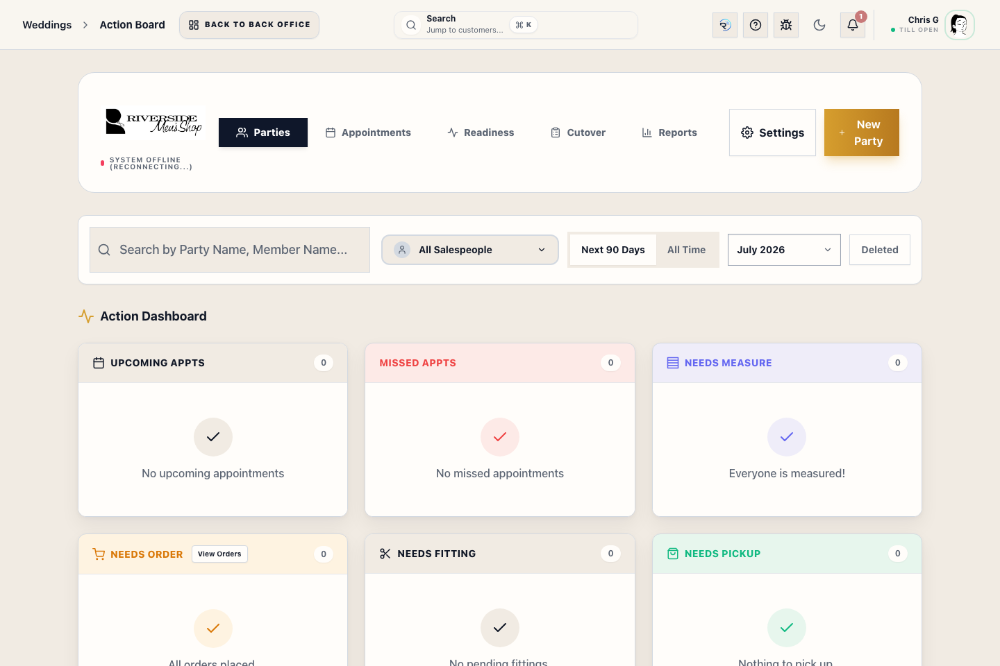
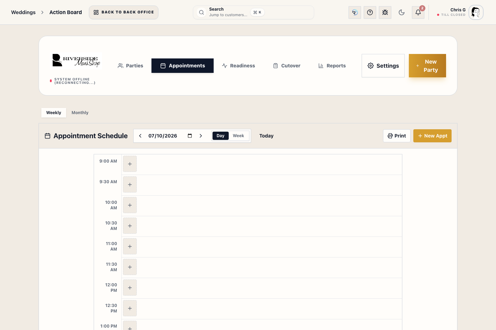
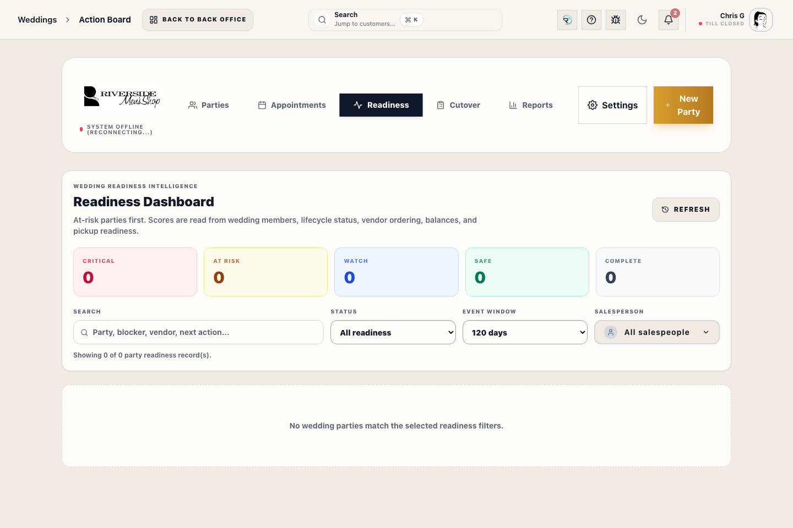

# Wedding Manager

## Authoritative status and audit rules

- **Measured** and **Fitted** may be completed manually, or automatically when a linked Measurement/Fitting appointment is marked Attended.
- **Ordered, Received, Ready for Pickup, and Picked Up** come from the member's Transaction/Fulfillment Order lines. Open the member and use Register/Orders; the party grid is a status view, not a second fulfillment system.
- Member names, phones, and email addresses come from the linked ROS Customer. Purchased item descriptions, Transaction totals, applied payments, held deposits, balances, fulfillment, alterations, and scheduled appointment counts are refreshed from their owning ROS records whenever the tracker opens, regains focus, receives a Wedding/appointment event, and while it remains open.
- **Paid** means the member has a linked Transaction with no remaining `balance_due`. A held wedding deposit remains **Deposit** until it is explicitly applied; it must not make an open Transaction appear Paid.
- A Pickup appointment marked Attended does not complete pickup. Finish pickup through Orders/Register so inventory, payment, fulfillment, and receipts remain linked.
- Schedule conflicts require Manager Access and a written override reason. ROS records the authenticated staff member, not a typed display name.
- Wedding deposits remain owned by the payer and allocated to a beneficiary member. Use the original payer's Orders & Receipts history to resume Deposit Only work.

## Archive older or inactive wedding tracking

Use **Archive Tracking** on the wedding header when the event is over, was cancelled, did not proceed, or is only a historical tracking record. Manager Access is required.

1. Choose the tracking outcome.
2. Enter a specific operational reason and optional tracking or historical notes.
3. Review the **Linked ROS snapshot (read only)**.
4. If linked work exists, acknowledge that each record remains controlled by its owning ROS workspace.
5. Select **Archive Wedding Tracking**.

The Wedding Hub is a tracker: it reads linked Transactions, Fulfillment Orders, deposit ledger activity, appointments, alterations, and related status from their owning ROS systems. Archiving removes only the tracker from active Wedding boards. It does not fabricate completion or change any linked record. Find archived trackers under **Closed / Archived**. A manager can reopen one; the original archive remains in Party History.

## Screenshots

## What this is

Wedding Manager is the shared workspace for wedding parties, members, event dates, appointments, outfit readiness, linked Transaction Records, deposits, balances, ordering, receiving, and pickup status.

Wedding Manager opens to **Readiness** so event risk and blockers lead the workspace. Use **Parties** and **Appointments** for everyday work. Less-frequent Cutover, Reports, and Settings destinations are grouped under **More wedding tools**.

Use the normal Riverside workflows for money, inventory, vendor orders, and fulfillment. Wedding Manager brings those facts together; it does not replace the financial Transaction Record or the guarded pickup workflow.

The Order Review is also a tracker. **Ordered**, **In Stock**, and **Picked Up** are read-only ROS-derived stages; selecting them opens the member workflow instead of changing the status locally. Measurement and fitting remain wedding operational milestones and may be completed through their attended appointments.

## Before you start

- **Wedding view** access is required to read parties; creating or changing records requires the matching wedding-management access.
- Confirm the correct party, event date, and member before changing anything.
- Link each member to the correct Customer account when possible.
- Never retype a balance from another system. Riverside derives balances from linked Transaction Records and allocations.

## Find or create a party

1. Open **Weddings → Parties**.
2. Search by party or member name and confirm the event date.
3. Open the party, or select **New Party** when a new group is required.
4. Search ROS Customers for the Groom. Select the matching Customer when one exists; otherwise enter separate **First Name** and **Last Name** fields to quick-add a new Customer account when the party saves.
5. Enter the event details and assign the responsible salesperson.
6. For each additional member, search and select the existing Customer or enter separate First and Last names. Choose the member type from the role list; use **Other** only when the listed roles do not fit.
7. Choose **Save & Start Groom Wedding Order** when the Groom is ready to move directly into Register. This opens the linked Customer and wedding member; no financial Transaction is created until normal Register checkout succeeds.
8. Review the saved party before adding appointments, outfit work, or orders.

Use the party ID and event date when two families have similar names. Deleting a party or member with live financial or fulfillment links requires manager review.

## Manage members and outfit work

1. Open the party and select the member.
2. Confirm measurements, outfit requirements, and Customer linkage. **Add Member** searches current ROS Customers first and quick-adds a new Customer only from separate First and Last names. Saved names and contact details remain owned by the linked Customer account.
3. Leave placeholder outfits in **Needs measurements** until the exact sellable variation is known.
4. Attach the correct Transaction Record or fulfillment line to the member.
5. Move ordering and receiving work through **Orders**, purchase orders, and **Receive Stock**.
6. Verify readiness again after measurements, ordering, receiving, alterations, or payment changes.

For a new or existing member who is ready to sell, choose **Add & Start Wedding Order** or **Save & Start Wedding Order**. Riverside saves the Customer/member link first and then opens that exact member in Register with Wedding Order context.

Do not mark a member ready merely to clear the board. Readiness must agree with the actual item, receiving, alteration, balance, and pickup state.

## Schedule party appointments

1. Open **Appointments** inside Wedding Manager for party-linked visits.
2. Choose weekly or monthly view.
3. Select the correct member, appointment type, date, time, and assigned staff member.
4. If Riverside finds a schedule conflict, use the approved Manager Access override and enter the operational reason. The appointment and its override record save together.
5. Save and confirm the appointment appears on the expected date.
6. Mark attendance from the normal appointment workflow after the visit occurs.

Use the main **Appointments** workspace for store appointments that are not tied to a wedding party.

## Review readiness

1. Open **Readiness**.
2. Start with **Critical** and **At risk** parties.
3. Open a party to see which member or source workflow is blocking completion.
4. Resolve measurements in the member workflow, vendor work in Orders/receiving, balances in the Transaction Record, and release in Pickup.
5. Reopen Readiness and confirm the blocker clears from the authoritative data.

ROSIE readiness takeaways summarize visible risks. They do not collect payment, receive items, mark pickup, or change member status.

## Deposits and group payments

Wedding deposits and payments must remain attached to their audited payment and allocation records. A payment placed for another party member appears on that member's Customer account and can be applied from the Register payment screen when eligible.

At the Register, **Wedding Manager** is also the guided setup, deposit, history, and order-building path. Choose **Deposit Only** or **Collect & Build Orders** first, then choose or start the party. Staff may start a party with Party Name and Wedding Date, link or create each Customer, assign roles, verify the payer, and choose an exact destination for every member amount. For equal deposits, enter **Deposit amount per selected member** once and select only the intended members; unselected members receive nothing and individual overrides remain available. A selected `$0` member is visibly excluded instead of silently blocking valid funded members. In the **New Wedding Party** form or Wedding Manager **Style & Order Details**, select the party's sellable ROS parent products (suit, shirt, tie, shoes, and so on) and mark each as **All**, **Groom Only**, **Groomsmen Only**, **Any**, or **Other**. **Any** is an optional choice for every member; **Other** requires an exact member role. Register filters these products by the loaded member before opening the shared variation panel for size and color. In **Collect & Build Orders**, **Start Building Member Orders** preserves payer merchandise and opens all funded members in one Builder before payer Payment. Parent rows appear automatically; choose an exact variation, skip a row, or search a different parent for member-specific exceptions. Add optional alterations, choose a salesperson for all members or override individually, and set individual No Tax only with a required reason. **Save Member Order & Next** stores nonfinancial drafts. After **Final Payment** succeeds, **Open Wedding Builder → Create All Member Transactions** creates the separate member Transactions/Fulfillment Orders using the exact held sources without collecting another payer tender. The completion screen provides full member detail and an individual printable receipt for each. A decline posts nothing and retains the drafts. **Deposit Only** stops after funding; reopen the original payer's **Wedding Manager → Review & Reprint** to load that payer's party workflows, funded members, held balances, posted member Transactions, and receipts, then choose **Build All Remaining Orders** to resume the same Builder later. If a member Transaction is already posted, **Build More Items** begins a separate Wedding Order for additional merchandise and leaves the earlier financial records and receipts unchanged. Removing or changing the selected Customer clears stale Wedding member and unposted payer-allocation context.

When staff selects an individual wedding member in Register, Riverside asks **Part of the Wedding Order?** **Yes — Build Wedding Order** reuses the same party parent-item and exact-variation system as Deposit & Build, attaches new deferred merchandise to that member's Wedding Order, and leaves product search, scanning, alterations, Take now, and needs-measurements choices available. The prompt names an available held deposit and contributing payer but never applies funds automatically. **No — Regular Sale** leaves the sale outside wedding fulfillment. Nothing financial posts until the normal server-validated checkout succeeds.

The party Readiness panel shows **Wedding deposits** as the total contributed through Split deposit and the number of members funded. Member rows show **Deposit** when funds are held before that member has a Transaction Record. The payer's Customer History records the group contribution, while Daily Sales keeps the payer's own Transaction total separate from **Wedding Deposits Placed** and **Total Tender Collected**. This separation is intentional: the member funds remain deposit liabilities and are not added to the payer's merchandise sale.

When a Wedding Builder parent product opens the variation panel, **Item to Build** and every completed choice stay visible at the top. Use **Back** at any step, including pricing review, or select a completed choice to edit it before confirming. At the first step, Back returns to the Wedding Builder without adding or changing the item.

Before promising a balance or refund:

1. Open the member's Customer and linked Transaction Records.
2. Confirm who paid, what amount remains held, and whether any amount was already applied.
3. Use the normal Register or Transaction Record payment/refund workflow for that member only. There is no batch refund.
4. For **Original Card**, confirm the screen names the original wedding deposit payer as the refund recipient. Riverside uses the exact originating Helcim transaction; the money returns to the payer, not the member.
5. Confirm the member history records the refunded allocation and the payer history records the returned money.
6. Get Manager Access for disputes, forfeitures, multi-payer refunds, or uncertain ownership.

## Cutover review

Use **Cutover** when Riverside is taking over parties that were already active in Counterpoint or a paper process.

1. Confirm the imported party and member list.
2. Link each member to the correct Riverside Customer.
3. Review suggested imported Transaction Records and fulfillment lines.
4. Select the exact Transaction Record lines to link (maximum 100) and choose only a pre-pickup status through **Ready for pickup**.
5. Complete the Manager Access approval. An empty selection is never treated as all lines.
6. Complete **Picked Up** only through Register pickup so inventory, revenue, commissions, loyalty, and audit move together.
7. Leave ambiguous matches unresolved for manager review.

When an imported member has an exact normalized name and phone match, Riverside
links the member to the active Customer instead of creating another profile.
Inactive merged profiles are ignored. If duplicate active matches still exist,
Riverside keeps the oldest account by customer-code generation: numeric,
`C-`, Lightspeed name code, then `ROS-`.

## What to watch for

- Party notes and worksheet comments are not sellable products.
- A ready garment with an open balance remains blocked from release.
- Do not manually move money between members; use the wedding payment and allocation flows.
- Do not mark paper status cells complete without confirming the Riverside source record.
- If readiness, Orders, Customer history, and Register disagree, stop and escalate before promising completion.
- Wedding search and party lists distinguish an empty result from an unavailable refresh. The live-update connection indicator describes socket connectivity; the separate data-check time confirms when the party list actually refreshed.
- Wedding Party Hub search waits for a short typing pause, cancels the older lookup when the query changes, and keeps the loaded cards visible with **Updating…** while newer results arrive.
- Wedding Deposit does not proceed to tender while party membership or live balance context is unavailable. Resolve the shown party, member, destination, salesperson, or balance issue in the guided workspace.
- At the Register, select the payer and choose **Wedding Deposit** from the Cart toolbar. Existing party membership opens directly; otherwise search for or start the party, then add the payer and other members inline.

## What happens next

Accurate wedding records feed the Action Board, Customer history, Register wedding lookup, appointments, ordering, receiving, readiness, reporting, and guarded pickup workflows.

## Related workflows

- [Register (POS)](manual:pos)
- [Checkout & Payment](manual:pos-nexo-checkout-drawer)
- [Orders Workspace](manual:orders-workspace)
- [Receive Stock](manual:inventory-receiving-bay)
