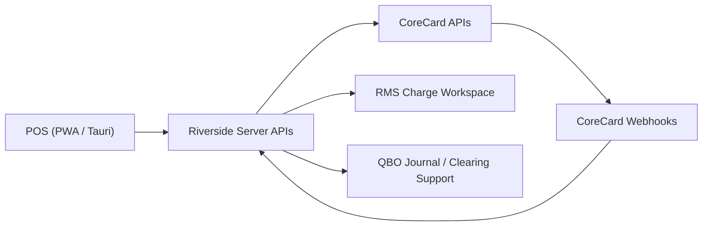

# RMS Charge / CoreCredit / CoreCard Full Architecture

This document is the current architectural source of truth for RiversideOS RMS Charge operations.

Use this file when you need to understand how the implemented system works end to end. Use the staff manuals in [`/Users/cpg/riverside-os/docs/staff`](./staff) for role-based procedures, and use [`/Users/cpg/riverside-os/docs/CORECARD_SANDBOX_LIVE_VALIDATION_RUNBOOK.md`](./CORECARD_SANDBOX_LIVE_VALIDATION_RUNBOOK.md) for real sandbox or live tenant validation.

## Purpose

RMS Charge is RiversideOS's unified financing tender for CoreCredit/CoreCard-backed activity.

The system supports:

- financed purchases from POS
- RMS payment collection from POS
- refunds and reversals using stored host references
- server-side CoreCard posting
- webhook ingestion
- repair polling
- exception management
- reconciliation and QBO-aware accounting support

The system does **not** expose CoreCard credentials, raw PAN, or CVV to the browser, PWA storage, or Tauri client storage.

## End-to-End Flow

### Financed purchase

1. POS attaches the active Riverside customer to the sale.
2. POS selects the single financing tender: `RMS Charge`.
3. Riverside resolves linked CoreCredit/CoreCard accounts on the server.
4. POS shows masked account choices if needed, then presents a required plan-selection step for the eligible programs.
5. POS does not silently default the financing plan. The operator must choose it explicitly.
6. POS sends the selected account and program metadata back to Riverside checkout.
7. Riverside posts the financing transaction to CoreCard from the server.
8. Checkout only succeeds after the required CoreCard host post succeeds.
9. Riverside persists RMS posting state, host references, and transaction metadata.
10. Receipts and RMS workspaces render from saved metadata, not from legacy tender names.

### RMS payment collection

1. POS adds the internal `RMS CHARGE PAYMENT` line by using the `PAYMENT` search workflow.
2. POS requires a customer and resolves the linked account on the server.
3. POS collects only the allowed in-store collection tenders for this flow.
4. Riverside posts the payment to CoreCard from the server.
5. The collection only succeeds after the required host payment post succeeds.
6. Riverside records the payment in RMS records and preserves the existing QBO-safe clearing behavior.

### Refunds and reversals

1. Back Office or other authorized RMS actions start from a previously posted RMS record.
2. Riverside uses the stored host reference and idempotency model to post the correction to CoreCard.
3. Riverside persists reversal or refund state and exposes it in RMS records, exceptions, reconciliation, receipts, and accounting support views as appropriate.

### Webhooks, polling, and reconciliation

1. CoreCard sends webhook events to Riverside server endpoints.
2. Riverside verifies, redacts, logs, and processes those events idempotently.
3. Repair polling refreshes balances, account status, transaction status, and stale posting state if webhook delivery is delayed or missing.
4. Reconciliation compares Riverside RMS records, CoreCard state, and expected QBO-clearing behavior.

## System Boundaries

### POS clients

The PWA POS client and Tauri POS client own:

- staff workflow
- customer attachment
- tender selection
- account disambiguation display
- program selection display
- receipt display
- operator feedback

They do **not** own:

- CoreCard authentication
- bearer token storage
- direct CoreCard API calls
- webhook verification
- reconciliation logic

### Riverside server

The Riverside server is the broker and system of orchestration for:

- token-based CoreCard authentication
- account lookup and program eligibility requests
- purchase, payment, refund, and reversal posts
- webhook verification and ingestion
- redacted payload logging
- posting state persistence
- exception queue workflows
- repair polling
- reconciliation
- QBO-supporting journal behavior

### CoreCard APIs

CoreCard is the external host for:

- account identity and status
- program eligibility
- balance and transaction detail
- live purchase and payment posting
- refund and reversal responses
- host-side transaction references
- webhook event delivery

## Transaction Lifecycle

### Purchase lifecycle

1. `resolved`
   Riverside matches the active Riverside customer to one or more linked CoreCard accounts.
2. `program selected`
   POS stores the selected program metadata in checkout state.
3. `pending host post`
   Riverside prepares the CoreCard request, generates an idempotency key, and opens the posting transaction lifecycle.
4. `posted`
   CoreCard accepts the purchase. Riverside stores the external transaction id, host reference, optional auth code, posting timestamps, and program/account metadata.
5. `webhook updated`
   Riverside may later receive a host event that confirms or updates the posting state.
6. `reconciled`
   A reconciliation run marks the RMS record and its accounting support expectations as matched or mismatched.

### Payment lifecycle

1. POS creates the RMS payment collection flow using `RMS CHARGE PAYMENT`.
2. Riverside resolves the account and posts the payment to CoreCard.
3. Riverside persists the payment RMS record and host reference state.
4. Later webhook, polling, and reconciliation flows refresh or verify final status.

### Refund / reversal lifecycle

1. An authorized user starts from an RMS record with an existing host linkage.
2. Riverside posts the refund or reversal using stored host identifiers.
3. Riverside marks the RMS record and posting event history with the correction state.
4. Reconciliation and QBO-supporting views reflect the correction path.

## Data Model

### Customer/account linkage

Primary linkage table:

- `customer_corecredit_accounts`

Important fields:

- `customer_id`
- `corecredit_customer_id`
- `corecredit_account_id`
- `corecredit_card_id`
- `status`
- `is_primary`
- `program_group`
- `last_verified_at`
- `verified_by_staff_id`
- `verification_source`
- `notes`

This table is the durable Riverside customer-to-CoreCard account map. The active Riverside customer on the sale remains the source of truth for checkout resolution.

### RMS record ledger

Primary ledger table:

- `pos_rms_charge_record`

Important fields include:

- `record_kind`
- `payment_method`
- `tender_family`
- `program_code`
- `program_label`
- `masked_account`
- `linked_corecredit_customer_id`
- `linked_corecredit_account_id`
- `resolution_status`
- `posting_status`
- `posting_error_code`
- `posting_error_message`
- `external_transaction_id`
- `external_auth_code`
- `host_reference`
- `posted_at`
- `reversed_at`
- `refunded_at`
- `idempotency_key`
- `external_transaction_type`
- `metadata_json`

### Transaction metadata

Transaction-level metadata is stored on Riverside transaction records so the user-visible tender remains `RMS Charge` while the financing program and masked account remain reconstructable later.

This is what drives:

- receipts
- RMS workspace detail
- reporting
- legacy coexistence

### Posting events

Append-style posting state is stored separately so Riverside can preserve:

- idempotency lifecycle
- request and response summaries
- retryable versus non-retryable failure classes
- host references
- redacted snapshots

### Event log

Inbound webhook events are stored in:

- `corecredit_event_log`

This preserves:

- external event identity
- receipt timestamp
- verification result
- redacted payload summary
- processing status
- related RMS/account linkage when available

### Exception queue

Operational failures and mismatches are stored in:

- `corecredit_exception_queue`

### Reconciliation

Reconciliation runs and mismatch items are stored in:

- `corecredit_reconciliation_run`
- `corecredit_reconciliation_item`

## State Transitions

### Posting status

- `pending`
  The host action is in progress or awaiting confirmation.
- `posted`
  The host action completed successfully and Riverside has the host reference data it needs.
- `failed`
  The host action failed and Riverside did not finalize the financial success path.
- `retried`
  A failed or stale item was retried through the exception workflow.
- `reconciled`
  A reconciliation run has confirmed the Riverside-visible state against host and accounting expectations.

### Operational health concepts

- `webhook pending`
  Riverside expects more host confirmation or has not yet processed the incoming event.
- `stale`
  The account snapshot or posting state needs a polling refresh.
- `mismatch`
  Riverside, CoreCard, or QBO-supporting expectations do not agree closely enough to auto-clear.

## Security Model

### Authentication model

CoreCard authentication is token-based and remains server-side only.

Riverside stores and uses CoreCard credentials only from environment or server configuration. Those credentials are never sent to the browser, local storage, or client logs.

### Sensitive data handling

Riverside avoids raw sensitive card data storage.

- no raw PAN storage
- no CVV storage
- masked account display only in UI-facing payloads
- redacted request and response logging
- snapshot retention controls for host payload data

### Audit model

Sensitive actions remain auditable, including:

- account link and unlink
- purchase post
- payment post
- refund and reversal
- failed host post
- retry
- assign
- resolve
- reconciliation runs

## Failure Modes

### Host failure

Examples:

- timeout
- duplicate submission
- insufficient available credit
- inactive or restricted account
- invalid program
- account/program mismatch
- host unavailable

Expected Riverside behavior:

- checkout or payment collection does not falsely succeed
- the operator sees a structured failure
- posting state persists
- exceptions are created where appropriate
- audit and redacted logs remain available

### Webhook delay or missing delivery

Expected Riverside behavior:

- inbound events are processed idempotently when they arrive
- repair polling refreshes stale records
- sync health surfaces show pending or failed webhook state
- reconciliation can still detect mismatches

### Reconciliation mismatch

Expected Riverside behavior:

- mismatch appears in RMS reconciliation
- staff can inspect supporting data
- retry or resolve actions stay permission-gated
- QBO-supporting expectations remain visible for finance review

## Legacy Compatibility

Historical `on_account_rms` and `on_account_rms90` records remain displayable and reportable.

Important rule:

- legacy records remain part of RMS history
- new operational flow uses unified `RMS Charge` plus saved program metadata
- receipt wording and reporting should not rely only on old tender code names

## Role-Based Reading Guide

- POS staff:
  [`/Users/cpg/riverside-os/docs/staff/pos-rms-charge.md`](./staff/pos-rms-charge.md)
- Back Office overview:
  [`/Users/cpg/riverside-os/docs/staff/rms-charge-overview.md`](./staff/rms-charge-overview.md)
- Account linking and status:
  [`/Users/cpg/riverside-os/docs/staff/rms-charge-accounts.md`](./staff/rms-charge-accounts.md)
- Transactions:
  [`/Users/cpg/riverside-os/docs/staff/rms-charge-transactions.md`](./staff/rms-charge-transactions.md)
- Exceptions:
  [`/Users/cpg/riverside-os/docs/staff/rms-charge-exceptions.md`](./staff/rms-charge-exceptions.md)
- Reconciliation:
  [`/Users/cpg/riverside-os/docs/staff/rms-charge-reconciliation.md`](./staff/rms-charge-reconciliation.md)
- Operations:
  [`/Users/cpg/riverside-os/docs/operations/rms-corecard-runbook.md`](./operations/rms-corecard-runbook.md)
- Security:
  [`/Users/cpg/riverside-os/docs/security/corecard-data-handling.md`](./security/corecard-data-handling.md)
- Finance:
  [`/Users/cpg/riverside-os/docs/finance/rms-charge-qbo.md`](./finance/rms-charge-qbo.md)

## Historical Implementation Notes

The implementation history remains documented in:

- [`/Users/cpg/riverside-os/docs/CORECARD_CORECREDIT_PHASE1.md`](./CORECARD_CORECREDIT_PHASE1.md)
- [`/Users/cpg/riverside-os/docs/CORECARD_CORECREDIT_PHASE2.md`](./CORECARD_CORECREDIT_PHASE2.md)
- [`/Users/cpg/riverside-os/docs/CORECARD_CORECREDIT_PHASE3.md`](./CORECARD_CORECREDIT_PHASE3.md)

Those files now serve as phase history. This document is the operational architecture reference.
