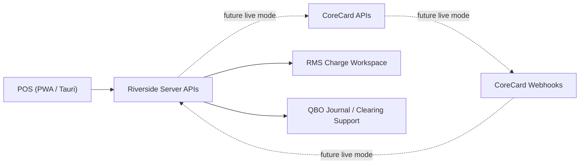

# RMS Charge / CoreCredit / CoreCard Full Architecture

This document is the current architectural source of truth for RiversideOS RMS Charge operations.

Use this file when you need to understand how the implemented system works end to end. Use the staff manuals in [`/Users/cpg/riverside-os/docs/staff`](./staff) for role-based procedures, and use [`/Users/cpg/riverside-os/docs/CORECARD_SANDBOX_LIVE_VALIDATION_RUNBOOK.md`](./CORECARD_SANDBOX_LIVE_VALIDATION_RUNBOOK.md) for optional real sandbox or live tenant validation.

## Purpose

RMS Charge is RiversideOS's unified financing tender for CoreCredit/CoreCard-backed activity. The launch/default workflow is manual RMS Charge: staff record the financing sale, payment collection, adjustment details, account, program, amount, and reference number in ROS while any external R2S/CoreCard work is completed through the approved merchant process.

The system supports:

- financed purchases from POS
- RMS payment collection from POS
- refunds and reversals using stored reference numbers
- manual approval/reference capture
- next-day R2S reporting tracking
- weekly R2S/CoreCredit Account List snapshot imports
- customer/account/program linkage
- transaction history and reporting visibility
- optional future server-side CoreCard posting
- optional webhook ingestion
- optional repair polling
- exception management
- reconciliation and QBO-aware accounting support

The system does **not** expose CoreCard credentials, raw PAN, or CVV to the browser, PWA storage, or Tauri client storage.

## End-to-End Flow

### Financed purchase

1. POS attaches the active Riverside customer to the sale.
2. POS selects the single financing tender: `RMS Charge`.
3. Riverside resolves linked CoreCredit/CoreCard accounts on the server.
4. POS shows masked account choices if needed, then presents a required program-selection step for the eligible programs.
5. POS does not silently default the financing program. The operator must choose it explicitly.
6. POS sends the selected account and program metadata back to Riverside checkout.
7. Riverside records the RMS Charge sale in manual mode and preserves the account, program, amount, staff actor, timestamps, and reference number when supplied.
8. Checkout succeeds from the ROS financial workflow without requiring a live CoreCard API post.
9. Riverside persists RMS source mode, reference metadata, transaction metadata, R2S reporting status, and reconciliation visibility. Manual records are `recorded_manually` / reference-tracked, not host-posted.
10. The record starts as `r2s_report_status: unreported` with `r2s_report_due_at` set to the next day.
11. Receipts and RMS workspaces render from saved metadata, not from legacy tender names.

### RMS payment collection

1. POS adds the internal `RMS CHARGE PAYMENT` line by using the `PAYMENT` search workflow.
2. POS requires a customer and resolves the linked account on the server.
3. POS collects only the allowed in-store collection tenders for this flow.
4. Riverside records the RMS Charge payment collection in manual mode with the selected account, payment tender, staff actor, timestamps, and reference number when supplied.
5. Riverside records the payment in RMS records, starts the R2S reporting follow-up as `unreported`, and preserves the existing QBO-safe clearing behavior.

### R2S reporting lifecycle

1. Manual RMS Charge Sales and RMS Charge Payments created through POS are reportable to R2S by the next day.
2. Riverside stores R2S reporting fields on the RMS Charge record metadata:
   - `r2s_reporting_required`
   - `r2s_report_status`
   - `r2s_report_due_at`
   - `r2s_reported_at`
   - `r2s_reported_by_staff_id`
   - `r2s_report_note`
3. The notification generator upserts a deduped reminder titled `Report RMS Charge to R2S` for each reporting-required unreported RMS Charge record.
4. Staff complete the external R2S follow-up through the approved merchant process, then open Customer → RMS Charge and choose `Mark Reported`.
5. Marking reported records the actor, timestamp, and optional note/reference, and clears the related reminder.
6. Marking reported does not post to a live API, mutate financial amounts, change QBO behavior, or imply bank reconciliation.

Phase 1 R2S reporting applies to RMS Charge Sales and RMS Charge Payments created through POS. Manual refund/reversal corrections remain tracked against the RMS Charge record/reference trail and can be reviewed in reconciliation, but they do not create a separate reporting checklist item in this phase.

Rows created before the R2S reporting metadata rollout (`2026-05-06T18:00:00Z`) do not become active reporting work unless their metadata explicitly marks reporting as required. They remain visible in history, but they do not create reporting reminders by default.

### Weekly Account List snapshot import

Sales Support uploads the weekly R2S/CoreCredit Account List report from Customer → RMS Charge → Accounts.

This workflow is file-based and manual-first. It is not live CoreCard API integration.

1. Staff upload the XLSX report and review the preview.
2. Riverside validates the fixed 4-row account block format, report metadata, footer count, and report totals.
3. Staff choose `Confirm Import`.
4. Riverside stores one import batch row and one account snapshot row per parsed account.
5. Riverside does not create customers, update customer records, link accounts automatically, create ledger rows, post transactions, or call live CoreCard APIs.

Imported balances are reference values only and should be labeled as:

- `Last imported balance`
- `Last imported open-to-buy`
- `Snapshot only`

RMS Charge remains the operational source of truth. The weekly Account List snapshot helps staff review accounts and prepare future customer matching, but it is not a transaction source and not a live balance proof.

If there is no successful Account List import within seven days, the notification generator upserts a deduped reminder titled `Upload weekly RMS Charge account list`. The reminder clears when a fresh import exists.

### Refunds and reversals

1. Back Office or other authorized RMS actions start from a previously posted RMS record.
2. Riverside uses the stored RMS record, reference number, and audit metadata to track the correction.
3. Manual RMS Charge corrections are tracked without requiring a CoreCard external transaction id. Live CoreCard records continue to use stored host identifiers for live refund/reversal posting.
4. Riverside persists reversal or refund state and exposes it in RMS records, exceptions, reconciliation, receipts, and accounting support views as appropriate.

### Webhooks, polling, and reconciliation

1. Manual RMS Charge records remain visible in reconciliation and reporting without live CoreCard events.
2. If optional live CoreCard automation is enabled later, CoreCard can send webhook events to Riverside server endpoints.
3. Riverside verifies, redacts, logs, and processes those events idempotently.
4. Repair polling can refresh balances, account status, transaction status, and stale posting state if webhook delivery is delayed or missing.
5. Reconciliation compares Riverside RMS records, available CoreCard state, and expected QBO-clearing behavior.

### Mode and source model

RMS Charge records preserve a source/mode internally for audit, reporting, and future automation gating:

- `source: manual` means the launch/default workflow. Riverside is the operational system of record for the RMS Charge sale, payment, reversal/refund tracking, reference number, account/program metadata, staff actor, timestamps, and reconciliation visibility.
- `source: corecard_live` means a response came from a confirmed CoreCard host read or a future enabled live-posting path.
- `credential_source` identifies whether the active runtime credentials came
  from encrypted Settings, deployment environment, or are missing.
- `last_corecard_request_at` is included when a live request timestamp is
  available.

Manual RMS Charge is not a degraded state. It does not require a live host reference, and staff-facing workflows should use operational labels such as `RMS Charge Sale`, `RMS Charge Payment`, `Reference Number`, `Program`, and `Account`.

Operational staff UI should also use `Report to R2S`, `Reported`, `Unreported`, and `Overdue` for the next-day follow-up requirement. CoreCard/CoreCredit API terms remain appropriate in Settings, architecture docs, and future live-integration diagnostics, but should not dominate daily Customer → RMS Charge work.

### Read-only tenant probe

Settings → CoreCard exposes a read-only tenant probe at:

- `GET /api/settings/corecard/tenant-probe`

The probe uses the runtime CoreCard host credentials and Riverside merchant
scope under R2S Financial:

- Merchant Number `12115`
- Merchant ID `11324`

The probe does not post purchases, payments, refunds, or reversals. It does not
create ledger rows and does not mutate customer/account data. A live-read proof
response for future CoreCard API enablement must show:

- `configured: true`
- `runtime_loaded: true`
- `source: "corecard_live"`
- `api_host_reachable: true`
- `read_call_succeeded: true`

`source: "manual"` remains valid for the launch RMS Charge workflow. Do not enable future live CoreCard API posting unless the probe returns `source: "corecard_live"` with a successful read for the Riverside merchant scope.

## System Boundaries

### POS clients

The PWA POS client and Tauri POS client own:

- staff workflow
- customer attachment
- tender selection
- account disambiguation display
- program selection display
- receipt display
- operator feedback

They do **not** own:

- CoreCard authentication
- bearer token storage
- direct CoreCard API calls
- webhook verification
- reconciliation logic

### Riverside server

The Riverside server is the broker and system of orchestration for:

- token-based CoreCard authentication
- account lookup and program eligibility requests
- manual RMS Charge recording
- optional purchase, payment, refund, and reversal posts after live enablement
- webhook verification and ingestion
- redacted payload logging
- posting state persistence
- exception queue workflows
- repair polling
- reconciliation
- QBO-supporting journal behavior

### CoreCard APIs

CoreCard is the external host for:

- account identity and status
- program eligibility
- balance and transaction detail
- optional live purchase and payment posting
- refund and reversal responses
- host-side transaction references
- webhook event delivery

## Transaction Lifecycle

### Purchase lifecycle

1. `resolved`
   Riverside matches the active Riverside customer to one or more linked CoreCard accounts.
2. `program selected`
   POS stores the selected program metadata in checkout state.
3. `manual record created`
   Riverside records the RMS Charge source mode, program/account metadata, amount, actor, timestamp, and reference number when supplied.
4. `corecard_live posted`
   In a future enabled live mode, CoreCard accepts the purchase and Riverside stores the external transaction id, host reference, optional auth code, posting timestamps, and program/account metadata.
5. `webhook updated`
   Riverside may later receive a host event that confirms or updates live posting state.
6. `reconciled`
   A reconciliation run marks the RMS record and its accounting support expectations as matched or mismatched.

### Payment lifecycle

1. POS creates the RMS payment collection flow using `RMS CHARGE PAYMENT`.
2. Riverside resolves the account and records the payment in manual mode with the selected tender and reference number when supplied.
3. In a future enabled live mode, Riverside can also post the payment to CoreCard and persist host reference state.
4. Later webhook, polling, and reconciliation flows refresh or verify final status when live CoreCard automation is active.

### Refund / reversal lifecycle

1. An authorized user starts from an RMS record with an existing RMS reference trail.
2. Riverside records the refund or reversal tracking details. In a future enabled live mode, Riverside can post the correction using stored host identifiers.
3. Riverside marks the RMS record and posting event history with the correction state.
4. Reconciliation and QBO-supporting views reflect the correction path.

## Data Model

### Customer/account linkage

Primary linkage table:

- `customer_corecredit_accounts`

Important fields:

- `customer_id`
- `corecredit_customer_id`
- `corecredit_account_id`
- `corecredit_card_id`
- `status`
- `is_primary`
- `program_group`
- `last_verified_at`
- `verified_by_staff_id`
- `verification_source`
- `notes`

This table is the durable Riverside customer-to-CoreCard account map. The active Riverside customer on the sale remains the source of truth for checkout resolution.

### Weekly imported account snapshots

Primary tables:

- `rms_account_list_import_batches`
- `rms_account_list_snapshots`

`rms_account_list_import_batches` stores the uploaded file hash, report metadata, parsed count, footer count, warning summary, report totals, uploader, and upload timestamp.

`rms_account_list_snapshots` stores parsed account snapshot fields for each account number in that batch, including customer/account display data, address/phone normalization, balance, minimum due, past due aging, open-to-buy, payment history codes, raw source payload, and parser warnings.

Snapshot rows may later carry manual match status and matched customer metadata, but Phase 2 does not auto-match or auto-update customers.

### RMS record ledger

Primary ledger table:

- `pos_rms_charge_record`

Important fields include:

- `record_kind`
- `payment_method`
- `tender_family`
- `program_code`
- `program_label`
- `masked_account`
- `linked_corecredit_customer_id`
- `linked_corecredit_account_id`
- `resolution_status`
- `posting_status`
- `posting_error_code`
- `posting_error_message`
- `external_transaction_id`
- `external_auth_code`
- `host_reference`
- `posted_at`
- `reversed_at`
- `refunded_at`
- `idempotency_key`
- `external_transaction_type`
- `metadata_json`

### Transaction metadata

Transaction-level metadata is stored on Riverside transaction records so the user-visible tender remains `RMS Charge` while the financing program and masked account remain reconstructable later.

This is what drives:

- receipts
- RMS workspace detail
- reporting
- legacy coexistence

### Posting events

Append-style posting state is stored separately so Riverside can preserve:

- idempotency lifecycle
- request and response summaries
- retryable versus non-retryable failure classes
- host references
- redacted snapshots

### Event log

Inbound webhook events are stored in:

- `corecredit_event_log`

This preserves:

- external event identity
- receipt timestamp
- verification result
- redacted payload summary
- processing status
- related RMS/account linkage when available

### Exception queue

Operational failures and mismatches are stored in:

- `corecredit_exception_queue`

### Reconciliation

Reconciliation runs and mismatch items are stored in:

- `corecredit_reconciliation_run`
- `corecredit_reconciliation_item`

## State Transitions

### Posting status

- `pending`
  The host action is in progress or awaiting confirmation.
- `posted`
  The host action completed successfully and Riverside has the host reference data it needs.
- `failed`
  The host action failed and Riverside did not finalize the financial success path.
- `retried`
  A failed or stale item was retried through the exception workflow.
- `reconciled`
  A reconciliation run has confirmed the Riverside-visible state against host and accounting expectations.

### Operational health concepts

- `webhook pending`
  Riverside expects more host confirmation or has not yet processed the incoming event.
- `stale`
  The account snapshot or posting state needs a polling refresh.
- `mismatch`
  Riverside, CoreCard, or QBO-supporting expectations do not agree closely enough to auto-clear.

## Security Model

### Authentication model

CoreCard authentication is token-based and remains server-side only.

Riverside stores CoreCard credentials in the encrypted integration credentials store managed from Backoffice Settings. Those credentials are never sent to the browser, local storage, or client logs. The live CoreCard runtime configuration is currently loaded at server startup, so newly saved credentials may require a server restart before live CoreCard payment/request paths use them.

### Sensitive data handling

Riverside avoids raw sensitive card data storage.

- no raw PAN storage
- no CVV storage
- masked account display only in UI-facing payloads
- redacted request and response logging
- snapshot retention controls for host payload data

### Audit model

Sensitive actions remain auditable, including:

- account link and unlink
- purchase post
- payment post
- refund and reversal
- failed host post
- retry
- assign
- resolve
- reconciliation runs

## Failure Modes

### Host failure

Examples:

- timeout
- duplicate submission
- insufficient available credit
- inactive or restricted account
- invalid program
- account/program mismatch
- host unavailable

Expected Riverside behavior:

- checkout or payment collection does not falsely succeed
- the operator sees a structured failure
- posting state persists
- exceptions are created where appropriate
- audit and redacted logs remain available

### Webhook delay or missing delivery

Expected Riverside behavior:

- inbound events are processed idempotently when they arrive
- repair polling refreshes stale records
- sync health surfaces show pending or failed webhook state
- reconciliation can still detect mismatches

### Reconciliation mismatch

Expected Riverside behavior:

- mismatch appears in RMS reconciliation
- staff can inspect supporting data
- retry or resolve actions stay permission-gated
- QBO-supporting expectations remain visible for finance review

## Legacy Compatibility

Historical `on_account_rms` and `on_account_rms90` records remain displayable and reportable.

Important rule:

- legacy records remain part of RMS history
- new operational flow uses unified `RMS Charge` plus saved program metadata
- receipt wording and reporting should not rely only on old tender code names

## Role-Based Reading Guide

- POS staff:
  [`/Users/cpg/riverside-os/docs/staff/pos-rms-charge.md`](./staff/pos-rms-charge.md)
- Back Office overview:
  [`/Users/cpg/riverside-os/docs/staff/rms-charge-overview.md`](./staff/rms-charge-overview.md)
- Account linking and status:
  [`/Users/cpg/riverside-os/docs/staff/rms-charge-accounts.md`](./staff/rms-charge-accounts.md)
- Transactions:
  [`/Users/cpg/riverside-os/docs/staff/rms-charge-transactions.md`](./staff/rms-charge-transactions.md)
- Exceptions:
  [`/Users/cpg/riverside-os/docs/staff/rms-charge-exceptions.md`](./staff/rms-charge-exceptions.md)
- Reconciliation:
  [`/Users/cpg/riverside-os/docs/staff/rms-charge-reconciliation.md`](./staff/rms-charge-reconciliation.md)
- Operations:
  [`/Users/cpg/riverside-os/docs/operations/rms-corecard-runbook.md`](./operations/rms-corecard-runbook.md)
- Security:
  [`/Users/cpg/riverside-os/docs/security/corecard-data-handling.md`](./security/corecard-data-handling.md)
- Finance:
  [`/Users/cpg/riverside-os/docs/finance/rms-charge-qbo.md`](./finance/rms-charge-qbo.md)

## Historical Implementation Notes

The implementation history is retired and summarized in [`RETIRED_DOCUMENT_SUMMARIES.md`](./RETIRED_DOCUMENT_SUMMARIES.md). This document is the operational architecture reference.
