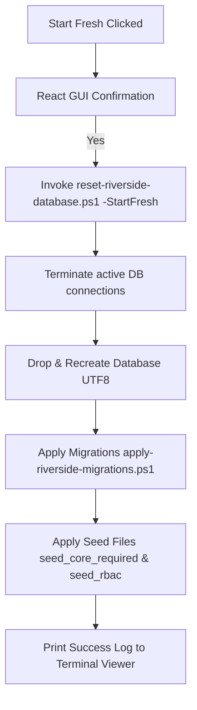

# Riverside OS Deployment Manager Manual

The **Riverside OS Deployment Manager** (`RiversideOS-Deployment-Manager.exe`) is the universal graphical hub for installing, updating, auditing, repairing, and resetting in-store Riverside OS workstations and server installations. 

Replacing the legacy WinForms-based and command-line scripts, it provides a unified, cross-station desktop dashboard that interfaces directly with local system configuration, services, database engines, and diagnostic tools.

---

## Key Capabilities

*   **Elevated Run-Time Authority**: Launches automatically as Administrator to manage system-level scheduled tasks, database engines, network firewalls, and configuration directories (`C:\RiversideOS` and `C:\ProgramData\RiversideOS`).
*   **Zero-Config Self-Healing Credentials**: Automatically detects PostgreSQL authentication patterns (trust/defaults) and generates cryptographically secure, URL-safe secrets and database passwords, saving them back to the configuration file.
*   **Comprehensive System Audit Diagnostics**: Performs an edge-to-edge system health check, mapping permissions, port availability, database versioning, background tasks, and printer reachability.
*   **Single-Click 'Start Fresh' (Factory Reset)**: Wipes the existing schema, creates a clean UTF8 database, applies all migrations, and runs core required seeds silently in a single click.
*   **High-Speed Pipeline Compilation**: Fully integrated into the GitHub Actions CI/CD pipeline, utilizing advanced compiler caching to compile and package the manager binary automatically in under 8 minutes.

---

## 1. Directory & Package Layout

Within the packaged Windows deployment ZIP, the files are structured as follows:

```text
RiversideOS-v[Version]-Windows-Deployment/
  Start-RiversideDeployment.cmd          <-- Primary double-click launcher
  RiversideOS-Deployment-Manager.exe     <-- Compiled Tauri GUI App
  Audit-System.cmd                       <-- Diagnostic double-click utility
  audit-system.ps1                       <-- Core pre-flight checking script
  install-server.ps1                     <-- Server installation logic
  install-register.ps1                   <-- Register workstation installer
  apply-riverside-migrations.ps1         <-- Schema updater
  reset-riverside-database.ps1           <-- Schema wiper and re-creator
  riverside-deployment.config.json       <-- Local configuration state
  server/
    riverside-server.exe                 <-- Compiled Axum API binary
  client-dist/                           <-- Compiled React frontend files
  migrations/                            <-- SQL migrations directory
  seeds/                                 <-- Core required start/RBAC seeds
  register/                              <-- Register MSI/EXE installers
```

---

## 2. Elevated Launcher Flow

To guarantee that local configuration writing, service registration, and network binding succeed, the Deployment Manager must run with administrator privileges.

### Double-Click Entry Point
When an operator double-clicks **`Start-RiversideDeployment.cmd`**, the script executes the following logic:
1. Checks for the presence of **`RiversideOS-Deployment-Manager.exe`**.
2. If found, it invokes a PowerShell script wrapper to trigger a User Account Control (UAC) prompt and run the executable elevated:
   ```powershell
   Start-Process -FilePath "RiversideOS-Deployment-Manager.exe" -Verb RunAs
   ```
3. If the compiled manager binary is missing (e.g. legacy/development environment), the script safely falls back to launching the command-line/WinForms setup utility.

---

## 3. Zero-Config Password Auto-Resolution & Generation

To prevent setup failures caused by misconfigured passwords or unreplaced placeholder tokens, all database and app scripts are self-healing.

### Automatic Secret and App Password Generation
When `install-server.ps1` or `apply-riverside-migrations.ps1` runs:
*   **JWT Secret:** If `storeCustomerJwtSecret` in the configuration is empty or matches a placeholder (e.g. `replace-with-...`), the script generates a secure 32-character token.
*   **App DB User Password:** If `appPassword` is empty or matches a placeholder, the script generates a secure 24-character database password.
*   **Auto-Save:** Generated secrets are automatically written back to the `riverside-deployment.config.json` configuration file, ensuring they are persistent and won't be lost during updates.

### Postgres Admin Password Auto-Detection
If the PostgreSQL admin password is left blank or as a placeholder:
*   The script attempts to connect to the local PostgreSQL instance on port 5432 using **empty/blank credentials** (checking for standard dev "trust authentication").
*   If that fails, it cycles through common default admin passwords (`postgres`, `admin`, `password`).
*   If a connection is successfully established, the script **automatically writes the working password** to `riverside-deployment.config.json`.
*   If no local instance is found, and the manager is installing a new PostgreSQL instance, it generates a new admin password and registers it.

---

## 4. Deep Pre-flight System Audit

Clicking the **Audit** button in the Deployment Manager (or running `Audit-System.cmd`) triggers the **`audit-system.ps1`** diagnostic utility. It validates the host environment and prints a color-coded status log:

| Check Target | Diagnostic Method | Recovery Action |
| :--- | :--- | :--- |
| **Admin Permissions** | Verifies Windows Security Principal is Administrator. | Throws warning to relaunch script elevated. |
| **Port Reachability** | Checks if TCP Port 5432 (PostgreSQL) is open. | Identifies if database service is stopped. |
| **Database Connection** | Attempts SQL check query using resolved credentials. | Validates config credentials and database existence. |
| **Schema & Migrations** | Queries table counts and checks `ros_schema_migrations`. | Identifies if migrations are pending or unapplied. |
| **Server Task Status** | Audits state of `"Riverside OS Server"` scheduled task. | Checks if task is registered, active, or terminated. |
| **API Health** | Pings port 3000 `/api/version` and `/api/staff/list-for-pos`. | Verifies Axum server is responding to HTTP traffic. |
| **System Environment** | Audits machine-level `RIVERSIDE_CREDENTIALS_KEY` variable. | Confirms API server has access to encryption keys. |
| **Printer Connectivity** | Pings IPs defined in `receiptPrinter` / `tagPrinter` settings. | Identifies routing/firewall issues for ticket printers. |

---

## 5. Maintenance Commands

The Deployment Manager provides a suite of dashboard buttons to manage local database operations:

```
┌────────────────────────────────────────────────────────┐
│                  DATABASE MAINTENANCE                  │
├────────────────────────────────────────────────────────┤
│  [ Apply Migrations ]     -->  Runs pending schemas    │
│  [ Seed Database ]        -->  Applies required data   │
│  [ Start Fresh ]          -->  Zero-Config Factory Reset│
└────────────────────────────────────────────────────────┘
```

### Apply Migrations
Runs `apply-riverside-migrations.ps1`. Reads the migration ledger `ros_schema_migrations` and applies any new numbered SQL scripts (from the `migrations/` directory) using `psql.exe`.

### Seed Database
Runs the core and RBAC seed scripts (`seeds/seed_core_required.sql` and `seeds/seed_rbac.sql`). Establishes standard store settings, system configuration, permission templates, and registers the fallback admin profile:
*   **Username:** `Chris G`
*   **Access PIN:** `1234`
*   **Role:** `admin`

### Start Fresh (Factory Reset)
The **Start Fresh** option completely drops the local database, recreates it from scratch, applies all schema migrations, and seeds the default production data in a single step.

> [!WARNING]
> This operation is highly destructive and will permanently delete all transaction history, customers, and inventory data on this workstation. It should only be used on new workstations or when recovering a failed initial setup.



To prevent blocking dialog boxes when triggered from the Tauri GUI log terminal, passing `-StartFresh` suppresses all WinForms MessageBox popups.

To prevent blocking dialog boxes when triggered from the Tauri GUI log terminal, passing `-StartFresh` suppresses all WinForms MessageBox popups.

---

## 6. Password & Security Management

The Deployment Manager includes automated self-healing scripts to recover from lost credentials or corrupted configuration files, improving ease of use for retail operators.

### Repair Server Credentials Key (`repair-server-credentials-key.ps1`)
If the server loses its encryption keys or the `.env` file is corrupted, this command:
1. Verifies administrative rights and checks the `.env` state.
2. Validates `RIVERSIDE_CREDENTIALS_KEY` and `RIVERSIDE_STORE_CUSTOMER_JWT_SECRET`.
3. If missing or invalid, generates cryptographically secure 48-character replacement secrets.
4. Writes them to the `.env` file and Windows Machine-level environment variables.
5. Safely restarts the `Riverside OS Server` scheduled task to pick up the new keys.

### Repair Bootstrap Admin (`repair-bootstrap-admin.ps1`)
In case of complete lockout, this script forcefully resets the primary administrative account to the factory default PIN (`1234`) and ensures the profile retains the `admin` role, restoring Back Office access.

---

## 7. Integrations & AI Add-ons

The manager exposes utilities to connect and enhance the Riverside OS environment after the core system is installed.

### Install ROSIE AI Stack (`Install-RosieAiStack.ps1`)
Downloads and configures the local AI copilot dependencies (Gemma GGUF models, SenseVoice, and Kokoro TTS) into the `%LOCALAPPDATA%\riverside-os\rosie` directory, ensuring offline capabilities are ready for the ROSIE worker.

### Set Counterpoint Bridge Token (`set-counterpoint-bridge-token.ps1`)
Generates or rotates the 48-character `COUNTERPOINT_SYNC_TOKEN` required to secure the bridge between Riverside OS and legacy NCR Counterpoint POS systems.

---

## 8. Development & Compilation Architecture

The Deployment Manager is a Tauri v2 application composed of a **Vite + React + TS** frontend (`deployment/manager-app/src`) and a **Rust** backend (`deployment/manager-app/src-tauri`).

### Tauri Command Bridge
The frontend interacts with Windows PowerShell by invoking custom Rust handlers defined in `lib.rs`:

```rust
// Invokes a powershell script in bypass mode, passing optional arguments
#[tauri::command]
async fn run_deployment_script(app: AppHandle, script_name: String, args: Option<Vec<String>>) -> Result<(), String>;

// Executes inline commands directly
#[tauri::command]
async fn run_inline_powershell(app: AppHandle, script_content: String) -> Result<(), String>;
```

Logs are emitted asynchronously from Rust back to the Vite console using the `deployment-log` event emitter, allowing operators to monitor script output in real time.

### GitHub Actions CI/CD Pipeline
The deployment manager packaging is automated in `.github/workflows/windows-deployment-package.yml`. 

To prevent compile bottlenecks (which previously took **35+ minutes**), the pipeline utilizes **`swatinem/rust-cache`** to cache build objects across runs. Workspaces are split into three targets:
1.  `client/src-tauri` (Tauri Client Desktop application)
2.  `server` (Axum Backend server executable)
3.  `deployment/manager-app/src-tauri` (Deployment Manager executable)

This cache reduction brings successive build times down to **8-10 minutes**. The runner automatically packages the compiled executable in the final zip file as `RiversideOS-Deployment-Manager.exe`.
