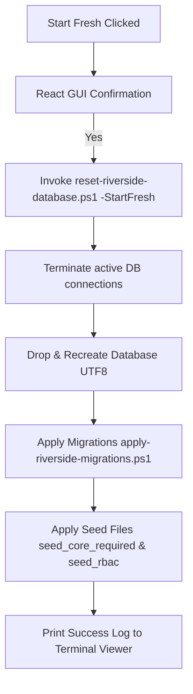

# Riverside OS Deployment Manager Manual

The **Riverside OS Deployment Manager** is the universal graphical hub for installing, updating, auditing, repairing, and resetting in-store Riverside OS workstations and server installations. Current Windows deployment packages include `Install-ROSDeploymentApps.cmd` so the Deployment Manager and ROS Server Manager can be installed as normal Windows apps before use.

For day-to-day Server PC operations after installation, use the separate **ROS Server Manager** (`ROS-ServerManager.exe`). It runs locally, does not require the Riverside API to be online, and is focused on server health, repairs, cleanup, updates, and recovery. See [`ROS_SERVER_MANAGER.md`](ROS_SERVER_MANAGER.md).

Replacing the legacy WinForms-based and command-line scripts, it provides a unified, cross-station desktop dashboard that interfaces directly with local system configuration, services, database engines, and diagnostic tools.

---

## Key Capabilities

*   **Elevated Run-Time Authority**: Launches automatically as Administrator to manage system-level scheduled tasks, database engines, network firewalls, and configuration directories (`C:\RiversideOS` and `C:\ProgramData\RiversideOS`).
*   **Zero-Config Self-Healing Credentials**: Automatically detects PostgreSQL authentication patterns (trust/defaults) and generates cryptographically secure, URL-safe secrets and database passwords, saving them back to the configuration file.
*   **Comprehensive System Audit Diagnostics**: Performs an edge-to-edge system health check, mapping permissions, port availability, database versioning, background tasks, and printer reachability.
*   **Single-Click 'Start Fresh' (Factory Reset)**: Wipes the existing schema, creates a clean UTF8 database, applies all migrations, and runs core required seeds silently in a single click.
*   **High-Speed Pipeline Compilation**: Fully integrated into the GitHub Actions CI/CD pipeline, utilizing advanced compiler caching to compile and package the manager binary automatically in under 8 minutes.

---

## 1. Directory & Package Layout

Within the packaged Windows deployment ZIP, the files are structured as follows:

```text
RiversideOS-v[Version]-Windows-Deployment/
  Start-RiversideDeployment.cmd          <-- Primary double-click launcher
  Install-ROSDeploymentApps.cmd         <-- Installs Deployment Manager and/or ROS Server Manager
  RiversideOS-Deployment-Manager.exe     <-- Compiled Tauri GUI App
  deployment-app/                        <-- Deployment Manager MSI/EXE installer bundle
  server-manager-app/                    <-- ROS Server Manager MSI/EXE installer bundle
  Audit-System.cmd                       <-- Diagnostic double-click utility
  audit-system.ps1                       <-- Core pre-flight checking script
  install-server.ps1                     <-- Server installation logic (Main Hub)
  install-register.ps1                   <-- Register / workstation installer
  remove-main-hub.ps1                    <-- Full server + app removal
  remove-standalone-app.ps1              <-- App-only removal
  apply-riverside-migrations.ps1         <-- Schema updater
  reset-riverside-database.ps1           <-- Schema wiper and re-creator
  riverside-deployment.config.json       <-- Local configuration state
  server/
    riverside-server.exe                 <-- Compiled Axum API binary
  client-dist/                           <-- Compiled React frontend files
  migrations/                            <-- SQL migrations directory
  seeds/                                 <-- Core required start/RBAC seeds
  register/                              <-- Register MSI/EXE installers
```

### macOS ROS Dev Center

The **ROS Dev Center** (`ros-dev`) is a separate macOS DevOps companion app built as a universal Apple Silicon / Intel DMG via `.github/workflows/macos-ros-dev-center-release.yml`. It connects to any ROS instance for real-time monitoring, GitHub integration, and one-click release builds. Download the `.dmg` from the matching release tag and install like any standard macOS application. See [`ros-dev/README.md`](../ros-dev/README.md) for setup and usage.

---

## 2. Installation Roles

The Deployment Manager supports **three distinct installation roles**. Choose exactly one per workstation:

| Role | What it installs | Use on |
|------|----------------|--------|
| **Main Hub** | PostgreSQL, `riverside-server.exe`, web bundle, migrations, firewall rule, startup task, and the Riverside desktop app | The single Windows PC that is the store server and may also serve as a back-office workstation. |
| **Standalone App — Back Office** | Riverside desktop app only, pointed at the Main Hub API | A non-server Windows PC used for back-office work (customers, orders, inventory, reports). |
| **Standalone App — Register #1** | Riverside desktop app only, pointed at the Main Hub API, with receipt-printer and cash-drawer settings | The primary cashier Windows PC. Must be a different PC than the Main Hub in production. |

**Rules:**
- Only **one** Main Hub exists per store.
- Register #1 should be a **separate physical PC** from the Main Hub for production reliability.
- Back Office workstations are lightweight: no PostgreSQL, no server task, just the desktop app.

---

## 3. Elevated Launcher Flow

To guarantee that local configuration writing, service registration, and network binding succeed, the Deployment Manager must run with administrator privileges.

### Installed-App Entry Point
For normal use, first run **`Install-ROSDeploymentApps.cmd`** from the deployment package and install the Deployment Manager, ROS Server Manager, or both. After that, launch them from the Windows Start menu like standard applications. The legacy **`Start-RiversideDeployment.cmd`** launcher remains as a fallback when a package is being used directly from Downloads.

When an operator double-clicks **`Start-RiversideDeployment.cmd`**, the script executes the following logic:
1. Checks for the presence of **`RiversideOS-Deployment-Manager.exe`**.
2. If found, it invokes a PowerShell script wrapper to trigger a User Account Control (UAC) prompt and run the executable elevated:
   ```powershell
   Start-Process -FilePath "RiversideOS-Deployment-Manager.exe" -Verb RunAs
   ```
3. If the compiled manager binary is missing (e.g. legacy/development environment), the script safely falls back to launching the command-line/WinForms setup utility.

---

## 3. Zero-Config Password Auto-Resolution & Generation

To prevent setup failures caused by misconfigured passwords or unreplaced placeholder tokens, all database and app scripts are self-healing.

### Automatic Secret and App Password Generation
When `install-server.ps1` or `apply-riverside-migrations.ps1` runs:
*   **JWT Secret:** If `storeCustomerJwtSecret` in the configuration is empty or matches a placeholder (e.g. `replace-with-...`), the script generates a secure 32-character token.
*   **App DB User Password:** If `appPassword` is empty or matches a placeholder, the script generates a secure 24-character database password.
*   **Auto-Save:** Generated secrets are automatically written back to the `riverside-deployment.config.json` configuration file, ensuring they are persistent and won't be lost during updates.

### Postgres Admin Password Auto-Detection
If the PostgreSQL admin password is left blank or as a placeholder:
*   The script probes the local PostgreSQL instance using the `psql -w` (no-interactive-prompt) flag. This ensures psql **immediately exits with a non-zero code** if the password is wrong rather than opening a console password prompt.
*   The probe sequence is: configured password → trust/empty → common defaults (`postgres`, `admin`, `password`).
*   If a connection is successfully established, the script **automatically writes the working password** to `riverside-deployment.config.json`.
*   If no connection succeeds, the installer prints a clear error pointing to `riverside-deployment.config.json` and exits — no hanging password prompts, no looping console dialogs.
*   `Invoke-NativeCommand` (the low-level process wrapper used by all psql calls) redirects stdin and closes it immediately, which prevents any child process from opening an interactive prompt on the console window.

---

## 4. Deep Pre-flight System Audit

Clicking the **Audit** button in the Deployment Manager (or running `Audit-System.cmd`) triggers the **`audit-system.ps1`** diagnostic utility. It validates the host environment and prints a color-coded status log:

| Check Target | Diagnostic Method | Recovery Action |
| :--- | :--- | :--- |
| **Admin Permissions** | Verifies Windows Security Principal is Administrator. | Throws warning to relaunch script elevated. |
| **Port Reachability** | Checks if TCP Port 5432 (PostgreSQL) is open. | Identifies if database service is stopped. |
| **Database Connection** | Attempts SQL check query using resolved credentials. | Validates config credentials and database existence. |
| **Schema & Migrations** | Queries table counts and checks `ros_schema_migrations`. | Identifies if migrations are pending or unapplied. |
| **Server Task Status** | Audits state of `"Riverside OS Server"` scheduled task. | Checks if task is registered, active, or terminated. |
| **API Health** | Pings port 3000 `/api/health`, `/api/ready`, `/api/live`, and `/api/version`. | Verifies Axum server is responding to HTTP traffic. |
| **System Environment** | Audits machine-level `RIVERSIDE_CREDENTIALS_KEY` variable. | Confirms API server has access to encryption keys. |
| **Printer Connectivity** | Pings IPs defined in `receiptPrinter` / `tagPrinter` settings. | Identifies routing/firewall issues for ticket printers. |

---

## 5. Maintenance Commands

The Deployment Manager provides a suite of dashboard buttons to manage local database operations:

```
┌────────────────────────────────────────────────────────┐
│                  DATABASE MAINTENANCE                  │
├────────────────────────────────────────────────────────┤
│  [ Apply Migrations ]     -->  Runs pending schemas    │
│  [ Seed Database ]        -->  Applies required data   │
│  [ Start Fresh ]          -->  Zero-Config Factory Reset│
└────────────────────────────────────────────────────────┘
```

### Apply Migrations
Runs `apply-riverside-migrations.ps1`. Reads the migration ledger `ros_schema_migrations` and applies any new numbered SQL scripts (from the `migrations/` directory) using `psql.exe`.

### Seed Database
Runs the core and RBAC seed scripts (`seeds/seed_core_required.sql` and `seeds/seed_rbac.sql`). Establishes standard store settings, system configuration, permission templates, and registers the fallback admin profile:
*   **Username:** `Chris G`
*   **Access PIN:** `1234`
*   **Role:** `admin`

### Start Fresh (Factory Reset)
The **Start Fresh** option completely drops the local database, recreates it from scratch, applies all schema migrations, and seeds the default production data in a single step.

> [!WARNING]
> This operation is highly destructive and will permanently delete all transaction history, customers, and inventory data on this workstation. It should only be used on new workstations or when recovering a failed initial setup.



To prevent blocking dialog boxes when triggered from the Tauri GUI log terminal, passing `-StartFresh` suppresses all WinForms MessageBox popups.

---

## 6. Removal Commands

The Deployment Manager can cleanly remove Riverside OS from a workstation. The removal path depends on the original installation role.

### Remove Main Hub (`remove-main-hub.ps1`)

Removes the **full server installation** from a Main Hub workstation:

- Stops and unregisters the `Riverside OS Server` and `Riverside OS LLM Host` scheduled tasks.
- Stops running `riverside-server` and `llama-server` processes.
- Uninstalls the Riverside desktop app via MSI/registry.
- Removes firewall rules (`Riverside OS Server`, `Riverside OS API`, `Riverside OS LLM Host`).
- Drops the `riverside_os` PostgreSQL database (unless `--KeepDatabase` is passed).
- Removes station configurations and the install root (unless `--KeepInstallRoot` is passed).

Requires Administrator elevation. Prompts for `REMOVE` confirmation unless `--Force` is passed.

### Remove Standalone App (`remove-standalone-app.ps1`)

Removes a **desktop-app-only installation** from a Back Office or Register workstation:

- Stops running Riverside client processes.
- Uninstalls the Riverside desktop app via MSI and registry uninstall strings.
- Removes station configurations.

Does **not** touch PostgreSQL, the server task, or firewall rules. Use this for Back Office workstations and Register #1 PCs when they are being retired or reimaged.

Requires Administrator elevation. Prompts for `REMOVE` confirmation unless `--Force` is passed.

---

## 7. Password & Security Management

The Deployment Manager includes automated self-healing scripts to recover from lost credentials or corrupted configuration files, improving ease of use for retail operators.

### Repair Server Credentials Key (`repair-server-credentials-key.ps1`)
If the server loses its encryption keys or the `.env` file is corrupted, this command:
1. Verifies administrative rights and checks the `.env` state.
2. Validates `RIVERSIDE_CREDENTIALS_KEY` and `RIVERSIDE_STORE_CUSTOMER_JWT_SECRET`.
3. If missing or invalid, generates cryptographically secure 48-character replacement secrets.
4. Writes them to the `.env` file and Windows Machine-level environment variables.
5. Safely restarts the `Riverside OS Server` scheduled task to pick up the new keys.

### Repair Bootstrap Admin (`repair-bootstrap-admin.ps1`)
In case of complete lockout, this script forcefully resets the primary administrative account to the factory default PIN (`1234`) and ensures the profile retains the `admin` role, restoring Back Office access.

---

## 8. In-App Update System (v0.80.9+)

As of v0.80.9, **routine updates no longer require the Deployment Manager**. All ongoing updates are handled from within the running Riverside OS application itself.

### Overview

| What changed | Detail |
|---|---|
| **Deployment Manager role** | First-time install and factory reset only. Not needed for updates. |
| **Routine updates** | Handled entirely from **Settings → Updates** inside Riverside OS. |
| **Daily update check** | The server checks GitHub for new releases every hour, once per calendar day. Admin staff receive an in-app notification when a newer version is available. |
| **Safe window enforcement** | The update check reports whether the current time is within the safe update window (before 10 AM or after 6 PM). The UI warns if an update is attempted during store hours. |

### Update Flow — Main Hub (Server PC)

On the Main Hub station, **Settings → Updates → Server update** shows a live version status banner and a one-click update button. When clicked, the system:

1. Downloads the Windows deployment ZIP for the version/build reported by the update check.
2. Extracts it to a temporary directory and verifies `deployment-package.manifest.json` against the target build SHA before launching any elevated script.
3. Runs `install-server.ps1`, `repair-bootstrap-admin.ps1`, and `install-register.ps1` elevated via UAC in a PowerShell window.
4. **Automatically restarts the `Riverside OS Server` scheduled task** after install.
5. Polls `GET /api/health` every 2 seconds (up to 60 s) and confirms the server is responding before printing "Update Complete".
6. The operator relaunches Riverside on all stations when prompted.

### Satellite Station Version Gate

When a Register or Back Office station connects to the server, `BackofficeSignInGate` checks `GET /api/version`. If the server version is **ahead of the client version**, the sign-in PIN screen is replaced with a blocking **"Update Required"** screen showing:

- The server version vs. the current station version.
- A one-click **"Update to vX.X.X"** button (Windows Tauri: pulls the signed MSI via the Tauri updater channel).
- A "Reload now" instruction for PWA / browser stations.
- A "Recheck after manual update" link.

**Staff cannot sign in until the client version matches the server.** This ensures all stations are always in sync after a server update.

### Admin Notifications

When the daily update check detects a newer release on GitHub, it broadcasts an `update_available` notification to all staff with the `settings.admin` permission. The notification includes the new version number and the current store-hours status, and deep-links to **Settings → Updates**.

### Release Asset Proof

Every production release workflow must prove the updater channel after uploading release assets. The workflow runs:

```bash
npm run check:updater-release -- --repo cpg716/riverside-os --tag v0.90.0 --platform windows-x86_64 --manifest latest.json
```

For the full Windows deployment release, the same verifier checks all signed manifests:

- `latest.json` — Riverside POS desktop updater.
- `latest-deployment-manager.json` — Deployment Manager self-updater.
- `latest-server-manager.json` — ROS Server Manager self-updater.
- `latest-countersync-bridge-gui.json` — Counterpoint Bridge GUI self-updater.

The verifier fails the release if any manifest is missing `+build` metadata, missing `build_sha`, missing a signature, points at a missing artifact, or lacks the matching `.sig` file. This is the release proof for **signed artifacts** and **same-version rebuild detection**.

### Manual Recovery Path

If an in-app update fails or a station cannot launch after an update, use this sequence. Do not skip directly to database reset unless ownership explicitly approves data loss.

1. **Main Hub first:** On the Main Hub, open the Deployment Manager as Administrator and run **Audit**.
2. **Repair server path:** If the API is down, use ROS Server Manager or Deployment Manager to restart/repair the `"Riverside OS Server"` scheduled task, then confirm `GET /api/health` returns 200. ROS Server Manager falls back to `C:\RiversideOS\server\.env` for installed Main Hub database diagnostics when the package config JSON is not present beside the manager executable.
3. **Repair release files:** If the server binary, web bundle, migrations, or ROSIE assets are missing, rerun the latest deployment package Main Hub install/update path.
4. **Repair migrations only:** If the app opens but reports missing tables/columns, run **Apply Migrations** from the same release package.
5. **Repair ROSIE only:** If AI/help features fail but the POS/server are healthy, run **Install/Repair ROSIE AI Stack** from the deployment tools.
6. **Repair workstation only:** On Register or Back Office PCs, run **Repair Workstation Settings** first. If the app binary is damaged, run the Standalone App installer for that station role.
7. **Recheck version gate:** Relaunch Riverside and confirm the station no longer shows **Update Required**.
8. **Escalate to restore only:** Use backup restore only when the database itself is corrupted or a migration/data issue cannot be repaired. Restore must be blocked while registers are open.

### Pre-Go-Live Update Rehearsal

Before go-live, run one complete update rehearsal on real hardware:

1. Install the previous signed release on the Main Hub, one Windows Register, one Back Office workstation, and one PWA/iPad station.
2. Publish or select a newer signed release.
3. On the Main Hub, run **Settings → Updates → Main Hub update** and verify server restart, migrations, ROSIE files, `/api/health`, and app relaunch.
4. On Windows Register and Back Office stations, verify the version gate blocks sign-in until the station updates.
5. Install the station update through the in-app updater and confirm the app relaunches into the correct station role.
6. On PWA/iPad, hard reload and confirm the version gate clears.
7. Run one POS smoke sale/refund-safe workflow, one help/ROSIE request, and one Counterpoint Sync health check after the update.
8. Record release tag, build SHA, machines tested, time started/finished, and any recovery actions used.

### API Endpoint

`GET /api/ops/update-check` (requires authenticated staff session) returns:

```json
{
  "current_version": "0.80.9",
  "latest_version": "0.81.0",
  "update_available": true,
  "release_notes": "...",
  "safe_window": false,
  "safe_window_hint": "Store is open (2:30 PM). Schedule the update before 10 AM or after 6 PM."
}
```

---

## 9. Integrations & AI Add-ons

The manager exposes utilities to connect and enhance the Riverside OS environment after the core system is installed.

### Install ROSIE AI Stack (`Install-RosieAiStack.ps1`)

Downloads and configures the local AI copilot runtime into `C:\RiversideOS\rosie\`. ROSIE is a **Zero-Python, binary-only** stack — no Python interpreters, `pip`, `venv`, or `uv` are required.

**What the installer does (in order):**

| Step | Description |
|---|---|
| **1 — Binaries** | Copies `sherpa-onnx-offline.exe` / `sherpa-onnx-offline-tts.exe` from the deployment package if bundled. If not present, downloads the pinned **sherpa-onnx v1.13.2** tar.bz2 from GitHub Releases and extracts the executables + required DLLs to `rosie\bin\`. |
| **2 — STT Models** | Copies or downloads **SenseVoice Small (int8)** from HuggingFace — `model.int8.onnx` + `tokens.txt` — into `rosie\stt\sherpa-onnx-sense-voice-zh-en-ja-ko-yue-int8-2024-07-17\`. |
| **3 — TTS Models** | Copies or downloads **Kokoro-82M** from HuggingFace — `model.onnx`, `voices.bin`, `tokens.txt`, `espeak-ng-data\` — into `rosie\tts\kokoro-multi-lang-v1_0\`. |
| **4 — Gemma GGUF** | Verifies SHA256 of the pinned Gemma 4 E4B GGUF or downloads from Hugging Face. A download failure is a **warning** (not a fatal error) so STT/TTS remain functional even without the LLM. |
| **5 — `.env` Patch** | Writes `RIVERSIDE_LLAMA_MODEL_PATH`, `RIVERSIDE_LLAMA_HOST`, and `RIVERSIDE_LLAMA_PORT` into the server `.env` file (skipped when called by `install-server.ps1` which handles this itself via the returned model path). |

**Version pins** are defined at the top of the script — update the `$SHERPA_VERSION`, `$STT_MODEL_DIR`, and `$TTS_MODEL_DIR` variables to upgrade components.

> [!NOTE]
> Binaries and models are **never committed to the git repository**. Current deployment ZIPs pre-bundle `rosie\bin\`, `rosie\stt\`, and `rosie\tts\` so operators do not have to download voice models during install. If those package folders are missing, the installer attempts pinned downloads and fails with an explicit Hugging Face token/model-source message instead of looping through opaque 401 errors.

### Counterpoint Bridge
The deployment ZIP includes the Counterpoint Bridge GUI installer under `counterpoint-bridge-gui\`. The current go-live path connects the Bridge directly to Main Hub ROS on port `3000`; the legacy standalone SYNC Workbench and bridge-token helper are not packaged.

---

## 9. Development & Compilation Architecture

The Deployment Manager is a Tauri v2 application composed of a **Vite + React + TS** frontend (`deployment/manager-app/src`) and a **Rust** backend (`deployment/manager-app/src-tauri`).

### Tauri Command Bridge
The frontend interacts with Windows PowerShell by invoking custom Rust handlers defined in `lib.rs`:

```rust
// Invokes a powershell script in bypass mode, passing optional arguments
#[tauri::command]
async fn run_deployment_script(app: AppHandle, script_name: String, args: Option<Vec<String>>) -> Result<(), String>;

// Executes inline commands directly
#[tauri::command]
async fn run_inline_powershell(app: AppHandle, script_content: String) -> Result<(), String>;
```

Logs are emitted asynchronously from Rust back to the Vite console using the `deployment-log` event emitter, allowing operators to monitor script output in real time.

### GitHub Actions CI/CD Pipeline
The deployment manager packaging is automated in two workflows:
- **Windows**: `.github/workflows/windows-deployment-package.yml` — builds the full Windows deployment ZIP (server binary, client bundle, register installer, Deployment Manager installer bundle, ROS Server Manager installer bundle, Counterpoint SYNC Workbench, and bundled ROSIE voice models). Signed updater manifests/installers are uploaded as release assets beside the ZIP.
- **macOS**: `.github/workflows/macos-ros-dev-center-release.yml` — builds a universal Apple Silicon / Intel DMG for the ROS Dev Center.

Both pipelines utilize **`swatinem/rust-cache`** to cache downloaded Rust dependencies across runs. The Windows workspace builds three targets sequentially in one job:
1.  `client/src-tauri` (Tauri Client Desktop application)
2.  `server` (Axum Backend server executable)
3.  `deployment/manager-app/src-tauri` (Deployment Manager executable)

Full Windows deployment package builds realistically take **20–30 minutes** (dependency caching saves time on crates that did not change between runs). macOS ROS Dev Center builds are faster at approximately **15 minutes** since only one Tauri app is compiled. The Windows runner automatically packages the compiled executable in the final zip file as `RiversideOS-Deployment-Manager.exe`.
