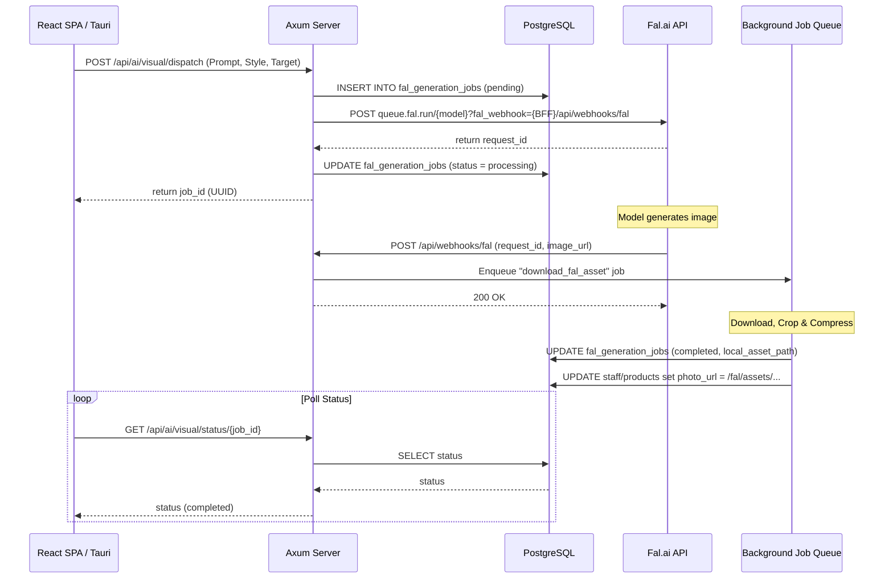

# Fal.ai Visual Sidecar Integration

## Overview
The **Fal.ai Visual Sidecar** is a centralized service in Riverside OS (ROS) that orchestrates image generation across the staff, product, and content pipelines. It interfaces with Fal.ai for high-performance diffusion tasks while strictly adhering to the **Local-First & Offline-First** architecture of ROS by downloading, optimizing, and caching all generated assets locally.

---

## 1. Core Architecture & Invariants

### Compute vs. Storage Split
* **Diffusion Pass**: Offloaded to Fal.ai's cloud GPUs using the `/queue` async API.
* **Storage Invariant**: Generated images are **never** served directly from Fal.ai CDN links in production. Once generation completes, ROS downloads, resizes/crops, and stores the image locally in `client/public/fal/{job_type}/{target_id}.jpg` and serves them from the local workstation/server file system.

### Database Tracking
All generation pipelines are tracked in the `fal_generation_jobs` table:
* `job_type`: Enumeration of `staff_avatar`, `product_image`, `promo_image`.
* `target_id`: Uuid reference to `staff.id` or `products.id`.
* `pending_job_id`: The async task request ID generated by Fal.ai.
* `local_asset_path`: Local folder URL path once downloaded.
* `status`: State tracker (`pending`, `processing`, `completed`, `failed`).
* `error_message`: Logs failures from Fal.ai queue or local download errors.

---

## 2. Dynamic Data Flow

---

## 3. Webhook & Background Worker
* **Webhook (`POST /api/webhooks/fal`)**: Receives the callback from Fal.ai, identifies the target job in the database, and schedules the `DownloadFalAsset` job in the background queue.
* **Worker (`fal_download.rs`)**: Downloads the completed image bytes, runs optimization checks, and standardizes image formats:
  * **Staff Avatars**: Normalizes and crops to a `512x512` progressive JPEG using the local avatar processing helpers.
  * **Product Images / Promos**: Compresses and saves to progressive high-quality JPEG/WebP.
  * **Target Update**: Dynamically links the local asset path to the target database table (`staff` avatar field or `product_web_images`).

---

## 4. Settings & Management Panel
Managed via **Settings → Integrations → Fal.ai** (`FalSettingsPanel.tsx`), providing full credential control:

### Secure Credentials
Stored securely via the PostgreSQL `integration_credentials` framework (AES-encrypted at rest):
* `api_key`: Saves under `FAL_KEY` env variable.
* `webhook_base_url`: Saves under `RIVERSIDE_PUBLIC_BASE_URL` env variable.

### Platform Monitoring
Admins with `settings.admin` permission can monitor platform logs directly inside ROS via server-side proxy endpoints:
* **Account Billing (`GET /api/settings/fal/billing`)**: Securely queries the account username and credit balance (`GET https://api.fal.ai/v1/account/billing?expand=credits`).
* **Usage Statistics (`GET /api/settings/fal/usage`)**: Monitors the last 30 days of estimated spend and endpoint volume usage (`GET https://api.fal.ai/v1/models/usage`).
* **Job Registry**: A real-time local log table displaying all completed and failed diffusion jobs.

---

## 5. Related Files
* **Backend Logic**:
  * [`server/src/logic/fal_sidecar.rs`](../server/src/logic/fal_sidecar.rs) — Core task dispatch logic.
  * [`server/src/jobs/fal_download.rs`](../server/src/jobs/fal_download.rs) — Image retrieval, cropping, and caching worker.
  * [`server/src/logic/integration_credentials.rs`](../server/src/logic/integration_credentials.rs) — Credentials encryption and env mapping.
* **APIs**:
  * [`server/src/api/ai.rs`](../server/src/api/ai.rs) — Visual dispatch and status routes.
  * [`server/src/api/settings.rs`](../server/src/api/settings.rs) — Secure billing and usage proxy endpoints.
  * [`server/src/api/webhooks.rs`](../server/src/api/webhooks.rs) — Callback receiver.
* **Frontend Panels**:
  * [`client/src/components/settings/FalSettingsPanel.tsx`](../client/src/components/settings/FalSettingsPanel.tsx) — Main dashboard.
  * [`client/src/components/settings/SettingsWorkspace.tsx`](../client/src/components/settings/SettingsWorkspace.tsx) — Sidebar tab routing.

## 6. Hardening (v0.70.x)

- **Retry Logic**: Queue submission retries up to **2 times** with exponential backoff (500ms → 1000ms) on network timeouts, connection errors, and HTTP 5xx.
- **Health Check**: `GET /api/ai/fal-health` performs a lightweight probe against `queue.fal.run` without triggering actual generation. Returns `configured`, `reachable`, `latency_ms`, `message`.
