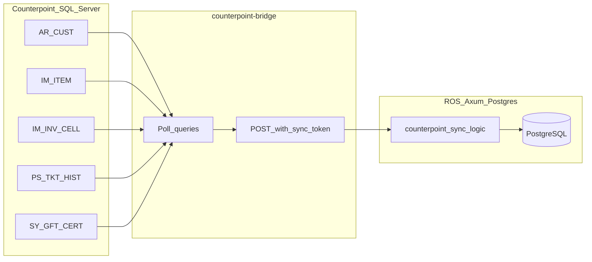
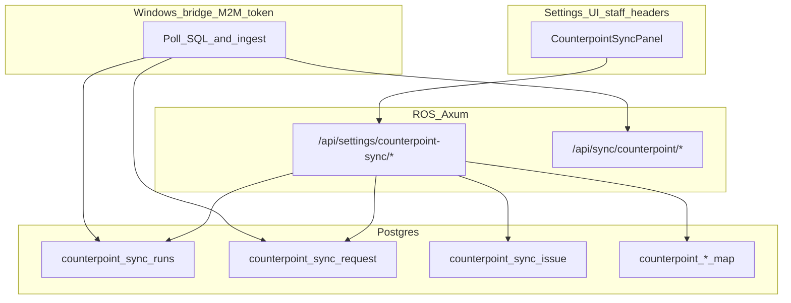

# Counterpoint v8.2 → Riverside OS (unified data map + Settings console)

**Role:** Implementation roadmap for NCR Counterpoint SQL → ROS PostgreSQL ingest, Windows bridge, and Back Office Settings monitoring.  
**Companion:** [counterpoint-bridge/INSTALL_ON_COUNTERPOINT_SERVER.txt](../counterpoint-bridge/INSTALL_ON_COUNTERPOINT_SERVER.txt), [counterpoint-bridge/README.md](../counterpoint-bridge/README.md).  
**Cursor plan:** synced with workspace planning; edit this file as the source of truth in git.

## Implementation checklist

- [x] **schema-external-keys** — Migration **84**: `counterpoint_bridge_heartbeat`, `orders.counterpoint_ticket_ref` (unique), `orders.is_counterpoint_import`, `counterpoint_sync_request`, `counterpoint_sync_issue`, `counterpoint_category_map`, `counterpoint_payment_method_map`, `counterpoint_gift_reason_map`.
- [x] **ingest-catalog-upsert** — `POST /api/sync/counterpoint/catalog`: `IM_ITEM` + `IM_INV_CELL` → `products` / `product_variants` upsert (server logic + bridge entity loop).
- [x] **ingest-gift-cards** — `POST /api/sync/counterpoint/gift-cards`: `SY_GFT_CERT` / `SY_GFT_CERT_HIST` → `gift_cards` + `gift_card_events`; `REASON_COD` mapping via `counterpoint_gift_reason_map`.
- [ ] **ingest-loyalty-policy** — Define policy; `PTS_BAL` / `PS_LOY_PTS_HIST` vs ROS order accrual (no double-count). *(deferred — requires business decision)*
- [x] **ingest-tickets** — `POST /api/sync/counterpoint/tickets`: `PS_TKT_HIST` / LIN / PMT → `orders` / `order_items` / `payment_transactions` / `payment_allocations`; idempotent on `counterpoint_ticket_ref`; `is_counterpoint_import = true` skips accrual.
- [x] **bridge-queries** — Extended `counterpoint-bridge/index.mjs` with catalog, gift-card, ticket entity loops, cursors, heartbeat, payloads; `.env.example` updated with `SYNC_CATALOG`, `SYNC_GIFT_CARDS`, `SYNC_TICKETS` flags and example SQL.
- [x] **counterpoint-bridge-heartbeat** — Migration **84** `counterpoint_bridge_heartbeat` singleton + `POST /api/sync/counterpoint/heartbeat` (M2M token); bridge sends `idle` / `syncing`; `GET /api/settings/counterpoint-sync/status` exposes `windows_sync_state`.
- [x] **settings-counterpoint-ui** — `CounterpointSyncSettingsPanel.tsx` in Settings → Integrations; staff-gated `GET /api/settings/counterpoint-sync/status`, `POST .../request-run`, `PATCH .../issues/:id/resolve`.
- [x] **ingest-staff** — Migration **86**: `counterpoint_staff_map` + `staff.data_source` / `counterpoint_user_id` / `counterpoint_sls_rep` + `customers.preferred_salesperson_id` + `orders.processed_by_staff_id`. `POST /api/sync/counterpoint/staff`: `SY_USR` + `PS_SLS_REP` + `PO_BUYER` → unified `staff` table. Ticket sync sets `processed_by_staff_id` (USR_ID) and `primary_salesperson_id` + `order_items.salesperson_id` (SLS_REP). Customer sync sets `preferred_salesperson_id` (SLS_REP). Bridge syncs staff first so downstream attribution resolves.

---

## Corrections vs informal Counterpoint prompts

- ROS gift cards use PostgreSQL enum **`gift_card_kind`**: `purchased`, `loyalty_reward`, `donated_giveaway` (see [../migrations/23_gift_cards_and_loyalty.sql](../migrations/23_gift_cards_and_loyalty.sql)), not a separate `gift_card_type` name.
- **`is_liability`** on `gift_cards` must stay consistent with kind (purchased = liability; loyalty/donated = typically not, per existing comments).

## Current baseline in repo

**Trust the [implementation checklist](#implementation-checklist) above for what is done vs deferred.** The M2M surface is **not** a minimal stub: ticket history ingests as full **`orders`** (see **ingest-tickets**).

- **Bridge:** [counterpoint-bridge/index.mjs](../counterpoint-bridge/index.mjs) polls SQL Server and POSTs batches to ROS with `COUNTERPOINT_SYNC_TOKEN`.
- **Ingest logic:** [../server/src/logic/counterpoint_sync.rs](../server/src/logic/counterpoint_sync.rs) — among other paths: **customers** (`customer_code` = `CUST_NO`), **catalog** (items + matrix cells), **gift cards**, **tickets** (headers / lines / payments → `orders` + related rows, idempotent on `counterpoint_ticket_ref`), **staff** mapping, inventory upserts, staging batch, and extended entities aligned with migrations **84–96** (vendor items, loyalty hist, open docs, etc. — pair with [`COUNTERPOINT_SYNC_GUIDE.md`](./COUNTERPOINT_SYNC_GUIDE.md)).
- **M2M API:** [../server/src/api/counterpoint_sync.rs](../server/src/api/counterpoint_sync.rs) — under **`POST /api/sync/counterpoint/`**: e.g. **`health`**, **`heartbeat`**, **`request/ack`**, **`request/complete`**, **`customers`**, **`inventory`**, **`category-masters`**, **`catalog`**, **`gift-cards`**, **`tickets`**, **`staff`**, **`staging`**, plus additional entity routes (store credit opening, open docs, vendors, vendor items, loyalty hist, customer notes, sales-rep stubs — see `router()` in that file). **Staff settings** live under **`/api/settings/counterpoint-sync/*`** (status, request-run, issues, staging, maps).
- **ROS keys:** `customers.customer_code` ([../migrations/28_customer_profile_and_code.sql](../migrations/28_customer_profile_and_code.sql)); `product_variants.counterpoint_item_key` unique when set ([../migrations/29_counterpoint_sync.sql](../migrations/29_counterpoint_sync.sql)); ticket idempotency **`orders.counterpoint_ticket_ref`** (**84**); loyalty on `customers.loyalty_points` + `loyalty_point_ledger` + `order_loyalty_accrual` ([../migrations/23_gift_cards_and_loyalty.sql](../migrations/23_gift_cards_and_loyalty.sql)) — **ingest-loyalty-policy** for CP history vs ROS accrual remains an open checklist item.

---

## 1) Customers, notes, loyalty

| Counterpoint | ROS target | Join / key |
|--------------|------------|------------|
| `AR_CUST` | `customers` | `customer_code` = `RTRIM(CAST(CUST_NO AS …))` (aligned with [../counterpoint-bridge/.env.example](../counterpoint-bridge/.env.example)) |
| `PTS_BAL` | `customers.loyalty_points` | After customer upsert exists |
| `AR_CUST_NOTE` | **Gap** | Optional future timeline / CRM notes mapping |
| `PS_LOY_PTS_HIST` | `loyalty_point_ledger` | **Do not double-apply** with ROS `try_accrue_for_order` on imported tickets without a documented policy |

**Implementation note:** Extend customer payload in [../server/src/logic/counterpoint_sync.rs](../server/src/logic/counterpoint_sync.rs) for `PTS_BAL` when policy is set; confirm CP column names in SSMS (`EMAIL_ADRS_1` vs view aliases).

---

## 2) Inventory and matrix

| Counterpoint | ROS target | Mapping rules |
|--------------|------------|---------------|
| `IM_ITEM` (parent) | `products` | Name, description, pricing/cost, category via mapping table or default; `variation_axes` when `IS_GRD = 'Y'` |
| `IM_INV_CELL` | `product_variants` | `variation_values` JSON; **`counterpoint_item_key`** = stable composite (not parent `ITEM_NO` alone for grids) |
| Non-grid `IM_ITEM` | `products` + one variant | SKU from `IM_BARCOD` or `ITEM_NO` |
| `IM_BARCOD` | `product_variants.sku` / `barcode` | Primary barcode rules |
| Qty / cost | `stock_on_hand`, costs | Extend current batch to **create** variants when missing |

**Critical:** Upsert product + variants in server logic (transaction); reuse [../server/src/logic/importer.rs](../server/src/logic/importer.rs) / products API patterns for defaults (`tax_category`, fulfillment, loyalty exclusions).

---

## 3) Sales ticket history

| Counterpoint | ROS target | Notes |
|--------------|------------|-------|
| `PS_TKT_HIST` | `orders` | Idempotent external key (migration): e.g. `counterpoint_ticket_ref` or composite unique |
| `PS_TKT_HIST_LIN` + `PS_TKT_HIST_CELL` | `order_items` | Resolve `variant_id` via `counterpoint_item_key` or SKU |
| `PS_TKT_HIST_PMT` | `payment_transactions` + `payment_allocations` | Map `PMT_TYP` → ROS `payment_method`; idempotent per ticket |
| `PS_TKT_HIST_GFT` | gift card events / balance | Align with `SY_GFT_CERT` |

**Loyalty:** Mark imported orders non-accrual or skip `try_accrue_for_order` for them.

---

## 4) Inventory history, purchasing (deferred phases)

- Optional: `IM_HST_TRX`, `IM_ADJ_HIST`, `IM_PRC_HIST` for audit parity.
- `PS_DOC` / deposits: after core ticket sync.
- `PO_*` / `AP_VEND`: vendor alignment with `vendors.vendor_code`; separate epic.

---

## 5) Gift cards

| Counterpoint | ROS target |
|--------------|------------|
| `SY_GFT_CERT` | `gift_cards` — code = `GFT_CERT_NO`; balances; `card_kind` from **`REASON_COD`** mapping |
| `SY_GFT_CERT_HIST` | `gift_card_events` |

**API:** `POST /api/sync/counterpoint/gift-cards` (M2M token).

---

## 6) Delivery phases (summary)

1. Schema + external keys for tickets and heartbeat.
2. Catalog upsert (items + matrix cells).
3. Gift cards.
4. Loyalty (policy + ingest).
5. Tickets (headers, lines, payments).
6. Settings UI + `counterpoint-sync` admin APIs.

---

## 7) Settings UI — Counterpoint sync console

**Goal:** Monitor bridge, request sync runs, review batches, issues queue, mapping editors — **never** return `COUNTERPOINT_SYNC_TOKEN` to the browser.

### Placement

- New panel (e.g. `CounterpointSyncSettingsPanel.tsx`) from [../client/src/components/settings/SettingsWorkspace.tsx](../client/src/components/settings/SettingsWorkspace.tsx), lazy-loaded like other Integrations panels.

### Windows sync status (ONLINE / OFFLINE / SYNCING)

| State | Meaning | Derivation |
|-------|---------|------------|
| **OFFLINE** | Not usable from ROS | Token not set on server **or** `last_seen_at` older than TTL |
| **ONLINE** | Connected, idle | Token set, heartbeat fresh, `bridge_phase = idle` |
| **SYNCING** | Active SQL read / POST ingest | Token set, heartbeat fresh, `bridge_phase = syncing` (+ optional `current_entity`); bridge must return to `idle` after each batch (success or failure) |

**Heartbeat:** `POST /api/sync/counterpoint/heartbeat` (M2M); table **`counterpoint_bridge_heartbeat`** singleton: `last_seen_at`, `bridge_phase`, optional `current_entity`, optional version/hostname.

**Staff API:** `GET /api/settings/counterpoint-sync/status` → `windows_sync_state`, `offline_reason` when offline, entity rows from `counterpoint_sync_runs`, etc.

### RBAC

- **`settings.admin`** (or dedicated permission) for all settings routes.

### Other settings APIs (suggested)

| Capability | API |
|------------|-----|
| Request run | `POST .../request-run` → row for bridge to poll |
| Review | `GET .../runs` or events |
| Issues | `GET .../issues`, `PATCH .../issues/:id` |
| Maps | CRUD for `counterpoint_category_map`, `counterpoint_payment_method_map`, `counterpoint_gift_reason_map`, etc. |

### Data model (supporting)

- `counterpoint_bridge_heartbeat`
- `counterpoint_sync_request`
- `counterpoint_sync_issue`
- `counterpoint_*_map` tables

### Bridge

- Heartbeat `idle` / `syncing` each poll cycle around batch work.
- Poll sync-request endpoint; ack when done.

---

## 8) Open decisions

- Loyalty: cutover snapshot vs ongoing `PTS_BAL`; interaction with imported tickets.
- Live `REASON_COD` values for gift certs → `gift_card_kind`.
- Category / tax defaults for auto-created products.
- Ticket uniqueness: `TKT_NO` vs composite with `BUS_DAT` / `STR_ID` in v8.2.
