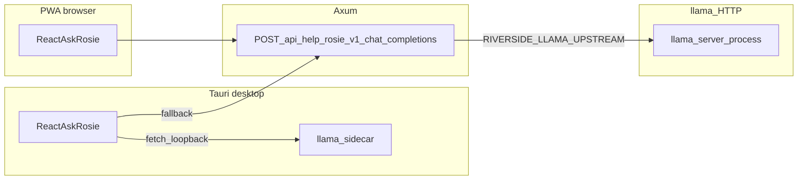
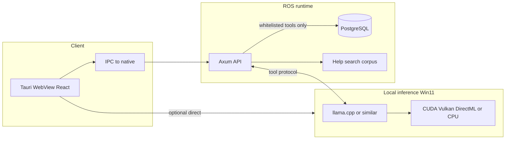

# Local multimodal help — **ROSIE** (RiversideOS Intelligence Engine)

**Status:** **Active program** — architecture + **Help-only** maintainer automation (**nightly** AIDOCS/Playwright manual pipeline, `generate:help`, `ros_help`) ship **now** as part of ROSIE; conversational **Ask ROSIE** in the Help drawer may still roll out behind flags (verify routes in [`server/src/api/mod.rs`](../server/src/api/mod.rs)). **Last updated:** 2026-04-08.

**Product name:** **ROSIE** = **RiversideOS Intelligence Engine**—orchestration + whitelisted **read** tools for answers autonomously build **only** the in-app Help Center (AIDOCS + Playwright → **`client/src/assets/docs/*-manual.md`**, **`client/src/assets/images/help/**`**, **`generate:help`**, **`ros_help`** reindex, and **help-scoped** embedding slices if used).

## ROSIE mission: learn Riverside OS end-to-end, elevate staff and admin

**Goals (what “success” looks like):**

| Audience | What ROSIE does | How she “learns” it (safe meaning) |
|----------|-----------------|-----------------------------------|
| **The product (ROS)** | Build **ground-up literacy**: architecture, workspaces, permissions, data flow, and where truth lives — from **Help manuals**, **`docs/staff/*`**, **`DEVELOPER.md`**, **`AGENTS.md`**, and (where enabled) **developer-mode** excerpts — **not** from unconstrained scraping of production Postgres. | **RAG + citations** on allow-listed Markdown; **versioned** policy bundle; optional **eval** on “explain this screen / this report” against **tool JSON + doc anchors**. |
| **Staff (cashier / floor / CRM)** | **Help them use ROS** day-to-day: procedures, POS and register discipline, customer hub hygiene, **how to** workflows — with **Jump to manual** and **`help_search`**. When they need **numbers**, she calls **read** tools and **reads back** server JSON (never invent SKUs, balances, or tender totals). | Same corpus + **`GET /api/help/search`** fusion; **tool traces** for supervised “good answers” (redacted). |
| **Admin / operations** | **Help them run the store stack**: integrations posture (docs-bound), reporting tiles and **basis** / date semantics, reindex/backup **rituals** described in shipped docs — always **RBAC-aware** (403 → explain **missing permission**, not workarounds). | **[`AI_REPORTING_DATA_CATALOG.md`](AI_REPORTING_DATA_CATALOG.md) §0 / §15** + **`reporting_run`**; **`store_sop_get`**; no **Settings POST** from autonomous loops without explicit human flows outside ROSIE. |
| **Business domain (sales, inventory, finance)** | **Interpret** **revenue**, **margin**, **recognition vs booked** (per **§15**), **inventory** (OH, reserved, available, **special_order** semantics), and **financial** reads the catalog already exposes — so leaders get **clear explanations** and **consistent** use of Riverside definitions. | **Only** via **whitelisted read tools** returning **server-computed** numbers (`rust_decimal` at the boundary). “Learning” here means **better explanations and routing to the right spec/report** — **not** embedding secret business rules in the model that **contradict** `order_checkout`, **`INVENTORY_GUIDE.md`**, or **QBO** bridges, and **not** **writing** any ledger or stock fields. |
| **Engineering / Bug Center** | **Review** internal **Bug Center** (or linked tracker) **metadata**: titles, repro, severity, linked manual/doc gaps — **triage** with staff, suggest **workarounds** from shipped docs, and **propose** **code fixes** as **unified diffs**, patch files, or **PR descriptions** for maintainers. | **Read** issues via whitelisted **`GET`** tools (or redacted exports) — add rows to **[`AI_REPORTING_DATA_CATALOG.md`](AI_REPORTING_DATA_CATALOG.md) §0** when the API ships. **Never** merge or push **Rust/TS** from an autonomous loop; **human** opens the PR, runs **`cargo check`**, and owns **[`AGENTS.md`](../AGENTS.md)** invariants (**`rust_decimal`**, **Axum state**, sqlx rules). |

**Mission vs mutation (read carefully):** ROSIE’s mission **includes** deep familiarity with **sales, inventory, and financial behavior** as implemented in ROS — taught by **docs + tool JSON + (governed) traces**, never by treating the LLM as an alternate **system of record**. She **advises** and **teaches**; **PostgreSQL + Rust business logic** remain authoritative. **Bug Center + code suggestions** are **advisory** until a **human** lands a PR. Pair every feature in this table with **[§ Absolute rule](#absolute-rule-learn-only-never-mutate-business-data)**.

### Bug Center and proposed code fixes (engineering assist)

**Intent:** Staff and admins can point ROSIE at **Bug Center** records (in-app module and/or API-backed tracker — exact router **`GET /api/...`** TBD until product ships the surface). ROSIE **summarizes**, **clusters** duplicates, fills **missing repro** steps from manuals, and **suggests** fixes.

**Safe shape for “offering code fixes”:**

- Output is **proposed** `diff`/snippet with **file paths** and **rationale**, citing **`DEVELOPER.md`**, **`AGENTS.md`**, and relevant **`logic/*`** / tests — **not** silent application to `main`.
- **Autonomous writes** remain **[Help Center only](#absolute-rule-learn-only-never-mutate-business-data)**. **Server/client** code changes are **always** maintainer PRs after **review + CI**.
- **No** production **secrets**, customer payloads, or full DB dumps in issue text sent to the model; **redact** before tool/RAG ingestion.

**Implementation:** When **Bug Center** exists, add **`bug_center_list`** / **`bug_center_get`** (names indicative) to the **tool router** and **§0**; restrict to **`settings.admin`**, **`developer`**, or a dedicated **`bugs.view` / `bugs.triage`** permission — **not** register cashiers by default.

## Absolute rule: learn only, never mutate business data

**ROSIE must never** alter **business logic**, **financial** state, or **inventory** data — and **never** mutate **orders**, **payments**, **gift cards**, **QBO bridges**, **customer** rows, **product** stock fields, or any **PostgreSQL** tables that back store operations.

- **What ROSIE may build (automation writes):** **Only** the **shipped Help Center** manual tree — i.e. **[`MANUAL_CREATION.md`](MANUAL_CREATION.md)** outputs: **`client/src/assets/docs/*-manual.md`**, **`client/src/assets/images/help/<id>/`**, **`npm run generate:help`** artifacts, and **`ros_help`** indexing driven from that corpus. **Not** `docs/staff/*`, **not** the **three-document contract** files, **not** `DEVELOPER.md` / `AGENTS.md`, **not** **`server/**`** or **migrations**. Those stay **human PRs**; ROSIE may **read** them to draft better manuals or **suggest** code patches in **chat/PR text**, never **commit** **product** code or **schema** autonomously.
- **She learns** (without mutating store data) by improving **Help** prose and retrieval (**`ros_help`**, optional **help-only** RAG chunk files), **eval** fixtures for Help quality, **supervised** patterns for **routing** staff/admin questions to the right **read** tools and doc sections, and (when approved) **model adapters** from **redacted** corpora — never by applying model output as **Postgres writes**, **checkout/inventory** behavior changes, or **silent** “corrections” to **revenue / inventory / financial** truth.
- **Tooling:** Only **GET-style**, **permission-gated**, catalog-approved reads may execute from her runtime. **No** `INSERT`/`UPDATE`/`DELETE` driven by LLM output; **no** prompt or nightly job may rewrite **`server/src/logic/*`** or **migrations** from generated text.
- **Nightly maintainer jobs** may touch **only** the **Help Center file paths** above + **help-derived** index/embeddings — **not** production DB rows.

This is **non-negotiable** for **Riverside Men’s Shop** trust; pair with **[`AI_CONTEXT_FOR_ASSISTANTS.md`](AI_CONTEXT_FOR_ASSISTANTS.md) §13** in implementation reviews.

---

## The three-document contract (ship these together for ROSIE)

Treat these Markdown files as a **versioned policy bundle**. Changing any one without reconciling the others is a **ROSIE contract drift** risk.

| Document | Role for ROSIE | ROSIE must… |
|----------|----------------|-------------|
| **[`AI_CONTEXT_FOR_ASSISTANTS.md`](AI_CONTEXT_FOR_ASSISTANTS.md)** | **Constitution** — intent routing, safety, RBAC posture, training §9–§12, **§13 ROSIE runtime contract** (incl. **§13.6** learning) | Load into **system prompt** (or RAG as `priority: highest`). Resolves *procedure vs metric vs permission*. |
| **[`AI_REPORTING_DATA_CATALOG.md`](AI_REPORTING_DATA_CATALOG.md)** | **Tool & API allowlist** — §0 route inventory, Curated Reports **`report_id` → GET**, §15 NL/time semantics | Executor maps model output **only** to routes/params documented here; **§15** trains **`basis`** / dates. |
| **This file (`PLAN_LOCAL_LLM_HELP.md`)** | **Architecture & product** — sidecar, Tauri, voice/vision phases, privacy, Windows 11, Help UI integration | Engineers implement **trust boundary** (Axum = data); PM/ops use **phasing** and **hardware** expectations. |

**Companion (shipped product context):** [`ROS_AI_INTEGRATION_PLAN.md`](../ROS_AI_INTEGRATION_PLAN.md), [`PLAN_HELP_CENTER.md`](../PLAN_HELP_CENTER.md), [`MANUAL_CREATION.md`](MANUAL_CREATION.md).

**Grounding corpus (RAG allowlist, minimum):** `docs/staff/*` per [`staff/CORPUS.manifest.json`](staff/CORPUS.manifest.json), `client/src/assets/docs/*-manual.md`, the **three documents** above (chunk by `##` / §), and [`AGENTS.md`](../AGENTS.md) excerpts for **developer-mode** ROSIE only — **never** customer rows or production chat logs in embedding stores.

**Deployment baseline (Riverside):** The **Axum API** and **Tauri** register/desktop shell are expected to run on **Windows 11** store PCs. Local LLM sidecars and GPU acceleration must be evaluated on **Win32 builds** (installer, service, paths, AV exclusions)—not assumed from Linux-only stacks such as **ROCm**.

---

## Implementation checklist (from architecture review)

- [ ] On **Windows 11**: validate GPU/driver Stack (NVIDIA **CUDA**, AMD **Vulkan** / **DirectML** per chosen runtime, or **CPU-only**); pin exact GGUF + license; measure TTFT vs a Linux-only path if you ever split the sidecar.
- [ ] Design JSON/tool-calling contract between sidecar and Axum: whitelist `help_search` + reporting specs + CRM reads; no ad-hoc SQL.
- [ ] Wire **§0 / `GET` inventory** and **Curated Reports v1** from [`AI_REPORTING_DATA_CATALOG.md`](AI_REPORTING_DATA_CATALOG.md) into the tool router; freeze **system-prompt invariants** from [`AI_CONTEXT_FOR_ASSISTANTS.md`](AI_CONTEXT_FOR_ASSISTANTS.md) **§4 + §13** (or RAG-retrieve same sources with version hashes).
- [ ] On every ROSIE-affecting PR: verify **[three-document contract](#the-three-document-contract-ship-these-together-for-rosie)** — bump **`POLICY_PACK_VERSION`**, reconcile **tool table** with catalog §0, and update §15 if **`basis`** / handler params change.
- [ ] Prototype Tauri spawn/supervise inference binary + IPC; CPU-only path first.
- [ ] Prefer route/component context + optional screenshot; defer full multimodal until Phase 2 metrics pass.
- [ ] **Learning ops:** Define **RAG reindex** + **`POLICY_PACK_VERSION`** bump procedure when staff docs or the **three-document bundle** change; optional **governed** adapter training per **§ Controlled learning** + **[`AI_CONTEXT_FOR_ASSISTANTS.md`](AI_CONTEXT_FOR_ASSISTANTS.md) §13.6**.
- [ ] **Nightly ROSIE maintainer (Help Center only):** Ship an **unattended** job that runs **AIDOCS** + **Playwright** golden paths, **diffs** UI vs committed **`*-manual.md`**, **regenerates** help artifacts (`npm run generate:help`), **reindexes** `ros_help`, and **refreshes** any **help-manual-only** sidecar embeddings — see [Authoring new Help manuals](#authoring-new-help-manuals-aidocs-playwright-and-governed-learning). PRs from this job **must** be limited to **`client/src/assets/docs/*-manual.md`**, **`client/src/assets/images/help/**`**, and generated help manifest artifacts — **no** other paths ([§ Absolute rule](#absolute-rule-learn-only-never-mutate-business-data)). **Merge policy** is org-defined; **never** embed raw production PII in commits or embeddings.
- [ ] **Bug Center + engineering assist:** When **Bug Center** (or linked tracker API) ships, add **read** tools + **[`AI_REPORTING_DATA_CATALOG.md`](AI_REPORTING_DATA_CATALOG.md) §0** rows; enable ROSIE to **summarize / triage** and **output proposed code fixes** for **human** PRs only — see [Bug Center and proposed code fixes](#bug-center-and-proposed-code-fixes-engineering-assist).
- [ ] **LightRAG + pgvector KB:** New migration(s) for **`rosie_kb_*`** tables + **pgvector**; **stateless** query API; index **code + manuals + verified axiom cards**; CI/cron **reindex**; benchmark **embed + retrieve** on **Win11 i7-12th** (optional **VNNI** path) — see [LightRAG-style technical knowledge base](#lightrag-style-technical-knowledge-base-pgvector-stateless).
- [ ] **ROSIE LLM routing:** Client **Tauri-direct + Axum fallback** (`rosieLlm`-style module); server **`RIVERSIDE_LLAMA_UPSTREAM`** proxy + **help-viewer** auth for **`POST /api/help/rosie/v1/chat/completions`** — document env vars in [`DEVELOPER.md`](../DEVELOPER.md) when implemented (see [Ship decision](#ship-decision-parity-and-desktop-sidecar)).

---

## Context in ROS today

- **Shipped help path:** Help Center (`client/src/lib/help/`), manuals under `client/src/assets/docs/*-manual.md`, search via `GET /api/help/search` (`server/src/api/help.rs`) + optional Meilisearch (`ros_help`). See [`MANUAL_CREATION.md`](MANUAL_CREATION.md), [`PLAN_HELP_CENTER.md`](PLAN_HELP_CENTER.md).
- **Retired in-app AI platform:** Migration **78** dropped `ai_doc_chunk`, pgvector-driven RAG tables, and `POST /api/ai/*`. Any new LLM work should be a **new** architecture—not a revival of old tables without an explicit migration story.
- **Reporting / NL safety:** [`AI_REPORTING_DATA_CATALOG.md`](AI_REPORTING_DATA_CATALOG.md) requires **whitelisted** specs and **no arbitrary SQL** from models; money stays server-computed (`rust_decimal`). The same discipline applies to any `ros_db_query`-style tool: **parametric, read-only, permission-gated** calls into existing Axum handlers or small `logic/*` query modules—not raw `sqlx` strings built from model text.

## Controlling prompt & model grounding (“Gemma 4” / local LLM)

**Scope:** Any local generative model (e.g. **Gemma-class** GGUF—**pin artifact and license**) is only safe if its behavior is **bounded** by shipped docs and server tools—not by “figuring out” Riverside from raw database access.

**Not this (ungoverned):** Continuous **weight updates** or **embedding stores** fed directly from **production Postgres**, **customer PII**, or **raw production chat logs** without redaction, consent, and **`POLICY_PACK_VERSION`** review.

### Controlled learning from new data (ROSIE **may** improve over time)

ROSIE is designed to **stay current** as Riverside evolves. “Learning” means **controlled** updates to **narrative, retrieval, and (optionally) model weights** — **not** the model **changing** financial, inventory, or operational truth in **Postgres**. She **does not** “learn” by writing rows.

| Channel | What updates | Governance |
|--------|----------------|------------|
| **Nightly ROSIE maintainer job** | **Help Center only:** **Playwright** + **AIDOCS** → proposed or merged **`client/src/assets/docs/*-manual.md`** + **`client/src/assets/images/help/**`**; **`generate:help`**; **`ros_help`** reindex; optional **help-corpus-only** embedding refresh | **Synthetic** E2E data only; **redaction** required; **path-enforced** PRs (no edits outside Help manual tree); **audit** logs. **Does not** read production DB for embeddings. **Does not** autonomously edit **`docs/staff/*`**, **three-document bundle**, or **server** code. |
| **Corpus / RAG refresh** | New or edited **`docs/staff/*`**, **`client/src/assets/docs/*-manual.md`**, **three-document bundle**, optional allow-listed `docs/*.md` | **`docs/staff/*`**, **bundle**, and repo **meta docs** = **human PRs** only. **`client/src/assets/docs/*-manual.md`** may also be updated by the **nightly Help job** above. **`CORPUS.manifest.json`** + **reindex** job; chunk **hashes** / **`POLICY_PACK_VERSION`** per release train. |
| **Live store policy** | **`GET /api/staff/store-sop`** markdown | Fetched at runtime (not embedded as weights); ROSIE **prefers** this over stale chunks when authenticated. |
| **`ros_help` / Meilisearch** | In-app help index after `generate:help` / admin reindex | Same as shipped Help Center—ROSIE calls **`help_search`**, not a private scrape of the DB. |
| **Tool traces for supervision** | JSON traces: user intent → **approved `spec_id`** + params → tool output (numbers from Axum) | Use to build **instruction-tuning** or **eval** sets—**redact** PII; **no** customer names in plain-text training rows unless policy allows. |
| **Staff feedback** | Thumbs-down, “cite was wrong,” support tickets | Route to **docs/issues**; fix **source** Markdown or catalog; then **re-embed**—treat as **content correction**, not autodiff on weights. |
| **Adapter / LoRA** | Small fine-tunes on **curated** Riverside dialogues + constitution | **Optional**; requires **Product/Legal** sign-off, frozen **base GGUF**, documented dataset hash, and **rollback** plan. |

**Default posture:** **Base weights + frozen constitution (this file + AI_CONTEXT + catalog §0/§15) + versioned RAG + Axum tools** remains the **Riverside Men’s Shop** standard; treat adapter training as an **advanced** lane.

**Instead, this stack (execution + grounding):**

1. **Constitution layer (maintained Markdown, human-reviewed):**
   - **[`AI_CONTEXT_FOR_ASSISTANTS.md`](AI_CONTEXT_FOR_ASSISTANTS.md)** — **Intent routing** (staff corpus vs **`GET /api/help/search`** vs reporting vs store SOP API), **safety non-negotiables**, **authenticated access** patterns, training §9–§12, and **[§13 — ROSIE runtime contract](AI_CONTEXT_FOR_ASSISTANTS.md)** (tool policy, RAG allow/deny, three-doc bundle). Treat as the **primary source** when drafting ROSIE’s controlling prompt (or when chunking for RAG).
   - **[`AI_REPORTING_DATA_CATALOG.md`](AI_REPORTING_DATA_CATALOG.md)** — **Exhaustive read inventory (§0)**, **Curated Reports v1** (tile → route), **ROSIE** note under canonical router, **`reporting.*` / Metabase** context, **RBAC labeling contract**, and **[§15](AI_REPORTING_DATA_CATALOG.md)** (time/`basis` / NL→route). The model must **map** natural language to **`spec_id` + params** (or exact **`GET` paths**) already listed here—**never** invent SQL or new endpoints in the prompt.

2. **Grounding:** Keep an **allow-listed** RAG corpus (hashed chunks) including—at minimum—`docs/staff/*` (manifest-driven), `client/src/assets/docs/*-manual.md`, **`AI_CONTEXT_FOR_ASSISTANTS.md`**, **`AI_REPORTING_DATA_CATALOG.md`** (may be large; chunk by §), plus [`AGENTS.md`](../AGENTS.md) excerpts for invariants when **developer-mode** ROSIE is enabled.

3. **Execution:** All **numeric truth** and **permission checks** happen in **Axum** via whitelisted tools (see **Data-aware tooling (“Hands”)** below). The model **narrates** tool JSON and citations—same split as described in the catalog intro and context guide.

4. **Change control:** When **`AI_CONTEXT_FOR_ASSISTANTS.md`** or **`AI_REPORTING_DATA_CATALOG.md`** changes in a PR, treat it as a **ROSIE contract change**: refresh **policy pack** version, **RAG index**, and/or **system prompt stub** in the same release train (or document intentional lag).

5. **Optional fine-tuning (LoRA / adapters):** See **Controlled learning from new data** above—only with explicit **Product/Legal** review; **base weights + constitution + RAG + tools** remains the default path.

### Source-of-truth hierarchy (when RAG disagrees with tools)

Apply in order; **stop** at the first layer that answers authoritatively:

1. **Live JSON** from Axum tool calls (numbers, permission errors, truncated flags).
2. **`GET /api/staff/store-sop`** markdown (store-specific policy).
3. **In-app manuals** + **`docs/staff/*`** (procedure — *citation required*).
4. **[`AI_CONTEXT_FOR_ASSISTANTS.md`](AI_CONTEXT_FOR_ASSISTANTS.md)** + **[`AI_REPORTING_DATA_CATALOG.md`](AI_REPORTING_DATA_CATALOG.md)** (meta-routing and API inventory).
5. **Model pre-training** — **lowest** priority; never override (1)–(4) on Riverside facts.

**Help Center UX:** **Ask ROSIE** prose must not **contradict** the **Browse** manual body on policy; if conflict, **manual + SOP win** — ROSIE should say “the manual states …” and link the anchor.

### Minimum system prompt stub (copy-paste; extend in product)

Use as the non-droppable prefix for **production** ROSIE (local or hosted stub). Replace `{POLICY_PACK_VERSION}` at build time.

```
You are ROSIE (RiversideOS Intelligence Engine)—assistive only. Your mission: help users learn Riverside OS, help staff use the product, help admins operate it responsibly, explain sales/inventory/finance via read tools and docs, and (for authorized roles) triage Bug Center items and SUGGEST code fixes as diffs for human review—never merge code yourself. You NEVER change business logic or store state. You do NOT execute SQL, write to Postgres, mutate orders/customers/inventory/payments/ledger rows, or bypass RBAC. You learn Riverside by docs, tool traces, and governed corpora—not by altering data. Numeric truth: only from tool JSON the Riverside Axum server returned. Procedures: cite docs/staff paths or help manual anchors.

Follow docs/AI_CONTEXT_FOR_ASSISTANTS.md invariants (money: rust_decimal; no PIN sharing; Metabase ≠ Riverside Admin for margin). Reporting: map questions to whitelisted read tools only; spec_id and params MUST match docs/AI_REPORTING_DATA_CATALOG.md §0 and §15 (basis booked vs recognition—ask if unclear).

Policy pack: {POLICY_PACK_VERSION}. If a tool returns 403, explain Missing permission—do not suggest workarounds that violate policy.
```

### Release checklist when the “three documents” change

- [ ] Bump **`POLICY_PACK_VERSION`** (or git SHA label) in server config / build.
- [ ] Re-embed or re-chunk RAG for changed sections.
- [ ] Regression: sample tool calls for **`margin_pivot`** (403 for non-Admin), **`sales-pivot`** (`basis` fork), **`help_search`** (empty Meilisearch).
- [ ] Update [`ThingsBeforeLaunch.md`](../ThingsBeforeLaunch.md) § LLM if go-live behavior changes.

## Reality checks on common hardware claims

| Claim | Calibrated expectation |
|--------|-------------------------|
| **Sub-100ms** multimodal answers | Not realistic for full Gemma-class decode + vision encoder on a single local machine; target **time-to-first-token** and **UX** (streaming, skeleton UI) instead. Sub-100ms is plausible for **cache hit / tiny classifier** only. |
| **GPU on Windows 11** | **ROCm is not** the default local path on Windows desktops. Prefer **CPU** first, then **llama.cpp** (or similar) builds using **CUDA** (NVIDIA), **Vulkan**, or **DirectML** (varies by fork)—validate the exact **release artifact** and driver on your fleet. Running the **inference sidecar inside WSL2** is an optional split topology (still test **localhost** tool calls from native Tauri). |
| Placeholder model names (e.g. “Gemma 4 E2B”) | Pin an exact **GGUF / model card / license** before implementation. Quant size drives RAM/VRAM. |
| **~5GB “pinned” for model** | Reasonable order-of-magnitude for **one** medium 4-bit model in **RAM** (CPU) or partial **VRAM** (GPU); actual footprint depends on context length, batch, and vision tower. |
| **Intel 12th Gen + VNNI for embeddings** | Plausible for **CPU INT8** embedding models (e.g. **ONNX Runtime** / **fastembed** builds with x86 VNNI paths). **Validate** on **Windows 11** store images; **throughput** still bounded by model size and batch — publish measured **chunks/sec** in ops docs. |
| **“Zero latency” LLM explanation** (e.g. UI click → **Epson TM-M30III** TCP path) | **Not** achievable for **full** decode-and-speak or long generation. **Low-latency** is realistic for **cached** / **pre-materialized** traces and **vector retrieval** only (often **tens–low hundreds of ms** to **first token** on a warm index). Pair **instant** **structured** answers (diagram + file:line citations from the KB) with **streaming** LLM **narration** when prose is required. |

## LightRAG-style technical knowledge base (pgvector, stateless)

**Architect hat:** Treat ROSIE’s **Intelligence Core** as a **stateless, high-fidelity technical KB**: every user turn is **retrieve → (optional) graph expand → generate** with **no long-lived conversational memory** in Postgres — only **versioned knowledge** rows (and optional **ephemeral** request logs for **audit**, not **RAG**).

### Relationship to migration 78

Migration **78** **removed** legacy **`ai_doc_chunk`** / **`vector`** / `POST /api/ai/*`. A **pgvector** return is a **deliberate new program**, not a silent revival:

- **New** tables (names indicative): e.g. **`rosie_kb_chunk`**, **`rosie_kb_edge`**, **`rosie_kb_source`**, with **`embedding vector(N)`**, **`content_sha256`**, **`policy_pack_ref`**, **`git_sha`** (for code snapshots).
- **Own** migration file(s), **ops runbook**, **backup** note (index size), and **privacy** review — **do not** reuse old **`ai_doc_chunk`** semantics without explicit engineering sign-off.

### LightRAG pattern (vector + graph)

| Layer | Role |
|-------|------|
| **Chunks** | Semantic units: code symbol/region, manual §, axiom card, doc paragraph — each with **stable `source_ref`** (path + lines or manual anchor). |
| **Vectors** | **pgvector** similarity search (HNSW/IVFFlat per ops choice); dimension **pinned** to one embedding model per environment. |
| **Graph edges (LightRAG)** | Curated or extracted **relations**: *imports*, *calls*, *IPC invoke*, *HTTP route → handler*, *UI component → bridge* — stored in **`rosie_kb_edge`** for **multi-hop** “how does this chain work?” queries (e.g. **Print** button → Tauri **`invoke`** → [`client/src-tauri/src/hardware.rs`](../client/src-tauri/src/hardware.rs) **async TCP** ESC/POS → **Epson TM-class** such as **TM-M30III**, plus **PWA** fallback [`POST /api/hardware/print`](../DEVELOPER.md) per [`docs/PWA_AND_REGISTER_DEPLOYMENT_TASKS.md`](PWA_AND_REGISTER_DEPLOYMENT_TASKS.md) / [`docs/RECEIPT_BUILDER_AND_DELIVERY.md`](RECEIPT_BUILDER_AND_DELIVERY.md)). |
| **Generation** | Sidecar LLM receives **only** retrieved subgraph + tool outputs; **no** prior **chat** rows loaded from DB. |

### Indexed corpora (allow-list)

1. **Codebase (Rust + React + Tauri)**  
   - **Backend:** `server/src/**/*.rs` (respect **secrets**: never index `.env`, keys, token files). Prefer **module-aware** chunking (`logic/*`, `api/*`, `services/*`).  
   - **Frontend:** `client/src/**/*.{ts,tsx}` (exclude generated noise if any).  
   - **Tauri native:** `client/src-tauri/**/*.rs` (**hardware bridge** first-class).  
   - **Metadata:** commit **SHA** (or build id) per reindex so the KB can say “as of …”.

2. **Manuals & SOPs**  
   - `docs/staff/*` per **[`staff/CORPUS.manifest.json`](staff/CORPUS.manifest.json)**.  
   - `client/src/assets/docs/*-manual.md` (Help Center **Browse** body).  
   - **Wedding / bespoke lifecycle:** wedding pipeline docs ([`docs/PRODUCT_ROADMAP_MENS_WEDDING_RETAIL.md`](PRODUCT_ROADMAP_MENS_WEDDING_RETAIL.md), [`docs/APPOINTMENTS_AND_CALENDAR.md`](APPOINTMENTS_AND_CALENDAR.md), embedded **`client/src/components/wedding-manager/**`** where indexed as **UI map** only — **no** customer data.

3. **Business “truth anchors” (axiom cards)**  
   - Store as **short**, **citable** cards in **`rosie_kb_chunk`** with **`kind = axiom`** and a **mandatory** **`canonical_ref`** pointer to **[`AGENTS.md`](../AGENTS.md)**, a **migration note**, or **[`INVENTORY_GUIDE.md`](../INVENTORY_GUIDE.md)** / orders docs — **not** as a parallel **law** that overrides Rust.  
   - **Examples to validate before indexing:** “**Special orders** behave as **unfulfilled** for stock until pickup” must **match** server fulfillment rules (see **`AGENTS.md`** **special_order** / **wedding_order** checkout semantics). “**Layaways** counted **in full** at start” must **match** actual **layaway** recognition in code and reports — if product wording differs, the **axiom card** must quote the **real** rule id / doc, not marketing shorthand.  
   - **Conflict policy:** **[Source-of-truth hierarchy](#source-of-truth-hierarchy-when-rag-disagrees-with-tools)** wins; if an axiom card disagrees with **Postgres/tool JSON**, the card is **wrong** and must be **reindexed** after a **human** doc fix.

### Stateless operation (no episodic memory)

- **No** `conversation_turn` / **user memory** tables feeding retrieval.  
- Optional **`request_id`** and **access logs** for **security** only.  
- **Clean slate** each Ask: context = **this** query + **retrieved** KB subgraph + **approved** tool calls — aligns with **privacy** and **audit**.

### CPU / VNNI / hybrid cores

- Prefer **batched embedding** jobs (nightly or on merge) on **Win11** build hosts; **embed query** on-demand with **small** latency budget.  
- **VNNI (INT8)** is an **implementation detail** of the chosen embedding runtime — **benchmark** on **i7-12th** fleet images; do **not** promise **P-core pinning** without measurement ([§ Reality checks](#reality-checks-on-common-hardware-claims)).  
- **Explaining** “button → **TM-M30III**” should lean on **indexed** `printerBridge` / `hardware.rs` chunks + **edges** so the model **grounds** in **file:line**, not hallucinated wiring.

### API surface (indicative)

- **`POST /api/rosie/kb/search`** (or sidecar-only): **staff-gated**; returns **chunk ids**, **snippets**, **edges**, **never** raw secrets.  
- **Reindex:** **`POST /api/settings/rosie-kb/reindex`** ( **`settings.admin`** ) or **CI** worker with **`DATABASE_URL`** — **same** trust as Meilisearch reindex.  
- Pair with existing **`help_search`** where Help **full-text** and **vector** KB overlap — fusion strategy in product (e.g. **manual** wins on policy text).

### Embedding dimensions (pin per environment)

**Rule:** One **embedding model** per deployment **train** (dev/stage/prod). The DB column dimension **`N`** in **`vector(N)`** must match the model output **exactly**.

| Typical model class | **`N` (dimensions)** | Notes |
|---------------------|----------------------|--------|
| Small sentenceTransformers / MiniLM-family (CPU-friendly) | **384** | Common default for local CPU RAG; validate against chosen crate card. |
| BERT-base–style | **768** | Heavier; better quality / cost trade on **i7** class. |
| Larger E5 / nomic-embed class | **768** or **1024** | Pin card; may need more RAM per million chunks. |

Store the active **`N`** and model id in **`store_settings`** JSON or env (e.g. **`RIVERSIDE_ROSIE_EMBED_MODEL`**, **`RIVERSIDE_ROSIE_EMBED_DIM`**) so reindex jobs fail fast on mismatch. **Changing `N`** requires **ALTER … TYPE** or **new column + backfill** — treat as a **migration event**.

### DDL sketch (PostgreSQL + pgvector)

**Indicative only** — finalize in a numbered `migrations/NN_rosie_kb.sql` after DBA review. Requires **`pgvector`** (Compose image **`pgvector/pgvector:pg16`** already matches many ROS dev setups per **Compose**).

```sql
-- Enable once per database (if not already present from an older migration story).
CREATE EXTENSION IF NOT EXISTS vector;

-- Provenance for a batch of indexed bytes (file, commit, manual id).
CREATE TABLE rosie_kb_source (
    id              UUID PRIMARY KEY DEFAULT gen_random_uuid(),
    kind            TEXT NOT NULL CHECK (kind IN ('rust', 'typescript', 'tsx', 'markdown', 'manual', 'axiom', 'meta_doc')),
    ref_path        TEXT NOT NULL,
    ref_anchor      TEXT NOT NULL DEFAULT '',
    git_sha         TEXT,
    policy_pack_ref TEXT,
    content_sha256  TEXT NOT NULL,
    indexed_at      TIMESTAMPTZ NOT NULL DEFAULT NOW(),
    UNIQUE (kind, ref_path, ref_anchor, content_sha256)
);

-- Replace 384 with your pinned N.
CREATE TABLE rosie_kb_chunk (
    id              UUID PRIMARY KEY DEFAULT gen_random_uuid(),
    source_id       UUID NOT NULL REFERENCES rosie_kb_source (id) ON DELETE CASCADE,
    kind            TEXT NOT NULL CHECK (kind IN ('code', 'manual', 'axiom', 'doc')),
    body            TEXT NOT NULL,
    embedding       vector(384) NOT NULL,
    meta            JSONB NOT NULL DEFAULT '{}',
    created_at      TIMESTAMPTZ NOT NULL DEFAULT NOW()
);

CREATE INDEX rosie_kb_chunk_source_idx ON rosie_kb_chunk (source_id);
CREATE INDEX rosie_kb_chunk_kind_idx ON rosie_kb_chunk (kind);

-- pgvector: HNSW (good default for many query-heavy workloads; tune m / ef_construction).
CREATE INDEX rosie_kb_chunk_embedding_hnsw
    ON rosie_kb_chunk
    USING hnsw (embedding vector_cosine_ops);

-- LightRAG-style edges (optional v1; may start empty and backfill).
CREATE TABLE rosie_kb_edge (
    id          UUID PRIMARY KEY DEFAULT gen_random_uuid(),
    src_chunk   UUID NOT NULL REFERENCES rosie_kb_chunk (id) ON DELETE CASCADE,
    dst_chunk   UUID NOT NULL REFERENCES rosie_kb_chunk (id) ON DELETE CASCADE,
    rel         TEXT NOT NULL,
    meta        JSONB NOT NULL DEFAULT '{}',
    UNIQUE (src_chunk, dst_chunk, rel)
);

CREATE INDEX rosie_kb_edge_src_idx ON rosie_kb_edge (src_chunk);
CREATE INDEX rosie_kb_edge_dst_idx ON rosie_kb_edge (dst_chunk);
```

**Operational notes:** Reindex = **delete stale** rows by **`content_sha256`** / **`git_sha`**, then **INSERT** new **`rosie_kb_source`** + **`rosie_kb_chunk`** batches in a transaction. **VACUUM** / **ANALYZE** after large rebuilds. If **RAM** is tight, consider **IVFFlat** instead of HNSW with fewer lists — ops choice.

### llama.cpp installation (ROS desktop)

| Path | What it is |
|------|------------|
| **Tauri sidecar (shipped)** | Build **`llama-server`** per **[`client/src-tauri/binaries/README.md`](../client/src-tauri/binaries/README.md)**; place **`llama-server-{target-triple}.exe`** (or Unix equivalent) under **`client/src-tauri/binaries/`**. The app spawns it via **`rosie_llama_*`** in **`client/src-tauri/src/llama_server.rs`**. See **[`DEVELOPER.md`](../DEVELOPER.md)** § Desktop (Tauri). |
| **Env** | **`RIVERSIDE_LLAMA_MODEL_PATH`** (required `.gguf`), optional **`RIVERSIDE_LLAMA_MMPROJ_PATH`** (LLaVA), **`RIVERSIDE_LLAMA_HOST` / `RIVERSIDE_LLAMA_PORT`**. |
| **System / dev** | Alternatively run **`llama-server`** yourself on the store PC (same flags) and point the **WebView** or **Axum** client at that URL — sidecar is optional if ops prefer a **Windows service**. |

**Embedding models** (for **pgvector**) are **separate** from the **chat GGUF**: index jobs run a small embedder (e.g. **fastembed** / **ONNX Runtime** in Rust or Python worker); only **vectors** land in **`rosie_kb_chunk`**.

### Plain language: what a **WebView** is and why Riverside uses it

**What it does:** A **WebView** is the **embedded web engine** the OS provides inside a **normal desktop window**. It **renders** the same kind of UI as a website — HTML, CSS, JavaScript — but **without** opening a separate **Chrome / Edge / Safari** “browser app” for the cashier. On **Windows 11** the desktop shell typically uses **WebView2**; on **macOS**, **WKWebView**; on **Linux**, **WebKitGTK**.

**Why Riverside needs it (for the product, not specifically for ROSIE):** The **register and Back Office UI** are built with **React** (TypeScript, Tailwind, Vite). That stack is chosen so one **codebase** can also ship as a **PWA in a real browser** on tablets and remote devices. **Tauri** wraps that React app in a **native** desktop package: the **WebView** paints the pixels, while **Rust** (in `client/src-tauri/`) handles **privileged** work — ESC/POS over **TCP**, spawning **`llama-server`**, file paths, etc. — that browsers restrict or handle awkwardly.

**How this ties to ROSIE:** ROSIE does **not** require a WebView by magic; she needs a **surface** for **Ask ROSIE** and **Help**. On **desktop**, that surface is the **same React UI** running **inside the WebView**. Staff still type or use voice in that UI; the app then calls **Axum** and optional **local llama** over **HTTP**. If you used only **CLI** or **API** tools, you could skip the WebView — but **Riverside’s shipped cashier experience** is the Tauri **window + WebView**.

### Where ROSIE runs: WebView, Axum, sidecar

| Surface | Role |
|---------|------|
| **Tauri WebView** | **Yes** — the **primary desktop shell** is **Tauri 2** hosting the **React** (Vite) UI inside a system **WebView** (WebView2 / WKWebView / WebKitGTK). **Help Center**, **Ask ROSIE** chat (when shipped), and settings all run **in this WebView**, not in a separate installed Chrome/Edge **browser** window for the register app. |
| **PWA / browser** | Same **React** app can load in a normal tab for **PWA**; there is **no** Tauri **native** IPC there — printing/hardware may use **`fetch`** to **Axum** instead of **`invoke`**. |
| **`llama-server` sidecar** | **Native process** next to the Tauri shell (or an external service). The **WebView** (or **Axum BFF**) talks to it over **`http://127.0.0.1:<port>`** (OpenAI-compatible API per upstream **llama.cpp**). |
| **PostgreSQL** | **Axum** holds **`DATABASE_URL`**; the **WebView** should **not** get raw DB credentials. **pgvector** KB is read/written only from **trusted server** code or **offline reindex** jobs. |

### PWA vs Tauri: will ROSIE work on both?

**Short answer:** **Yes for the product features that go through the server** — same **React** app, **Help** / **Search**, and (when shipped) **Ask ROSIE** use **Axum** for **`GET /api/help/search`** and (when implemented) **`POST /api/help/rosie/v1/chat/completions`**, with normal **staff auth** on the proxy path; **Tauri** may also call the **local sidecar** directly per [Ship decision](#ship-decision-parity-and-desktop-sidecar). **PWA** and **Tauri** both run that UI; **Tauri** is not required for ROSIE **if** all intelligence is **server-mediated** or the client is given a **reachable HTTPS/HTTP URL** for an LLM proxy.

**What is Tauri-only or different on PWA:**

| Capability | **Tauri desktop** | **PWA / browser** |
|------------|-------------------|-------------------|
| **Embed & spawn `llama-server`** via `rosie_llama_*` | **Yes** ([`llama_server.rs`](../client/src-tauri/src/llama_server.rs)) | **No** — no sidecar IPC; run **llama** on the **store PC or server** separately and point the client at **`http(s)://…`** or use **only** Axum-streamed completion. |
| **Native thermal print** (`invoke` → TCP) | **Yes** (preferred desktop path) | **No** — use **`POST /api/hardware/*`** or browser print where applicable ([`docs/PWA_AND_REGISTER_DEPLOYMENT_TASKS.md`](PWA_AND_REGISTER_DEPLOYMENT_TASKS.md)). |
| **Help + ROSIE BFF on Axum** | **Yes** | **Yes** — same **`fetch`**, same RBAC headers/cookies as other BO routes. |
| **Local-only LLM on localhost** without exposing a port | Easier with **sidecar** + loopback | **Harder** — browser **mixed content** / **CORS** / **TLS**; prefer **Axum** as the only hop from browser to `llama-server`. |

**Topology:** When the **Axum API** runs on a **different host** than the Tauri register PC, **`fetch` loopback** from the desktop still hits the **local** `llama-server` **sidecar** on that register; the **Axum proxy** uses **`RIVERSIDE_LLAMA_UPSTREAM`** to reach **server-hosted** or containerised **llama** — ops pick the topology per store.

### Ship decision: parity and desktop sidecar

**Single client surface:** One React helper (indicative path **`client/src/lib/rosieLlm.ts`**) exposes **`chatCompletions()`** (or a **streaming** twin) for **Help / Ask ROSIE**. All feature parity flows through that module.

**Routing rules:**

1. **Tauri desktop** — When **`isTauri()`** from **`@tauri-apps/api/core`** is true: **default** try **direct** OpenAI-compatible **`POST {base}/v1/chat/completions`** to the **embedded sidecar**, if **`VITE_ROSIE_LLM_DIRECT`** is **not** explicitly **`0`** / **`false`**. Use **`VITE_ROSIE_LLM_HOST`** (default **`127.0.0.1`**) and **`VITE_ROSIE_LLM_PORT`** (default **`8080`**, aligned with **`RIVERSIDE_LLAMA_PORT`** in [`client/src-tauri/src/llama_server.rs`](../client/src-tauri/src/llama_server.rs)). Optionally probe **`GET /health`** (if upstream exposes it) or rely on the **first completion** attempt before falling back.
2. **Fallback and PWA** — On **any** of: **browser / PWA**, **`VITE_ROSIE_LLM_DIRECT=0`**, or **direct** request failure → call **`POST ${VITE_API_BASE ?? …}/api/help/rosie/v1/chat/completions`** with the **same staff headers** as **`GET /api/help/search`** ([`help.rs`](../server/src/api/help.rs) viewer gate).
3. **Sidecar lifecycle** — Desktop may **`invoke('rosie_llama_start')`** once per session, from **Settings**, or before the first completion; **direct** mode assumes **llama-server** is **listening** on the configured host/port.

### Axum BFF (implementation contract — not shipped until coded)

Add a **staff-gated** forwarder (new handler in [`server/src/api/help.rs`](../server/src/api/help.rs) or a small **`rosie_proxy`** merged into the **`/api/help`** router):

| Item | Spec |
|------|------|
| **Route** | **`POST /api/help/rosie/v1/chat/completions`** — request/response shape matches **llama.cpp** server **OpenAI-compatible** chat; body **proxied** (streaming optional). |
| **Auth** | Same as **Help viewer** — reuse **`middleware::require_help_viewer`** / **`resolve_help_viewer`** so **POS + Back Office** match existing Help behaviour. |
| **Upstream** | Env **`RIVERSIDE_LLAMA_UPSTREAM`** (e.g. **`http://127.0.0.1:8080`**) — **strip** trailing slash; forward to **`{upstream}/v1/chat/completions`**. **Unset or empty** → **503** JSON error (no silent fallback). |
| **Safety** | Respect Axum **`DefaultBodyLimit`** (or route-specific limit) for JSON size; **do not** blindly forward browser **`Authorization`** to llama unless product adds a **server-side API key** for the upstream. |
| **Timeout** | Shared **`http_client`** in [`main.rs`](../server/src/main.rs) is currently **25s** — may need a **longer** client or dedicated **`reqwest::Client`** for LLM + **SSE** streams. |
| **Streaming** | Prefer **SSE** / **chunked** proxy pattern (see [`metabase_proxy.rs`](../server/src/api/metabase_proxy.rs)); **non-streaming JSON** OK for an MVP. |

### Deployment diagram (parity)



### Phasing note

This KB is **orthogonal** to **[Help-only autonomous writes](#absolute-rule-learn-only-never-mutate-business-data)**: the **nightly** manual job updates **Markdown files**; the **LightRAG** indexer **reads** those files + code into **pgvector** — **no** LLM writes to **`server/src/logic`**.

## Target architecture (high level)

**Recommended split:** keep the **Axum server** as the trust boundary for RBAC and data tools; run the **inference engine** as a **separate local process** (sidecar) that the Tauri app and/or server can call over **localhost gRPC/HTTP**. The Tauri shell should **not** hold Postgres credentials for ad-hoc SQL.



**Shipped scaffold:** The Tauri shell can bundle **`llama-server`** as an **`externalBin`** sidecar and spawn it from **`client/src-tauri/src/llama_server.rs`** (`rosie_llama_*` commands). Build and place binaries per [`client/src-tauri/binaries/README.md`](../client/src-tauri/binaries/README.md) and [`DEVELOPER.md`](../DEVELOPER.md) § Desktop (Tauri).

### Phased product intent

- **Phase 1 (Library):** Extend current Help Center: better ranking; optional **file-based** embedding index **or** **[LightRAG-style pgvector KB](#lightrag-style-technical-knowledge-base-pgvector-stateless)** after **new** migrations (not revival of pre–**78** tables). Reuse `ros_help` / manual corpus as **authoritative** narrative; **fuse** with vector KB where product approves.
- **Phase 2 (Watcher / vision):** **Native screenshot + DOM snapshot** from Tauri (window capture + accessibility/DOM export), not “Playwright-on-demand” inside production POS—that is heavy, brittle, and a large attack surface. If you need browser-only parity for **PWA**, scope a **separate** debug harness (Playwright) for **dev builds only**.
- **Phase 3 (Developer mode):** Read-only **code search** (ripgrep + tree-sitter chunking, or `ast-grep`) + links to `DEVELOPER.md` / `AGENTS.md`; **Bug Center** read tools + **proposed** patches for **human** PRs; never **execute** model-generated code or **merge** without maintainer review.
- **Phase 4 (Voice — fully integrated UX):** **Streaming STT** + **TTS** on **CPU** (e.g. small ONNX models via **`ort`**—**pin artifacts**; appendix names are examples). Voice is **not** a separate screen or “voice-only mode”: it lives inside the same **Ask ROSIE** thread as text—**mic**, **transcript → user bubble**, **spoken assistant replies** (with **text always visible**), **barge-in** (user speech **cuts TTS** immediately), and clear **listening / thinking / speaking** affordances. **Barge-in** is in the **audio pipeline design** from day one. **Register lane:** open-mic and TTS are **opt-in** per store policy (**privacy protocol**); same POS-stability discipline as vision.

## Component decisions

| Area | Recommendation |
|------|----------------|
| **Inference server** | **llama.cpp**-compatible server (GGUF) or a small Windows-friendly wrapper—pick based on **shipping Win x64 builds** for your GPU class (**CUDA** / **Vulkan** / **DirectML** / **CPU**). Start with **CPU fallback** so register/help works when GPU drivers or the sidecar fail. |
| **Tauri “sidecar”** | Bundle or spawn the inference binary; supervise lifecycle in `client/src-tauri/`. IPC from React via Tauri commands; keep **secrets and DB** on Axum. |
| **Vision** | Use **model’s multimodal path** only after you prove latency/quality; v1 can be **screenshot + OCR + templated UI labels** from React state (faster, cheaper). |
| **RAG / KB** | **Meilisearch** `ros_help` for **staff Help** full-text + optional **[LightRAG + pgvector](#lightrag-style-technical-knowledge-base-pgvector-stateless)** for **code + manuals + axiom cards** (stateless retrieval). Ingest: `docs/staff/*.md`, `client/src/assets/docs/*-manual.md`, **`server/` / `client/` / `client/src-tauri/`** allow-listed code, **[`AI_CONTEXT_FOR_ASSISTANTS.md`](AI_CONTEXT_FOR_ASSISTANTS.md)**, **[`AI_REPORTING_DATA_CATALOG.md`](AI_REPORTING_DATA_CATALOG.md)**. Store chunks + hashes + **git SHA**; **no** customer PII in embeddings. |
| **Truth guards** | Maintain a **versioned YAML/JSON “policy pack”** loaded server-side; model must cite **rule id**; executor validates against server domain rules—**do not** trust free-text business rules as system of record. |
| **Voice (integrated)** | Same **Ask ROSIE** surface as chat: **STT** + **TTS**, **CPU-first**, **barge-in**, Tauri/native **audio** path—**§ Help Center integration** and appendix **§ Voice Interaction**; models pinned at implementation time. |

## Data-aware tooling (“Hands”)

Implement tools as **Rust functions** with fixed signatures. The model proposes **tool name + JSON args**; **Axum** validates args, enforces RBAC, executes, returns JSON. **No tool may accept raw SQL.**

### Canonical tool surface (align names with OpenAPI / internal router)

| Tool name (suggested) | Backs to | Permission / auth (typical) | Notes |
|----------------------|----------|-----------------------------|--------|
| `help_search` | `GET /api/help/search` | `require_help_viewer` (staff **or** open register session) | Same caps as [`server/src/api/help.rs`](../server/src/api/help.rs); empty hits if Meilisearch unset. |
| `help_list_manuals` | `GET /api/help/manuals` | same | For Browse parity. |
| `help_get_manual` | `GET /api/help/manuals/{manual_id}` | same | Citations should use **manual_id + section_slug** anchors. |
| `store_sop_get` | `GET /api/staff/store-sop` | Authenticated staff | **Prefer before** contradicting global docs. |
| `reporting_run` | Whitelisted GETs only | Per catalog row | **`spec_id`** MUST be one of: (a) **Curated** `report_id` from [`reportsCatalog.ts`](../client/src/lib/reportsCatalog.ts) / catalog §0 table, or (b) an **internal registry** key that maps 1:1 to a **single** documented **`GET`** path in [`AI_REPORTING_DATA_CATALOG.md`](AI_REPORTING_DATA_CATALOG.md) §0–§1. Params: e.g. `from`, `to`, `basis`, `group_by`, `limit` — **only** keys the handler accepts. |
| `order_summary` | `GET /api/orders/{id}` (and list if scoped) | `orders.view` + composite session rules | Narrow scope; no broad export unless product approves. |
| `customer_hub_snapshot` | `GET /api/customers/{id}/hub` (+ timeline only if needed) | `customers.hub_view` + paths as routed | Do not expose merge/duplicate tools to autonomous loops. |
| `wedding_actions` | `GET /api/weddings/actions` | `weddings.view` | **`party_balance_due`** is party-level; string decimal in JSON. |
| `inventory_control_board` *(optional alias)* | `GET /api/inventory/control-board` or `GET /api/products/control-board` | **`catalog.view`** (typical) | Paged SKUs; **`search`**, **`product_id`**; does **not** replace fulfillment math—pair with `inventory_variant_intelligence` for **OH / reserved / available** semantics. |
| `inventory_variant_intelligence` *(optional alias)* | `GET /api/inventory/intelligence/{variant_id}` | **`catalog.view`** | Single-variant **read bundle** for hub-style answers (**qty**, **reserved**, **special-order** context per server shape). |
| `bug_center_list` *(when shipped)* | `GET /api/.../bug-center` (query, paging) | **`bugs.view`** / **`settings.admin`** / dev role (product-defined) | **Read** issue summaries for ROSIE triage; **no** arbitrary fields from LLM → SQL. |
| `bug_center_get` *(when shipped)* | `GET /api/.../bug-center/{id}` | same | Full **redacted** detail: repro, links, **no** raw customer payloads unless policy allows. |

**Add new tools only when:** (1) §0 gains a matching row, (2) RBAC is explicit, (3) executor unit tests exist. **Bug Center** tools apply **only** after the product adds the backing routes and catalog documentation.

### Register reports, Z-close, and inventory (operational topics ROSIE must ground)

Staff will ask ROSIE about **real store operations**, not only help prose. **Numbers and permission-sensitive facts** must always come from **tools** (or live SOP), never from model recall alone.

| Topic | Ground with | Procedure / concept truth |
|--------|-------------|---------------------------|
| **Register Reports** (Back Office **Reports** tiles) | **`reporting_run`** → Curated **`register_sessions`**, **`register_override_mix`**, **`register_day_activity`** ([`reportsCatalog.ts`](../client/src/lib/reportsCatalog.ts), [`AI_REPORTING_DATA_CATALOG.md`](AI_REPORTING_DATA_CATALOG.md) §0); **`basis`** / dates per **§15** | **`insights.view`** vs **`register.reports`** exactly as catalog; lane vs store-wide scope. |
| **Z-close / session history / drawer variance** | Same Insights GETs + optional lane **`register_session_id`** where documented | **Who runs Z**, **combined Z**, **multi-lane** rules are **procedural**—[`TILL_GROUP_AND_REGISTER_OPEN.md`](TILL_GROUP_AND_REGISTER_OPEN.md), [`staff/pos-reports.md`](staff/pos-reports.md), [`staff/EOD-AND-OPEN-CLOSE.md`](staff/EOD-AND-OPEN-CLOSE.md). **Printed Z** payload may be **register client** concern—do not invent tender lines without a **read** source. |
| **SKU lookup / PLP-style search** | `inventory_control_board` or `GET /api/inventory/scan/{sku}` | Ranked search behavior: [`docs/SEARCH_AND_PAGINATION.md`](SEARCH_AND_PAGINATION.md). |
| **Qty on hand, reserved, available, special-order behavior** | `inventory_variant_intelligence` + server fields; **never** recompute `available = on_hand - reserved` in the model if the API returns it | **Authoritative model:** [`AGENTS.md`](../AGENTS.md) special-order / wedding stock rules; depth: [`INVENTORY_GUIDE.md`](../INVENTORY_GUIDE.md). |
| **“On order” / PO lines** | Whitelist only if §0 documents a **procurement** read (e.g. PO list)—**`procurement.view`** | Do not conflate **PO open qty** with **on hand**. |
| **OOS / low-stock / track flags** | Intelligence + control-board fields as returned by API | **OOS** is a **business/UI label** derived from **`available_stock`**, thresholds, and **`track_low_stock`**—cite API/staff docs, don’t guess thresholds. |
| **Inventory movements / physical count** | `GET /api/inventory/physical/sessions*` when §0 row exists; **`physical_inventory.view`** | Session-scoped audit—[`INVENTORY_GUIDE.md`](../INVENTORY_GUIDE.md) physical inventory chapter; no invented variance without tool JSON. |

**RAG priority:** For “**how do I**…” on register lane / Z / count workflows, **`docs/staff/*`** + in-app manuals win; for “**how many / what’s on hand**…”, **tool JSON** wins over prose.

**Explicit non-goals:** `ros_db_query(text)`, `run_raw_sql`, `counterpoint_m2m_as_staff`, or any **POST** that mutates business tables from model output without a human confirmation path outside ROSIE.

### `reporting_run` and Curated Reports v1

Train the model that **`spec_id`** values **`sales_pivot`**, **`margin_pivot`**, **`best_sellers`**, … are **aliases** for the documented GETs in the catalog **Curated Reports** table — not free-form labels. **Admin-only** tiles (**`margin_pivot`**) must fail closed with the same **403** UX copy as direct API calls.

### Planned ROSIE HTTP surface (optional BFF)

**Not in repo until implemented:** `POST /api/help/rosie/*` (chat turn, tool orchestration, streaming) should reuse **`require_help_viewer`** or stricter staff auth and **must not** widen access beyond tool table above. **Before shipping:** grep [`server/src/api/mod.rs`](../server/src/api/mod.rs) for `rosie`; until present, treat as **design only**.

## Privacy protocol (local-first)

- Screenshots and DOM snapshots: **memory-only or encrypted scratch on disk**; **no cloud upload**; log **redaction** for customer names if vision is on.
- **Opt-in** “Send screenshot to local model” with a clear **store policy** line in staff SOP.
- **Register lane:** vision loop **disabled** on shared customer-facing displays unless policy allows.
- **Voice:** **Opt-in** microphone and spoken responses; **no** always-listening on shared customer-facing lanes unless policy explicitly allows; audio buffers **must not** be logged raw to cloud.

## Phased roadmap (implementation)

1. **Spec & spike (order of weeks):** Confirm **Windows 11** inference build + GPU path (or CPU-only); pick exact model artifact; measure TTFT / tokens/sec for text-only; define tool JSON schema between Axum and sidecar.
2. **Phase 1:** Server-mediated RAG over manuals + Help search fusion; streaming **Ask ROSIE** UI in [`HelpCenterDrawer`](../client/src/components/help/HelpCenterDrawer.tsx) alongside existing **Browse** + **Search** (see **Help Center integration** below); **no vision**. **UX:** Composer and header **reserve** mic, speaker, and **voice state** indicators (can be disabled stub until Phase 4 backend lands) so voice is **not** a layout retrofit.
3. **Phase 2:** Tauri capture pipeline + optional vision model path; structured “what screen is this” from **route name + component stack** before pixels.
4. **Phase 3:** Developer bundle with code search + linkbacks; still read-only.
5. **Phase 4:** **Voice stack** — wire STT/TTS (CPU-first), **barge-in**, Tauri/audio into the **already-designed** Ask ROSIE UI; **backend** may follow text MVP, but **product UX** treats voice as **fully integrated**, not optional polish. Align with appendix **§ Voice Interaction (CPU-Optimized)**.

## Rust / Postgres bridge note

Pick the **inference backend** first (llama.cpp vs candle/mistral.rs vs external `llama-server`). The **Postgres bridge** should not be a generic “LLM SQL” crate: use **existing Axum modules** + thin tool dispatch, `rust_decimal` at boundaries, and **`thiserror`** mapping—not LLM-generated SQL.

## Help Center integration (ROSIE in the shipped UI)

- **Modes:** Treat **Browse** (manuals + TOC) and **Search** (`/api/help/search` + client fallback) as the **authoritative** paths; **Ask ROSIE** is an added pane—conversation, **streaming** replies, **citations** that jump to existing `help-{manualId}-{slug}` anchors (manual always wins on policy conflicts).
- **Voice (fully integrated, not bolted on):** Same thread as text—**one** conversation surface.
  - **Input:** **Mic** control (push-to-talk or tap-to-toggle per store policy), **live partial transcript** in the composer or inline, final utterance posted as a **user message** (editable before send if desired).
  - **Output:** **TTS** for assistant stream (toggle **Speak replies** / volume); **text remains primary** for citations and accessibility.
  - **Barge-in:** Starting speech or explicit **Stop speaking** **cancels TTS** immediately; never talk over the cashier without a clear state machine.
  - **States:** Distinct UI for **idle / listening / processing / speaking** (ROSIE orb or bar—`prefers-reduced-motion` safe).
  - **Settings:** **Help Center** or **Settings → Integrations**: voice on/off, mic permission hint, **no always-listening** on shared lanes unless policy allows.
- **Visuals:** On-brand **data-theme** tokens only ([`ROS_UI_CONSISTENCY_PLAN.md`](ROS_UI_CONSISTENCY_PLAN.md)); distinct **ROSIE** identity (wordmark **ROSIE**, expand **RiversideOS Intelligence Engine** where space allows).
- **Flags / API:** Prefer **`VITE_ROSIE_HELP_ENABLED`** (client gate) and a **`POST /api/help/rosie/*`** (or `/api/rosie/*`) BFF **once implemented** — must mirror **help viewer** auth or stricter staff-only policy; **verify** routes in [`server/src/api/mod.rs`](../server/src/api/mod.rs) before docs claim ship. Phase A may **search-fuse** text only; **UI chrome** for voice (mic/speaker/disabled stub) should land early per **§ Phased roadmap**.
- **Pairing doc:** Shipped Help Center plan + drawer behavior: [`PLAN_HELP_CENTER.md`](../PLAN_HELP_CENTER.md); staff-facing manual workflow: [`MANUAL_CREATION.md`](MANUAL_CREATION.md).

## Authoring new Help manuals: AIDOCS, Playwright, and governed learning

**Scope — the only thing ROSIE autonomously builds:** The **in-app Help Center** via the **AIDOCS + Playwright** manual pipeline ([`MANUAL_CREATION.md`](MANUAL_CREATION.md), [`PLAN_HELP_CENTER.md`](../PLAN_HELP_CENTER.md)). **Nothing else** in the repo is an autonomous **write** target — not **`docs/staff/*`**, not **constitution/catalog** Markdown, not **Rust/SQL/TS** product code.

**Posture — current, not deferred:** ROSIE runs **on her own** **nightly** (and on demand after large merges) to keep that **Help** corpus aligned with the UI: **`client/src/assets/docs/*-manual.md`**, **`client/src/assets/images/help/<id>/`**, **`npm run generate:help`**, **`ros_help`** reindex, and **help-scoped** retrieval artifacts — so **Browse**, **Search**, and **Ask ROSIE** share one **grounded** Help source.

**Non-negotiable boundary:** Autonomy applies **only** to the **Help Center file tree** and **help search index** above. It **does not** extend to other documentation, **business logic**, **financial** or **inventory** truth, **live store data**, or **RBAC** bypass — **[§ Absolute rule](#absolute-rule-learn-only-never-mutate-business-data)**; see also **[§ Controlled learning](#controlled-learning-from-new-data-rosie-may-improve-over-time)** and [`AI_CONTEXT_FOR_ASSISTANTS.md`](AI_CONTEXT_FOR_ASSISTANTS.md) **§13**.

### Nightly autonomous loop (target behavior)

Each run should be **idempotent**, **logged**, and **redaction-safe**:

1. **Sync** the target branch (e.g. `main`) and install/build the client **deterministically** (same as CI).
2. **Playwright:** execute an **allow-listed** route / E2E set (staff-auth fixtures, **synthetic** data only — no production DB snapshot) to produce **DOM traces**, **screenshots**, and **step metadata** for drift detection.
3. **AIDOCS / capture CLI:** refresh screenshots where configured; align file paths with [`MANUAL_CREATION.md`](MANUAL_CREATION.md).
4. **ROSIE drafting:** LLM proposes **patches only** under **`client/src/assets/docs/*-manual.md`** and **`client/src/assets/images/help/**`**. **Read-only** context may include existing manuals, `docs/staff/*`, **three-document bundle**, and **redacted** UI summaries — **never** customer names, cards, or live receipts in blobs.
5. **Compile:** run **`npm run generate:help`**; fail the job if the manifest breaks.
6. **Index:** **UPSERT** `ros_help` (Meilisearch) via existing reindex path or headless API call; refresh **help-manual-only** sidecar chunks/embeddings when that corpus changed (**not** a blanket “re-embed the whole repo”).
7. **Learn (when possible):** append **redacted** Help **draft→merged** pairs and nightly **eval** scores for Help quality to the **governed** corpus ([`AI_CONTEXT_FOR_ASSISTANTS.md`](AI_CONTEXT_FOR_ASSISTANTS.md) **§13.6**); optional **adapter** training **only** from that pool — **not** from production chat or raw Postgres exports.
8. **Land changes:** open a PR (default) or **auto-merge** when org policy + diff is **only** under the **Help Center paths** in **[§ Absolute rule](#absolute-rule-learn-only-never-mutate-business-data)** + green checks; **reject** any generated diff touching **`server/**`**, **`migrations/**`**, **`docs/staff/**`**, or **three-document** sources; notify on **drift** even when no text change ships (e.g. UI changed but manual stale).

### AIDOCS (mechanical layer)

**[aidocs-cli](https://github.com/BinarCode/aidocs-cli)** and [`MANUAL_CREATION.md`](MANUAL_CREATION.md) / [`PLAN_HELP_CENTER.md`](../PLAN_HELP_CENTER.md) remain the **human-facing** procedure; ROSIE **wraps** them in the nightly job so **captures and Markdown stay in sync** without waiting for a human to remember.

### Playwright (authoring and QA — not production “eyes”)

- **Role:** **Playwright** drives the **built app** in **CI / nightly** to feed **manual drift detection** and **golden regressions** — the same **`client/e2e/`** discipline as the rest of the repo.
- **Calibration:** Still **not** the cashier-lane vision loop (appendix **Vision / UI capture**). On the floor, **Tauri-first** or structured app state wins; **Playwright is for engineering-time automation** that runs **while the store sleeps**.
- **Safety:** [**MANUAL_CREATION.md**](MANUAL_CREATION.md) hygiene (**no secrets / PII in screenshots**) is enforced in the job; fail or strip assets that violate rules.

### Tooling (ship with the program)

Indicative Axum/Tauri/CI surfaces: **`help_propose_manual_patch`** (**must reject** any path outside **`client/src/assets/docs/*-manual.md`** and **`client/src/assets/images/help/**`**), **`aidocs_run_capture`** (wrapped CLI, argv allow-list), **`playwright_export_steps`** — **audited**, **maintainer/M2M** or **admin**-gated; behavior version-locked with the **three-document contract** for **prompt** invariants, **not** as an autonomous writer of those files. Names are not final until implemented; **verify** [`server/src/api/mod.rs`](../server/src/api/mod.rs).

## ROSIE Settings panel (planned — beyond a volume slider)

**Placement:** **`Settings → Integrations`**, a **`ROSIE` / Assistant subsection**, and/or **Help** drawer gear — **React** in **Tauri** + persisted prefs (local + optional **`store_settings`** JSON via **`settings.admin`** for fleet defaults).

**Product naming:** Copy may use **persona** labels for **TTS only** (e.g. **Bella** = default / efficient; **Emma** = alternate timbre). **Canonical expansion** remains **RiversideOS Intelligence Engine** (not “Expert”) in spec and training docs.

### Suggested categories (calibrated to repo safety)

| Category | Setting (example) | Intent | **Calibration (must follow)** |
|----------|-------------------|--------|------------------------------|
| **Persona** | **Voice preset** (Bella vs Emma) | Swap **TTS style** / speaker embedding where the engine supports it **without** reloading the full acoustic model | **Pin** implementation (`kokoroxide`, **`ort`**, or other) at build time; measure **latency** on **12th Gen i7**; **no** outbound cloud TTS when **Local-only** is on. |
| | **Speech rate** | Slider ~0.8–1.5× | Pure client/TTS param. |
| **Hardware / perf** | **Resource mode** (“Balanced” vs “Responsive”) | Maps to **max context**, **decode thread count**, optional **process priority** — **not** a guarantee of P/E-core pinning | **Windows** hybrid scheduling: expose **honest** UX (“may reduce TTFT”) — see [§ Reality checks](#reality-checks-on-common-hardware-claims); avoid promising fixed **P-core** affinity without measured gains. |
| | **Context window budget** | Slider or preset (e.g. 8k / 16k / 32k tokens) | Trades **RAM** vs **recall**; default **conservative** on **32 GB** store PCs with POS running. |
| **Assistant behavior** | **Strict citations** / **verbosity** | Changes **how hard ROSIE pushes** manual links and tool calls — **prompt + UI policy only** | **Does not** change **PostgreSQL** fulfillment, layaway recognition, or wedding pipeline **state machines**. |
| **Vision & privacy** | **Snapshot mode** | **On-demand** (button) vs **disabled**; optional **dev** interval for QA | **Production:** **Tauri-first** capture — **no Playwright polling** on cashier lanes; appendix **Vision / UI capture** row is binding. |
| | **Redact payment / PII regions** | Heuristic blur or **block** vision pipeline when **Payment** / card UI detected | Defense-in-depth; **not** a substitute for **opt-in** vision policy. |
| | **Local-only processing** | Enforce **localhost** for LLM/STT/TTS + Axum; **no** cloud inference URLs | Operator toggle + build flag; aligns with **Privacy protocol**. |

The appendix **Calibration — must not override Riverside OS repo policy** table (below) remains the source for **vision vs Playwright**, **SQL**, and **P/E-core** expectations.

### “Business logic guardrails” — what **not** to ship as client toggles

Settings must **not** expose switches that imply: *“Special orders are / aren’t fulfilled sales”*, *“Layaways count in full on day X”*, or *“Wedding lifecycle follows alternate rules”* **with effect on ledger or reports**. Those truths live in **server logic**, **migrations**, and **[`AGENTS.md`](../AGENTS.md)** / **[`AI_REPORTING_DATA_CATALOG.md`](AI_REPORTING_DATA_CATALOG.md)**.

**Allowed:** (1) **Read-only** “How Riverside works” explainer with links to docs; (2) **`settings.admin`**-only **store policy** fields that already exist on the server; (3) **ROSIE prompt** emphasis (“always quote **special-order** stock rule when relevant”) stored in **`store_settings`** **without** mutating accounting.

**Implementation order (Rust/Tauri first vs server):**

1. **Voice preset + rate + local-only + perf presets** — mostly **client/sidecar**; fastest path to **felt** UX wins.  
2. **“Guardrails”** — if you need code first, implement **server-side** **`rosie_assistant_config`** (or reuse **`store_settings` JSON**) + **BFF validation** so toggles **cannot** contradict `order_checkout` / `inventory` / `weddings` invariants.

## Optional product spec touchpoint

One short paragraph in [`Riverside_OS_Master_Specification.md`](../Riverside_OS_Master_Specification.md) may describe future **ROSIE** / local help assist (not autonomous operations)—only when product approves messaging.

---

## Appendix: ROSIE master integration prompt (for external “architect” LLMs)

**Purpose:** Feed the following block to a **high-reasoning** or **deep-research** model when you want a *second opinion* technical blueprint. It encodes **CPU-first** assumptions, **Alder Lake**-class hardware, and **Riverside Men’s Shop** domain framing.

**Calibration — must not override Riverside OS repo policy:**

| Topic | Prompt says | Repo ground truth |
|--------|-------------|-------------------|
| **Vision / UI capture** | Playwright-on-demand | **What this means:** *Playwright-on-demand* = launching a **second automated Chromium** to drive/scrape the UI when ROSIE needs a snapshot. That is **heavy** (RAM/CPU), **slow to spin up**, and **fragile** on a busy register. *Tauri-first* = the **already-running** desktop app captures what it needs with **native** APIs (window/screen pixel readout, optional accessibility-style tree) plus **structured context from React** (route id, workspace tab, component state you already trust). Use **Tauri-first** on the **production** floor; reserve **Playwright** for **developer** E2E or one-off debugging—not the default “what am I looking at?” loop during checkout. |
| **Data / SQL** | Model “generate and execute SQL” | **Not allowed** as arbitrary NL→SQL. Use **Axum**-mediated, **compile-time-approved** read tools and [`AI_REPORTING_DATA_CATALOG.md`](AI_REPORTING_DATA_CATALOG.md)—same discipline as **Data-aware tooling (“Hands”)** above. |
| **Business rules** | Hardcoded “Rule A/B/C” in prompt | Treat as **examples**; **authoritative** rules stay in server logic + **versioned policy pack** / [`AGENTS.md`](../AGENTS.md) fulfillment model (**special_order** stock, **wedding_disbursements**, etc.). ROSIE cites **rule ids**, not free-text law. |
| **Models** | Gemma 4 E2B, Moonshine, Kokoro | **Pin** exact GGUF / ONNX artifacts + licenses before build; names move fast—validate **April 2026** availability. |
| **Core pinning (P/E)** | Pin inference to P-cores | **Windows** thread affinity and hybrid scheduling are **non-trivial**; prefer **measured** QoS (priority, process groups, limiting sidecar threads) before micro-managing **P-core** affinity unless profiling proves it. |
| **ROSIE “fixes” the business** | Model or nightly job adjusts tax, SKUs, orders, or inventory | **Never.** ROSIE is **learn-only** relative to store truth: **docs + RAG + indexes + optional adapters**. All **financial** and **inventory** mutations stay in **human-reviewed** Rust/SQL and normal app flows — see **[§ Absolute rule](#absolute-rule-learn-only-never-mutate-business-data)**. |
| **ROSIE authors the whole repo** | Nightly job updates `docs/staff`, `DEVELOPER.md`, server Rust, migrations | **No.** Autonomous **writes** are **Help Center manuals only** (AIDOCS/Playwright pipeline). Everything else is **human-maintained**; ROSIE may **read** those sources to write better manuals — see **[What ROSIE may build](#absolute-rule-learn-only-never-mutate-business-data)** in **§ Absolute rule**. |
| **ROSIE replaces finance/inventory truth** | Model “knows” margin, stock, revenue without tools | **No.** She **explains** and **routes** using **[§0 / §15](AI_REPORTING_DATA_CATALOG.md)** and **read** tool JSON; **Postgres + `rust_decimal` logic** stay canonical — see **[ROSIE mission](#rosie-mission-learn-riverside-os-end-to-end-elevate-staff-and-admin)** vs **[§ Absolute rule](#absolute-rule-learn-only-never-mutate-business-data)**. |
| **ROSIE ships code from chat** | Autonomous merge of model-generated `server/` fixes | **No.** **Bug Center** assist ends at **proposed** patches; **maintainers** run CI and merge — **[§ Bug Center and proposed code fixes](#bug-center-and-proposed-code-fixes-engineering-assist)**. |
| **LightRAG “axioms” override Postgres** | Indexed card says layaway/special-order rule ≠ server | **No.** **Truth anchors** are **staff-readable** reflections of **verified** [`AGENTS.md`](../AGENTS.md) / code; **tools + DB** win — **[§ LightRAG KB](#lightrag-style-technical-knowledge-base-pgvector-stateless)** **Business “truth anchors”**. |
| **Zero-latency** full LLM trace to hardware | Instant narrative for every path | **No.** Use **retrieval + citations** for **fast** facts; **full generation** streams — **[§ Reality checks](#reality-checks-on-common-hardware-claims)**. |

### The ROSIE Master Integration Prompt

**Role:** You are the Lead AI Systems Architect for **RiversideOS (ROS)**, a custom, local-first retail OS built for bespoke tailoring and wedding management.

**The Mission:** Architect the implementation of **ROSIE (RiversideOS Intelligence Engine)**. ROSIE is an in-app, voice-enabled, multimodal AI agent that lives inside the ROS Tauri 2 environment. She must "know every inch" of the code, docs, and live UI state to assist users and developers.

**Hardware Environment (The Constraint):**

- **Host:** Windows 11, 12th Gen Intel i7 (8 P-cores, 4 E-cores), 32GB RAM.
- **Constraint:** **CPU-Focused Inference.** Minimize GPU/VRAM usage to maintain POS stability. Use Intel-specific optimizations (AVX2, VNNI, OpenVINO) for the Alder Lake hybrid architecture.

**Technical Stack:**

- **Logic:** Rust-native backend, Tauri 2 frontend (React), PostgreSQL local-store.
- **Brain:** Gemma 4 E2B Instruct (Local GGUF via `llama.cpp` or `mistral.rs`).
- **Vision:** Prefer **Tauri + in-app context** for UI state; **Playwright** only where justified (e.g. dev harness), not the default POS path.
- **Voice:** Moonshine Tiny (STT) and Kokoro-82M (TTS) for real-time, human-sounding interaction.

**Requirements for the Integration Plan:**

1. **Thread & Core Management**
   - Define a strategy to pin the LLM inference and STT/TTS tasks to **P-cores** for performance.
   - Offload background POS tasks (Postgres, inventory sync, thermal printing) to **E-cores** to ensure zero UI lag during AI "thinking" phases.

2. **Multimodal Vision Loop**
   - **Preferred (production):** Tauri/native capture + structured React context (route, keys, safe labels)—minimize “spin up another browser.”
   - **Optional:** Document how a **Playwright** harness could mirror that for **dev-only** DOM export; do not assume it runs on cashier lanes.
   - Define how to format this context into a prompt for the chosen vision/text model to answer “What am I looking at?” questions.

3. **Domain-Specific Knowledge (RAG)**
   - **Codebase Indexing:** Plan a semantic search layer for the Rust/React source code.
   - **Business Rules Anchor:** Hardcode "Truth Guards" into the system prompt to prevent hallucinations on critical logic:
     - *Rule A:* Special Orders = Pending Unfulfilled Sales (NOT completed).
     - *Rule B:* Layaways = Counted in full on the day the layaway is started.
     - *Rule C:* Wedding lifecycle management (leads to tailoring to fulfillment).

4. **Voice Interaction (CPU-Optimized)**
   - Outline the implementation of **Moonshine** for streaming STT and **Kokoro-82M** for TTS using the `ort` (ONNX Runtime) crate ecosystem for CPU acceleration on Windows.
   - Ensure a "Barge-in" interrupt feature is architected into the Rust audio stream.

5. **Agentic Tooling**
   - Define a **read-only** tool layer for structured data questions (e.g. “wedding rentals next month”). **The deliverable must map natural language to existing Axum handlers or an approved, parameterized query catalog**—not open-ended `sqlx` strings from the model. (Align with [`AI_REPORTING_DATA_CATALOG.md`](AI_REPORTING_DATA_CATALOG.md).)

**Deliverable:** A comprehensive System Design Document including:

- A **Mermaid sequence diagram** showing the interaction between the User, the Rust backend (Axum), optional sidecar, and CPU-based AI models.
- Specific **Rust crate** recommendations for Windows 11 performance (**CPU / OpenVINO / ONNX** where relevant).
- A **phase-by-phase roadmap** (RAG → vision → voice), explicitly calling out **POS stability** and **offline** behavior.

### Why this prompt is useful

- **Hardware precision:** Surfaces **VNNI**, **AVX2**, and hybrid-core tradeoffs for **CPU-bound** LLM inference without assuming datacenter GPUs.
- **Domain specificity:** Forces the architect model to engage **Riverside Men’s Shop** workflows (tailoring, weddings, layaways)—then **verify** against this repo’s real types and migrations.
- **Modern stack:** Points at small-footprint **April 2026** STT/TTS and LLM families—**pin concrete artifacts** before implementation.

**Next step:** Run the prompt in your tool of choice; fold any blueprint back into this doc and [`ROS_AI_INTEGRATION_PLAN.md`](../ROS_AI_INTEGRATION_PLAN.md) only after aligning the **Calibration** table above.

**After edits:** Reconcile with **[`AI_CONTEXT_FOR_ASSISTANTS.md` §13](AI_CONTEXT_FOR_ASSISTANTS.md)** (ROSIE runtime contract) and **[`AI_REPORTING_DATA_CATALOG.md` §0 / §15](AI_REPORTING_DATA_CATALOG.md)** so tool names and **spec_id** rules stay identical across repos.
