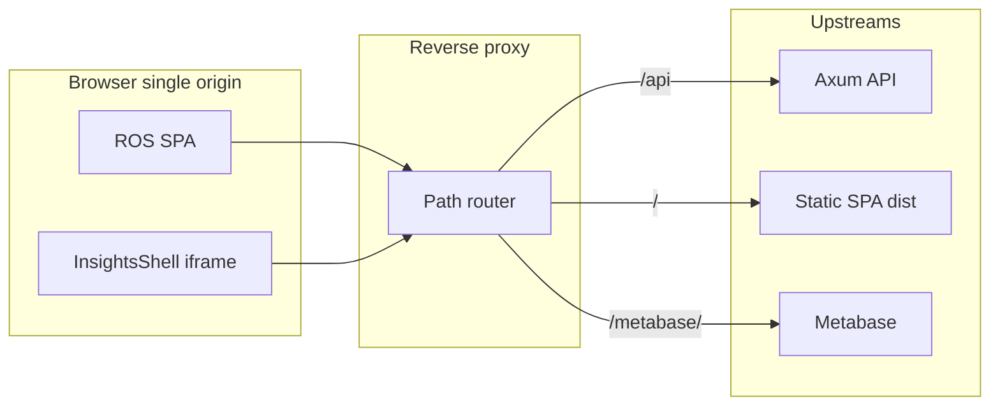
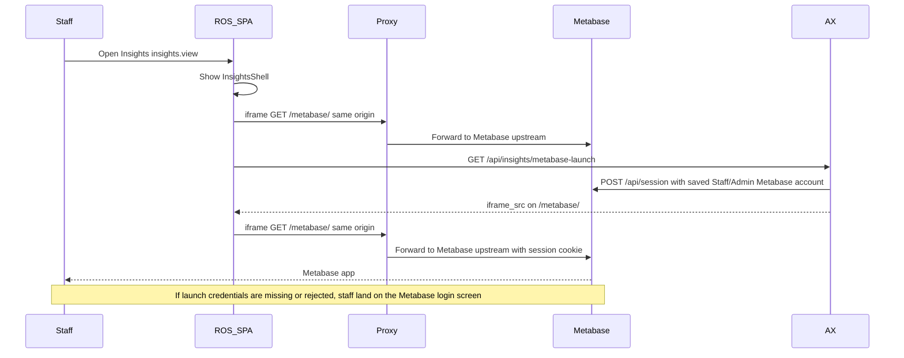

# Plan: Metabase + Insights (same-origin shell, OSS)

**Status:** **Phase 1 shipped** (proxy, Compose, `InsightsShell`, Staff **Commission payouts**). **Phase 2 shipped:** migrations **`90_reporting_insights.sql`** + **`96_reporting_business_day_geo_loyalty.sql`** (`reporting.*` views including business-day totals, customer geo, staff names, loyalty views; **`metabase_ro`**), **Settings → Insights** (`insights_config`), optional **JWT handoff** (`RIVERSIDE_METABASE_JWT_SECRET` + Metabase JWT auth — usually paid). Further views + catalog sync remain incremental. This document stays the architecture + ops runbook.

**Summary:** Self-hosted OSS [metabase/metabase](https://github.com/metabase/metabase) is the **only** analytics UI: the sidebar keeps the label **Insights**, but choosing it opens an **Insights shell** (same pattern as [WeddingShell](../client/src/components/layout/WeddingShell.tsx))—thin Riverside chrome and a **full-viewport iframe** pointing at **Metabase’s full app** on a **same-origin** path (e.g. `/metabase/`) via a **reverse proxy**. OSS stations should use Riverside's saved shared-auth launcher: Admin staff launch with the saved Admin Metabase account and other staff launch with the saved Staff Metabase account. Paid Metabase stations can instead enable **JWT handoff** in **Settings → Insights** with a matching Metabase JWT signing string. **Commission payout** finalization (ledger + finalize) lives under **Staff → Commission payouts**, separate from **Staff → Commission** (category rates). Phase 2 baseline: **`reporting.*` views** + **`metabase_ro`**, **Settings** policy fields. Staff manual: **`client/src/assets/docs/insights-manual.md`** (Help Center) and **`docs/staff/insights-back-office.md`**.

**Deprecated as primary UX:** Static JWT embedding (`GET /api/insights/metabase-embed`, `#theme=night`, single-dashboard-only) is **not** the target integration. An optional appendix below records that pattern only if a future need arises (e.g. a public kiosk dashboard).

---

## Implementation checklist (high level)

| Phase | Item | State |
|-------|------|--------|
| 1 | Reverse proxy: Axum **`metabase_proxy`**, [DEVELOPER.md](../DEVELOPER.md) §3c, [METABASE_REPORTING.md](./METABASE_REPORTING.md) | Done |
| 1 | Docker Compose: **metabase** + **metabase-db**, healthchecks, start with **`docker compose up -d`** ([docker-compose.yml](../docker-compose.yml)) | Done |
| 1 | **Insights shell:** [App.tsx](../client/src/App.tsx) **`insightsMode`** + [InsightsShell.tsx](../client/src/components/layout/InsightsShell.tsx) | Done |
| 1 | **Sidebar:** [Sidebar.tsx](../client/src/components/layout/Sidebar.tsx) — **Insights** has **no** subsections | Done |
| 1 | **Staff → Commission payouts:** [CommissionPayoutsPanel.tsx](../client/src/components/staff/CommissionPayoutsPanel.tsx), [StaffWorkspace.tsx](../client/src/components/staff/StaffWorkspace.tsx), **`SIDEBAR_SUB_SECTION_PERMISSIONS_ALL`** in [BackofficeAuthContext.tsx](../client/src/context/BackofficeAuthContext.tsx) | Done |
| 1 | Dev: [vite.config.ts](../client/vite.config.ts) **`/metabase`** proxy | Done |
| 1 | [STAFF_PERMISSIONS.md](./STAFF_PERMISSIONS.md), staff + in-app **insights-manual** | Done |
| 1 | Retire native Insights workspace (removed: `InsightsWorkspace.tsx`, `HistoricalReporting.tsx` under former `client/src/components/insights/`) | Done |
| 2 | Reporting views + `metabase_ro` ([`90`](../migrations/legacy_prelaunch_history/90_reporting_insights.sql) + [`96`](../migrations/legacy_prelaunch_history/96_reporting_business_day_geo_loyalty.sql)), Settings `insights_config`, JWT launch ([`insights.rs`](../server/src/api/insights.rs)) | Done (extend views + catalog as needed) |
| 2 | More `reporting.*` views, [AI_REPORTING_DATA_CATALOG.md](./AI_REPORTING_DATA_CATALOG.md) primary = Metabase on views | Ongoing |

---

## 1. Goals and non-goals

**Goals**

- **Metabase-only analytics:** All exploratory reporting and dashboards happen in **Metabase’s own UI** inside an iframe. The legacy Recharts **Insights** workspace has been **removed** from the client.
- **Riverside shell:** Sidebar label **Insights**; entering Insights leaves the normal Back Office layout and shows **InsightsShell** (Wedding Manager–style): minimal top bar + full-height iframe.
- **Same origin:** Browser origin for ROS SPA and Metabase (proxied path) is **identical** (scheme + host + port) so session cookies and framing stay simple.
- **Metabase logins (staff vs admin):** Riverside **`insights.view`** opens the iframe; **sensitive data in Metabase** (margin, cost, private collections) is controlled by the Metabase account used for launch. Recommended: saved **staff-class** and **admin-class** Metabase accounts for OSS, or paid JWT SSO with matching Metabase groups — see **`docs/METABASE_REPORTING.md`** § Operational standard.
- **Commission payouts in Staff:** Payout manager lives under **Staff → Commission payouts**, not under Insights. **Staff → Commission** remains **category commission rates** (`staff.manage_commission`) — do not conflate the two.

**Non-goals (Phase 1)**

- **Per-person SSO** between Riverside and Metabase in the OSS baseline.
- **Automatic** mapping of every Riverside staff member to a distinct Metabase user without ops setup (Metabase **People** and **groups** remain ops-managed; **staff-class vs admin-class** launch accounts are **required** for margin governance per **`METABASE_REPORTING.md`** unless paid JWT SSO is adopted).
- Defining every **reporting view** in SQL (Phase 2).

---

## 2. Alignment with “official reporting API / no bypass”

| Piece | Phase 1 (this delivery) | Phase 2 (`governance-views`) |
|--------|-------------------------|------------------------------|
| **Surface** | Full Metabase UI in Insights shell (iframe, same-origin path) | Same; collections and permissions refined in Metabase |
| **Truth** | Ops may connect Metabase to Postgres with a broad read role until reviewed | `CREATE VIEW reporting_* …`; `metabase_ro` has `SELECT` only on those views (+ minimal safe tables if unavoidable); document in `METABASE_REPORTING.md` + [AI_REPORTING_DATA_CATALOG.md](./AI_REPORTING_DATA_CATALOG.md) |
| **Axum `/api/insights/*`** | **Shrinks** for analytics UI; keep **operational** endpoints still required by product flows (e.g. **commission ledger** + **commission finalize** for Staff → Commission payouts). New KPIs default to **Metabase on views**, not new Recharts tabs | Policy: extend Axum only for POS/permissions/product flows; prefer views as source of truth |

---

## 3. Architecture



**Sequence (first open Insights):**



- **Entering Insights:** Gated by Riverside **`insights.view`** (staff headers / PIN as today). Riverside uses those staff headers only to choose the configured Admin vs Staff Metabase launch account.
- **Iframe `src`:** Prefer a **relative** path (e.g. `/metabase/`) so dev and prod both stay same-origin with the SPA.
- **No embedding secret** required for primary UX (contrast with static JWT embed).

---

## 4. Same-origin reverse proxy

**Definition:** The URL staff type in the browser is a **single origin** (e.g. `https://ros.store.example.com`). The reverse proxy routes:

| Path prefix | Upstream |
|-------------|----------|
| `/api/` | Axum (existing) |
| `/metabase/` | Metabase (strip or preserve prefix per Metabase version docs) |
| `/` | Static SPA (`client/dist`) or Vite in dev |

**Operator responsibilities**

1. Terminate **TLS** at the proxy in production.
2. Forward **`X-Forwarded-Proto`**, **`Host`**, and related headers so Metabase builds correct links. Confirm current [Metabase reverse-proxy / subpath](https://www.metabase.com/docs/latest/installation-and-operation/running-metabase-on-docker) documentation for your version (subpath support and env vars such as site URL / base path evolve by release).
3. Set Metabase **Site URL** (admin settings) to the **public** URL staff use, including path if Metabase is served under **`/metabase/`**.

**Development:** Today Vite often runs on `:5173` and Axum on `:3000`. To keep **one origin** for the iframe during local dev, use **Vite `server.proxy`** (or a small local Caddy/nginx) so the browser only talks to **one host:port** and `/metabase/` proxies to the Metabase container or `localhost:3001`.

**CSP / framing:** Same-origin iframe is **`frame-src 'self'`**-friendly; avoid cross-origin Metabase unless you intentionally widen policy.

---

## 5. Metabase authentication (store accounts)

- **Model:** Two shared Metabase users for OSS: **Admin** and **Staff**. They are stored server-side in encrypted Integration Credentials, never in the client bundle.
- **Flow:** The Insights shell calls **`/api/insights/metabase-launch`**. The server logs into Metabase through **`/api/session`**, sets a same-origin proxied session for **`/metabase/`**, and returns the iframe URL. If saved credentials are missing or rejected, the iframe falls back to the Metabase login page.
- **Tradeoff:** Shared Metabase users do not provide per-person auditability inside Metabase. Riverside still audits access to the Insights launch endpoint. For per-person Metabase identity, use paid JWT SSO or manually managed Metabase users/groups.

---

## 6. Riverside navigation and Staff commission payouts

**Insights**

- Primary sidebar item: **Insights** (tab id `dashboard` may remain in code for minimal churn).
- **Shipped:** [Sidebar.tsx](../client/src/components/layout/Sidebar.tsx) has **no** **Insights** subsections. Clicking **Insights** enters **InsightsShell** (not `AppMainColumn`).
- Optional: notification bell / theme controls aligned with [WeddingShell](../client/src/components/layout/WeddingShell.tsx).

**Staff → Commission (existing)**

- Subsection **`commission`**: fixed SPIFFs and combo incentives, permission **`staff.manage_commission`**.

**Staff → Commission reports (new)**

- Subsection id: **`commission-payouts`**, label: **Commission reports**.
- **Visibility:** Subsection visible when the staff member has **`insights.view`**.
- **API:** Continue using [server/src/api/insights.rs](../server/src/api/insights.rs): **commission ledger** requires **`insights.view`**. Riverside OS tracks and reports commissions; it does not finalize payouts.
- **UI (shipped):** [CommissionPayoutsPanel.tsx](../client/src/components/staff/CommissionPayoutsPanel.tsx) in **Staff → Commission payouts** (`activeSection === "commission-payouts"`).
- Remove **`dashboard:payouts`** from [BackofficeAuthContext.tsx](../client/src/context/BackofficeAuthContext.tsx) once Insights no longer exposes Payouts.

---

## 7. Metabase operator checklist (first-time setup)

Use current [Metabase installation](https://www.metabase.com/docs/latest/installation-and-operation/installing-metabase) / Docker docs; OSS image tags match [GitHub releases](https://github.com/metabase/metabase).

1. **Run Metabase** (Compose service or separate host); provision **Metabase application database** (Postgres recommended for prod; dev may use H2 only if acceptable).
2. **Reverse proxy:** Expose Metabase under the **same origin** as ROS at the chosen path (e.g. `/metabase/`).
3. **Admin setup wizard:** Create the **store** Metabase user (and optional separate Metabase admin for ops). Set **Site URL** to the URL browsers use (including path prefix if applicable). For Tailscale, use stable **MagicDNS** or hostname.
4. **Add database:** Postgres → `riverside_os` (from Metabase’s network: e.g. `host.docker.internal:5433` for local Compose per [docker-compose.yml](../docker-compose.yml) host port **5433**).
   - **Phase 1:** Dedicated DB user is ideal even before views (see §10).
5. **Smoke test:** Log in as the store user, run a simple question or dashboard.
6. **License awareness:** Read [LICENSE.txt](https://github.com/metabase/metabase/blob/master/LICENSE.txt) for OSS use (not legal advice).

**Not required for primary UX:** Enabling **static embedding** or copying an embedding secret (only needed for the optional appendix pattern).

---

## 8. Docker Compose (suggested shape)

Add optional services to [docker-compose.yml](../docker-compose.yml):

- **`metabase-db`:** Postgres for Metabase **metadata** only (separate volume from `riverside_pgdata`).
- **`metabase`:** `metabase/metabase:<pin>` with `MB_DB_TYPE=postgres`, `MB_DB_*` → `metabase-db`.
- **Publish:** Either **internal-only** port (proxy on host reaches Metabase) or a dev port (e.g. **3001**) with Vite/nginx proxying `/metabase/` → that port.

**Do not** store Metabase application data in the `riverside_os` database.

---

## 9. Client implementation (primary path)

### 9.1 InsightsShell

- New component (e.g. `client/src/components/layout/InsightsShell.tsx`) modeled on [WeddingShell.tsx](../client/src/components/layout/WeddingShell.tsx): `h-[100dvh]`, thin header (“Riverside OS” + **Insights**), **Back to Back Office**, `min-h-0 flex-1` body containing **one iframe**.
- **`iframe`:** `src={`${import.meta.env.BASE_URL}metabase/`}` or `VITE_METABASE_PUBLIC_PATH` defaulting to `/metabase/` — must resolve same-origin in dev and prod.
- **`title`:** e.g. `title="Insights (Metabase)"` for accessibility.
- **Loading:** Optional skeleton until `onLoad`; avoid `alert`/`confirm` (project invariant).

### 9.2 App routing

- [App.tsx](../client/src/App.tsx): When user selects **Insights** from sidebar, set **`insightsMode`** (parallel to `weddingMode` / `posMode`) and render **InsightsShell** instead of the default `Sidebar` + `AppMainColumn` tree (same structural switch as weddings).
- Exiting Insights clears `insightsMode` and returns to Back Office.

### 9.3 Permissions

- Hide or disable **Insights** sidebar entry for staff without **`insights.view`** (match existing tab gating).

### 9.4 Retire native Insights charts

- **Done:** Former `InsightsWorkspace` / `HistoricalReporting` client modules removed; payout UI lives in **CommissionPayoutsPanel**.

---

## 10. Server implementation (primary path)

- **No requirement** for `GET /api/insights/metabase-embed` or JWT embedding for the default product.
- **Keep** commission and other **operational** insight endpoints in [insights.rs](../server/src/api/insights.rs) for Staff payout flows and any remaining APIs documented in [AI_REPORTING_DATA_CATALOG.md](./AI_REPORTING_DATA_CATALOG.md).

---

## 11. Security summary

| Topic | Action |
|--------|--------|
| Metabase login | Shared store credential; ops rotation; Metabase internal permissions |
| Enter Insights | Riverside `insights.view` |
| DB access | Phase 2: `metabase_ro` + `reporting.*` views |
| CSP | `frame-src 'self'` when iframe is same-origin |
| HTTPS | TLS at proxy for production |

---

## 12. Testing and verification matrix

| Case | Expected |
|------|----------|
| Staff with `insights.view`, proxy + Metabase up | InsightsShell opens; iframe loads `/metabase/` |
| Metabase login | Store user can log in; session persists on reload |
| Staff without `insights.view` | Cannot open Insights (or sees no access) |
| Staff with `insights.view` | Staff → **Commission reports** visible; ledger loads |
| Staff without `insights.view` | Subsection hidden or API denied |
| **Commission** vs **Commission reports** | Incentive setup under Commission; tracking/reporting under Commission reports |
| `npm run check:server` | Clean after any Rust changes |

**Optional E2E:** Guard with `E2E_METABASE=1` if CI lacks Metabase; navigate Insights shell + Staff commission payouts.

---

## 13. Phase 2 — Governance (`governance-views`)

### 13.1 Postgres reporting views

- New migration under [migrations/](../migrations/): `NN_reporting_views.sql`.
- `CREATE SCHEMA IF NOT EXISTS reporting;` then `CREATE VIEW reporting.*` — document grain and date semantics.

### 13.2 Read-only role

```sql
CREATE ROLE metabase_ro LOGIN PASSWORD '...';
GRANT CONNECT ON DATABASE riverside_os TO metabase_ro;
GRANT USAGE ON SCHEMA reporting TO metabase_ro;
GRANT SELECT ON ALL TABLES IN SCHEMA reporting TO metabase_ro;
ALTER DEFAULT PRIVILEGES IN SCHEMA reporting GRANT SELECT ON TABLES TO metabase_ro;
```

### 13.3 Metabase app permissions (future plan — OSS only)

**Policy:** No Metabase Pro/Enterprise and no JWT SSO; enforce tiers in Metabase only. Full write-up: **[METABASE_REPORTING.md — Future plan: OSS access model](./METABASE_REPORTING.md#future-plan-oss-access-model-staff-vs-admin)**.

- **Groups:** e.g. **Reporting – Staff** (curated access) vs **Reporting – Admin** / **Administrators** (full).
- **Collections:** **Staff / Approved** (view-only for staff); admin-only collections for exploratory work.
- **Data + SQL:** Limit staff self-serve; restrict **native/SQL** for staff if they must not query all of **`reporting.*`** ad hoc.
- **Postgres:** Still one **`metabase_ro`** connection; network: LAN / Tailscale as appropriate.

### 13.4 Documentation

- [METABASE_REPORTING.md](./METABASE_REPORTING.md) when shipped.
- [AI_REPORTING_DATA_CATALOG.md](./AI_REPORTING_DATA_CATALOG.md): **Primary exploration:** Metabase on `reporting.*` views. **Axum `/api/insights/*`:** operational endpoints (e.g. commission ledger/finalize for Staff), not a parallel full analytics UI.

---

## 14. Troubleshooting

| Symptom | Likely cause | Fix |
|---------|----------------|-----|
| Blank iframe | Proxy path wrong; Metabase down; Site URL mismatch | Check proxy logs; Metabase admin Site URL |
| Login loop or broken links in iframe | `X-Forwarded-*` / wrong Site URL | Fix proxy headers and Metabase site URL |
| 404 on `/metabase/` | Upstream path strip misconfigured | Align proxy with Metabase subpath docs |
| Metabase slow | Raw wide tables | Phase 2 views + indexes |
| Cookie not sticking | Different origin than thought | Verify single scheme/host/port in address bar |

---

## 15. Rollback

- Remove `insightsMode` / InsightsShell; restore prior Insights navigation if needed.
- Revert Staff subsection and permission map if required.
- Stop Metabase services; remove proxy location. No DB migration required for Metabase metadata beyond optional Phase 2 reporting schema.

---

## 16. Implementation order (dependencies)

1. **ops-metabase** — Compose + proxy + Site URL smoke test (browser same origin).
2. **insights-shell** — `InsightsShell` + `App.tsx` mode switch + sidebar cleanup (no Insights subsections).
3. **staff-commission-payouts** — New Staff subsection, extract UI, remove `dashboard:payouts`, update [STAFF_PERMISSIONS.md](./STAFF_PERMISSIONS.md).
4. **retire-native-insights** — **Done** (client charts removed; operational **`/api/insights/*`** retained).
5. **verify** — Matrix above + `check:server`.
6. **governance-views** — Separate PR acceptable.

---

## 17. Files touched (expected)

| Area | Files |
|------|--------|
| Proxy / ops | [server/src/api/metabase_proxy.rs](../server/src/api/metabase_proxy.rs), production nginx/Caddy/Traefik config (repo or runbook), [docker-compose.yml](../docker-compose.yml), [DEVELOPER.md](../DEVELOPER.md), [METABASE_REPORTING.md](./METABASE_REPORTING.md) |
| Client | [App.tsx](../client/src/App.tsx), [InsightsShell.tsx](../client/src/components/layout/InsightsShell.tsx), [Sidebar.tsx](../client/src/components/layout/Sidebar.tsx), [BackofficeAuthContext.tsx](../client/src/context/BackofficeAuthContext.tsx), [StaffWorkspace.tsx](../client/src/components/staff/StaffWorkspace.tsx), [CommissionPayoutsPanel.tsx](../client/src/components/staff/CommissionPayoutsPanel.tsx), [insights-manual.md](../client/src/assets/docs/insights-manual.md), [vite.config.ts](../client/vite.config.ts) proxy |
| Server | [insights.rs](../server/src/api/insights.rs) (operational routes), [metabase_proxy.rs](../server/src/api/metabase_proxy.rs) — no JWT embed endpoint required for primary UX |
| Docs | [STAFF_PERMISSIONS.md](./STAFF_PERMISSIONS.md), [README.md](../README.md) catalog line if summary changes, [AI_REPORTING_DATA_CATALOG.md](./AI_REPORTING_DATA_CATALOG.md) (Phase 2) |
| Phase 2 | [migrations/NN_reporting_views.sql](../migrations/) |

---

## 18. Out of scope recap (updated)

- Riverside→Metabase **SSO** (Phase 1).
- **Static JWT** dashboard embed as the main Insights experience (see appendix).
- Rebuilding every legacy chart in React after Metabase ships.

---

## Appendix A — Optional: static JWT embed (not primary UX)

If a future need requires a **single** embedded dashboard without full Metabase chrome (kiosk, etc.), you can add:

- Metabase: enable **static embedding**, embedding secret, published dashboard.
- Server: `GET /api/insights/metabase-embed` returning `{ path, site_url }` with HS256 JWT ([Metabase static embedding](https://github.com/metabase/metabase/blob/master/docs/embedding/static-embedding.md)).
- Client: separate iframe URL built from JWT path + optional `#theme=night` / `#theme=light`.

**Secrets:** embedding secret **server-only**; never in Vite bundle. Read [LICENSE-EMBEDDING.txt](https://github.com/metabase/metabase/blob/master/LICENSE-EMBEDDING.txt) (not legal advice).

This path is **orthogonal** to the same-origin full-app shell and is **not** required for the Insights product described in sections 1–17.
