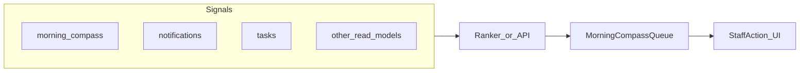

# Plan: Predictive Morning Compass (action-first staff queue)

**Audience:** Product and engineering planning **register** and **Operations** morning workflows.

**Status:** **Phase 1 shipped (client ranker)** — [`client/src/lib/morningCompassQueue.ts`](../client/src/lib/morningCompassQueue.ts) builds a ranked **Suggested next** queue from morning-compass wedding rows, open tasks, and inbox preview; **Register dashboard** ([`RegisterDashboard.tsx`](../client/src/components/pos/RegisterDashboard.tsx)) and **Operations → Morning** ([`OperationalHome.tsx`](../client/src/components/operations/OperationalHome.tsx)) render it with deep links (member drawer, task drawer, notification inbox). Server-side suggestion API remains optional for a later phase.

**Current baseline:** Register default tab **Dashboard** and Operations **Morning** widgets already aggregate **weather**, **attributed sales**, **session tenders**, **wedding pulse** (`GET /api/weddings/morning-compass`), **tasks**, and **notifications** — see **[`docs/REGISTER_DASHBOARD.md`](./REGISTER_DASHBOARD.md)**. **Today’s floor team** comes from schedule logic (`today_floor_staff`) — **[`docs/STAFF_SCHEDULE_AND_CALENDAR.md`](./STAFF_SCHEDULE_AND_CALENDAR.md)**. Notification bundles and morning digest semantics — **[`docs/PLAN_NOTIFICATION_CENTER.md`](./PLAN_NOTIFICATION_CENTER.md)** and **[`docs/NOTIFICATION_GENERATORS_AND_OPS.md`](./NOTIFICATION_GENERATORS_AND_OPS.md)**.

---

## 1. Product goal

Evolve from **informational tiles** (“here is context”) to an **action-ordered queue** (“do this first”):

- Prioritized items for **floor** and **ops**: callbacks, pickups ready, parties or orders at risk, **review** follow-ups (see **[`docs/PLAN_PODIUM_REVIEWS.md`](./PLAN_PODIUM_REVIEWS.md)**), **tasks** due soon, integration or backup nudges, and other signals already present in ROS or notifications.
- Each item should invite a **clear next step**: open a **drawer**, **task**, **customer**, **wedding**, or **notification** deep link (reuse **[`client/src/lib/notificationDeepLink.ts`](../client/src/lib/notificationDeepLink.ts)** patterns where applicable).

The Compass should feel like a **shift coach**, not only a bulletin board.

---

## 2. Design principles

- **RBAC:** Reuse **existing** permission keys; avoid proliferating new keys unless a slice truly needs a new gate. Server must enforce what each role may **see** and **act** on.
- **Surface modes:** **POS-Core** (register dashboard) stays **dense** and fast; **Back Office** Operations home can show **more context** and copy. Same underlying signals may **rank** or **filter** differently per surface.
- **UX invariants:** No browser **`alert`**, **`confirm`**, or **`prompt`** — use **`useToast`**, **`ConfirmationModal`**, and **`PromptModal`** per project rules.
- **No fake intelligence:** “Predictive” here means **ranked, explainable** prioritization from **known signals** (due dates, SLA-style windows, open balances, unread counts). Optional ML is **out of scope** until explicitly chosen.

---

## 3. Architecture sketch (open choice)

Two coarse approaches (not mutually exclusive):

| Approach | Idea | Tradeoff |
|----------|------|----------|
| **Client-side ranker** | Dashboard fetches existing endpoints; a **pure function** orders items by rules + snooze local state | Fast to ship; rules live in one TS module; consistency across devices depends on convention |
| **Server suggestions** | New read API returns **ordered suggestions** + metadata (reason codes, deep links) | Single source of truth for ordering; versioned rules; more backend work |

Either way, **signals** should map to **staff actions** without duplicating business logic in the client beyond presentation and sorting.

---

## 4. Backlog ingredients (non-exhaustive)

- **Prioritization rules** — Document per signal type (urgency, business hours, role).
- **Snooze / dismiss** — Align with notification **archive** and task completion; avoid duplicate “hide” semantics.
- **Deep links** — Customer hub, wedding party, order detail, inbox tab, Operations Reviews.
- **Wedding health** — Extend tiles that already surface risk (e.g. open balances) into **action lines** with links.
- **Operational tests** — Playwright or manual scripts when flows touch register default tab (**[`docs/ROS_UI_CONSISTENCY_PLAN.md`](./ROS_UI_CONSISTENCY_PLAN.md)** Phase 5 baseline).

---

## 5. Related “next level” ideas (same era, separate scopes)

Short bullets — **do not** block Compass on these, but they reinforce the same “closure” story:

- **Clienteling closure** — Inbox + Relationship Hub + tasks so **every** customer touch has a place to **finish** work (full Podium **two-way CRM** remains its own program — **[`docs/PLAN_PODIUM_SMS_INTEGRATION.md`](./PLAN_PODIUM_SMS_INTEGRATION.md)**).
- **Reputation loop** — Review invites + Operations **Reviews** + optional follow-up **tasks** — **[`docs/PLAN_PODIUM_REVIEWS.md`](./PLAN_PODIUM_REVIEWS.md)**.

---

## Related docs

| Doc | Role |
|-----|------|
| [`REGISTER_DASHBOARD.md`](./REGISTER_DASHBOARD.md) | Current POS dashboard blocks and APIs |
| [`STAFF_SCHEDULE_AND_CALENDAR.md`](./STAFF_SCHEDULE_AND_CALENDAR.md) | `today_floor_staff` |
| [`PLAN_NOTIFICATION_CENTER.md`](./PLAN_NOTIFICATION_CENTER.md) | Inbox, bundles, digest |
| [`AI_REPORTING_DATA_CATALOG.md`](./AI_REPORTING_DATA_CATALOG.md) | Morning compass / activity APIs for reporting consumers |
