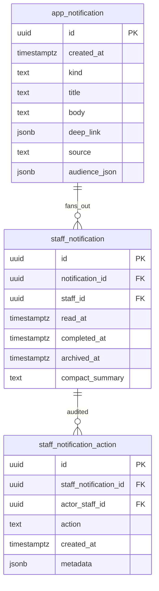

# Plan: App-wide Notification Center (Riverside OS)

**Status:** **Completed / shipped foundation.** This remains the architecture and historical implementation plan for notifications; current operational behavior is summarized in **[`NOTIFICATION_GENERATORS_AND_OPS.md`](./NOTIFICATION_GENERATORS_AND_OPS.md)**. Start with **[`CUSTOMER_MESSAGING_AND_NOTIFICATIONS.md`](./CUSTOMER_MESSAGING_AND_NOTIFICATIONS.md)** for the full messaging and notification documentation map.

Version-controlled implementation plan for a **PostgreSQL-backed** notification system: per-staff read/completed state, audit logging, **bell + slideout** (`DetailDrawer`) on **Back Office**, **POS (`PosShell`)**, and **Wedding** shells, **admin broadcast** with audience targeting, **retention** (archive after 30 days, browse history up to 1 year), **system event generators** (orders, weddings, pickup, alterations, QBO, procurement/PO), and **shared wiring** with Podium messaging per **[`PLAN_SHIPPO_PODIUM_NOTIFICATIONS_AND_REVIEWS.md`](./PLAN_SHIPPO_PODIUM_NOTIFICATIONS_AND_REVIEWS.md)** ( **`read-all`**, **`messaging_unread_nudge`** ).

**Related:** **Cross-cutting tracker** — [`PLAN_SHIPPO_PODIUM_NOTIFICATIONS_AND_REVIEWS.md`](./PLAN_SHIPPO_PODIUM_NOTIFICATIONS_AND_REVIEWS.md). Podium env + webhook deep spec — [`PLAN_PODIUM_SMS_INTEGRATION.md`](./PLAN_PODIUM_SMS_INTEGRATION.md). **Ops quick reference** (migrations **60–61**, env vars, code paths, deep links): [`NOTIFICATION_GENERATORS_AND_OPS.md`](./NOTIFICATION_GENERATORS_AND_OPS.md).

## Implementation checklist

- [x] **Schema:** `app_notification`, `staff_notification`, `staff_notification_action` (+ indexes, `dedupe_key`, retention columns) — **`migrations/51_app_notifications.sql`**; catalog flags + digest ledger — **`migrations/52_track_low_stock_morning_digest.sql`**
- [x] **Server:** `server/src/logic/notifications.rs` + `server/src/api/notifications.rs` (list, unread-count, read, complete, **archive** / user dismiss, broadcast, fan-out); register router; permission seeds
- [x] **Retention job:** archive at 30d (hours via **`RIVERSIDE_NOTIFICATION_ARCHIVE_HOURS`**), history via **`include_archived`**, purge via **`RIVERSIDE_NOTIFICATION_PURGE_HOURS`**
- [x] **Client:** `NotificationCenterContext` + drawer + bell; mount in `Header`, `PosShell`, `WeddingShell`; deep-link navigation from `App` (**`handleNotificationNavigate`**). **Compact inbox:** list shows kind + title only; **admin broadcast** expands for full body + sender; **`notification_bundle`** rows expand to a scrollable list (each line navigates via its nested `deep_link`); other routable notifications **tap once** to open the target workspace (**`notificationBundle.ts`**, **`notificationDeepLink.ts`**). Task reminders from bundles use **`staff_tasks`** + **`instance_id`** → Staff → Tasks checklist drawer.
- [x] **Broadcast UI:** composer in drawer for **`notifications.broadcast`** (all staff, admins only); full custom staff-ID audience available on API (`audience.mode` = `staff_ids`)
- [x] **Generators (hourly):** **Bundled** high-volume sweeps (`*_bundle` **`app_notification.kind`**, **`notification_bundle`** `deep_link`, **`upsert_app_notification_by_dedupe`**) replace legacy one-row-per-entity kinds (those rows are **`DELETE`d** on sweep): **`wedding_soon_bundle`**, **`order_due_stale_bundle`**, **`pickup_stale_bundle`** (open, balance cleared, unfulfilled lines 7+d), **`alteration_due_bundle`**, six **`po_*_bundle`** rules (overdue standard + direct_invoice, unlabeled, partial stale, draft stale, submitted missing expected_at), **`task_due_soon_bundle`** (per assignee + store-local day; open instances with **`due_date`** today or tomorrow — migration **56**, `run_task_due_reminders`), **`integration_health_failed_bundle`**, **`counterpoint_alerts_bundle`** (when **`COUNTERPOINT_SYNC_TOKEN`** is set), **`appointment_soon_bundle`**, **`negative_available_stock_bundle`**, **`gift_card_expiring_soon_bundle`**, **`special_order_ready_to_stage_bundle`**. **Unbundled / digest-style:** **`qbo_sync_failed`** (event-driven + hourly sweep), **`pin_failure_digest`**, **`after_hours_access_digest`**. **Backup health** (admin-only): **`backup_admin_local_failed`**, **`backup_admin_cloud_failed`**, **`backup_admin_past_due`** — migration **`60`**, `run_backup_admin_notifications`; deep link **`settings` → `backups`**. Migration **`61`**: **`integration_alert_state`** + **`staff_auth_failure_event`**. Event-driven emitters in `notifications.rs`: register cash discrepancy, catalog import rows skipped, customer merge, order fully fulfilled, commission finalize failed — **`handleNotificationNavigate`** in `App.tsx`. **Checkout (migration 68):** **`on_account_rms`** / **`on_account_rms90`** → **`rms_r2s_charge`** fan-out — **[`POS_PARKED_SALES_AND_RMS_CHARGES.md`](./POS_PARKED_SALES_AND_RMS_CHARGES.md)**.
- [x] **Admin morning digest** (once per **store-local** calendar day, after configurable hour): **bundled** **`morning_low_stock_bundle`**, **`morning_wedding_today_bundle`**, **`morning_po_expected_bundle`**, **`morning_alteration_due_bundle`** (each is one inbox row with **`notification_bundle`** payload + per-item `deep_link`s), plus a single **`morning_refund_queue`** summary row. Low-stock eligibility unchanged: template + variant **`track_low_stock`**, **`reorder_point > 0`**, available = `stock_on_hand - reserved_stock` ≤ reorder. Ledger: **`morning_digest_ledger`** + timezone from **`ReceiptConfig.timezone`**; env **`RIVERSIDE_MORNING_DIGEST_HOUR_LOCAL`** (default **7**). Migration **`52_track_low_stock_morning_digest.sql`**. Legacy per-entity kinds (`morning_low_stock`, etc.) are **deleted** when the bundled job runs.
- [x] **Podium + inbox:** **71** webhook ledger; **99**+ **`podium_inbound`** → **`podium_sms_inbound`** / **`podium_email_inbound`** + CRM threads, fan-out to staff, **`read-all`**, **18h nudge** (ingest off with **`RIVERSIDE_PODIUM_INBOUND_DISABLED`**) — **[`PLAN_SHIPPO_PODIUM_NOTIFICATIONS_AND_REVIEWS.md`](./PLAN_SHIPPO_PODIUM_NOTIFICATIONS_AND_REVIEWS.md)**. **`GET /api/notifications`** supports **`kinds`** for filtered views.
- [x] **Docs:** `DEVELOPER.md`, `docs/STAFF_PERMISSIONS.md`, `AGENTS.md` file map

---

## Current state

- **Shipped:** bell + [`DetailDrawer`](../client/src/components/layout/DetailDrawer.tsx) on Back Office ([`GlobalTopBar.tsx`](../client/src/components/layout/GlobalTopBar.tsx) inside the `AppMainColumn` shell), [`PosShell.tsx`](../client/src/components/layout/PosShell.tsx), [`WeddingShell.tsx`](../client/src/components/layout/WeddingShell.tsx); provider [`NotificationCenterContext.tsx`](../client/src/context/NotificationCenterContext.tsx).
- **Staff identity**: [`BackofficeAuthContext`](../client/src/context/BackofficeAuthContext.tsx) + headers; POS has `cashierCode` / session; [`staff`](../migrations/01_initial_schema.sql) + [`staff_role`](../migrations/17_staff_authority.sql) (`admin` | `salesperson` | `sales_support`).
- **Audit precedent**: [`staff_access_log`](../migrations/17_staff_authority.sql) + [`log_staff_access`](../server/src/auth/pins.rs).
- **Deep links precedent**: `ordersDeepLinkOrderId` + `setActiveTab("orders")` in `App.tsx`; `navigateWedding(partyId)` / `pendingWmPartyId`.

## Architecture (data)

**Core idea:** one canonical **notification** row (what happened + payload for navigation), many **per-staff rows** (inbox + state), append-only **action log** (who read/completed).

- **`app_notification`**: `kind` includes **event-driven / single-row** emitters (e.g. `admin_broadcast`, `qbo_sync_failed`, `rms_r2s_charge`, `register_cash_discrepancy`, …) and **bundled** hourly/morning kinds with suffix **`_bundle`** (e.g. **`morning_low_stock_bundle`**, **`wedding_soon_bundle`**, **`order_due_stale_bundle`**, **`task_due_soon_bundle`**, **`negative_available_stock_bundle`**, **`counterpoint_alerts_bundle`**, six **`po_*_bundle`** rules, …). **`morning_refund_queue`**, **`pin_failure_digest`**, **`after_hours_access_digest`**, and **backup admin** kinds stay **one row per signal** where appropriate. **Legacy** per-entity kinds (`morning_low_stock`, `order_due`, `appointment_soon`, …) are no longer inserted; generators **`DELETE`** those rows when the bundled job runs so old inboxes collapse after the next hourly pass.
- **`deep_link`:** Routable shapes include `order`, `wedding_party`, `alteration`, `purchase_order`, `qbo_staging`, **`qbo`** + `section`, `inventory` + `section` + optional `product_id`, **`settings`** + **`section`** (`backups`, `general`, `profile`, `bug-reports`, `integrations`), **`dashboard`** + `subsection`, **`register`**, **`home`** + `subsection`, **`customers`** + `subsection`, **`appointments`**, **`staff`** + `section`, **`staff_tasks`** + **`instance_id`** (checklist drawer), **`gift-cards`**, and **`notification_bundle`** (`bundle_kind`, **`items`**: `{ title, subtitle, deep_link }` per row). **`upsert_app_notification_by_dedupe`** refreshes title/body/`deep_link` for the same **`dedupe_key`** (store-local day or assignee+day for tasks).
- **`staff_notification`**: one row per (notification × staff). `read_at` / `completed_at` / user **`archived_at`** logged via **`staff_notification_action`** (`read`, `completed`, **`archived`** for **Dismiss**).
- **Retention:** archive `staff_notification` after **30 days** (e.g. set `archived_at`, compact body); default list API excludes archived; **history** includes archived for **365 days**; purge older per policy.

**Audience model:** `audience_json` e.g. `{ "mode": "roles", "roles": ["admin"] }`, `all_staff`, `staff_ids`, `permission` key, or salesperson-scoped linkage for “only their” rows. Fan-out creates **N** `staff_notification` rows; **`dedupe_key`** prevents duplicate fan-out.

**RBAC** (new seeds + [`permissions.rs`](../server/src/auth/permissions.rs)):

- `notifications.view` — inbox read/complete (default for active staff / BO auth as product chooses).
- `notifications.broadcast` — broadcast composer (often admin-only; may alias `settings.admin` for v1).
- **`procurement.view`** (existing) — gate PO notification fan-out if not admin-only.

## Architecture (API)

New [`server/src/api/notifications.rs`](../server/src/api/notifications.rs) (register in [`mod.rs`](../server/src/api/mod.rs)):

| Endpoint | Purpose |
|----------|---------|
| `GET /api/notifications` | Inbox (+ optional `include_archived`, `kinds`) |
| `GET /api/notifications/unread-count` | Bell / SMS badge |
| `POST /api/notifications/{staff_notification_id}/read` | Set `read_at` + action log |
| `POST /api/notifications/{staff_notification_id}/complete` | Set `completed_at` (+ `read_at` if null) + action log |
| `POST /api/notifications/{staff_notification_id}/archive` | User **Dismiss**: set `archived_at` + compact summary + action log **`archived`** |
| `POST /api/notifications/broadcast` | Admin broadcast + fan-out |

Logic: [`server/src/logic/notifications.rs`](../server/src/logic/notifications.rs) — insert + dedupe, **`upsert_app_notification_by_dedupe`** (bundles), **`delete_app_notification_by_dedupe`**, audience helpers, archive/purge, event emitters. Middleware: existing staff headers ([`middleware/mod.rs`](../server/src/middleware/mod.rs)).

## Architecture (client)

- **`NotificationCenterProvider`** ([`client/src/context/NotificationCenterContext.tsx`](../client/src/context/NotificationCenterContext.tsx) — new): unread count, refresh, open/close, mark read/complete, navigate callback from `App`.
- **`NotificationCenterBell`** + **`NotificationCenterDrawer`** (wraps `DetailDrawer`): Inbox / History; **compact** rows (kind + title); **broadcast** tap expands full message; **bundle** tap expands item list; routable single-row tap → navigate (**`notificationDeepLink.ts`**). **Inbox** **Dismiss** → **`POST /.../archive`**. **[`RegisterDashboard`](../client/src/components/pos/RegisterDashboard.tsx)** — short preview (“N items — open inbox to expand” for bundles) + Read / Complete / Dismiss.
- **`BroadcastComposer`**: when `notifications.broadcast` (or admin).

**Mount points:** [`GlobalTopBar.tsx`](../client/src/components/layout/GlobalTopBar.tsx), [`PosShell.tsx`](../client/src/components/layout/PosShell.tsx), [`WeddingShell.tsx`](../client/src/components/layout/WeddingShell.tsx).

**Navigation contract:** `handleNotificationNavigate` in [`App.tsx`](../client/src/App.tsx) — tab switch, wedding mode, POS mode, `ordersDeepLinkOrderId`, `pendingWmPartyId`, **alterations**, **PO / procurement**, **QBO staging**, **settings** (`profile` / `general` / `backups`), **inventory list + product hub**, **`staff_tasks`** + **`instance_id`** (Staff → Tasks drawer via **`StaffTasksPanel`** props through **`AppMainColumn`** / **`StaffWorkspace`**).

## System event generators (phased)

Jobs in [`server/src/logic/notifications_jobs.rs`](../server/src/logic/notifications_jobs.rs): **hourly** tokio interval in [`main.rs`](../server/src/main.rs) (archive/purge + generators below) + **event-driven** hooks where appropriate (e.g. QBO failure immediately after `qbo_sync_logs` → `failed`).

### Admin morning digest (**admin** staff only)

Runs on the **first hourly tick** on or after **`RIVERSIDE_MORNING_DIGEST_HOUR_LOCAL`** (0–23, default **7**) in the store’s **`ReceiptConfig.timezone`**. Inserts one row into **`morning_digest_ledger`** for that **local calendar date** (`ON CONFLICT DO NOTHING`); if the day was already claimed, the whole morning block is skipped.

| Kind | Dedupe (per store-local day) | Payload |
|------|------------------------------|---------|
| `morning_low_stock_bundle` | `morning_low_stock_bundle:{yyyy-mm-dd}` | **`notification_bundle`** / `bundle_kind` **`morning_low_stock`**; each **`items[]`** row: `inventory` + `product_id` |
| `morning_wedding_today_bundle` | `morning_wedding_today_bundle:{date}` | **`notification_bundle`**; items → `wedding_party` |
| `morning_po_expected_bundle` | `morning_po_expected_bundle:{date}` | **`notification_bundle`**; items → `purchase_order` |
| `morning_alteration_due_bundle` | `morning_alteration_due_bundle:{date}` | **`notification_bundle`**; items → `alteration` |
| `morning_refund_queue` | `morning_refund_queue:{date}` | Single row: `orders` + `subsection=open` (not bundled) |

**Low stock eligibility:** `products.track_low_stock` **and** `product_variants.track_low_stock` (both default **false**; toggled in **Product hub** General + Matrix in Back Office), `reorder_point > 0`, available ≤ reorder.

**Catalog:** migration **`52_track_low_stock_morning_digest.sql`** (`products.track_low_stock`, `product_variants.track_low_stock`, `morning_digest_ledger`). API: `PATCH /api/products/{id}/model`, `PATCH /api/products/variants/{id}/pricing` with `track_low_stock`; create product body optional `track_low_stock`.

### Core retail / operations

| Rule | Audience | Data |
|------|----------|------|
| Wedding soon (e.g. ≤14d) | Admin: all; Salesperson: attributed parties | `wedding_parties.event_date` |
| Orders coming due | Admin + role-wide; Salesperson: `order_items.salesperson_id` | `orders` / lines (define “due”) |
| Pickup ready 7+d, not picked up | Admin + cashier-facing roles | **Gap:** add `orders.pickup_ready_at` or line-level signal |

### Alteration due

| Rule | Audience | Data |
|------|----------|------|
| Due soon / overdue | Admin + cashier-facing: all open due; Salesperson: customers attributed via `linked_order_id` → order lines | `alteration_orders.due_at`, status `intake` / `in_work` |

Deep link: `alteration` + `alteration_id`. **Hourly bundle:** kind **`alteration_due_bundle`**, dedupe **`alteration_due_bundle:{yyyy-mm-dd}`**, **`notification_bundle`** with per-alteration items (legacy **`alteration_due`** rows deleted on sweep).

### QBO sync failures (admin)

Event-driven after [`qbo.rs`](../server/src/api/qbo.rs) sets `qbo_sync_logs.status = failed`; optional nightly sweep. Dedupe: `qbo_failed:{sync_log_id}`. Deep link: `qbo_staging` + `sync_log_id`.

### Procurement / PO (admin-first)

Sources: [`purchase_orders`](../migrations/01_initial_schema.sql), lines, [`receiving_events`](../migrations/01_initial_schema.sql), [`product_variants.shelf_labeled_at`](../migrations/12_shelf_label_tracking.sql), [`inventory_transactions`](../migrations/01_initial_schema.sql).

| Bundle kind (per store-local day) | Rule summary |
|-----------------------------------|--------------|
| `po_overdue_receive_bundle` | Standard PO: `expected_at` + 3d, not fully received; excludes closed/cancelled/draft |
| `po_direct_invoice_overdue_bundle` | `direct_invoice` branch, same overdue heuristic |
| `po_received_unlabeled_bundle` | Recent receipts with unlabeled SKUs |
| `po_partial_receive_stale_bundle` | Partially received, idle 14+ days |
| `po_draft_stale_bundle` | Draft older than 21 days |
| `po_submitted_no_expected_date_bundle` | Submitted 7+ days without `expected_at` |

Each upserts one row; **`items[]`** carry `purchase_order` + `po_id`. Legacy per-PO kinds are removed on sweep. **`po_submitted_no_expected_date_bundle`** rows use dedupe key prefix **`po_submitted_no_expected_bundle`** (historic naming).

**Other hourly bundles (same pattern):** `wedding_soon_bundle`, `order_due_stale_bundle`, `pickup_stale_bundle`, `appointment_soon_bundle`, `integration_health_failed_bundle`, `counterpoint_alerts_bundle`, `gift_card_expiring_soon_bundle`, `special_order_ready_to_stage_bundle`, `negative_available_stock_bundle`. **Tasks:** `task_due_soon_bundle:{assignee_staff_id}:{yyyy-mm-dd}` — prior day’s assignee bundles for that date are deleted then recreated.

### Backlog

Additional “due today” signals (e.g. explicit order promise dates) if added to schema later.

## Integration with Podium SMS

See **[`PLAN_PODIUM_SMS_INTEGRATION.md`](./PLAN_PODIUM_SMS_INTEGRATION.md)**. Inbound SMS creates `app_notification` (`sms_inbound` / `podium_sms`) + same fan-out; **SMS Module** list and **Notification Center** use the **same API** and badge counts; read/complete/audit identical. Optional later: mirror outbound automated SMS as low-priority staff notifications.

## Implementation order

1. Migration (tables, indexes, `dedupe_key`).
2. Rust: models, logic, API, optional `RIVERSIDE_NOTIFICATION_ARCHIVE_HOURS`.
3. Client: provider, drawer, bell; wire all shells.
4. Broadcast API + UI.
5. Generators (pickup timestamp schema if needed; alteration; QBO hook; PO SQL validated against receive code).
6. Podium webhooks: emit notifications; document `kinds` filter.
7. Update `DEVELOPER.md`, `STAFF_PERMISSIONS.md`, `AGENTS.md`; keep Podium plan cross-linked to this doc.

## Risks / decisions

- **Cashier-facing** = `salesperson` + `sales_support` (+ optional `admin`) unless a dedicated flag is added.
- **Read vs completed** per `kind` metadata.
- **POS auth** for `GET /api/notifications` must match how `PosShell` sends headers today.
- **QBO:** shared `dedupe_key` for event + sweep.
- **PO:** `direct_invoice` semantics vs standard receive.
- **Bundling:** high-volume hourly jobs **upsert** a single **`app_notification`** per store-local day (or per assignee+day for tasks) via **`dedupe_key`**; legacy per-entity rows are **deleted** when the bundled job runs. Client inbox stays compact; users expand bundles or tap through to targets.

## Completion summary (current end state)

### Overview

The Riverside OS notification system is a PostgreSQL-backed, per-staff operational inbox optimized for fast in-app handoff: glance, understand, tap, land in the exact source context. It is intentionally closer to a familiar phone-style notification center than an admin utility drawer, while preserving auditability, controlled delivery, and predictable extension rules.

It is optimized for:

- operator scanning during busy store days
- direct handoff into the correct workspace, record, drawer, or modal
- per-staff noise reduction without weakening critical alerts
- safe cleanup and inbox maintenance in short bursts
- predictable extension by future contributors

### Final behavior model

Creation → delivery → interaction → cleanup works like this:

- Server emitters create canonical `app_notification` rows with a reviewed `kind`, operator-facing title/body, and deep-link payload.
- Fan-out creates per-staff inbox rows with independent read/completed/archived state.
- Per-staff preferences are enforced server-side before routine notifications are delivered.
- Mandatory/system alerts bypass suppressible preference categories and still deliver.
- The bell unread count comes from the provider-level unread endpoint.
- The drawer loads inbox/history/broadcast views from the notifications API.
- Operators tap actionable rows to open the destination directly, or preview bundle/announcement rows.
- Read, complete, and dismiss/archive actions update per-staff lifecycle state.
- History shows archived/completed cleanup state; Inbox focuses on active attention.

### Routing and landing

Deep links are the contract between notification creation and client handoff.

Expected behavior:

- A notification must open the correct app area.
- Where an existing workspace already supports exact selection, it should also open the correct record, drawer, or modal.
- “Right workspace only” is not considered sufficient if exact landing already exists in that destination.

Current precise landing includes:

- Orders: exact transaction/order context
- Staff Tasks: exact task instance
- Weddings: exact party
- Alterations: exact alteration row/context
- Purchasing: exact PO
- Inventory: exact product hub/product context
- QBO: exact sync log where applicable
- Customers/Messaging: exact customer/hub tab context
- Settings/Bug reports: exact settings subsection/report context
- Appointments: exact appointment day + modal via `appointment_id`

### Interaction contract

This contract is intentionally centralized and should not drift.

- Actionable, non-bundle, non-announcement rows direct-open on primary tap.
- `notification_bundle` rows preview/expand first rather than direct-open.
- Bundle children can navigate directly through their nested `deep_link`.
- `admin_broadcast` / announcement rows are preview-oriented and not task-like.
- Client-side synthetic rebundling is intentionally not part of the system.

### Preferences and delivery

Preferences are per-staff and enforced server-side.

Current configurable categories:

- Orders
- Tasks
- Weddings & Appointments
- Inventory & Purchasing
- Customers & Loyalty
- Announcements

Current mandatory/non-suppressible class:

- System Alerts

Important properties:

- Preferences are stored in `staff.notification_preferences`.
- Preferences are read/written through `GET/PATCH /api/staff/self`.
- Enforcement happens during server fan-out, not only in the client.
- Mandatory/system and unknown-safe behavior remain protected.

### Taxonomy

Notification taxonomy is explicit and reviewed.

Requirements:

- Every emitted notification kind should have an intentional classification.
- Unknown fallback remains safe, but should be rare.
- New kinds should not silently become mandatory because of weak heuristics.

Current model:

- Explicit kind review lives in server notification logic.
- Drift-protection tests assert that current emitted kinds are intentionally classified.
- Heuristic substring classification is not the accepted extension model.

### Payload standards

Payload quality is part of the product, not decoration.

Title expectations:

- concise
- human
- operator-facing
- distinct enough to scan in a crowded inbox

Body expectations:

- add useful context
- do not merely repeat the title
- help answer “what happened?” and “what should I do next?”

Source/context expectations:

- include the entity or context users need to recognize quickly
- include IDs only when they help operators, not as raw system leakage
- carry the deep-link payload fields the client actually needs for precise landing

Language rules:

- avoid tooling-heavy/internal phrasing
- avoid queue/process jargon when a store operator phrase is better
- prefer plain operational language over implementation detail

### Severity model

Severity is explicit and used for visual treatment.

Current levels:

- `announcement`
- `info`
- `action`
- `urgent`
- `system`

Operator interpretation:

- `announcement`: team communication, not an actionable alert
- `info`: informative, low-pressure update
- `action`: workflow item that likely needs attention
- `urgent`: operational risk or stale item needing prompt attention
- `system`: admin/system issue that should clearly stand apart

UI intent:

- severity should be visible at a glance
- unread state supports severity, but does not replace it
- bundle parents inherit severity from their semantic `bundle_kind`

### Inbox ergonomics

The inbox is tuned for burst scanning.

Current ergonomics:

- `Today` / `Earlier` grouping
- relative-time emphasis
- unread rows stand out
- older/read rows recede
- severity is visible before detailed reading
- bundles reduce clutter without hiding direct child actions

Scanning expectation:

Operators should be able to answer quickly:

- what is new
- what matters now
- what can wait

### Lifecycle and cleanup

Per-row lifecycle:

- `read`: row has been seen
- `complete`: task-like row is done and also marks read
- `archive` / dismiss: moves the row out of active inbox use into history behavior

Cleanup behavior:

- read/archive are per-staff state
- shared `read-all` exists only for specific shared/common notification classes where that behavior is intentional
- completion remains limited to task-like notifications

Bulk cleanup:

- Inbox supports cautious bulk actions
- `Mark new read`: targets visible unread, non-archived rows
- `Dismiss reviewed`: targets visible read, non-archived rows
- bulk actions do not introduce auto-delete or hidden destructive behavior

Safety constraints:

- no aggressive auto-dismiss rules
- no complex lifecycle engine
- no behavior that silently removes unseen alerts

### Micro-feedback and empty states

The system should feel complete when there is nothing urgent to do.

Current expectations:

- empty inbox should feel reassuring, not broken
- history empty state should explain what will appear there
- loading should feel calm, not abrupt
- bulk cleanup should feel like closure, not transaction processing

Tone/style:

- calm
- operator-facing
- brief
- reassuring, not cute
- closer to polished mobile notification feedback than internal admin tooling

### Testing and protection

Current protection covers the behavior contract and the extension seams that most often drift.

Client-side contract coverage includes:

- deep-link actionability for normalized destinations such as `order`
- primary interaction rules: open vs preview
- announcement behavior
- completion classification
- severity mapping
- recency bucketing
- appointment actionability/landing contract
- bulk lifecycle helper targeting safety

Server-side notification tests cover:

- taxonomy/category mapping
- mandatory fallback behavior
- default-enabled preference behavior
- explicit review of emitted kinds

Must not regress:

- direct-open vs preview rules
- order deep-link normalization
- bundle child navigability
- appointment exact landing contract
- task-only completion semantics
- taxonomy explicitness
- preference enforcement model

### Extension rules

When adding a new notification kind, do all of the following:

1. Taxonomy classification
   Add or confirm explicit taxonomy review in server notification logic. Do not rely on substring accidents or unknown fallback unless the alert is truly intended to be mandatory/system-like.
2. Payload quality
   Write an operator-facing title/body. Make the row scannable in a crowded inbox and include useful context instead of internal process language.
3. Deep-link completeness
   Provide the route payload the client actually needs. If exact landing already exists in the destination workspace, include the exact record/context ID.
4. Severity assignment
   Ensure the kind maps intentionally to `announcement`, `info`, `action`, `urgent`, or `system`.
5. Preference review
   Decide whether the kind is suppressible under an existing category or mandatory. Do not let routine alerts become mandatory by omission.
6. Test updates
   Update client contract tests if behavior or helper classification changes. Update server tests if a new emitted kind is added to the taxonomy set.
7. Preserve the interaction contract
   Do not invent a new row behavior mode casually. Use direct-open for actionable single rows, preview for bundles and announcements.

Primary extension test locations:

- [`client/e2e/notification-deep-link-contract.spec.ts`](../client/e2e/notification-deep-link-contract.spec.ts)
- [`server/src/logic/notifications.rs`](../server/src/logic/notifications.rs)

### Explicit non-goals

This system intentionally does not try to be:

- a multi-channel delivery system for email/SMS/push
- a complex preference matrix with per-entity/per-route rules
- a gesture-heavy native-mobile abstraction layer
- an auto-dismiss or auto-delete engine
- a large analytics/reporting subsystem for notification performance
- a replacement for chat or messaging products
- a new global routing architecture

It is intentionally a focused in-app notification center with:

- clear delivery
- precise in-app handoff
- controlled noise
- predictable extension rules
