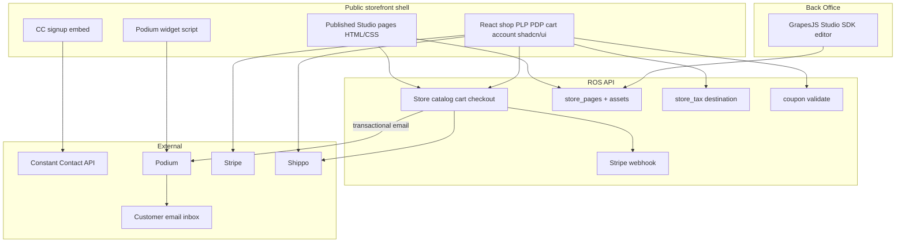

# Plan: Online Store module (ROS-native, deeply integrated)

> **FUTURE ADDITION (product lock):** **Paid web checkout** (`POST /api/store/checkout`, Stripe), **binding `rate_quote_id` into paid totals**, **post-payment Shippo label purchase**, and **Shippo tracking webhooks for guest orders** are **explicitly out of scope** until this module ships checkout. **`/shop`** may show **shipping rate estimates** for UX only; **POS, Orders, and Shipments hub** are the supported Shippo/label flows today — see **[`PLAN_SHIPPO_SHIPPING.md`](./PLAN_SHIPPO_SHIPPING.md)**.

**Status:** **Partially implemented** — migrations **73**–**77** are shipped; public **`/shop`** supports catalog, CMS pages, guest + server cart, tax/shipping **estimates**, coupons **preview**, and **customer accounts** (JWT). **Paid web checkout** (**Stripe** + **`POST /api/store/checkout`**) is **not** built; neither is **Insights** reporting by **`sale_channel`**. Canonical operator/dev detail: **[`docs/ONLINE_STORE.md`](./ONLINE_STORE.md)**.

**Product posture (2026):** Full **ecommerce checkout** and broad online-store expansion are **paused**; Riverside is prioritizing other work (e.g. **Podium reviews** — **[`docs/PLAN_PODIUM_REVIEWS.md`](./PLAN_PODIUM_REVIEWS.md)**). **Deferred goals** for a future **loyalty-oriented web account** (single **`customers`** base, identity match at sign-up, unified in-store + online purchase history — **not** a monolithic “one box” for staff) live in **[`docs/PLAN_ONLINE_STORE_UNIFIED_CUSTOMER.md`](./PLAN_ONLINE_STORE_UNIFIED_CUSTOMER.md)**.

Implementation plan for a **first-party e-commerce surface** that is **not a bolt-on**: catalog visibility, stock, promotions, tax, and reporting stay tied to **Inventory**, **`product_variants`**, and server-side **`logic/`**. [Shopify’s API documentation](https://shopify.dev/docs/api) is used only as a **reference model** — **Shopify is not integrated**.

---

## Current state vs what is left

| **Shipped today** | **Still open (priority roughly top → bottom)** |
|-------------------|-----------------------------------------------|
| **Schema 73–77:** `orders.sale_channel`, web variant flags, `store_pages` / coupons / tax rate table, Shippo columns + `store_shipping_rate_quote`, **`shipment`** hub (**75**), **`store_guest_cart`** + **`store_media_asset`** (**76**), **`customer_created_source`** + **`customer_online_credential`** + JWT store accounts (**77**). | **Web checkout (Phase C):** **`POST /api/store/checkout`**, Stripe (Payment Element or Checkout Session), webhook, create **`orders`** with `sale_channel = web`, persist cart address/tax/coupon snapshot, increment coupon **`uses_count`**, **stock lock at payment**. |
| **Public API:** catalog, pages (sanitized HTML), **`POST /cart/lines`**, **`/cart/session`**, coupon preview, **`GET /tax/preview`**, **`POST /shipping/rates`** (stub or live Shippo), **`GET /media/{id}`**; **`/api/store/account/*`** (register, login, activate, me, password, orders). Rate limits: **`store_account_rate`**. | **Shippo after rates (Phase C2):** bind **`rate_quote_id`** into paid checkout, buy label, tracking webhooks; POS/order flows per **[`PLAN_SHIPPO_SHIPPING.md`](./PLAN_SHIPPO_SHIPPING.md)**. Optional: variant **weight/dimensions** for better quotes (**§9**). |
| **Admin API:** pages CRUD/publish, coupons, Studio **asset** upload. **`online_store.manage`** (+ **`settings.admin`** where coded). | **Reporting (Phase E):** Orders UI + **Insights** pivot/filter on **`sale_channel`** (column exists; no first-class reporting yet). |
| **Public UI:** **`PublicStorefront`** — PLP, faceted PDP, cart (localStorage + server session), pickup vs ship + rate picker, tax/coupon **estimate**, **`?promo=`**; **`/shop/account`** profile + order list/detail. | **Tax v2:** persist **`tax_breakdown`** on web orders (needs checkout); nexus flags in Settings; optional **Stripe Tax** or external rate API (**§6**). |
| **Inventory / BO:** web column, filters, bulk publish, matrix **web $** / gallery / **publish new variants to web**; **Settings → Online store** (raw HTML + **GrapesJS Studio** lazy chunk, coupons). | **On-site integrations (Phase D):** Podium **widget** in storefront shell; **transactional email** after payment (extend **[`PLAN_PODIUM_SMS_INTEGRATION.md`](./PLAN_PODIUM_SMS_INTEGRATION.md)**); **Constant Contact** embed + optional checkout marketing opt-in (**§7**, **[`PLAN_CONSTANT_CONTACT_INTEGRATION.md`](./PLAN_CONSTANT_CONTACT_INTEGRATION.md)**). |
| | **Coupons (beyond preview):** per-customer limits, stacking rules, category/SKU scope; richer staff edit + usage analytics (**§4**). |
| | **Studio ops:** production **SDK license** + **`VITE_GRAPESJS_STUDIO_LICENSE_KEY`** / domain allowlist (**Phase A**); CSP + optional **custom blocks** for featured products (**§5**). |

**Single biggest gap:** there is **no** server path that turns an authenticated or guest cart into a **paid** **`web`** order — everything above stops at **estimate + account**.

---

### Current implementation snapshot (shipped in tree)

| Area | Location / notes |
|------|------------------|
| **Schema** | **`migrations/73_online_store_module.sql`**: `orders.sale_channel`, `product_variants.web_*`, `store_pages`, `store_coupons`, `order_coupon_redemptions`, `store_tax_state_rate`, RBAC **`online_store.manage`**, seed **`home`** page. **`migrations/74_shippo_shipping_foundation.sql`**: Shippo columns on **`orders`**, **`shippo_config`**, **`store_shipping_rate_quote`**. **`migrations/75_unified_shipments_hub.sql`**: **`shipment`**, **`shipment_event`**, **`shipments.*`** — **`docs/SHIPPING_AND_SHIPMENTS_HUB.md`**, **`PLAN_SHIPPO_SHIPPING.md`**. **`migrations/76_store_guest_cart_and_media_assets.sql`**: **`store_guest_cart`**, **`store_guest_cart_line`**, **`store_media_asset`**. **`migrations/77_customer_online_account.sql`**: **`customers.customer_created_source`**, **`customer_online_credential`**. |
| **Public API** | **`server/src/api/store.rs`** (nested at **`/api/store`** and **`/api/admin/store`**): catalog, published pages (HTML sanitized with **ammonia**), coupon preview, tax preview, guest cart session, media, Shippo **`POST /shipping/rates`**. **`server/src/api/store_account.rs`** nested at **`/api/store/account`**: register / login / activate / me / password / orders (JWT **`Authorization: Bearer`**). **`server/src/api/store_account_rate.rs`**: rolling per-IP and per-customer limits — **`docs/ONLINE_STORE.md`**. |
| **Logic** | **`server/src/logic/store_catalog.rs`**, **`store_promotions.rs`**, **`store_tax.rs`**. |
| **Inventory** | Control board: **Web** column, **On web** filter, bulk publish/unpublish; product hub matrix: **Web store** checkbox; **`PATCH /api/products/variants/{id}/pricing`** includes `web_published`, `web_price_override`, `web_gallery_order`; **`POST /api/products/variants/bulk-web-publish`**. |
| **Staff UI** | **Settings → Online store** (`OnlineStoreSettingsPanel.tsx`): pages (**Raw HTML** + **Visual (Studio)** tabs, **`StorePageStudioEditor.tsx`**, **`@grapesjs/studio-sdk`** lazy chunk), coupons (create, activate/deactivate). Optional **`VITE_GRAPESJS_STUDIO_LICENSE_KEY`**. |
| **Public shop** | **`PublicStorefront.tsx`** + **`main.tsx`** **`/shop`**, **`/shop/account`**, **`/shop/account/orders/{uuid}`**. **TanStack Query** for catalog, CMS pages, cart resolution, account profile/orders. **`ui-shadcn/`** components + **`[data-storefront]`** CSS variables (not the main BO **`ui-*`** set). Guest cart: **`localStorage`** + **`POST /api/store/cart/lines`** for priced lines; **`ros.store.cartSessionId.v1`** + **`/api/store/cart/session`** (create/get/put/delete) keeps a **server** copy; **delivery address + `POST /api/store/shipping/rates`** (Shippo live or stub) + **`rate_quote_id`** selection; tax/coupon **estimate** UI (state from delivery address); **`?promo=`** pre-fill. |
| **Product slug for web** | Store catalog uses **`products.catalog_handle`** (trimmed, case-insensitive) as the public slug; template must be active and at least one variant **`web_published`**. |

**Permission:** **`online_store.manage`** — documented in **`docs/STAFF_PERMISSIONS.md`** (catalog table) and migration **73** seeds. Admin routes also allow **`settings.admin`** where implemented in **`store.rs`**.

**Related plans:** [`PLAN_CONSTANT_CONTACT_INTEGRATION.md`](./PLAN_CONSTANT_CONTACT_INTEGRATION.md) (list growth + storefront embeds), [`PLAN_PODIUM_SMS_INTEGRATION.md`](./PLAN_PODIUM_SMS_INTEGRATION.md) (SMS + **web chat widget** + **transactional email** via Podium where configured), **[`PLAN_SHIPPO_SHIPPING.md`](./PLAN_SHIPPO_SHIPPING.md)** (**Shippo**: web checkout rates + labels + **POS shipping charges**).

**CMS / visual builder:** **[GrapesJS Studio SDK](https://app.grapesjs.com/docs-sdk/overview/getting-started)** is **wired** in **Settings → Online store** (**self** storage → **`PATCH project_json`**; export HTML to raw draft). **`store_pages.project_json`** + **`published_html`**; public **`GET /api/store/pages/{slug}`** serves **sanitized** **`published_html`**. See **§5** and **`docs/ONLINE_STORE.md`**.

**Public shop UI:** **`/shop`** uses **shadcn-style** owned components under **`client/src/components/ui-shadcn/`** with **`components.json`**, **`cn()`** (**`client/src/lib/utils.ts`**), Radix primitives, and **TanStack Query** — aligned with the **[shadcn/ui](https://ui.shadcn.com/)** approach without duplicating the Back Office **`ui-*`** system. **Stripe checkout** — Phase C. Details: **`docs/ONLINE_STORE.md`**, **§5** subsection **Public shop UI**.

---

## Product intent

1. **Deep Inventory integration** — Staff choose **exactly which variants** appear online; stock follows **`available_stock`** rules.
2. **Channel attribution** — **`sale_channel`**: register vs web (reporting, ops).
3. **Apparel-grade variant UX** — Faceted PDP from **`variation_values`** / matrix model ([`products.rs`](../server/src/api/products.rs)).
4. **Coupon codes** — Staff-defined **promo codes** (percent or fixed, limits, windows) validated **server-side** on cart/checkout.
5. **Out-of-state / destination tax** — Web checkout collects **ship-to**; tax engine applies **jurisdiction-appropriate** rules (see §6); not hard-coded to Erie-only for remote sales.
6. **Site content + storefront UX** — **GrapesJS Studio SDK** for staff-facing **WYSIWYG** marketing/legal pages (ongoing **SDK license** where required for public/production use; hosting remains separate). **Catalog and checkout** stay ROS-native; the builder is **not** a substitute for inventory APIs. **shadcn/ui** (Tailwind + Radix, copy-paste components) for the **public shop** shell — PLP, PDP, cart, checkout, filters — see **§5**.
7. **Marketing + messaging on the public site** — **Constant Contact** for **list growth / campaigns** (embeds, optional checkout marketing opt-in). **Podium** for **on-page chat/SMS widget** and, **for transactional email**, **order-adjacent messages** (confirmations, shipping/fulfillment notices, etc.) sent through Podium when enabled — **not** a parallel transactional engine in CC. Details: **§7–§8** and [`PLAN_PODIUM_SMS_INTEGRATION.md`](./PLAN_PODIUM_SMS_INTEGRATION.md).
8. **Shipping (Shippo)** — Shared [**Shippo**](https://goshippo.com/docs/) integration for **online checkout** (rates, ship-to, labels, tracking) and **in-store orders** that must be **shipped** (POS: add shipping $ + optional label purchase). Full design: **[`PLAN_SHIPPO_SHIPPING.md`](./PLAN_SHIPPO_SHIPPING.md)**.

---

## Design principles (Shopify-informed, single system of record)

| Shopify concept | ROS equivalent |
|-----------------|----------------|
| Admin / catalog | **`products`**, **`product_variants`**, categories, images |
| Publish to web | **`web_published`** on variants; Inventory UI |
| Discount codes | **`store_coupons`** (or equivalent) + cart application in `logic/` |
| Tax by address | **Destination sourcing** module extending beyond NYS Erie in-store defaults |
| Storefront | **Marketing pages:** **HTML** from **`published_html`** (Studio or raw editor). **Shop:** React + **`ui-shadcn`** + **`/api/store/*`** — see **`docs/ONLINE_STORE.md`** and §5 |
| “Apps” | **CC embed** (marketing); **Podium** — storefront **widget** + **transactional email** (and existing **SMS**) per Settings / Podium plan |
| Shipping | **Shippo** — rates + labels; shared `logic/shippo.rs` for **web + POS** |

**Money:** `rust_decimal::Decimal` everywhere except Stripe cent boundaries.

---

## 1. Deep integration with Inventory

(Same as prior revision.)

### Staff surfaces

| Surface | Behavior |
|---------|----------|
| **[`InventoryControlBoard.tsx`](../client/src/components/inventory/InventoryControlBoard.tsx)** | **Shipped:** **Web** column (counts + avail total), **On web** filter, bulk **Publish web / Unpublish web**. |
| **Product hub / matrix** | **Shipped:** per-variant **Web store** checkbox (`PATCH` pricing), **Web $** override + **Sort** (gallery order) in **`MatrixHubGrid`**. |
| **Matrix generation** | **Shipped:** **Product master** checkbox **Publish new variants to web** → **`POST /api/products`** **`publish_variants_to_web`**. |

### Stock truth

- **Store catalog** exposes **`available_stock`** per variant on **`GET /api/store/products/{slug}`** (`store_catalog.rs`). POS cart continues to use [`inventory.rs`](../server/src/services/inventory.rs). **Transactional lock at payment confirmation** — **pending** (no web payment capture yet).

---

## 2. Store vs register sales tracking

- **`orders.sale_channel`**: `register` | `web` — **column shipped** (migration **73**); new rows default **`register`**; POS checkout paths unchanged. Web orders will set **`web`** once **Phase C** checkout exists.
- **Orders** UI + **Insights** `group_by=channel` (or dedicated widget) — **not implemented**; see **Current state vs what is left** → Reporting.

---

## 3. Apparel variant UX (PDP)

- **`GET /api/store/products/{slug}`**: **shipped** — returns product + **`variation_axes`** + **`web_published`** variants with **`variation_values`**, **`unit_price`** (web override → retail override → base), **`available_stock`**.
- **Client `/shop` PDP:** **faceted** option pickers when **`variation_axes`** / **`variation_values`** exist; flat variant chips as fallback; add-to-cart (**localStorage** + **server cart session** sync). **URL `?promo=`** — **shipped** on **`/shop/cart`** (pre-fills coupon when field empty).

---

## 4. Coupon codes (online store)

### Requirements

- Codes are **entered at cart** (and pre-applied via **`?promo=`** when the cart URL includes it). **Shipped:** **`POST /api/store/cart/coupon`** preview; **`?promo=`** on **`/shop/cart`**. Full checkout application — **pending** Stripe Phase C.
- **Validation only on server**: existence, date window, **min subtotal**, **max redemptions** (global; **per-customer email** not yet), **stacking rules** (e.g. one code per order unless flagged). **Shipped:** global window, min subtotal, max uses, kinds **percent** / **fixed_amount** / **free_shipping**. **`uses_count`** is **not** incremented on cart preview (increment on paid web order — **pending**).
- **Types**: **percent off** (cap max discount $ optional), **fixed amount off**, **free shipping** (if shipping module exists).
- **Scope** (MVP → full): **entire cart** first; later **include/exclude category or product IDs**.

### Data model (migration)

- **`store_coupons`**: `code` (unique CI), `kind`, `value`, `starts_at`, `ends_at`, `min_subtotal_usd`, `max_uses`, `uses_count`, `is_active`, optional `customer_segment` (future).
- **`order_coupon_redemptions`**: `order_id`, `coupon_id`, `discount_amount` — audit and enforce limits.

### Logic

- **`logic/store_promotions.rs`**: `apply_coupon(cart_snapshot) -> Result<AdjustedTotals, CouponError>`.
- Reuse patterns from **[`discount_events`](../migrations/41_discount_events.sql)** only if product wants **same** rules for web and events; otherwise **keep web coupons separate** to avoid conflating trunk-show automation with **code WELCOME10**.

### Staff UX

- **Settings → Online store → Coupons** — **shipped:** list, create, activate/deactivate (**`PATCH`**). Full edit UI / usage analytics — **lightweight** (see `OnlineStoreSettingsPanel.tsx`).

### Stripe

- Pass **final** discounted line totals into Checkout Session / PaymentIntent metadata; persisted on **`order_items`** consistent with POS discount lines.

---

## 5. Website builder & content — **GrapesJS Studio SDK** (chosen)

**Primary reference:** [Get started with Studio SDK](https://app.grapesjs.com/docs-sdk/overview/getting-started) — package **`@grapesjs/studio-sdk`**, React entry **`StudioEditor`** from `@grapesjs/studio-sdk/react`, styles `@grapesjs/studio-sdk/style`. The SDK is a **fully embeddable, drag-and-drop, white-label** Studio; it is **customizable and extendable** through the **GrapesJS core API** (custom blocks, storage adapters, assets). Live exploration: [app.grapesjs.com/studio](https://app.grapesjs.com/studio). Deeper integration topics: [Configuration overview](https://app.grapesjs.com/docs-sdk/configuration/overview) (storage, assets, projects, pages, blocks — use current SDK docs as source of truth).

### Goal

Staff edit **marketing and legal pages** (home, about, policies, landing pages) with a **non-technical WYSIWYG** experience **inside Back Office**. **Shop behavior** (ONLINE variants, PDP, cart, checkout) remains **data-driven from ROS APIs**, not hand-authored HTML for every SKU.

### What this choice implies

| Area | Implication |
|------|-------------|
| **Licensing** | Per [Licenses](https://app.grapesjs.com/docs-sdk/overview/licenses): **public domain** deployments require a **configured SDK license** (domain allowlist + enablement); **localhost** can use full Studio features **without** a license for development. Treat prod/staging domains as a **budget + ops** checklist. |
| **Client dependency** | Add **`@grapesjs/studio-sdk`** to the **React** client; lazy-load the editor route/tab to avoid inflating the default Back Office bundle. |
| **Persistence** | **`store_pages`**: **`published_html`** + **`project_json`**; public **`GET /api/store/pages/{slug}`** serves **sanitized** **`published_html`** (ammonia). Studio **self** storage **PATCH**es **`project_json`**; staff may **export** HTML into the raw draft. Documented in **`docs/ONLINE_STORE.md`**. |
| **Assets** | **Images/fonts** used in pages need a **ROS-backed or configured remote** asset pipeline (upload API + permissions, **`settings.admin`** or dedicated key). Align with SDK **Assets** configuration; **do not** rely on ephemeral browser-only storage for production. |
| **Multi-page** | SDK **web** projects support **multiple pages** (see getting-started `project.default.pages`). Map ROS **`slug`** ↔ Studio page identity; enforce **unique slugs** and reserved paths (`/cart`, `/checkout`, `/products/*`, etc.). |
| **ROS-specific UI** | Use **custom blocks / components** (GrapesJS API) for **store-specific** elements: e.g. **featured ONLINE products**, newsletter CTA, hours/location — backed by **`GET`** store/catalog endpoints so staff do not paste product HTML by hand. |
| **Public rendering & security** | Published output is **HTML/CSS** (and possibly **inline scripts** if misconfigured). **Public site** must **sanitize** untrusted fragments, set **Content-Security-Policy**, and **avoid** or tightly gate **“custom code”**-style blocks. Reuse the plan’s embed rules for **CC / Podium** (allowlists). |
| **Optional: email project type** | SDK supports **`project.type: 'email'`** with **MJML** for newsletters. **Future:** separate BO surface + storage table if product wants **in-app email template** editing; not required for storefront MVP. |
| **Vendor / continuity** | Editor UX and defaults **track Grapes Studio** releases — pin package versions in **`package.json`**, read SDK **migration/changelog** on upgrades; keep **export/backup** of project JSON for disaster recovery. |

### Deferred alternatives (not the default path)

- **ROS JSON block editor** (Puck / Editor.js–style) — superseded for **marketing pages** by this decision; could still be used for **narrow** structured widgets if ever needed.
- **Open-source GrapesJS only** — more assembly work for the same output model; Studio SDK chosen for **faster polished editor** and **vendor support** (per product positioning).
- **External site + embed shop** (former Option C) — remains valid for **exceptional** cases (e.g. separate marketing domain) but is **not** the primary CMS plan.

### Recommendation (unchanged in spirit)

Ship **store + legal + homepage** **inside ROS** with **Studio SDK** in Back Office; public storefront **consumes published pages** + **integrated shop routes**.

### Public shop UI — **shadcn-style** (implemented baseline)

**Shipped:** **`client/components.json`**, **`@/components/ui-shadcn/*`** (Button, Card, Input, Label, Badge, Skeleton, Separator), **`cn()`** + **tailwind-merge** / **clsx**, **`[data-storefront="true"]`** HSL tokens as **`storefront.*`** in Tailwind, **TanStack Query** in **`PublicStorefront.tsx`**. Components are **owned source** (same model as shadcn — not a separate runtime package).

**Primary reference:** [shadcn/ui](https://ui.shadcn.com/) — patterns and upstream docs for **Vite + React + TypeScript** when adding more primitives.

### Goal

Deliver a **professional, modern** catalog and checkout experience: grids, galleries, variant pickers, dialogs/sheets, forms, and responsive layouts — **without** a second design system (e.g. MUI/Chakra) fighting Tailwind. **Catalog data and business rules remain in ROS**; shadcn is **presentation and interaction** only.

### What this choice implies

| Area | Implication |
|------|-------------|
| **Scope** | Use shadcn for **transactional shop routes** (`/products`, `/products/:slug`, `/cart`, `/checkout`, etc.) and shared **storefront chrome** (header/footer) where those are **React-rendered**. **Studio** remains for **editorial** pages served as published HTML or hybrid shell — reserve **`/cart` / `/checkout`** (and API-driven PLP/PDP) for the React app so state and Stripe stay coherent. |
| **Tailwind** | Storefront uses **scoped** **`storefront.*`** variables on **`[data-storefront]`** (see **`docs/ONLINE_STORE.md`**) so BO **`ui-*`** / **`app`** tokens stay unchanged for staff surfaces. |
| **Accessibility** | Prefer **Radix**-backed primitives for focus, dialogs, and sheets; align with [`useDialogAccessibility`](../client/src/hooks/useDialogAccessibility.ts) expectations where patterns overlap. |
| **Data fetching** | **TanStack Query** — **shipped** for **`/shop`**; extend the same pattern for future checkout routes. |
| **Payments** | Integrate **Stripe** via **`@stripe/react-stripe-js`** and **`@stripe/stripe-js`** (Payment Element or Checkout redirect) inside shadcn-styled **Card** / **Form** layouts — see §4 Stripe notes and Phase C. |
| **Optional add-ons** | **Embla Carousel** (often paired with shadcn carousel) for PDP **image galleries**. **PLP text search** is **shipped**: **`GET /api/store/products?search=`** with optional self-hosted **Meilisearch** + SQL hydration when **`RIVERSIDE_MEILISEARCH_URL`** is set — see **`docs/ONLINE_STORE.md`**, **`docs/SEARCH_AND_PAGINATION.md`**. |
| **Maintenance** | Components are **owned code**; upstream shadcn updates are **manual merges** — pin patterns in **`docs/ONLINE_STORE.md`** or **`DEVELOPER.md`**. |

---

## 6. Out-of-state / destination tax rules

### Riverside web policy (documented)

Operator-facing rules and API behavior for **`/shop`** are in **[`ONLINE_STORE.md`](./ONLINE_STORE.md) → Web tax policy**: **NY tax on in-store pickup**; **no NY tax on ship-to outside NY**; **no collection for other states** under the current **no nexus** assumption. **`GET /api/store/tax/preview`** implements **`fulfillment=store_pickup`** vs **`fulfillment=ship`** with **`state`** for ship-to.

### Context

In-store ROS today centers on **NYS Publication 718-C / Erie** ([`logic/tax.rs`](../server/src/logic/tax.rs)). **Remote / shipped sales** often require **destination** rates (customer’s ship-to state/local) and **economic nexus** compliance — **legal/accounting** must confirm obligations.

### Architecture

1. **Checkout** collects **fulfillment** (pickup vs ship) and, when shipping, **ship-to** address (at least **country + state + postal**; city/street for accuracy).
2. **`logic/store_tax.rs`** **`web_tax_preview`** applies the **documented web policy** (NY row from **`store_tax_state_rate`** for pickup and ship-to NY; **0** rate + disclaimer for ship-to non-NY under current assumptions).

### Rate source options (pick one per phase)

| Approach | Cost | Notes |
|----------|------|--------|
| **Manual admin table** | Free | `tax_jurisdiction` → combined rate; rough for local home-rule states — **disclaimer** in UI |
| **Stripe Tax** | Per transaction | Accurate, low engineering; **not** “hosting-only” cost |
| **TaxJar / similar API** | Often has **free dev / low-volume** tier | Verify current pricing; good middle ground |
| **CSV import** of rate tables | Free labor | Periodic updates |

### Implementation phases

- **Phase 1**: **Fulfillment + ship-to** for shipped orders; **flat NY rate** from DB for NY-sourced previews; disclosure JSON. **Shipped:** **`store_tax_state_rate`** + **`GET /api/store/tax/preview`** (**`fulfillment`**, **`state`**, **`subtotal`**) + **Web tax policy** in **`ONLINE_STORE.md`**; **no Stripe checkout gate** yet.
- **Phase 2**: ZIP+4 or API integration for accuracy; **nexus flags** in Settings (“we collect in: …”).
- **Always**: Persist **`tax_breakdown`** JSON on web orders for audit; use **`Decimal`** for all calculations. **Preview path uses `Decimal`**; **order persistence** — **pending** web orders.

### Nexus / registration

- Document in **`docs/ONLINE_STORE.md`**: ROS stores **jurisdiction codes** on orders; **CPA** owns registration — not a code substitute.

---

## 7. Constant Contact on the public website

Keep **ROS as consent source of truth**; CC is **lists + campaigns**.

| Integration | Purpose |
|-------------|---------|
| **Embedded signup form** | CC provides **embed HTML/JS** for a list — inject via **Settings → Integrations → Constant Contact** → `signup_embed_html` (sanitized allowlist) rendered in storefront footer or **/newsletter** page block. |
| **Web-only opt-in checkbox** at checkout | “Email me offers” → if checked, **server** calls CC API (async) to **add/update contact** on **Web Buyers** list (after [`PLAN_CONSTANT_CONTACT_INTEGRATION.md`](./PLAN_CONSTANT_CONTACT_INTEGRATION.md) exists). |
| **Double opt-in** | Prefer CC’s **confirmed opt-in** flow for list signups from embed. |
| **Transactional vs marketing** | **Podium** is the intended channel for **transactional email** tied to web (and shared) order lifecycle (see **§8**). **Transactional** messages do **not** require an **opt-in** (they follow the **email provided at checkout** for the transaction). **Constant Contact** remains **marketing / newsletters** and **does** require explicit consent (embed + checkout checkbox per rows above). Do **not** duplicate order confirmations or fulfillment mail in CC unless product explicitly wants a second copy. **Stripe** may still send **payment/receipt** artifacts per Stripe settings; align copy so customers are not confused by multiple senders. |

Update **`PLAN_CONSTANT_CONTACT_INTEGRATION.md`** with this storefront section (see that file).

---

## 8. Podium — storefront widget **and transactional email**

**Product assumption:** Riverside uses **Podium** not only for **SMS** and the **web chat widget**, but also for **transactional email** (order-related and operational mail) where Podium supports it and the integration is configured. Implementation detail, credentials, templates, and API shapes live in **[`PLAN_PODIUM_SMS_INTEGRATION.md`](./PLAN_PODIUM_SMS_INTEGRATION.md)** (Podium reference: [Send a Message (SMS or Email)](https://docs.podium.com/docs)); this section scopes **online store** behavior and boundaries vs **Constant Contact** (§7).

| Integration | Purpose |
|-------------|---------|
| **Podium Web Chat / widget** | Podium provides a **snippet** (script + key) placed in storefront **layout** (footer or `index.html` for SPA). Customers text/chat from **every page**; conversations land in **Podium Inbox** (staff already use Podium). |
| **Transactional email (web orders)** | After **Stripe** (or equivalent) confirms payment, ROS triggers **Podium email** for **web `sale_channel`** orders — e.g. **order confirmation** (summary, order ref, pickup/shipping expectation), and later **fulfillment / shipped** notices if product wants parity with SMS. Use **email collected at checkout** for these messages. **No marketing-style opt-in** is required for **transactional** mail (order/fulfillment-related); **Constant Contact** / **marketing_email_opt_in** (§7) applies only to **promotional** lists and campaigns — keep the two channels separate in copy and implementation. |
| **Template ownership** | **Editable templates** (subject/body, placeholders `{order_ref}`, line summary hooks) live under **Settings → Integrations → Podium** (or split **Email** subsection) alongside SMS templates — same RBAC pattern as today (**`settings.admin`** until a finer key ships). |
| **Graceful degradation** | If Podium email is **disabled** or misconfigured, log + optional **Stripe**-only receipt behavior; never block checkout solely because email send failed (async retry / dead-letter policy — product choice). |
| **Configuration** | **Settings → Integrations → Podium**: widget flags/snippet (existing), plus **email send enabled**, **from** identity per Podium account, and any **template IDs** or body fields Podium’s API requires. **Do not** commit secrets; env or DB **settings.admin** only. |
| **Relation to API SMS** | Widget = **inbound + outbound UI**; [`PLAN_PODIUM_SMS_INTEGRATION.md`](./PLAN_PODIUM_SMS_INTEGRATION.md) covers **server-triggered SMS** and should be extended for **email** send path, payloads, and logging/redaction. **Widget + SMS + email** can coexist. |

Update **`PLAN_PODIUM_SMS_INTEGRATION.md`** with **transactional email** triggers, template keys, and webhook/idempotency notes aligned with web checkout (see that file).

---

## 9. Shipping (Shippo) — summary

Shipping is **not** online-store-only: the same **Shippo** integration serves **web checkout** and **register / POS** when staff sell an order that will be **mailed** to the customer.

| Channel | Highlights |
|---------|------------|
| **Online Store** | Ship-to address → **rate quotes** → verified quote id on Stripe checkout → **label + tracking** after payment (or staff queue). Works with **§6 destination tax** (same address). |
| **POS** | **“Ship order”** flow: address + rate picker → **shipping line** added to **`CheckoutRequest` / order totals** → optional **buy label** after tender. **Late $:** if shipping is unknown at sale time, staff add the same **rates → line** from **Orders** or when marking **ready / pickup / delivery** (see **Late-bound shipping** in [`PLAN_SHIPPO_SHIPPING.md`](./PLAN_SHIPPO_SHIPPING.md)). |

**Catalog prerequisite:** **weight** (and ideally dimensions) per variant or product for accurate Shippo rates — may require migration + Inventory UI fields.

**Detail:** **[`PLAN_SHIPPO_SHIPPING.md`](./PLAN_SHIPPO_SHIPPING.md)** (schema, `rate_quote_id` anti-tamper, webhooks, permissions, phases).

---

## Architecture diagram (updated)

**As implemented today:** public pages = **sanitized `published_html`** (from raw HTML and/or Studio export); shop UI = **`PublicStorefront`** + **`ui-shadcn`** + Query (**PLP / PDP / cart / account** — no **checkout** route yet); **Studio** editor = **Back Office**; diagram edges to **Stripe** / **webhook** / **CC** / **Podium** on product = **target** after Phase **C** / **D**.

---

## API surface (additions)

| Method | Path | Notes |
|--------|------|--------|
| GET | `/api/store/products`, `/api/store/products/{slug}` | **Shipped** — public catalog (slug = `catalog_handle`); web-published variants only. |
| POST | `/api/store/cart/coupon` | **Shipped** — coupon **preview** (`subtotal` + `code`); does not mutate `uses_count`. |
| POST | `/api/store/cart/lines` | **Shipped** — priced cart lines from **`variant_id` + `qty`** (web-published variants only); **`subtotal`**, **`missing_variant_ids`**. |
| GET | `/api/store/tax/preview` | **Shipped** — `subtotal`, `state` (ship-to when `fulfillment=ship`), `fulfillment` = `ship` \| `store_pickup`; estimate + disclaimer per **`docs/ONLINE_STORE.md`** Web tax policy. |
| GET | `/api/store/pages` | **Shipped** — list published page metadata. |
| GET | `/api/store/pages/{slug}` | **Shipped** — **sanitized** `published_html` JSON. |
| GET | `/api/admin/store/pages` | **Shipped** — list all pages (**`online_store.manage`** or **`settings.admin`**). |
| POST | `/api/admin/store/pages` | **Shipped** — create page (slug + title). |
| GET | `/api/admin/store/pages/{slug}` | **Shipped** — full row including `project_json` + `published_html`. |
| PATCH | `/api/admin/store/pages/{slug}` | **Shipped** — patch title, SEO, `project_json`, `published_html`, `published`. |
| POST | `/api/admin/store/pages/{slug}/publish` | **Shipped** — set `published = true`. |
| GET | `/api/admin/store/coupons` | **Shipped**. |
| POST | `/api/admin/store/coupons` | **Shipped**. |
| PATCH | `/api/admin/store/coupons/{id}` | **Shipped** — `is_active`, `max_uses`, `ends_at`. |
| POST | `/api/admin/store/assets` | **Shipped** — JSON **`file_base64`**, **`mime_type`**, optional **`filename`**; **`online_store.manage`** / **`settings.admin`**; images stored in **`store_media_asset`** (max **3 MiB**). |
| GET | `/api/store/media/{id}` | **Shipped** — public image bytes (**JPEG/PNG/WebP/GIF**). |
| POST | `/api/store/cart/session` | **Shipped** — create session; optional **`lines`**; response includes **`cart_id`** + priced payload. |
| GET | `/api/store/cart/session/{id}` | **Shipped** — priced lines; extends expiry; **404** if missing/expired. |
| PUT | `/api/store/cart/session/{id}` | **Shipped** — replace lines (**`CartResolveBody`**). |
| DELETE | `/api/store/cart/session/{id}` | **Shipped** — drop session. |
| POST | `/api/store/account/register`, `/api/store/account/login`, `/api/store/account/activate` | **Shipped** — create/link **`customer`** row + optional password; **429** when unauthenticated POST rate limit exceeded — **`docs/ONLINE_STORE.md`**. |
| GET, PATCH | `/api/store/account/me` | **Shipped** — profile + address fields (**`Bearer`**); **PATCH** partial update. |
| POST | `/api/store/account/password` | **Shipped** — change password (**`Bearer`** + current password). |
| GET | `/api/store/account/orders`, `/api/store/account/orders/{order_id}` | **Shipped** — web-channel orders for linked customer; store-safe detail payload. |
| POST | `/api/store/checkout` | **Not implemented** — Phase C (Stripe + order create). |
| POST | `/api/store/shipping/rates` | **Shipped** — body per [`store.rs`](../server/src/api/store.rs) / **`logic/shippo.rs`** (stub vs live per config; see [`PLAN_SHIPPO_SHIPPING.md`](./PLAN_SHIPPO_SHIPPING.md)). |
| POST | `/api/products/variants/bulk-web-publish` | **Shipped** — `{ variant_ids, web_published }` (**`catalog.edit`**). |

**POS / orders:** `POST /api/transactions/.../shipping/rates`, `.../shipping/buy-label` — defined in Shippo plan.

---

## Phases (updated)

### Phase A — Schema + Inventory + Studio SDK skeleton

- **Done:** Same as prior checklist + **`@grapesjs/studio-sdk`** in client (**`StorePageStudioEditor`**, lazy-loaded from **Settings → Online store**); **self** storage → **`PATCH`** **`project_json`**; **export HTML** to raw draft path; **Studio `assets.onUpload`** → **`POST /api/admin/store/assets`** → public **`GET /api/store/media/{id}`** URLs in page HTML; **inventory:** **`publish_variants_to_web`** on **`POST /api/products`**; matrix hub **web price override** + **gallery order** UI.
- **Open:** **SDK license** + **`VITE_GRAPESJS_STUDIO_LICENSE_KEY`** for prod ([Licenses](https://app.grapesjs.com/docs-sdk/overview/licenses)).

### Phase B — Catalog PDP + cart + coupons + tax v1

- **Done (MVP+):** **`GET /api/store/products`**, **`GET /api/store/products/{slug}`**; **`PublicStorefront`** PLP/**faceted PDP**/cart (**localStorage** + **`POST /api/store/cart/lines`** + **guest cart session** API); **customer accounts** (**`/api/store/account/*`**, **`/shop/account`**, migration **77**); **in-store pickup** vs **ship** fulfillment + **`GET /api/store/tax/preview`** aligned with **Web tax policy**; **`POST /api/store/shipping/rates`** when shipping (Shippo); **`POST /api/store/cart/coupon`**; **landing marketing pages**; **`?promo=`**; **TanStack Query**; **`ui-shadcn`** + scoped storefront tokens.
- **Not implemented:** **ship-to** as part of **paid** checkout (Phase C); full **shadcn** parity (additional components only as needed).

### Phase C — Stripe + webhook

- **Blocks most “remaining” rows** in **Current state vs what is left** (paid **`web`** orders, coupon redemption, tax snapshot on order, stock lock).
- **`POST /api/store/checkout`** (or equivalent) + **`@stripe/react-stripe-js`** / **`@stripe/stripe-js`** in a **`/shop/checkout`** route (shadcn **Form** / **Card** patterns).
- Discounted totals; persist tax + coupon snapshot on **`orders`** / line items; Stripe **webhook** for finality.
- **Podium transactional email** for **web** orders (confirmation after successful payment / webhook), per **§8**; extend [`PLAN_PODIUM_SMS_INTEGRATION.md`](./PLAN_PODIUM_SMS_INTEGRATION.md) with email templates and send path.

### Phase C2 — Shippo (parallel or after C)

- **Shipped (foundation):** migrations **74**–**75**, **`POST /api/store/shipping/rates`** on **`/api/store`** (and POS paths per **`PLAN_SHIPPO_SHIPPING.md`**), `logic/shippo.rs`, staff **`shipment`** hub.
- **Open:** Attach **verified** **`rate_quote_id`** to **Stripe** checkout / order create; post-payment **label purchase** + **tracking** sync/webhooks; remaining POS/order-detail flows in **`PLAN_SHIPPO_SHIPPING.md`**.

### Phase D — Integrations on site

- **Podium widget** settings + inject (storefront layout; may be reflected as **default Studio page** partials or post-publish shell — implementation detail).
- **Podium transactional email** templates tested end-to-end with **sandbox** checkout (§8); document **from** domain / Podium requirements in **`docs/ONLINE_STORE.md`**.
- **CC embed** field + optional checkout list signup (Studio **HTML embed** blocks only with **sanitize/allowlist** per §5).

### Phase E — Reporting + tax v2

- **Open:** Insights / Orders **channel** pivot (or filter) using **`orders.sale_channel`** — meaningful once **Phase C** creates **`web`** rows; optional **Stripe Tax** or external rate API if accuracy required beyond **`store_tax_state_rate`** + **`GET /api/store/tax/preview`**.

---

## Documentation

- **`docs/ONLINE_STORE.md`**: **shipped** — operator + dev summary (routes, APIs, CMS, cart, **accounts + JWT + rate limits**, env).
- **`DEVELOPER.md`**: **updated** — **`/api/store`**, **`/api/store/account/*`**, **`/api/admin/store`**, **`/shop`**, **`RIVERSIDE_STORE_CUSTOMER_JWT_SECRET`**, store account rate envs, **`VITE_GRAPESJS_STUDIO_LICENSE_KEY`**, pointer to **`ONLINE_STORE.md`**.
- **`docs/STAFF_PERMISSIONS.md`**: **`online_store.manage`** row in permission catalog.
- **`README.md`**, **`AGENTS.md`**, **`.cursorrules`**: catalog / agent read lists include **`ONLINE_STORE.md`** where appropriate.

## Risks

| Risk | Mitigation |
|------|------------|
| Tax liability miscomputed | Legal review + phased API integration; clear “estimate” copy |
| Coupon abuse | Rate limit apply attempts; audit redemptions; storefront **account** unauth POST + authed minute caps (**`docs/ONLINE_STORE.md`**) |
| XSS via embed HTML | Strict sanitize allowlist for CC snippet; prefer iframe embed if CC offers it |
| XSS via **published Studio HTML** | Sanitize public output; restrict custom-code blocks; CSP; periodic audit of published snapshots |
| Podium script CSP | Configure **Content-Security-Policy** for script src allowlist (include **Studio** / CDN script origins if applicable) |
| **Studio SDK license** / renewal | Track prod deployment checklist; pin SDK version; test upgrades in staging |
| **Vendor lock-in / upgrade breaks** | Export **project JSON** backups; read SDK changelog before bumping **`@grapesjs/studio-sdk`** |
| **Transactional email** deliverability / confusion | Use **one** primary transactional sender (**Podium**); document relationship to **Stripe** receipts; handle bounces per Podium/provider docs |
| **Storefront vs BO style drift** | Document **storefront** Tailwind theme / CSS variables; prefer **shared tokens** or a single **accent** source of truth |

---

## References

- [Shopify — APIs](https://shopify.dev/docs/api) — conceptual.
- [shadcn/ui](https://ui.shadcn.com/) — Tailwind + Radix; [docs](https://ui.shadcn.com/docs) (Vite + React setup).
- [Stripe React](https://stripe.com/docs/stripe-js/react) — **`@stripe/react-stripe-js`** for checkout UI alongside shadcn.
- [GrapesJS Studio SDK — Getting started](https://app.grapesjs.com/docs-sdk/overview/getting-started) — embed, React **`StudioEditor`**, web/email project types.
- [GrapesJS Studio SDK — Licenses](https://app.grapesjs.com/docs-sdk/overview/licenses) — production / public domain requirements.
- [GrapesJS Studio SDK — Configuration overview](https://app.grapesjs.com/docs-sdk/configuration/overview) — storage, assets, projects (verify paths against current docs).
- [GrapesJS (open source core)](https://github.com/GrapesJS/grapesjs) — API extension points referenced by the SDK.
- ROS: [`logic/tax.rs`](../server/src/logic/tax.rs), [`products.rs`](../server/src/api/products.rs), [`store.rs`](../server/src/api/store.rs), [`store_catalog.rs`](../server/src/logic/store_catalog.rs), [`store_promotions.rs`](../server/src/logic/store_promotions.rs), [`store_tax.rs`](../server/src/logic/store_tax.rs), [`InventoryControlBoard.tsx`](../client/src/components/inventory/InventoryControlBoard.tsx), [`PublicStorefront.tsx`](../client/src/components/storefront/PublicStorefront.tsx), [`OnlineStoreSettingsPanel.tsx`](../client/src/components/settings/OnlineStoreSettingsPanel.tsx), [`StorePageStudioEditor.tsx`](../client/src/components/settings/StorePageStudioEditor.tsx), **[`ONLINE_STORE.md`](./ONLINE_STORE.md)**, [`AGENTS.md`](../AGENTS.md).
