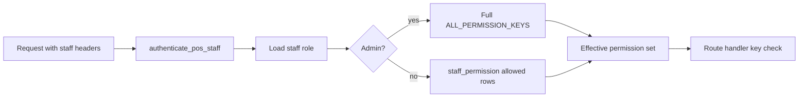

# Staff permissions, contacts, and RBAC (v1)

This document describes Riverside OS **Back Office** access control: string permission keys, **per-staff** grants (runtime), **role templates** in the database (edited under **Settings**), staff **phone/email**, **linked employee customer** (employee pricing + zero commission on those sales), and how the client loads **effective permissions** after staff authentication.

**Runtime model (migration 97):** For non-**admin** staff, the effective permission set is **`staff_permission`** only (`allowed = true` rows). **`staff_role_permission`** and **`staff_role_pricing_limits`** are **store default templates** used when onboarding, when an operator clicks **Apply role defaults** on a profile, and for initial migration backfill. **`staff_permission_override`** is no longer used for enforcement after backfill (rows may remain unused).

For high-level architecture, see **`DEVELOPER.md`**. For agent-oriented invariants, see **`AGENTS.md`**.

**UI labels (Back Office vs POS):** The main sidebar item for entering the touch shell is **POS** (subsection **Register** = launchpad). **Till open** / **Till closed** reflect drawer session state. **Register #1** / **#2** still refer to **hardware lanes** and till-group rules below — unchanged in API and modals.

---

## Sign-in model (4-digit staff credential)

- **Single credential (Access PIN):** Staff use one **four-digit Access PIN**. Access is initiated via an identity dropdown followed by PIN entry. The server securely hashes this PIN (`pin_hash`); the internal `cashier_code` (Employee Tracking ID) is background-linked for reporting but is **not** used by the user for login.
- **Back Office gate:** The shell shows **Sign in to Back Office** until valid credentials load permissions (`BackofficeSignInGate`). **Opening the register is not required** for Back Office work. After sign-in, permissions from the **`effective-permissions`** response are applied.
- **Auto-assigned Tracking ID**: The 4-digit numeric identifier used for receipts and audit logs is **auto-assigned** by the system during staff creation. It is visible in the **Economics** tab of the staff profile but is not required for daily operations.
- **Bootstrap admin:** Chris G, initial PIN `1234`.
- **Dev register bypass:** `VITE_REGISTER_AUTH_BYPASS=true` skips the register keypad for local/E2E (see `RegisterOverlay.tsx`).

---

## Schema (migrations 34 + 40 + 97)

Apply migrations in numeric order. Key objects:

| Object | Purpose |
|--------|---------|
| `staff.phone`, `staff.email` | Optional work contact fields (validated in API). |
| `staff_role_permission` | `(role, permission_key, allowed)` — **template** defaults per `staff_role` (edited in **Settings → Staff access defaults**). **Not** read at auth time for non-admin enforcement. |
| `staff_permission` | `(staff_id, permission_key, allowed)` — **per-person** grants; PK `(staff_id, permission_key)`. Non-admin effective permissions = keys with `allowed = true`. |
| `staff_permission_override` | Legacy `(staff_id, permission_key, allow|deny)` — **not** used for enforcement after migration **97** backfill. |
| `staff.max_discount_percent` | **Per-person** register discount cap (enforced at checkout). Copied from **`staff_role_pricing_limits`** when applying role defaults. **Admin** still treated as **100%** in code if needed. |
| `staff.employment_start_date`, `staff.employment_end_date` | Optional HR-style dates; archive UX may set **end** when deactivating. |
| `staff.employee_customer_id` | Optional FK to **`customers`**: links the staff member’s CRM profile for **employee pricing** on the POS and sets **`orders.is_employee_purchase`** at checkout (partial unique: one customer ↔ one staff). |

Migration **34** creates contacts + role/override tables; **36** and **39** seed **`staff_role_permission`**; **40** adds **`staff_role_pricing_limits`**. **Migration `97_staff_profile_permissions_and_employment.sql`** adds **`staff_permission`**, employment + employee-customer columns, **`staff.max_discount_percent`**, and backfills from the pre-97 effective set and role caps. **Admin** is still **full catalog in app code**; template rows for admin are optional for the Settings UI.

### Orders keys (migration 36)

**`migrations/36_orders_rbac_permissions.sql`** adds role defaults for **`orders.view`**, **`orders.modify`**, **`orders.cancel`**, and **`orders.refund_process`** (admin: all true; salesperson: view + refund_process; sales_support: all true). These keys must exist in **`server/src/auth/permissions.rs`** / **`ALL_PERMISSION_KEYS`** before the migration runs.

Operational behavior (refund queue, returns, register session bypass): **`docs/TRANSACTION_RETURNS_EXCHANGES.md`**.

### Extended Back Office keys (migration 39)

**`migrations/39_extended_rbac_catalog.sql`** seeds **`staff_role_permission`** for:

| Key | Typical use |
|-----|-------------|
| `catalog.view` | Read catalog surfaces: products, categories, vendors, hubs, PO summary reads, tax resolve, control-board read paths (often combined with staff **or** POS session in middleware). |
| `catalog.edit` | Product create/import/bulk/matrix, variant pricing & stock, shelf labels, clear overrides; **`POST /api/inventory/batch-scan`**. |
| `procurement.view` | List/get purchase orders. |
| `procurement.mutate` | Create/submit/receive PO, direct invoice, lines. |
| `settings.admin` | Receipt config, backup CRUD/restore, DB stats/optimize. |
| `gift_cards.manage` | Gift card admin surfaces (issue/void/list); lookup paths may also allow POS session per module. |
| `loyalty.program_settings` | `GET`/`PATCH` loyalty settings, monthly eligible (PII). |
| `weddings.view` | Read wedding routes (SSE, lists, GET party/member, ledger, financial context). |
| `weddings.mutate` | Create/update/delete parties, members, appointments, restore. |
| `wedding_manager.open` | Open the Wedding Management Hub from POS (Integrated Hub) or Back Office (Standalone Shell) navigation. In POS mode, this preserves the register context while providing full management access. |
| `register.reports` | Back Office access to register reconciliation and cash adjustment APIs without a POS session token. |
| `register.open_drawer` | Back Office **paid-in / paid-out** drawer adjustments (`POST /api/sessions/{id}/adjustments`) **without** matching POS session token; open register devices still use session headers. Seeded in migration **50**. |
| `register.shift_handoff` | **`POST /api/sessions/{id}/shift-primary`** — set **register shift primary** (`shift_primary_staff_id`) without closing the drawer; valid POS session token for that session **or** this permission from Back Office. Seeded in migration **55**. See **`docs/STAFF_TASKS_AND_REGISTER_SHIFT.md`**. |
| `register.session_attach` | **`GET /api/sessions/list-open`** and **`POST /api/sessions/{id}/attach`** — pick or join an open lane when several registers are in use (migration **66**). Satellite open UI also calls **list-open** to link lane 2+ to an open **Register #1** in the same **`till_close_group_id`** (migration **67**). |
| `orders.suit_component_swap` | **`POST /api/transactions/{id}/items/{line}/suit-swap`** — inventory-aware variant replacement on a line. Seeded in migration **50**. |
| `ops.dev_center.view` | **Settings → ROS Dev Center** read access (health, integrations, stations, alerts, audit, bug overlays). Seeded in migration **149** (admin default only). |
| `ops.dev_center.actions` | ROS Dev Center guarded mutations (alert ack, guarded action execution, bug↔incident links). Requires explicit reason + dual confirmation and writes immutable action-audit rows. Seeded in migration **149** (admin default only). |

**Till close group (migration 67):** Open **Register #1** creates a new **`till_close_group_id`** (one physical drawer: float, paid in/out, expected/actual cash). **Satellite lanes (2+)** must send **`primary_session_id`** of an open **lane 1** session and use **`opening_float` = 0**; cash tenders on satellites roll into the primary’s Z. **Z-close / `close_session`** runs only on **lane 1** and closes **all** open sessions in the group in one transaction with a shared **`z_report_json`**. **Admin** entering POS open flow: if **Register #1** is not open, the UI asks whether **they** open **#1** (opening cashier) or **another terminal** opens **#1** first (**Check again** polls **`list-open`**). With **#1** already open, **admin** defaults to **Register #2** for Back Office-style POS use (no float); they can still pick **#1** from the dropdown. **Lane 2+** has no separate close control in POS. Back Office **Orders → Process refund** shows **Go to POS** when no till is open (**`GET /api/sessions/current`** **404**). Full detail: **`docs/TILL_GROUP_AND_REGISTER_OPEN.md`**.

### Staff recurring tasks (migration **56**)

| Key | Typical use |
|-----|-------------|
| `tasks.manage` | Create/edit **templates** and **assignments**, **team-open** / **history** admin reads, deactivate assignments; complete instances on behalf of others. Seeded **admin** only. |
| `tasks.view_team` | **Team** board of all open instances (assignee avatars). Seeded **admin**, **sales_support**. |
| `tasks.complete` | **Staff → Tasks** subsection, Operations **My tasks**, **`GET /api/tasks/me`** and self-service checklist mutations. Seeded **admin**, **sales_support**, **salesperson**. |

Lazy materialization and HTTP surface: **`docs/STAFF_TASKS_AND_REGISTER_SHIFT.md`**.

### Notification center (migrations **51–52**; task reminders **56**)

| Key | Typical use |
|-----|-------------|
| `notifications.view` | Bell + **`GET /api/notifications`** / unread / **read** / **complete** / **archive** (Dismiss). Seeded for **admin**, **salesperson**, **sales_support**. POS path uses valid register session headers → staff id **`COALESCE(shift_primary_staff_id, opened_by)`** (migration **55**). Archive appends **`staff_notification_action`** **`archived`**. |
| `notifications.broadcast` | **`POST /api/notifications/broadcast`** — admin-seeded only; writes **`notification_broadcast`** access log metadata. |

**Morning digest (migration 52 + jobs):** Admin-only fan-out uses **bundled** kinds **`morning_low_stock_bundle`**, **`morning_wedding_today_bundle`**, **`morning_po_expected_bundle`**, **`morning_alteration_due_bundle`** (each one inbox row, **`notification_bundle`** payload with per-item deep links), plus a single **`morning_refund_queue`** row. Catalog opt-in: **`products.track_low_stock`** and **`product_variants.track_low_stock`** (both default false). **Task due reminders (migration 56):** hourly **`task_due_soon_bundle`** (one row per assignee per store-local day; nested links may use **`staff_tasks`** + **`instance_id`**). See **`docs/PLAN_NOTIFICATION_CENTER.md`**.

Role defaults: **admin** = all **true**; **salesperson** = narrow (e.g. `catalog.view`, `procurement.view`, `weddings.view`, most admin keys **false**); **sales_support** = broad **true** — see the migration file for the exact matrix.

---

## Effective permissions

1. Authenticate with **`authenticate_staff_by_id`** (using the staff UUID and their 4-digit **Access PIN**).
2. If **`DbStaffRole::Admin`**, the effective set is **the full catalog**.
3. Otherwise, effective keys are loaded from **`staff_permission`**.
4. The background **Employee Tracking ID** (`cashier_code`) remains stored for printed receipt attribution and audit trails but is not part of the primary login handshake.

**Discount cap:** Non-admin max line discount % comes from **`staff.max_discount_percent`** only (see **`server/src/logic/pricing_limits.rs`**). **`staff_role_pricing_limits`** is the Settings template copied by **Apply role defaults**.

---

## Server implementation

| Location | Role |
|----------|------|
| `server/src/auth/permissions.rs` | `pub const` keys, `ALL_PERMISSION_KEYS`, `effective_permissions_for_staff`, `staff_has_permission`. |
| `server/src/middleware/mod.rs` | `require_authenticated_staff_headers`, `require_staff_with_permission`, **`require_notification_viewer`** (staff or POS session + **`notifications.view`**). |
| `server/src/auth/pins.rs` | PIN hashing, `authenticate_pos_staff`, `log_staff_access`. |
| `server/src/api/staff.rs` | Roster/patch (including phone/email, employment, **`max_discount_percent`**, **`employee_customer_id`**), **template** role permissions + pricing limits (Settings), **per-staff** `GET`/`PATCH /admin/{id}/permissions, **POST** apply-role-defaults, self **effective-permissions** (includes optional **`employee_customer_id`** for POS). |

Handlers for QBO, Insights, physical inventory, staff hub, order attribution, loyalty adjust, inventory cost, etc., should call **`require_staff_with_permission`** with the **specific key** for that action (split read vs write where the UX requires it).

---

## Permission catalog (v1)

Canonical list: **`server/src/auth/permissions.rs`**. UI labels: **`client/src/lib/staffPermissions.ts`**.

| Key | Typical use |
|-----|-------------|
| `staff.view` | View staff roster / hub. |
| `staff.edit` | Create new staff and edit existing profile fields (name, code, role, active, contacts). |
| `staff.manage_pins` | Set or change staff PINs. |
| `staff.manage_commission` | Commission Manager: rules, SPIFFs, combos, and category overrides. |
| `staff.view_audit` | Staff access log. |
| `staff.manage_access` | Edit **per-person** permission checklists on staff profiles; use **Settings → Staff access defaults** for role **template** matrix and template discount caps (**`settings.admin`** may also open Settings; templates are policy-sensitive). |
| `qbo.view` | QBO workspace read-oriented actions. |
| `qbo.mapping_edit` | Save ledger / granular mappings. |
| `qbo.staging_approve` | Approve staging. |
| `qbo.sync` | Trigger sync. |
| `insights.view` | **Insights** tab (Metabase in **`InsightsShell`**). Also required for **Staff → Commission payouts** ledger APIs. |
| `insights.commission_finalize` | Finalize commission payouts (**Staff → Commission payouts**); requires **`insights.view`** as well for that UI. |
| `physical_inventory.view` | List/read physical inventory sessions. |
| `physical_inventory.mutate` | Create, count, review, publish sessions. |
| `orders.view` | List/read orders, audit, receipt ZPL (Back Office headers; or `register_session_id` when tied to that session). |
| `orders.modify` | Add/edit/delete lines, pickup, line returns, exchange link (or register session read path for pickup/returns). |
| `orders.cancel` | Set order status to cancelled (queues refunds when payments exist). |
| `orders.refund_process` | `GET /refunds/due`, `POST .../refunds/process`. |
| `orders.edit_attribution` | Patch order attribution. |
| `loyalty.adjust_points` | Manual loyalty adjustments. |
| `loyalty.program_settings` | Loyalty program config and monthly eligible (PII export). |
| `inventory.view_cost` | Cost fields in product / intelligence paths. |
| `catalog.view` | Catalog read paths (products, categories, vendors, import preview, etc.). |
| `catalog.edit` | Catalog mutations, **`POST /api/inventory/batch-scan`**. |
| `procurement.view` | Purchase order list/read. |
| `procurement.mutate` | PO create/submit/receive, direct invoice. |
| `settings.admin` | Settings, backups, database maintenance. |
| `help.manage` | **Settings → Help center**: edit manual visibility, markdown overrides, and permission gates (`help_manual_policy`); migration **79**. |
| `gift_cards.manage` | Gift card management. |
| `customers.couple_manage` | Link/unlink Joint Couple partners and create Joint accounts. |
| `weddings.view` | Weddings workspace read APIs. |
| `weddings.mutate` | Weddings workspace writes. |
| `wedding_manager.open` | Open the full Wedding Manager shell / Weddings tab. |
| `register.reports` | Register reconciliation / Z-style reports from BO without POS token. |
| `register.shift_handoff` | Change register shift primary without closing session — **`POST /api/sessions/{id}/shift-primary`**. |
| `tasks.manage` | Staff task templates, assignments, admin history / team views; complete others’ instances. |
| `tasks.view_team` | Open team board of peers’ open task instances. |
| `tasks.complete` | Own recurring task instances; **Staff → Tasks** / Operations **My tasks** / POS **Tasks** tab. |
| `online_store.manage` | **Settings → Online store**: CMS pages (raw HTML + GrapesJS Studio), coupons, **`GET`/`PATCH` `/api/admin/store/*`**. **`settings.admin`** also allows the same admin store routes. Seeded in migration **73** — **`docs/ONLINE_STORE.md`**, **`docs/PLAN_ONLINE_STORE_MODULE.md`**. |
| `ops.dev_center.view` | **Settings → ROS Dev Center** read-only operational visibility. |
| `ops.dev_center.actions` | Run Dev Center guarded actions/mutations with reason + dual confirmation semantics. |

---

## Staff API (selected)

Base path: **`/api/staff`**. Gated routes expect headers:

- `x-riverside-staff-code` (required)
- `x-riverside-staff-pin` (required when that staff has a PIN hash)

| Method | Path | Permission (typical) | Notes |
|--------|------|------------------------|--------|
| GET | `/effective-permissions` | Authenticated staff | Returns **`permissions`**, profile fields, optional **`employee_customer_id`**. |
| GET | `/admin/roster` | `staff.view` | Hub rows including contacts, cap, employment, linked customer. |
| PATCH | `/admin/{staff_id}` | `staff.edit` | Patch profile, cap, employment, **`employee_customer_id`** / detach. |
| GET/PATCH | `/admin/role-permissions` | `settings.admin` **or** `staff.manage_access` | **Template** matrix → **`staff_role_permission`**. |
| GET/PATCH | `/admin/pricing-limits` | `settings.admin` **or** `staff.manage_access` | **Template** caps → **`staff_role_pricing_limits`**. |
| GET/PATCH | `/admin/{staff_id}/permissions` | `staff.manage_access` | **Per-staff** keys → **`staff_permission`**. |
| POST | `/admin/{staff_id}/apply-role-defaults` | `staff.manage_access` | Reset person’s permissions + cap from templates for their **`staff.role`**. |

Sensitive changes are logged to **`staff_access_log`** (e.g. template saves, **`staff_permission_save`**, **`staff_apply_role_defaults`**) where implemented in `staff.rs`.

---

## Client implementation

| Location | Role |
|----------|------|
| `client/src/context/BackofficeAuthContext.tsx` | Stores **four-digit** code/PIN (when the register opens, **`setStaffCredentials(cashier_code, cashier_code)`** so Back Office can load permissions without re-keying; otherwise the keypad gate collects them). Exposes **`backofficeHeaders()`**, **`hasPermission`**, **`staffDisplayName`**, **`staffAvatarKey`**, **`employeeCustomerId`** (from **`effective-permissions`**), **`refreshPermissions`**, **`adoptPermissionsFromServer`**, sidebar permission maps, **`subSectionVisible`** (including **`settings:staff-access-defaults`** when **`settings.admin`** **or** **`staff.manage_access`**). Persists credentials in **`sessionStorage`** key **`ros.backoffice.session.v1`** after unlock/sign-in; cleared by **Lock workspace**, **Switch staff** (register closed), or when the tab closes. |
| `client/src/components/layout/BackofficeSignInGate.tsx` | Full-screen **Sign in to Back Office** keypad until `effective-permissions` succeeds (independent of register open); applies returned permissions with **`adoptPermissionsFromServer`**. |
| `client/src/lib/backofficeSessionPersistence.ts` | Read/write/clear that **`sessionStorage`** payload (code + PIN for the browser session only — not `localStorage`). |
| `client/src/lib/posRegisterAuth.ts` | **`mergedPosStaffHeaders(backofficeHeaders)`** — BO staff headers from context + POS session id/token from **`sessionStorage`**. **`sessionPollAuthHeaders()`** — persisted BO session + POS token only (no React context); for **`GET /api/sessions/current`** outside the provider tree. **`hasRegisterSessionPollCredentials()`** — skip polls when neither staff nor POS id would be sent (avoids pointless **401** in DevTools). |
| `client/src/components/layout/RegisterSessionBootstrap.tsx` | Mounted inside **`BackofficeAuthProvider`** in **`App.tsx`**: hydrates register state via **`GET /api/sessions/current`** using **`mergedPosStaffHeaders(backofficeHeaders)`** so the poll matches the signed-in staff row in context. Listens for **`ros-backoffice-session-changed`** (fired from **`backofficeSessionPersistence`** on write/clear) to re-poll after Back Office sign-in/out. |
| `client/src/components/staff/StaffWorkspace.tsx` | Unlock gate, roster, **Team** (and Tasks / Schedule / Commission / Payouts / Audit). **Edit staff** modal: profile, employment, linked **employee customer**, per-person discount %, PIN (**`staff.manage_pins`**), access checklist (**`staff.manage_access`**, saved with profile + **Apply role defaults**). Removed sidebar items: Role access, Discount caps, User overrides, PINs (defaults live under **Settings**). |
| `client/src/components/staff/StaffAccessPanels.tsx` | **Template** role matrix + discount caps (imported by **Settings → Staff access defaults**). |
| `client/src/components/settings/SettingsWorkspace.tsx` | **Staff access defaults** subsection: lazy-loaded template editors. |
| `client/src/components/pos/Cart.tsx` | When cart **`customerId`** equals the signed-in staff **`employee_customer_id`** (from context), new lines default to **`employee_price`** when present. |
| `client/src/App.tsx` | Redirects away from tabs/subsections the user cannot access after permissions load; renders **`RegisterSessionBootstrap`** as a sibling under **`BackofficeAuthProvider`** (before the main shell). |
| `client/src/components/layout/Sidebar.tsx` | Hides nav items and subsections based on permissions. Profile **title**: **`staffDisplayName`** (**`full_name`** from **`GET /api/staff/effective-permissions`**) is authoritative; register **`cashierName`** is secondary session context. Fallback remains **“No Active Session”**. Profile **image**: **`staffAvatarUrl`** from **`staffAvatarKey`** in context, with session **`cashierAvatarKey`** as fallback. **`Settings` → Profile** + **`PATCH /api/staff/self/avatar`**. **`PosSidebar.tsx`** matches for POS mode. |

Any `fetch` to a permission-gated API must pass **`...(backofficeHeaders() as Record<string, string>)`** (or merge into `Headers`) so the server can resolve effective permissions. For **`GET /api/sessions/current`**, prefer **`mergedPosStaffHeaders(backofficeHeaders)`** whenever **`useBackofficeAuth()`** is available; otherwise **`sessionPollAuthHeaders()`**. **404** = no open till with valid auth; **401** = missing or invalid staff/POS headers (or stale POS token after a DB reset — client clears POS **`sessionStorage`** and retries where implemented).

---

## Adding a new permission

1. **Rust:** Add a `pub const` in `server/src/auth/permissions.rs` and append it to **`ALL_PERMISSION_KEYS`**.
2. **Database:** Extend **`staff_role_permission`** seeds in a new migration (or use **Settings → Staff access defaults**) so roles have sensible **templates**. Existing staff keep their **`staff_permission`** rows until an admin edits them or runs **Apply role defaults**.
3. **Handler:** Gate with **`require_staff_with_permission(state, &headers, permissions::YOUR_KEY).await?`** (or equivalent).
4. **Client:** If the shell should hide UI, add entries to **`SIDEBAR_TAB_PERMISSION`** or **`SIDEBAR_SUB_SECTION_PERMISSION`** in `BackofficeAuthContext.tsx`; mirror labels in **`staffPermissions.ts`**; ensure related `fetch` calls use **`backofficeHeaders()`**.
5. **Docs:** Update the permission table in this file.

---

## Manual QA (RBAC)

1. With the register **closed**, open Back Office: confirm **Sign in to Back Office** appears, enter a valid **four-digit** code (and matching PIN when `pin_hash` is set), then confirm **Main Navigation** and a tab (e.g. Operations) load.
2. Create or use a **non-admin** staff user with a **subset** of **`staff_permission`** rows (via profile checklist or **Apply role defaults** then remove keys).
3. Confirm **403** on API calls when the required key is missing.
4. Confirm gated workspaces send **`backofficeHeaders`** on every relevant request (Insights, QBO, Staff, physical inventory, etc.).
5. Confirm **sidebar** hides tabs and subsections (e.g. Physical count, **Commission payouts**, Staff sub-panels) when mapped permissions are absent.
6. Confirm **deep links** or stale subsections **redirect** to the first allowed subsection after permissions load (`App.tsx`).
7. **Orders:** With **`orders.view`** only, confirm list/detail work with **`backofficeHeaders`**; confirm **`orders.refund_process`** is required for **`/api/transactions/refunds/due`** and **process refund**; confirm **`orders.modify`** is required for line edits and **returns** (see **`docs/TRANSACTION_RETURNS_EXCHANGES.md`**).

---

## Lightspeed Retail (X-Series) roles — reference comparison

Lightspeed’s [Setting user roles and permissions](https://x-series-support.lightspeedhq.com/hc/en-us/articles/25534171377819-Setting-user-roles-and-permissions) doc is a useful **retail framing** for how shops think about access. ROS does not mirror their product 1:1, but the ideas below align with **Settings → Staff access defaults** (templates) and **per-staff** profiles today, and what is reasonable to add later.

### Concept mapping

| Lightspeed idea | Riverside OS today |
|-----------------|-------------------|
| **Cashier** — sell, transfer stock, close register; no catalog/report management | Roughly **`salesperson`** with **narrow** role defaults (POS + customers; deny Back Office keys until granted). |
| **Manager** — cashier capabilities + users, reporting, product edits | Roughly **`sales_support`** or a **salesperson** with extra keys (`insights.view`, `inventory.view_cost`, QBO read-only, etc.). |
| **Admin** — full store | **`admin`** role: effective permissions are always the **full catalog** in software (see [Effective permissions](#effective-permissions)). |
| **Account owner** — billing, subscription, export, transfer ownership | ROS has **no** in-app subscription owner tier; treat **admin** + server/backup discipline as your “break glass” surface. |
| **Outlet / location** access per user | ROS is **single-store** in typical deployments; multi-location would need new schema, not only permissions. |
| **Custom roles** (Enterprise) | **`staff_role`** label + **`staff_permission`** per person; **templates** in **`staff_role_permission`** for quick **Apply role defaults**. |
| **Show product costs** (role toggle) | **`inventory.view_cost`** — unit cost in POS intelligence paths (see catalog table above). |
| **Discount limits** (% cap) | **Per staff:** **`staff.max_discount_percent`** + checkout validation ([`server/src/logic/pricing_limits.rs`](../server/src/logic/pricing_limits.rs)). **Templates:** **`staff_role_pricing_limits`** under **Settings → Staff access defaults**. |
| **Sell** permissions (void, edit ledger, returns, store credit, register ops) | **`orders.view` / `modify` / `cancel` / `void_sale` / `suit_component_swap` / `refund_process`** cover **BO** order reads, line edits, cancel vs void-unpaid, suit/component swaps, refunds, and line returns; **checkout** stays POS-authenticated. **Store credit** liability is live (checkout tender + BO adjust via **`store_credit.manage`**). **`orders.void_sale`** is seeded in migration **49**; **`orders.suit_component_swap`** in **50**. |
| **Customers** (merge, groups, store credit, hub, duplicate queue, RMS charge reporting, shipments hub, export CSV, on-account limits) | **`customers.merge`**, **`customer_groups.manage`**, **`store_credit.manage`**, **`customers_duplicate_review`** (duplicate review queue APIs + hub **Queue pair**) gate merge, group membership, credit adjustments, and queue tools. **`customers.rms_charge`** gates **Customers → RMS charge** and **`GET /api/customers/rms-charge/records`** (RMS/RMS90 charge tenders vs cash/check payment collections on the internal RMS payment line). **`shipments.view`** / **`shipments.manage`** gate **Customers → Shipments**, hub **Shipments** tab, and **`/api/shipments/*`** (list/read vs create/patch/rates/notes) — migration **75**, **`docs/SHIPPING_AND_SHIPMENTS_HUB.md`**. **Relationship Hub–aligned reads/writes** use **`customers.hub_view`** (hub/profile/single customer row/store-credit summary), **`customers.hub_edit`** (**`PATCH /api/customers/{id}`** — contact, marketing, VIP, custom fields), **`customers.timeline`** (**`GET …/timeline`**, **`POST …/notes`**), and **`customers.measurements`** (**`GET`/`PATCH …/measurements`**). Per-customer **order history** in the hub still requires **`orders.view`**. Enforcement uses **`require_staff_perm_or_pos_session`** where documented for hub paths: valid **open register POS session** **or** staff with the key. Merge, queue, groups, and store-credit adjust remain **staff permission** checks on their handlers. Default **`salesperson`** / **`sales_support`** for merge + duplicate review: migration **64**. Dedicated **customer CSV export** and **on-account / AR limit** keys are not split out yet. |
| **Self-edit profile** | Profile edits go through **`staff.edit`** (or admin tooling in **Staff → Team**); **self-service** contact update and **employee CRM link** are available to the authenticated user via **Settings → Profile** (**`GET`/`PATCH` `/api/staff/self`**). In **POS mode**, sensitive employment data (Role, Economics, Permissions) is **view-only**, while **Personal Info** (Name, Phone, Email, Icon) and **CRM Linkage** remain editable without broad **`staff.edit`** permission (v0.2.1). |
| **Identity Prioritization** | **Primary Invariant**: The UI MUST always reflect the persona who explicitly signed in via the PIN gate, overriding workstation register state in the Top Bar and navigation context (v0.2.1). |
| **POS Settings Gate** | **Strategic Boundary**: POS Settings are restricted to **Staff Profile** and **Printers & Scanners** (Hardware) to maintain operational security at public registers. |

### Practical takeaway for store operators

1. **Name roles by job function** in your runbook (even though DB enums are `salesperson` / `sales_support`): e.g. “Floor = salesperson defaults”, “Office = sales_support + insights + inventory cost”.
2. For one-off exceptions, toggle keys on the person’s **Staff → Team → Edit staff → Access** checklist (or use **Apply role defaults** after a role change).
3. **Review `inventory.view_cost`** like Lightspeed’s “Show product costs”: only grant where margin data is appropriate.
4. When planning new POS safeguards (discount caps, void sale), prefer **new permission keys** + middleware-style checks so they show up in the same matrix as everything else.

---

## Operational notes

- **Migration 34** must be applied before relying on RBAC; missing tables or columns will surface as database errors in staff or wedding paths if other features assume newer schema.
- **Migrations 36–37** are required for **orders** permission seeds and **line returns** / **exchange_group_id**; see **`docs/TRANSACTION_RETURNS_EXCHANGES.md`**.
- **Migration 39** extends **`staff_role_permission`** with **catalog / procurement / settings / gift cards / loyalty program / weddings / register.reports**; apply after **34**.
- **Migration 40** adds **`staff_role_pricing_limits`** (template discount caps; copied to **`staff.max_discount_percent`** per person).
- **Migration 97** adds **`staff_permission`**, per-staff cap, employment + **`employee_customer_id`**, and backfill from legacy effective permissions.
- **Migrations 42–43** add **customer merge / groups / store credit** schema and seeds for **`customers.merge`**, **`customer_groups.manage`**, **`store_credit.manage`**.
- **Migration 63** seeds **`customers.hub_view`**, **`customers.hub_edit`**, **`customers.timeline`**, **`customers.measurements`** for **`admin`**, **`salesperson`**, and **`sales_support`** (tune templates and per-staff **`staff_permission`** as needed).
- **Migration 64** sets **`customers_duplicate_review`** and **`customers.merge`** to **allowed** for **`salesperson`** and **`sales_support`** (duplicate review queue APIs, hub enqueue UI, and two-customer merge in Back Office).
- **Migration 69** adds **`customers.rms_charge`** (admin + sales_support), **`products.pos_line_kind`**, **`pos_rms_charge_record.record_kind`**, and ledger seed **`RMS_R2S_PAYMENT_CLEARING`** for R2S payment collection checkout and reporting.
- **Migration 75** seeds **`shipments.view`** (admin, sales_support, salesperson) and **`shipments.manage`** (admin, sales_support; salesperson denied by default) for the unified **`shipment`** registry — **`docs/SHIPPING_AND_SHIPMENTS_HUB.md`**.
- **Migration 49** seeds **`orders.void_sale`** (void unpaid orders without **`orders.cancel`**).
- **Migration 50** adds **`suit_component_swap_events`** plus seeds **`orders.suit_component_swap`** and **`register.open_drawer`**.
- **Migrations 55–56** add **`register_sessions.shift_primary_staff_id`**, **`register.shift_handoff`**, staff **`task_*`** tables, and **`tasks.*`** / **`task_due_soon`** — see **`docs/STAFF_TASKS_AND_REGISTER_SHIFT.md`**.
- **Migration 38** adds **`register_sessions.pos_api_token`** and **`orders.checkout_client_id`** (POS token checkout + idempotent replays); required for those flows, independent of the permission matrix.
- Do not add dev bypasses for staff auth; production and development share the same enforcement story (**`AGENTS.md`**).
