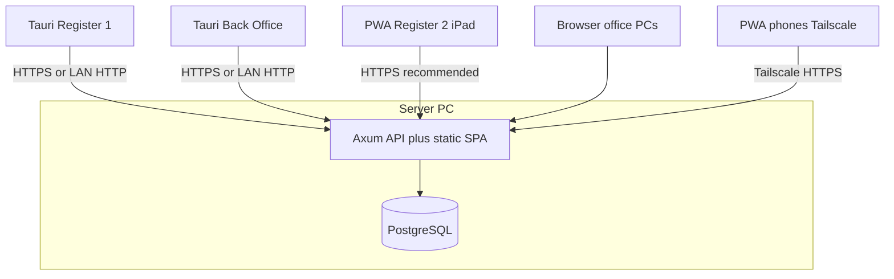

# Riverside OS — Full store deployment guide

This document is the **canonical production deployment** reference for a typical shop layout:

- **One Windows PC** runs **PostgreSQL** and the **Riverside OS server** (Rust Axum API + static web UI from `client/dist`).
- **Register 1 (main)** and **Back office** use the **Windows desktop app** (Tauri 2).
- **Register 2 (iPad)** and **smartphones** use the **Progressive Web App** (browser / Add to Home Screen).
- **Other office PCs** use a browser or optional Tauri; same server URL.

Deeper checklists and remote access detail live in linked docs at the end.

---

## 1. Architecture snapshot

There is **one application backend** and **one database**. Every client device talks to the **same API origin** (for example `https://ros.yourstore.tld` or `http://server-pc:3000` on the LAN).

- The server listens on **`0.0.0.0:3000`** by default so **LAN and Tailscale** clients can reach it. Override with **`RIVERSIDE_HTTP_BIND`** if you terminate TLS on a reverse proxy and bind the app to loopback only (see [`DEVELOPER.md`](../DEVELOPER.md) environment table).

**Optional Meilisearch:** Many shops run a small **Meilisearch** process on the same server PC (or another host on the LAN) for fuzzy inventory, CRM, wedding, order, and storefront PLP search. PostgreSQL remains authoritative; the API syncs index documents and falls back to SQL **ILIKE** if Meilisearch is down. After deploy or restore, admins run **Settings → Integrations → Meilisearch → Rebuild search index** (or **`POST /api/settings/meilisearch/reindex`**). Details: [`SEARCH_AND_PAGINATION.md`](SEARCH_AND_PAGINATION.md).

---

## 2. Roles and recommended client

| Role | Recommended client | Notes |
|------|-------------------|--------|
| **Server + database** | N/A (services on one PC) | Run PostgreSQL and `riverside-server` here. This PC should stay on and be on UPS if possible. |
| **Register 1 (main)** | **Tauri (Windows)** | Required for **physical receipt print** from the post-sale flow (see section 6). |
| **Back office** | **Tauri (Windows)** | Matches Register 1 for updates and behavior; use for inventory shelf labels and printing hub settings. |
| **Register 2 (iPad)** | **PWA (Safari)** | Add to Home Screen. Shared device: **log out or close the register** when unattended ([`PWA_AND_REGISTER_DEPLOYMENT_TASKS.md`](PWA_AND_REGISTER_DEPLOYMENT_TASKS.md)). |
| **Other office PCs** | Browser or Tauri | Same URL and auth; optional Tauri if you want a dedicated shell. |
| **Phones (inventory, remote)** | **PWA** | Use **Tailscale** (or equivalent private mesh) and **HTTPS**; do not expose plain HTTP to the public internet for staff apps ([`REMOTE_ACCESS_GUIDE.md`](../REMOTE_ACCESS_GUIDE.md)). |

### Till shift: Register #1 and satellite lanes

The app supports **multiple open register terminals** (migration **66**) sharing one **till close group** (**67**): **Register #1** is the **cash drawer** (opening float, paid in/out, **Z-close**). **Register #2+** link to an open **#1** session (**$0** satellite float); **Z** on **#1** closes **all** lanes in the group. Train staff that **physical cash** for the day lives in the **#1** drawer even when tenders post from **#2**. Full behavior: **[`docs/TILL_GROUP_AND_REGISTER_OPEN.md`](TILL_GROUP_AND_REGISTER_OPEN.md)**.

---

## 3. Build and release artifacts

### 3.1 Server (shop server PC)

- **Rust binary** for the API (`cargo build --release` in `server/`, or your CI artifact). The server pins **Rust 1.88+** in **`server/rust-toolchain.toml`** (**`ort`** / **fastembed** for staff-help embeddings); use that toolchain in CI and release builds.
- **Production web bundle** `client/dist` copied next to the deployment layout your runbook uses (Axum serves this folder in production).
- **Database**: PostgreSQL reachable via **`DATABASE_URL`**. Apply all migrations in `migrations/` in order (see [`DEVELOPER.md`](../DEVELOPER.md)). If you ship ROS-AI help, set **`RIVERSIDE_REPO_ROOT`** to the deployed tree that contains **`docs/staff/CORPUS.manifest.json`** and run **`POST /api/ai/admin/reindex-docs`** after upgrades that change staff docs — [`docs/ROS_AI_HELP_CORPUS.md`](ROS_AI_HELP_CORPUS.md).

### 3.2 Windows desktop app (Register 1 + Back office)

1. Copy [`client/.env.register.example`](../client/.env.register.example) to **`client/.env.register`** (gitignored).
2. Set **`VITE_API_BASE`** to the origin **each PC can reach** (LAN IP or hostname of the server, or your HTTPS URL). Avoid `http://127.0.0.1:3000` unless the API truly runs on that same machine.
3. From **`client/`**: `npm run tauri:build` (runs the register build first per Tauri config).

Installer signing and CI notes: [`docs/PWA_AND_REGISTER_DEPLOYMENT_TASKS.md`](PWA_AND_REGISTER_DEPLOYMENT_TASKS.md) section D.

### 3.3 PWA (iPad, phones, optional browser-only PCs)

1. Copy [`client/.env.pwa.example`](../client/.env.pwa.example) to **`client/.env.pwa`**.
2. Set **`VITE_API_BASE`** to the **exact origin** those devices use (Tailscale MagicDNS name, HTTPS hostname, etc.). Mismatched origins break API calls and CORS expectations.
3. From **`client/`**: `npm run build:pwa`.
4. Deploy the resulting assets so they are served with the API (Axum static) or from your CDN, consistently with your TLS strategy.

**Version visibility:** Settings → General → **About this build** (semver, git SHA, Tauri version on desktop, API base).

**Quality gates:** See section G in [`docs/PWA_AND_REGISTER_DEPLOYMENT_TASKS.md`](PWA_AND_REGISTER_DEPLOYMENT_TASKS.md) (Playwright, soak, backup drill).

---

## 4. Environment and security

Key variables (full table in [`DEVELOPER.md`](../DEVELOPER.md)):

| Variable | Purpose |
|----------|---------|
| **`DATABASE_URL`** | PostgreSQL connection string (server only). |
| **`RIVERSIDE_MEILISEARCH_URL`** | Optional; e.g. `http://127.0.0.1:7700` (host) or `http://meilisearch:7700` (same Docker network as the API). When unset, all search paths use SQL **ILIKE** only. |
| **`RIVERSIDE_MEILISEARCH_API_KEY`** | Optional; Meilisearch **master** or **API key** with index access. Store in secrets; never log. |
| **`RIVERSIDE_CORS_ORIGINS`** | Optional comma-separated **browser** origins (e.g. `https://app.example.com,http://192.168.1.50:3000`). Set when clients use multiple hostnames; when unset, development-style permissive CORS may apply (see `DEVELOPER.md`). |
| **`RIVERSIDE_HTTP_BIND`** | Optional bind address (e.g. `127.0.0.1:3000` behind a reverse proxy). |
| **`RIVERSIDE_MAX_BODY_BYTES`** | Optional; raise if large catalog imports fail. |
| **`OTEL_EXPORTER_OTLP_ENDPOINT`**, **`OTEL_EXPORTER_OTLP_TRACES_ENDPOINT`**, **`RIVERSIDE_OTEL_ENABLED`**, **`OTEL_SERVICE_NAME`**, **`OTEL_EXPORTER_OTLP_PROTOCOL`** | Optional; **OpenTelemetry OTLP** trace export from the API — full matrix in [`OBSERVABILITY_TRACING_AND_OPENTELEMETRY.md`](OBSERVABILITY_TRACING_AND_OPENTELEMETRY.md) and [`server/.env.example`](../server/.env.example). |
| **`RIVERSIDE_VISUAL_CROSSING_API_KEY`** | Optional; server-side Visual Crossing key (overrides DB `weather_config`). See [`WEATHER_VISUAL_CROSSING.md`](WEATHER_VISUAL_CROSSING.md). Never expose to the client. |
| **`RIVERSIDE_VISUAL_CROSSING_ENABLED`** | Optional; force live weather on/off. See [`WEATHER_VISUAL_CROSSING.md`](WEATHER_VISUAL_CROSSING.md). |

**Secrets** (Stripe, QBO, sync tokens, Visual Crossing key) stay **server-side**. The client bundle only exposes **`VITE_*`**: **`VITE_API_BASE`** (required for API origin). Optional: **`VITE_STOREFRONT_EMBEDS`** (Podium widget on public builds — [`PLAN_PODIUM_SMS_INTEGRATION.md`](PLAN_PODIUM_SMS_INTEGRATION.md)), **`VITE_GRAPESJS_STUDIO_LICENSE_KEY`** (GrapesJS Studio in **Settings → Online store** on non-localhost — [`ONLINE_STORE.md`](ONLINE_STORE.md)).

**Observability:** the API logs with **`tracing`** (`RUST_LOG`) and can send **OpenTelemetry OTLP** traces to your collector when **`OTEL_*`** / **`RIVERSIDE_OTEL_ENABLED`** are set — [`OBSERVABILITY_TRACING_AND_OPENTELEMETRY.md`](OBSERVABILITY_TRACING_AND_OPENTELEMETRY.md). That pipeline is separate from optional browser **Sentry** on in-app bug reports (**`docs/PLAN_BUG_REPORTS.md`**).

**Network**

- **Windows Firewall** on the server PC: allow inbound **TCP 3000** (or your chosen port) from **trusted subnets** (LAN, Tailscale interface), not from the entire internet.
- **HTTPS** for production PWA access; follow [`REMOTE_ACCESS_GUIDE.md`](../REMOTE_ACCESS_GUIDE.md) (Tailscale Serve, reverse proxy, etc.).

**Counterpoint bridge** (if used): set `ROS_BASE_URL` to the same base URL browsers use; bridge must reach the API ([`REMOTE_ACCESS_GUIDE.md`](../REMOTE_ACCESS_GUIDE.md)).

---

## 5. Per-station configuration (in-app)

### Printing Hub

**Settings → Printing Hub** stores station-local values in the browser/WebView profile:

- Receipt printer: **`ros.pos.printerIp`**, **`ros.pos.printerPort`** (default port **9100** for raw network printers).
- Report printer: **`ros.report.printerIp`** (and related keys as shown in Settings).

**Paths**

- **Tauri:** thermal payloads are sent with **native TCP** from the PC (`printerBridge` → Tauri `invoke` → `client/src-tauri/src/hardware.rs`).
- **Browser / PWA:** the same module can call **`POST /api/hardware/print`** so the **server** opens TCP to the printer IP (printer must be reachable **from the server** on the network).

Configure each **Register 1** PC with the **Epson receipt printer IP** (or your chosen workflow; see hardware section below).

---

## 6. Hardware matrix (reference deployment)

This section matches a common Riverside deployment: **Zebra** scanners and label printer, **Epson** receipt printer, **iPad** second register.

| Station | Device | Role in Riverside OS |
|---------|--------|----------------------|
| Register 1 | **Zebra DS2208** | USB **keyboard wedge (HID)**. Focus the POS search / SKU field; scans appear as typed text. No scanner SDK in the app. |
| Register 2 | **Zebra CS6080** | Pair to iPad as a **Bluetooth keyboard (HID)** so Safari receives scan data as keystrokes. Program a **suffix** (Enter/Tab) if your workflow needs automatic submit. |
| Back office | **Zebra LP 2844** | **Shelf / inventory labels:** the app opens a **print layout** and uses the **system print dialog** (`labelPrint.ts`, `@page` **4in × 2.5in**). Install the **Zebra Windows driver**, match **label stock** and driver page size to avoid scaling issues. Tauri and Edge use the same OS print path for this feature. |
| Register 1 | **Epson TM-m30III** (receipts) | See **subsection 6.1** — important language/protocol note. |
| Register 2 (iPad) | Receipts | See **subsection 6.2** — current app behavior. |

### 6.1 Epson TM-m30III and ZPL (read carefully)

Today, the POS **Sale complete** flow loads **`GET /api/orders/{order_id}/receipt.zpl`** and sends the response as **ZPL** over **TCP** (default port **9100**) via **`printZplReceipt`** in [`client/src/lib/printerBridge.ts`](../client/src/lib/printerBridge.ts).

**ZPL is Zebra’s wire format.** The **Epson TM-m30III** expects **ESC/POS** (or driver-mediated printing), **not ZPL**, on a **raw** socket. Pointing the current ZPL job at the Epson’s raw **9100** port will **not** produce a correct receipt.

**Practical options (operations):**

1. **Use a Zebra-class (ZPL-capable) network receipt printer** on raw **IP:9100** if you need the current pipeline without code changes.
2. Use **Epson driver- or ePOS-based printing** outside the current raw-ZPL path (not exposed as a first-class alternate in the receipt modal today).
3. **Engineering follow-up:** add an **ESC/POS** receipt generator and client selection (separate project from this guide).

Work with your installer or Epson docs for **static IP** or **DHCP reservation** for the TM-m30III if you move to a supported print path later.

### 6.2 iPad Register 2 — physical receipt print

[`ReceiptSummaryModal`](../client/src/components/pos/ReceiptSummaryModal.tsx) **requires Tauri** for the Print action: if `isTauri()` is false, it shows an error that **physical printing requires the Riverside OS desktop app**.

So **iPad PWA cannot print a thermal receipt from that button today**, even though `printerBridge` could theoretically use **server-side** print for non-Tauri clients.

**Operational workarounds:** complete the sale on iPad, then **reprint from Register 1** or another **Windows Tauri** station; or treat printed customer copy as optional on that lane until product supports PWA/server receipt dispatch.

---

## 7. Operations

- **Applying updates (local / no GitHub):** [`docs/LOCAL_UPDATE_PROTOCOL.md`](LOCAL_UPDATE_PROTOCOL.md) — backup, migrations, server binary + `FRONTEND_DIST`, Tauri and PWA rollout, rollback.
- **Backups and restore:** [`BACKUP_RESTORE_GUIDE.md`](../BACKUP_RESTORE_GUIDE.md).
- **Offline behavior:** POS may **queue checkouts** offline; back-office and inventory mutations generally require the API ([`docs/PWA_AND_REGISTER_DEPLOYMENT_TASKS.md`](PWA_AND_REGISTER_DEPLOYMENT_TASKS.md) section F).
- **Large catalogs:** customer browse and inventory lists use paging; spot-check latency on Wi-Fi and Tailscale before busy weekends ([`docs/SEARCH_AND_PAGINATION.md`](SEARCH_AND_PAGINATION.md)).

### 7.1 Troubleshooting (short)

**PWA will not load**

1. From the device browser, open **`VITE_API_BASE`** (same origin the app was built with).
2. Tailscale / DNS: [`REMOTE_ACCESS_GUIDE.md`](../REMOTE_ACCESS_GUIDE.md).
3. HTTPS certificate validity and device clock.
4. Hard refresh; clear site data or remove and re-add the home screen icon.
5. Collect **Settings → General → About this build**.

**Desktop register will not print**

1. Confirm printer **IP** and **ping** from the PC.
2. Windows Firewall: **outbound** to printer (often **TCP 9100**).
3. **Tauri** path uses local TCP; **PWA** path uses **`/api/hardware/print`** (server must reach the printer).
4. Restart the desktop app after network changes.

**Shelf labels (LP 2844)**

1. Confirm the **LP 2844** is the selected printer in the system dialog.
2. Driver label size vs **4in × 2.5in** layout in the app.

---

## 8. Related documentation

- [`REMOTE_ACCESS_GUIDE.md`](../REMOTE_ACCESS_GUIDE.md) — Tailscale, phones, laptops.
- [`docs/PWA_AND_REGISTER_DEPLOYMENT_TASKS.md`](PWA_AND_REGISTER_DEPLOYMENT_TASKS.md) — PWA vs Tauri builds, CORS, offline, QA sign-off.
- [`DEVELOPER.md`](../DEVELOPER.md) — local dev, env vars, architecture.
- [`docs/STAFF_PERMISSIONS.md`](STAFF_PERMISSIONS.md) — RBAC, headers, PINs.
- [`docs/TILL_GROUP_AND_REGISTER_OPEN.md`](TILL_GROUP_AND_REGISTER_OPEN.md) — multi-lane register, combined Z-close.
- [`BACKUP_RESTORE_GUIDE.md`](../BACKUP_RESTORE_GUIDE.md) — database maintenance and cloud sync.
- [`INVENTORY_GUIDE.md`](../INVENTORY_GUIDE.md) — scanning and physical inventory behavior.
- [`AGENTS.md`](../AGENTS.md) — repo map and invariants for contributors.

---

*Last aligned with application behavior as of repository documentation practices; verify receipt and print flows against your installed version using **About this build**.*
